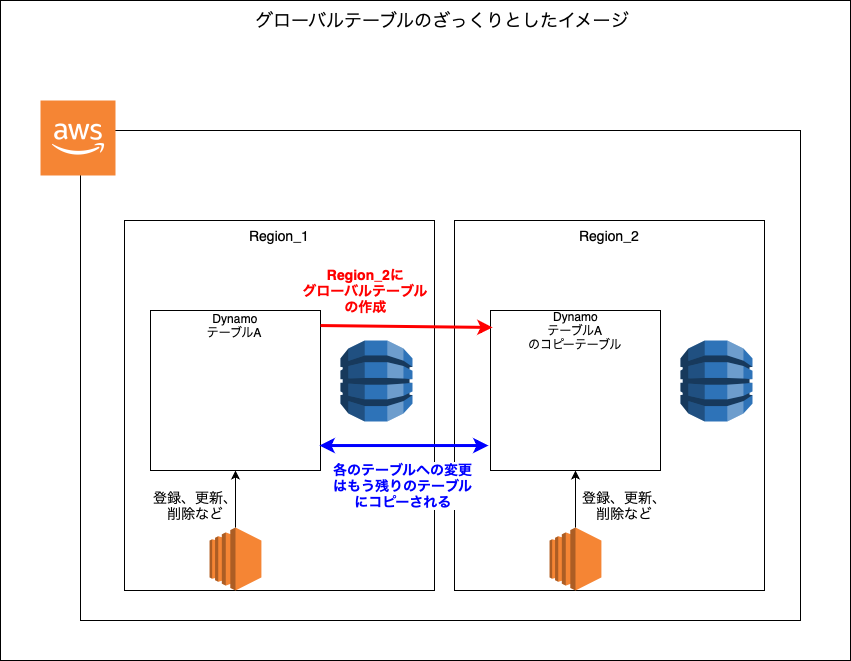

### グローバルテーブルとは (Global Tables)

#### 概要

- 対象の Dynamo テーブルをリージョンを指定して複製する機能

- 複製元のテーブル及び、新しく複製されるテーブルへの操作は他のリージョンのテーブルに非同期(大体1秒以内らしい)にコピーされる

- とあるテーブルで障害が発生した場合、そのテーブルへのリクエストは別リージョンのテーブルに自動リダイレクトされる

- 世界的なサービスの場合、低レイテンシーでユーザーにサービスを提供できる (ユーザーの地域と近ければより低レイテンシー)

 

 

#### 制約

- グローバルテールブルの作成元テーブルと、そのコピーテーブルでパーティションキーが同じである必要がある

- グローバルテールブルの作成元テーブルと、そのコピーテーブルで DynamoDB Stream が有効になっている必要がある
    - 各テーブルを同期させるには、DynamoDB Stream で変更を検知する必要があるため

- (プロビジョニングモードの場合) グローバルテールブルの作成元テーブルと、そのコピーテーブルで同じ**書き込みキャパシティ**が設定されている必要がある

- グローバルテールブルの作成元テーブルと、そのコピーテーブルでテーブル名は同じである必要がある

 
 

参考サイト

[【初心者向け】Amazon DynamoDB 入門！完全ガイド](https://zenn.dev/issy/articles/zenn-dynamodb-overview#グローバルテーブル)

[Amazon DynamoDBのグローバルテーブルを使ってみた](https://blog.serverworks.co.jp/dynamodb-globaltables)

[Amazon DynamoDB グローバルテーブル](https://aws.amazon.com/jp/dynamodb/global-tables/)

---

### コスト

