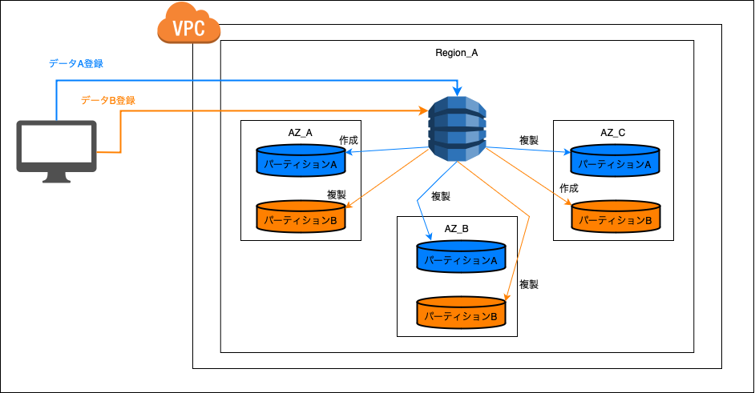
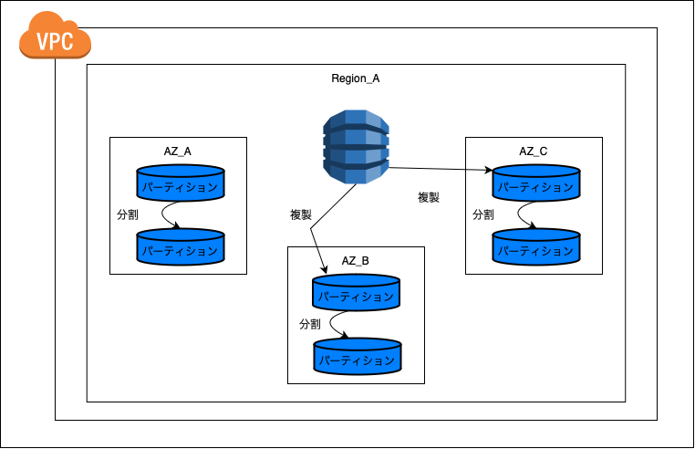
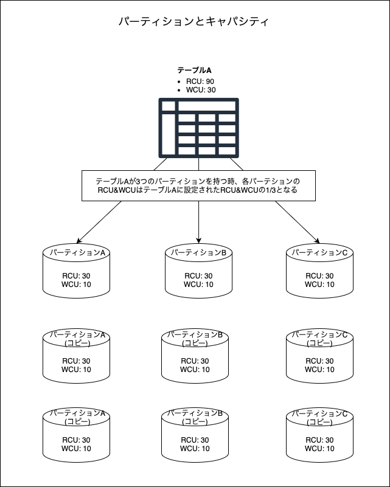
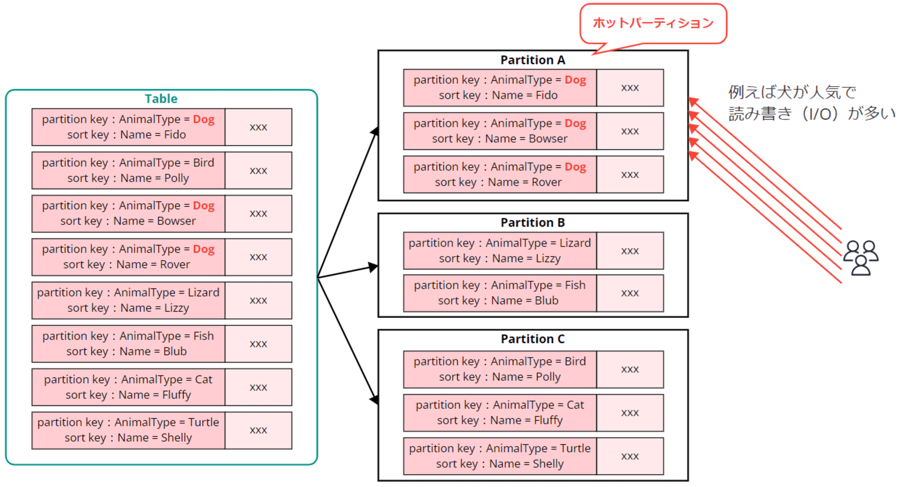
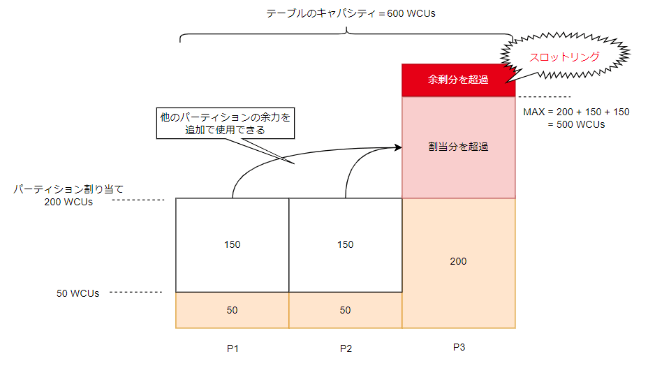
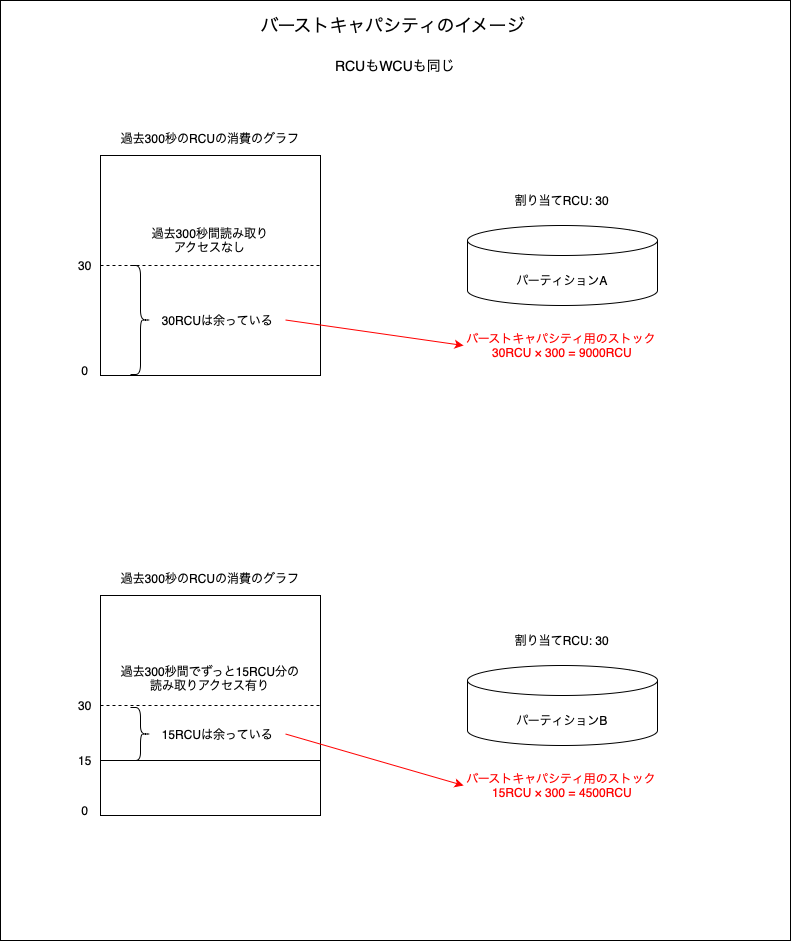

### Partition とは

- データの保存先

- 実態は SSD (内の割り当てられた領域) = マシン

- DynamoDB の可用性に関しては、このパーティションがリージョン内の3つの AZ に自動で複製される

    

     

    - (たぶん)イメージ的にはデータが作成されるごとに、AZ 内のマシンにパーティションが作成される

    - 以下の画像で言うと、同一マシンに2つのパーティション(パーティションA、B)ではなく、AZ 内の異なるマシンにパーティションA、Bが作成される (たぶん)

    

- パーティションは[パーティションキー](./DynamoDB_Table.md)ごとに作成される

- パーティションが大きくなると DynamoDB 側で自動でパーティションの分割が実行される → データが増えても読み書きの速度を保つ高スケーラビリティを実現

    

    - なぜ高スケーラビリティなのか?

        → 対象のデータを大量のデータの中から取得するよりも時間やコンピューティングリソースが少なくて済むのは明白

- DynamoDB では各パーティションごとに、データ容量とスループットが決まっている
    

 
 

参考サイト

[【初心者向け】Amazon DynamoDBのテーブル基礎を理解できるハンズオンを作ってみた](https://blog.serverworks.co.jp/2023/08/17/160708#データの保存について)

---

### 各パーティションについて

- 各パーティションのサイズ
    - 各パーティションの最大サイズは10GB
        - 10GBを超えると、そのパーティションを2つに分割する

- 各パーティションのスループット
    - テーブルに設定するスループットをパーテーションに対して均等に分散する

    - 各パーティションに割り当てれる最大RCU/WCU
        - RCU: 3000RCUまで
        - WCU: 1000WCUまで

        

---

### ホットパーティション

- データの読み書きが一部のパーティションに偏ってしまうことをホットパーティションと呼ぶ

    

    引用: [DynamoDB のキャパシティユニット、テーブル構造、パーティション分割について図解でおさらい](https://dev.classmethod.jp/articles/dynamodb-capacity-partitions-recap/)

 

- ホットパーティションが起きると、テーブルに十分なキャパシティを割り当てたのに、そのパーティションへの読み書きの際にスロットリングエラーがよく起きることがある
    - ホットパーティションのキャパシティを使い切るのが早くなるから

 

#### アダプティブキャパシティ

- 上記問題を解決するための仕組みとして**アダプティブキャパシティ**と言うものがある

    - アダプティブキャパシティは自動で ON になっている

    - とあるパーティションがそのキャパシティを使い果たそうと、他の余力のあるパーティションのキャパシティが割り当てられる

    

    引用: [【初心者向け】Amazon DynamoDB 入門！完全ガイド](https://zenn.dev/issy/articles/zenn-dynamodb-overview#アダブティブキャパシティ)

 

#### バーストキャパシティ

- 各パーティションにおいて過去300秒(5分)で消費しきらなかったキャパシティをストックしておき、スロットリングエラーが起きそうな時に、そのストックしておいたキャパシティを使うことができる機能

    - 例: 30 RCU を持つパーティションが過去300秒全く読み取りアクセスがなかった場合、そのパーティションのストックする RCU は?
        - 30RCU × 300 = 9000RCU

    
