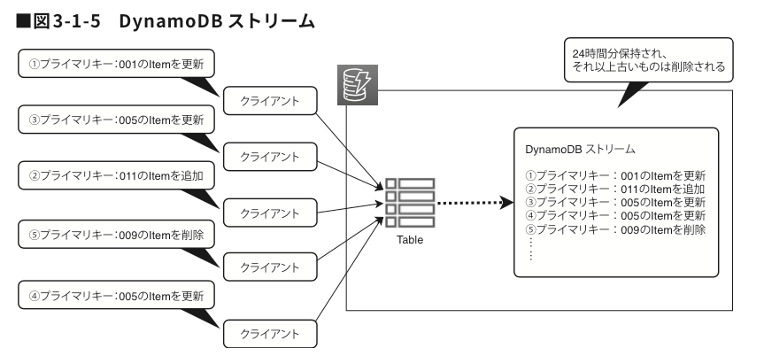
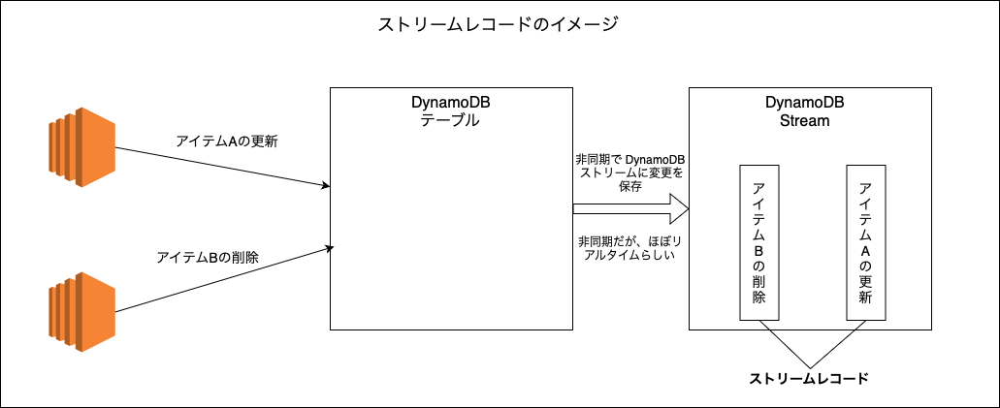
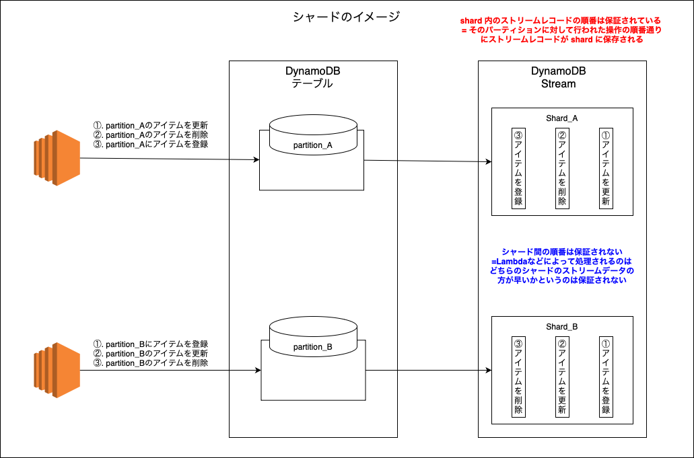
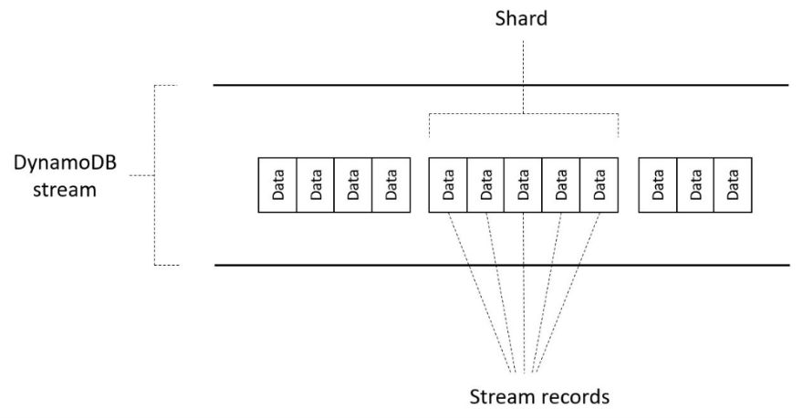
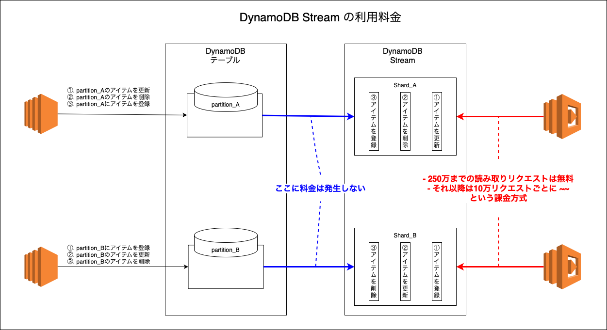

### DynamoDB Stream とは

#### 概要

- DynamoDB テーブルのアイテムに対する変更(作成、更新、削除)を検出し、その変更を履歴として保存できる機能

- 履歴は24時間で消えてしまうので、変更を検出したら S3 などに保存すると言ったように利用される

引用: [DynamoDBを語ってみる](https://tech.nri-net.com/entry/talk_about_dynamodb)

 

#### 詳しい仕組み

#### ストリームレコード (streaming record)

- ストリームレコードとは、DynamoDB Stream が有効なテーブル内の1件のデータが変更された時に作成されるレコード
    - 変更の内容などを保持している

- ストリームレコードは24時間保持される
    - 24時間後に自動で削除される

 

 

#### シャード (shard)

- ストリームレコードの集まり
    - シャードとは複数のストリームレコードを格納するパイプのようなもの

    - イメージ的にはストリームレコードのグループ

- シャードは、DynamoDB のパーティションに対して結びついている

- シャード内のストリームレコードの順番は担保されている

    - しかし、シャード間の順番は保証されてない = どちらのシャードのデータが Lambda 等によって最初に処理されるのかはわからない

- シャードは AWS 側で管理されるので、こちらで制御できない

 

 

#### DynamoDB Stream

- DynamoDB Stream はテーブルごとに作成される

- 複数のシャードから構成される

引用: [Amazon DynamoDB ストリームを使用して、順序付けされたデータをアプリケーション間でレプリケーションする方法](https://aws.amazon.com/jp/blogs/news/how-to-perform-ordered-data-replication-between-applications-by-using-amazon-dynamodb-streams/)

 
 

参考サイト

DynamoDB Stream 全般

- [DynamoDB StreamsとLambdaの話](https://qiita.com/bassaaaaa/items/7477420641080f922a59)

- [DynamoDBストリームの利用](https://adtech-blog.united.jp/2019/04/aws/dynamodbストリームの利用/)

シャード数について

- [DynamoDB ストリームの Lambda IteratorAge メトリックスが増加しているのはなぜですか。](https://repost.aws/ja/knowledge-center/dynamodb-lambda-iteratorage#)

---

### 具体的な利用方法

- DynamoDB のテーブルに対する変更を検出したら、Lambda で追加処理を行いたいケース
    - S3 などにログを保存するなど

- DynamoDB のテーブルに対する変更を検出したら、通知を送りたいケース

- 集計結果を別テーブルに書き込む

    - バッチ処理だとリクエスト数が多くなり、キャパシティが枯渇してしまう可能性もあるらしい

 
 

参考サイト

[AmplifyでDynamoDB Streamを用いて変更履歴をS3に保存する](https://qiita.com/akiraabe/items/6e3366565ba9c691023b)

[DynamoDBはバッチ処理よりストリーム処理との相性が良いという話](https://zenn.dev/hsaki/articles/aws-dynamodb-stream-suited)

---

### コスト

- DynamoDB と DynamoDB Stream 間でのデータ転送的なコストは発生しない

- DynamoDB Stream へのストリームレコード読みとりリクエストに対して料金が発生する

- 料金は DynamoDB Stream が有効化されているリージョンによって異なるが毎月250万件までのリクエストは無料

    - それ以降は10万リクエストごとに ~~ UDS といった課金方式

 

 
 

参考サイト

[オンデマンドキャパシティの料金](https://aws.amazon.com/jp/dynamodb/pricing/on-demand/)
