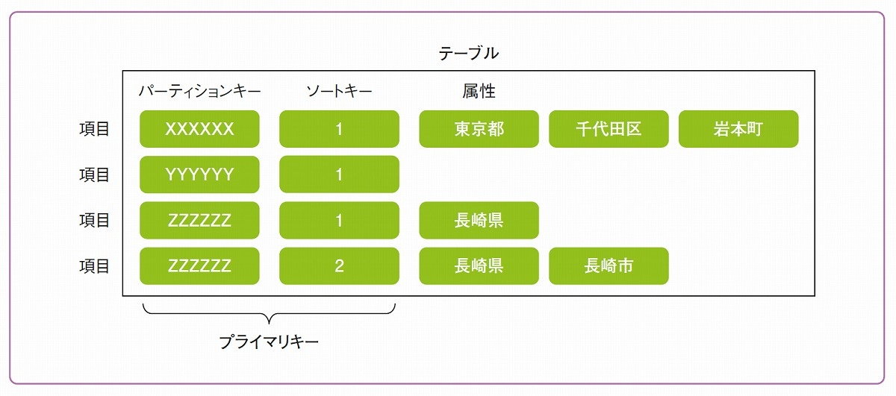
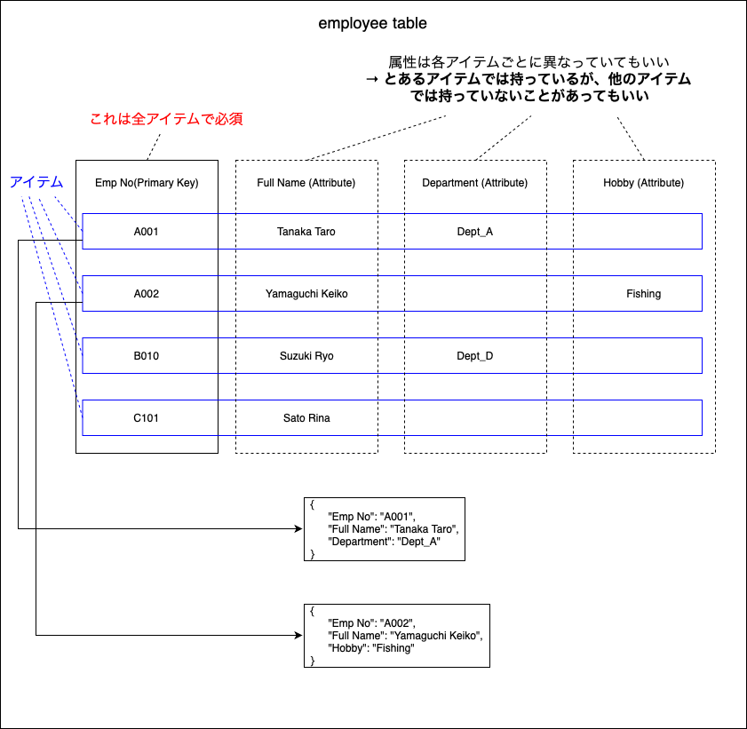
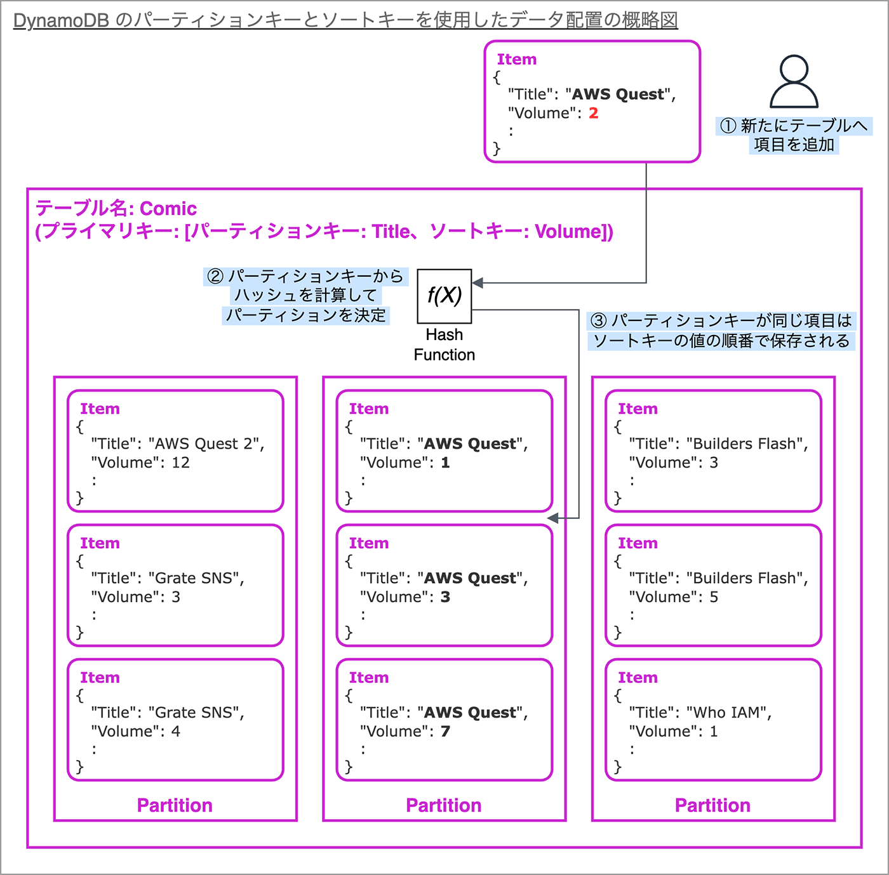

### DynamoDB のデータ構造

引用: [Amazon DynamoDBとは何かをわかりやすく図解、どう使う？テーブル設計の方法とは](https://www.sbbit.jp/article/cont1/95515)

 

- テーブル: RDB と同じテーブルのイメージで OK

 

- 項目 (Item): RDB でいうレコード。 データのエントリー

 

- 属性 (Attribute): RDB でいうカラム
    - 属性名とデータ型で定義する

    - **各項目が異なる属性を持っていても良い**

    

- プライマリーキー or パーティションキー (Primary or Partition Key)

    - RDB でいうプライマリーキー

    - どんなテーブルでも各アイテムに必ず必須

    - Dynamo の裏でプライマリーキーの値をハッシュ関数にかけ、パーティションの場所を決めている

 

- ソートキー (Sort Key)

    - RDB でいう複合主キーを表現したい時に DynamoDBでは プライマリーキー ＋ ソートキーで表現する

    - ソートキーを張ることで、パーティション内では**ソートキーの順番でデータを格納する**

    

    引用: [パーティションキーとソートキーの役割と共に Amazon DynamoDB のプライマリキーについて学ぼう](https://aws.amazon.com/jp/builders-flash/202404/learn-dynamodb-primary-key/)

 
 

参考サイト

---

### 基本的なデータの取得

#### パーティションキーだけのテーブル

- パーティションキーを指定して任意のアイテムを取得

- テーブルのデータ(アイテム)を全件取得 

 

#### パーティションキー + ソートキーのテーブル

- パーティションキー & ソートキー を指定して任意のアイテムを取得

- パーティションキーを指定して任意のアイテムを取得
    - パーティションキー & ソートキーでの取得と違う点 → パーティションキーだけだと複数件のアイテムを取得する可能性もある

- テーブルのデータ(アイテム)を全件取得

- パーティションの指定 + ソートキーに対して条件を指定して、該当するアイテムを取得

 

#### 注意点

- 何のキーでもない属性を条件にアイテムを取得することはできない
    - [GSI や LSI](./DynamoDB-GSI-LSI.md)を利用することで、この点を克服することはできる

    - でも、基本的に任意の項目で検索をかけられないのは不便に思ってしまう

- パーティションキーは必ず検索条件に指定する必要がある(全件取得の時以外)

- パーティションキーに対して部分一致での検索はできない

- テーブルのデータ全件取得は基本的にやってはいけないぐらいパフォーマンスが悪い

 
 

参考サイト

[パーティションキーとソートキーの役割と共に Amazon DynamoDB のプライマリキーについて学ぼう](https://aws.amazon.com/jp/builders-flash/202404/learn-dynamodb-primary-key/)

[Amazon DynamoDB のテーブル設計で悩んだら最初に読もう -これだけ知ればある程度の検索には対応できる-](https://blog.usize-tech.com/table-design-for-amazon-dynamodb/)

---

### テーブルクラス

- テーブル作成時に運用の目的別に2つのクラスから選択できるテーブルの種類

- 2つのテーブルクラスで性能の差はない

- 運用途中で別のテーブルクラスへの変更も可能

 

#### 標準テーブルクラス

- 特徴
    - テーブルへの書き込み/読み取りのコストが低い
    - ストレージの料金が高い

- 運用目的: 通常利用のテーブル

 

#### DynamoDB 標準 - IA (Infrequent Access) テーブルクラス

- 特徴
    - テーブルへの書き込み/読み取りのコストが高い
    - ストレージの利用料金は安い

- 運用目的: あまりアクセスしないが、ストレージ容量を逼迫するログデータなどを保存するテーブル

 
 

参考サイト

`DynamoDB テーブルに適したテーブルクラスを選択して、ストレージコストを最適化する`部分

- [Amazon DynamoDB でコストを最適化するにはどうすればいいですか?](https://repost.aws/ja/knowledge-center/dynamodb-optimize-costs#)

---

### キャパシティモード

- テーブル作成の際に以下の2つからテーブルのタイプを選択する

- テーブルのスループット性能を最初から決めておくか決めないかの違い (料金の違いは[こちら](./DynamoDB_CapacityUnit.md#コスト計算の際のキャパシティユニット)を参照)

 

#### プロビジョニングモード

- テーブルにあらかじめ[キャパシティユニット](./DynamoDB_CapacityUnit.md)を決めて作成するモード

- 割り当てたキャパシティユニットを全て消費してしまうと、スロットリングエラーが起きデータが読み込み/か着込みできなくなることがある (詳しくは[こちら](./DynamoDB_Partition.md#ホットパーティション)を参照)

- あらかじめ読み取り/書き込みのリクエスト数が想定できている場合などに選択されるモード

 

#### オンデマンドモード

- テーブルにキャパシティユニットを決めずに作成するモード

- キャパシティを割り当てないので、スロットリングエラーは起きにくい (絶対起きないわけではない)

- 読み取り/書き込みのリクエスト数が想定できている場合 (サービスのスタート) などに選択されるモード

 
 

参考サイト

[DynamoDB のキャパシティモードについて調べてみた](https://blog.serverworks.co.jp/DynamoDB-Capacity_Mode)