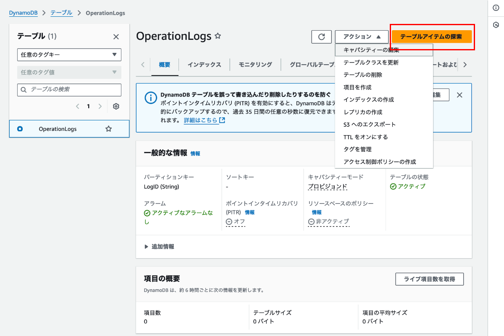

### テーブルの作成

1. AWS マネージドコンソールから DynamoDB の画面に遷移し、サイドメニューの `テーブル` をクリックする

    

 

2. `テーブルの作成` をクリックする

    

 

3. テーブルの作成に必要な設定を記述する

    - テーブル名
        - 作成するテーブルの名前

    - パーティションキー
        - テーブルのパーティションキー名とそのデータ型

    - ソートキー
        - テーブルのソートキー名とそのデータ型
        - ソートキーが必要ない場合は未入力にする

    

     

    - テーブル設定
        - テーブルに関する設定を AWS の用意したデフォルトのものにするか、自分でカスタマイズして設定するかを選ぶ項目

        - 設定をカスタマイズする場合は[こちら](#テーブル設定でカスタマイズを選択した場合)を参照

    

     

    - タグ
        - 作成する DynamoDB テーブルにつけるタグ名

    

 

4. 作成するテーブルの設定が完了したら `テーブルの作成` をクリックする

    

 

5. テーブルが作成されていることを確認する

    

---

### テーブル設定でカスタマイズを選択した場合

#### テーブルクラスの選択
- テーブルクラス
    - 詳しくは[こちら](./DynamoDB_Table.md#テーブルクラス)を参照

- キャパシティ計算ツール
    - アクセスが予測される場合、月のコストがどれくらいになるか大まかな見積もりが計算できるツール

 

#### キャパシティモードの選択

- プロビジョンドモードの場合

    - 読み込みキャパシティー

        - Auto Scaling
            - 読み込みキャパシティについて Auto Scaling を有効化するかどうか (詳しくは[こちら](./DynamoDB_AutoScaling.md)を参照)

    - 書き込みキャパシティ
        - Auto Scaling
            - 書き込みキャパシティについて Auto Scaling を有効化するかどうか
            
    

     

    - Auto Scaling を無効にすると、常に確保する読み取り/書き込みキャパシティを指定する

    

 

- オンデマンドモードの場合

    - 最大テーブルスループット
        - 読み取り/書き込みキャパシティの上限を設定することができる

    

 

#### セカンダリインデックス

- 作成するセカンダリインデックスの設定

    

 

#### 読み取り/書き込みキャパシティの推定コスト

- プロビジョンドモードの場合、月の推定コストが算出される

 

#### 保管時の暗号化

- デフォルトで保存データは暗号化される

- どの暗号キーを使って暗号化するかについての設定

- 暗号キーの管理
    - Amazon DynamoDB が所有/管理する AWS KMS キーを使用
        - AWS 所有のキー
        - 利用料金がかからない

    - AWS マネージドキー
        - AWS が所有管理する AWS 所有のキーと少し異なるキー
        - KSM へのキーの保管料や、キーへの暗号化/復号化のリクエストに料金が発生する
        
    - ユーザーが所有する暗号キー
        - AWS KMS でユーザーが作成したキーのこと
        - AWS マネージドキーと同様に KMS の料金が発生する

 

 

#### 削除保護

- 誤ってテーブルを削除するのを防ぐ機能
    - 有効になっている限り、テーブルの削除はできない
    - 無効にして初めてテーブルの削除ができる

 

#### リソースベースのポリシー

 
 

参考サイト

暗号化の際の AWS KMS キーの種類について

- [【初心者向け】AWS KMS 入門！完全ガイド](https://zenn.dev/issy/articles/zenn-kms-overview#マスターキー)

- [【初心者向け】AWS KMSの基本用語をわかりやすく解説](https://kazuqueue-tech.com/kms-basic-vocabulary/#st-toc-h-2)

---

### テーブルの操作 (AWS マネージドコンソール)

- AWS マネージドコンソールのサイドメニューの `テーブル` からテーブル一覧画面に遷移し、操作したいテーブルを選択する

    

 

#### データの登録/検索/変更/削除

- データの登録
    - *テーブルの書き込みキャパシティを消費することに注意

    - テーブルの詳細画面より、 `アクション` → `項目を作成` を選択する

        
    
     

    - 項目のパーティションキーや他の属性の値を入力し `項目を作成` をクリック

        

 

- データの検索
    - *テーブルの読み取りキャパシティを消費することに注意

    - テーブルの詳細画面より `テーブルアイテムの検索` をクリック

        

     

    - 検索方法(スキャン/クエリ) や 条件(フィルター) などを指定し `実行する` をクリックする

        

 

- データの更新
    - *テーブルの書き込みキャパシティを消費することに注意

    - 更新したいデータを選択後、下の「返された項目」セクションから `アクション` → `項目の編集` をクリック

        

     

    - 更新したい属性に値を設定したら `保存` か `保存して`

        

     

    - 属性が更新されているか確認する

        

 

- データの削除
    - *テーブルの書き込みキャパシティを消費することに注意

    - 更新したいデータを選択後、下の「返された項目」セクションから `アクション` → `項目の削除` をクリック

        

     

    - 確認モーダルにて、`削除` を選択

        

---

### データの操作 (PartiQL エディタ)

#### PartiQL エディタとは

- PartiQL という言語で DynamoDB を操作することができるエディタ

- AWS マネージドコンソールから DynamoDB の画面に遷移し、サイドメニューの `PartiQL エディタ` をクリックする

    

 

#### クエリ

- 基本手には SQL と同じ

- クエリを書いたら、`実行` をクリックする

    

 

- クエリについては[こちら](https://qiita.com/y-mae/items/1edf5809ce40d75779fb#insertselect-update-delete)を参照

 
 

参考サイト

[SQL互換のクエリ言語「PartiQL」でDynamoDBを操作する](https://qiita.com/y-mae/items/1edf5809ce40d75779fb#insertselect-update-delete)

---

### テーブルの詳細確認

#### 概要

- 一般的な情報
    - テーブルのキーやキャパシティモードなどの情報が確認できる

- 項目の概要
    - テーブル内に登録されているデータの概要が確認できる

- キャパシティーメトリクスの表
    - テーブルの使用率が確認できる (キャパシティメトリクス)

 

 

#### インデックス

- テーブルに作成されている GIS / LSI の確認や作成ができる

- LSI はテーブル作成後に作成はできない

 

 

#### モニタリング

- アラーム
    - テーブルに対して作成されている CloudWatch アラームの確認ができる

- CloudWatch Contributor Insights for DynamoDB
    - スロットリングが発生した項目を確認できる (たぶん)

- CloudWatch メトリクス
    - [テーブルの概要タブ](#概要)にもあったテーブルの使用状況や、　GSI / LSI の利用状況などテーブルの利用状況に関する情報をモニタリングできる

 

 

#### グローバルテーブル

- レプリカ
    - 他のリージョンに作成されてるグローバルテーブルの情報を確認できる

 

 

#### バックアップ
- ポイントインタイムリカバリ
    - ポイントインタイムリカバリの確認/有効化ができる
    - 詳しくは[こちら](./DynamoDB_Backup.md#ポイントインタイムリカバリ-pitr)を参照

- バックアップ
     - オンデマンドバックアップの確認/作成ができる

 

 

#### エクスポートおよびストリーム

- S3 へのエクスポート
    - S3 へのエクスポート状況が確認できる
    - S3 へのエクスポートができる

- Amazon Kinesis データストリームの詳細
    - Amazon Kinesis の詳細を確認/機能をONにすることができる

- DynamoDB Stream の詳細
    - DynamoDB Stream の詳細を確認/機能をONにすることができる
    - 詳しくは[こちら](./DynamoDB_Stream.md)を参照

 

 

#### アクセス許可

- IAM Access Analyzer のアクティブな検出結果
    - テーブルに対して設定されているアクセス権などの分析結果を確認できる (たぶん)

- テーブルについてのリソースベースポリシー
    - テーブルに対してアタッチされているアクセス許可ポリシーの確認/作成ができる

 

#### 追加の設定

- その他のテーブル設定についてのタブ

- 読み込み/書き込みキャパシティー
    - テーブルに設定されているキャパシティを確認/変更ができる

    - グローバルインデックスに設定されているキャパシティの確認/変更ができる

 

 

- Auto Scaling アクティビティ
    - Auto Scaling の実行履歴が確認できる(たぶん)

- 削除保護
    - 削除保護の ON/OFF ができる

- Time To Live (TTL)
    - TTL の確認/有効化ができる
    - 詳しくは[こちら](./DynamoDB.md#特徴機能)を参照

- 暗号化
    - テーブルデータの暗号/復号化に使う KMS キーの設定ができる

- タグ
    - テーブルに付与するタグの設定ができる

 

