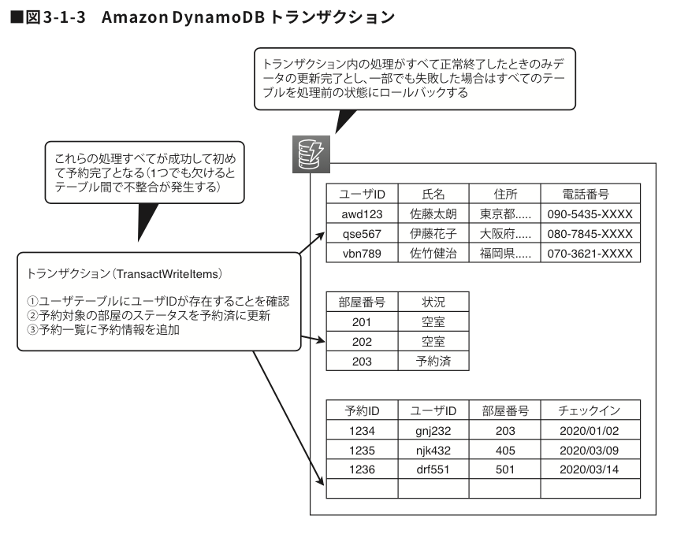

### DynamoDB でのトランザクション

- アイテムへの読み取り/書き込み/削除の複数のリクエストを1つのトランザクションにまとめることができる機能
    - トランザクションの結果は全てのリクエストの成功か、全てのリクエストの失敗の2つ

    - トランザクション中のリクエストがどれか1つでも失敗したら全ての操作をロールバックする

 

- DynamoDB のDBのトランザクションはロックを取得しない
    - DynamoDB のトランザクションのイメージ的には楽観的ロック
    - トランザクション中に操作するアイテムのロックは取得しないので、他のユーザーやアプリケーションから同じアイテムに対して操作される可能性はある

引用: [DynamoDBを語ってみる](https://tech.nri-net.com/entry/talk_about_dynamodb)

 
 

参考サイト

[【AWS公式ドキュメントを噛み砕く】DynamoDB入門者に説明する資料](https://qiita.com/hamachi4708/items/9f11cff0afc1d31586c7#dynamodb-transactions)

---

### DynamoDB トランザクションの制限

- 1トランザクション内のアイテムの合計サイズは 4 MB 以内であること

    - 読み取りアイテムの合計サイズ、書き込みアイテムの合計サイズ合わせて 4MB 以内である必要がある (たぶん)

    - DynamoDB のテーブルの1アイテムのサイズ制限が 400KB なので、400KBのアイテム を100件まで1トランザクションで操作可能

 

- 1トランザクションに含めることができるリクエストは100件まで

 

- ★1つのトランザクション内で1つのアイテムに行えるリクエストは1つまで

    - 1つのトランザクション内でテーブル A のアイテム A に行える操作(読み取り/書き込み/削除)は1回だけ

        - 1トランザクション中で対象のアイテムへの書き込み、読み取り、削除がそれぞれ1回までではなく、どれかの操作を1回行うとそのアイテムに対して他の操作はできない

 
 

参考サイト

[DynamoDB のトランザクション](https://docs.aws.amazon.com/ja_jp/amazondynamodb/latest/developerguide/ServiceQuotas.html#limits-dynamodb-transactions)

[Amazon DynamoDB で TransactWriteItems API 呼び出しが失敗するのはなぜですか?](https://repost.aws/ja/knowledge-center/dynamodb-transactwriteitems#)

---

### トランザクションと他のリクエストや他のトランザクションが衝突した場合

- DynamoDB のトランザクションは楽観的ロック = トランザクション実行中にロックを取得しない 

 
 

参考サイト

[New – Amazon DynamoDB Transactions]()

---

### DynamoDB トランザクションの消費キャパシティ

- トランザクション中の読み取り

    - 4KB以下のデータ読み取りリクエスト1回で**2 RCU**消費する

        → 強力な整合性での読み取りの2倍 RCU を消費する
    
 

- トランザクション中の書き込み

    - 4KB以下のデータ書き込みリクエスト1回で**2 WCU**消費する
     
        → 通常の書き込みの2倍 WCU を消費する

- *(たぶん)トランザクションが失敗しても、実行されたリクエスト分のキャパシティは消費される