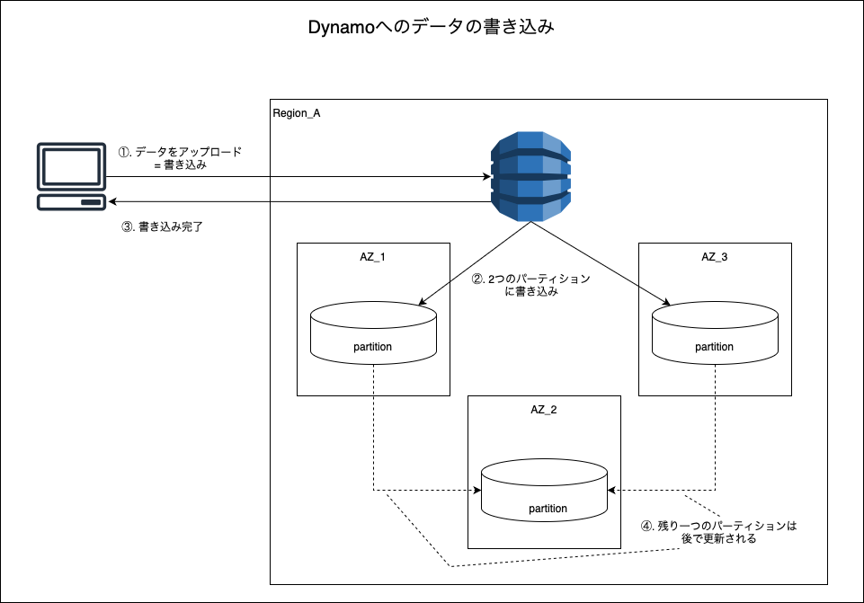
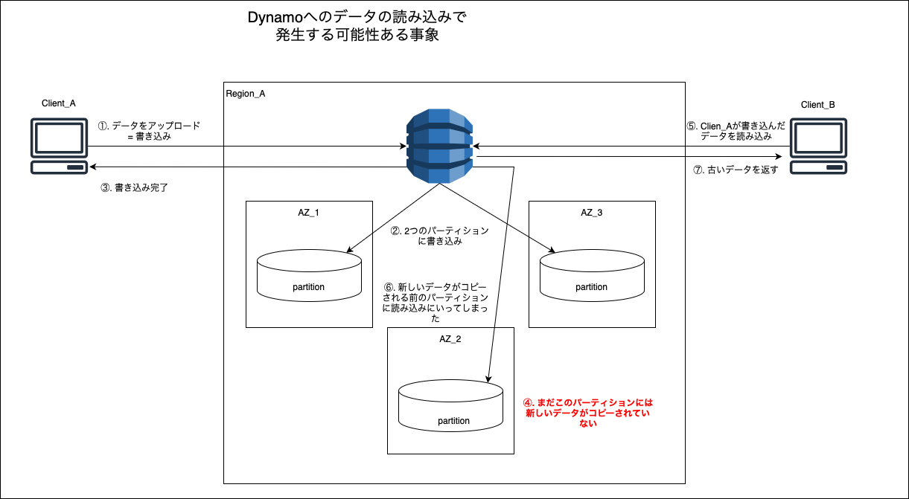
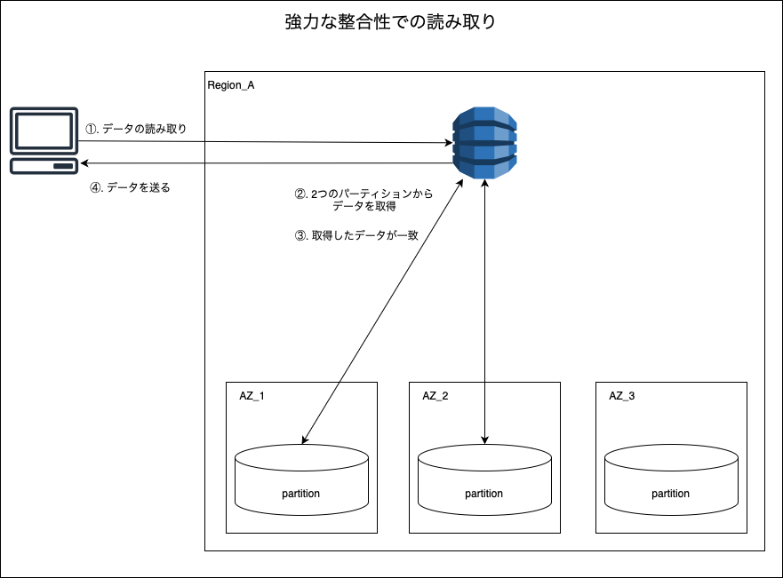
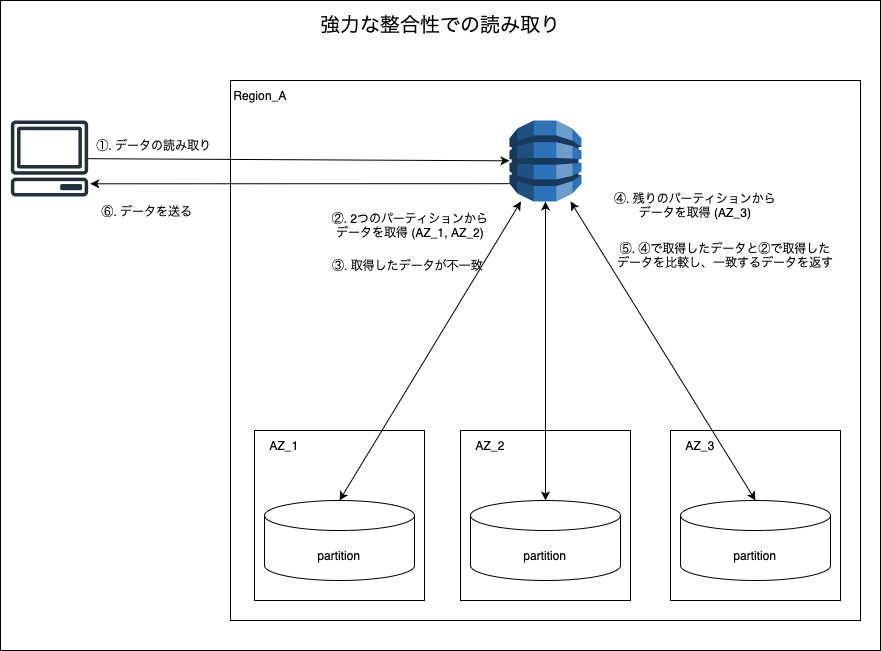

### データの整合性とは

- データの一貫性(矛盾がないこと、辻褄が合っていること)
    - 登録/更新された最新のデータが返ってくること
    - 削除されたデータが返ってこないこと

    など

---

### DynamoDB でのデータの整合性

2つの整合性のオプション(レベル)がある

- 結果整合性 (Eventually Consistent)
    - 書き込み
        - 3つのパーティションのうち2つに書き込んだ時点で書き込み完了
            - 残り1つのパーティションは時間が経過したらコピーされる **(通常は1秒以内にコピーされる)**

        

     

    - 読み取り
        - 3つのパーティションのうち1つに読み取りにいく
        - 結果、更新前のデータが取得されてしまう可能性もある

        

 

- 強い整合性 (Strongly Consistent)

    - 読み取り

        - 2つのパーティションに読み取りにいく

            - デフォルトの結果整合性での読み取りよりも、２倍読み取りを行なっているので、**読み込みキャパシティユニットを2倍消費する**

            - 結果整合性での読み取りよりもレイテンシーが高くなる = データが返ってくる時間が遅くなる可能性は大いにある

            - 値が一致したらその値を返す

            
            
             

            - 値が一致しなかったらもう一箇所のパーティションを読み込みにいき、一致した値を返す

            
            
 
 
参考サイト

[DynamoDBの整合性モデル](https://qiita.com/uenohara/items/44d2334c597dc631bc60)

[【AWS公式ドキュメントを噛み砕く】DynamoDB入門者に説明する資料](https://qiita.com/hamachi4708/items/9f11cff0afc1d31586c7#整合性モデル)

---

### テーブルのロック

TODO: Dynamo のテーブルのロックについて追記する