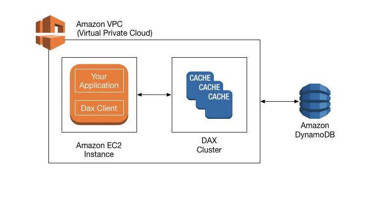

### DAX (DynamoDB Accelerator) とは

引用: [DAX: 仕組み](https://docs.aws.amazon.com/ja_jp/amazondynamodb/latest/developerguide/DAX.concepts.html)

 

#### 概要
- DynamoDB 専用のフルマネージドなインメモリキャッシュサービス
    - テーブルのデータを読み込む際
        - DAX にあれば DAX から取得
        - DAX に無ければテーブルから取得し、DAX にキャッシュする

- 読み取りの速度を向上させる

 

#### 注意点

- VPC 内からしか使えない = VPC 内のクライアントだけが DAX を使える

 

- 強力な整合性のある読み取りは使えない

    - DAX は強力な整合性のある読み取りリクエストが来たら、たとえメモリにあっても DynamoDB を見に行く

    - 強力な整合性のある読み取り結果は DAX にキャッシュされない

 
 

参考サイト

DAX全般

- [Amazon DynamoDB Accelerator (DAX)とは？ 基本的な概要と使い方を解説](https://workjam.co.jp/aws-dynamodb-dax/)

- [【AWS】『DynamoDB Accelerator (DAX)』を超分かりやすく【新感覚Study】](https://ascend-beyond.com/study/3664/)

- [DynamoDBを語ってみる](https://tech.nri-net.com/entry/talk_about_dynamodb)

- [Amazon DynamoDB](https://qiita.com/leomaro7/items/383c1aa287c7daf49518#9dynamodb-accelerator-dax)

DAXの制限について

- [ElastiCacheは良いサービス！！特徴や使い方をおさらいしましょ！](https://dev.classmethod.jp/articles/elasticache-is-very-good-lets-review/)

- [Amazon DynamoDB Accelerator (DAX)ってなんだろ？](https://zenn.dev/mn87/articles/699cc3b10dc8d9#向いてないケース)

---

### 料金

 

上記画像の通り DAX 利用の際に発生する料金は

- DAX ノード (キャッシュノード) 1台につき稼働時間ごとに料金が発生する
    - 料金は DAX ノードのインスタンスタイプによって異なる

 

- 異なるAZ間での EC2(クライアント) と DAX とのデータ転送に料金が発生する
    - EC2 側でのデータ転送(In/Out)

 

- 異なるリージョン間でのデータ転送に関して DynamoDB 側でデータ転送に料金が発生する
    - DynamoDB 側のデータ転送(Out)

 
 

参考サイト

[Amazon DynamoDB Accelerator (DAX) のオンデマンドインスタンス料金](https://d1.awsstatic.com/International/ja_JP/Amazon%20DynamoDB%20Accelerator%20(DAX)%20Pricing_v3.pdf)