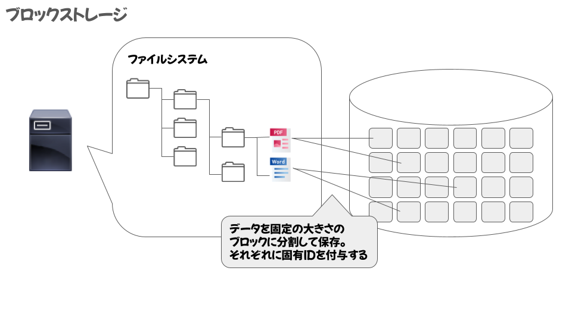
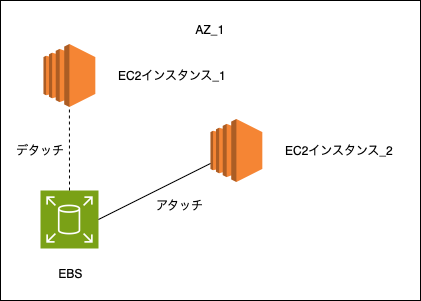
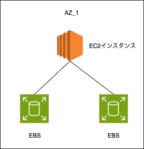
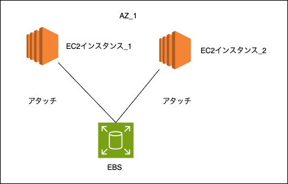
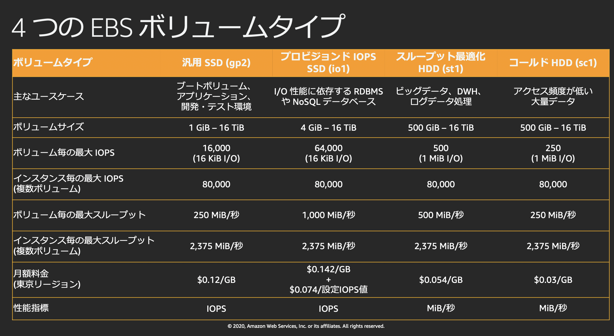

### EBS とは

- Elastic Block Storage の略

- 記憶領域をブロック単位で切り出してファイル(データ)を管理する方法

    - ブロックとファイルが必ずしも1対1で管理されているわけではなく、1つのファイルに複数のブロックが使われていることが多い

    - ファイルストレージやオブジェクトストレージよりも、**データの取得にかかる時間が短い**

    

    引用: [【CLF】ストレージサービス](http://pino070810.com/ストレージサービス/)

- 主な使用用途
    - EC2 インスタンスにアタッチして、そのEC2の外部ストレージとして利用する

    - *EBS単体では直接使用することはできず、必ずEC2インスタンスと組み合わせて利用される

 
 

参考サイト

[【2022年最新】クラウドストレージの仕組みと主なサービス](https://cloud-ace.jp/column/detail301/)

[ブロックアクセスとファイルアクセス](https://www.fujitsu.com/jp/products/computing/storage/lib-f/tech/beginner/block/)

[オブジェクトストレージとは？ブロックストレージやファイルストレージとの違いや、特徴・メリットを徹底解説！](https://jitera.com/ja/insights/21399)

[AWS 入門ブログリレー 2024〜 Amazon EBS 編〜](https://dev.classmethod.jp/articles/introduction-2024-amazon-ebs/)

---

### EC2 インスタンスと EBS の関係

- 特定の EC2 インスタンスに依存することなく、他の EC2 に EBS のアタッチ・デタッチが可能
    - $\color{red}\text{EBS と 同一 AZ の EC2 インスタンスのみで可能}$

    

 

- 1つの EC2 インスタンスに複数の EBS をアタッチすることが出来る
    - $\color{red}\text{EBS と 同一 AZ の EC2 インスタンスのみで可能}$

    

 

- 以下の条件を全て満たせば、1つの EBS を複数の EC2 インスタンスにアタッチすることが出来る

    - アタッチ先の EC2 インスタンスが EBS と同一 AZ であること
    - EC2 は Nitro 
    - ストレージタイプ: プロビジョンド IOPS SSD
    - EBS マルチタッチ機能を利用
    - *マルチアタッチが有効な EBS は $\color{red} \text{ストレージタイプ \& サイズは変更不可能}$

    

 
 

参考サイト

[「Amazon EBS 完全に理解した」 あなたに贈る Amazon EBS 再入門](https://pages.awscloud.com/rs/112-TZM-766/images/AWS-20_AWS_Summit_Online_2020_STG02.pdf)

---

### EBS の特徴&機能

1.  高可用性

    - 作成された EBS は同 AZ 内の複数のサーバーに複製が自動で作成される (同 AZ 内の他のデータセンターのサーバーに複製されるイメージ)

    - EBS が作成されたサーバー1台がピンポイントで故障しても、他の自動複製があるサーバーで稼働するので問題ない

 

2. 暗号化

    - 以下のデータを暗号化することができる
        - EBS に保存しているデータ
        - EBS とインスタンス間でやりとりされるデータ
        - EBS から作成されるスナップショット
        - スナップショットから作成される EBS 内のデータ 

     

    - **作成済みの EBS で後から暗号化したい場合**、以下の手順で EBS の差し替えを行う必要がある
        1. 暗号化されてない EBS のスナップショットを作成
        2. 上記で作成したスナップショットを**暗号化を有効にしてコピーする** (スナップショットのコピーができる)
        3. 暗号化が有効なスナップショットから EBS を作成
        4. 対象のインスタンスの EBS と差し替える

     

    - 暗号化した EBS は途中で暗号化の解除はできない

 

3. スナップショット

    - EBS のデータのバックアップ (およびその取得機能)

    - Incremental backup 方式

    - データサイクルマネージャー機能で、スケジュールを指定してスナップショットの作成&削除を自動化することができる

    - スナップショットは S3 に保存される

    - スナップショットのアーカイブ化も可能

        - スナップショットをアーカイブ化すると、そのスナップショットはフルバックアップになる

        - アーカイブ化したスナップショットから EBS を作成するには、アーカイブ化したスナップショット → 通常のスナップショットに戻してから EBS を作成する必要がある

        - アーカイブ化したスナップショット → 通常のスナップショットに戻すのに時間&料金がかかる

 

4. エラスティックボリューム
    - EBS がアタッチされた EC2 インスタンスを停止することなく EBS の容量を変更することができる機能
        - 大きい容量に変更はできるが、小さい容量への変更はできないっぽい

 
 

参考サイト

[AWS EBSとは？8つの特徴とEBSボリュームについても解説](https://www.openupitengineer.co.jp/column/it-technology/8539)

[EBS新機能エラスティックボリュームは本当に停止しないのか](https://recipe.kc-cloud.jp/archives/9648/)

[EC2のライフサイクルマネージャを使ってEBSのスナップショットを自動で作成する方法](https://qiita.com/Kudo_kotore/items/caaed21e3bc824a10c7b)

[Amazon EBS スナップショットのアーカイブ](https://docs.aws.amazon.com/ja_jp/ebs/latest/userguide/snapshot-archive.html)

[EBS新機能エラスティックボリュームは本当に停止しないのか](https://recipe.kc-cloud.jp/archives/9648/)

[【AWS】EBSスナップショットについて](https://qiita.com/mzmz__02/items/a368278907028004f075)

---

### AZ, リージョンを跨いで EBS の複製

- AZ の移動
    - 移動したい EBS ボリュームのスナップショットを作成する
    - 移動先 AZ にて、上記スナップショットから新しい EBS ボリュームを作成する

- リージョンの移動
    - 移動したい EBS ボリュームのスナップショットを作成する
    - 上記スナップショットを移動先のリージョンにコピーする
    - 移動先リージョンにてコピーしたスナップショットから新しい EBS ボリュームを作成する

 
 

参考サイト

[アベイラビリティーゾーン (AZ) の移行&インスタンスのアップグレードガイド](https://repost.aws/ja/articles/AR1ucmr6ASQguaxZqvTDMOvg/アベイラビリティーゾーン-az-の移行-インスタンスのアップグレードガイド)

[【AWS】EBSスナップショットについて](https://qiita.com/mzmz__02/items/a368278907028004f075)

[別AZからEBSスナップショットをリストアする](https://coffee-nominagara.com/az-ebs-snapshot-restore#toc9)

---

### ボリュームタイプ (ストレージタイプ)

SSD
- 汎用 SSD (gp2)
    - コストと性能のバランスがいいストレージタイプ

- プロビジョンド IOPS SSD(io1)
    - DB などの用途

 

HDD

- スループット最適化 HDD (st1)
    - ビッグデータの保存ストレージなどの用途

- Cold HDD (sc1)
    - 最も低コストなストレージタイプ
    - ただし、パフォーマンスはどのストレージタイプよりも低速
    - ログ保存などの用途

 

引用: [「Amazon EBS 完全に理解した」 あなたに贈る Amazon EBS 再入門](https://pages.awscloud.com/rs/112-TZM-766/images/AWS-20_AWS_Summit_Online_2020_STG02.pdf)

 
 

参考サイト

[AWS EBSとは？8つの特徴とEBSボリュームについても解説](https://www.openupitengineer.co.jp/column/it-technology/8539)

---

### EBS 最適化インスタンスとは

- EBS は EC2 インスタンスに物理的にマウントされているわけではなく、ネットワーク経由で繋がっている

- EBS 最適化インスタンスとは EC2 インスタンスにアタッチされた EBS ボリュームへの専用ネットワーク接続を提供する機能
    - HTTPやDNSなどの通信に使う回線と分けられるため、どちらの通信(ボリュームとの通信 and HTTPやDBSの通信)もパフォーマンスの向上が見込める
    
- EBS 最適化インスタンスの機能が使える新しいインスタンスタイプのものは、デフォルトで有効になっており、**OFFにすることはできない**
    - 一方で、利用できない古いインスタンスはデフォルトで無効になっており、ONにすることはできない

 
 

参考サイト

[AWS SAA　問題185-188：Amazon EBS 最適化インスタンス](https://net-skills.net/aws-architect/saa-185-188/)

[【初心者向け】Amazon EC2インスタンスタイプの選び方は？種類ごとの特徴を解説](https://biz.nuro.jp/column/aws-mama-022/#:~:text=Amazon%20EBS%20最適化インスタンス,のストレージを指します%E3%80%82)

---

### スナップショットのゴミ箱機能

- 意図せず削除してしまったスナップショットを復旧できる機能
    - 削除したスナップショットはゴミ箱に移動する
    - 設定したゴミ箱の保持期間内であれば、削除したスナップショットのリカバリが可能

- ゴミ箱機能を利用するには、以下についての保持ルールの作成が必要
    - 保持するリソースタイプ: EBS スナップショットか カスタムAMIか
    - 保持する対象の指定: タグで指定するか、リージョン内の全ての EBS スナップショット or カスタムAMIか
    - 保持期間

- 削除されたスナップショットでも、ゴミ箱内にあれば**通常の EBS スナップショットと同じ料金が発生する**

 
 

参考サイト

[[NEW!] EBSスナップショットで「ごみ箱」が使えるようになりました！ [Recycle Bin] #reinvent](https://dev.classmethod.jp/articles/reinvent2021-recover-accidental-deletions-snapshots-recycle-bin/)

[[アップデート] Amazon EBSで ごみ箱(Recycle Bin)の保持ルールをロックできるようになりました](https://dev.classmethod.jp/articles/amazon-ebs-rule-lock-recycle-bin-unintended-changes-region-level-snapshots-amis/)

---

### 利用料金

- ボリュームタイプによって利用料金は変わる

- 作成した EBS のボリュームの容量に対して料金が発生する

- *ボリュームの使用容量ではなく、作成時に指定したボリュームの容量
    例: 100GB の EBS ストレージを作成し、現在 10GB の容量を使っている場合

    → 100GB のストレージの料金が発生する

- EC2 を停止したとしても、EBS が残っているなら EBS の料金は発生する

- EBS の スナップショットを作成した場合、スナップショットにも課金が発生する
    - スナップショットの保存に
    - スナップショットがアーカイブの場合、アーカイブ → 通常のスナップショットに復元の手間が発生し、さらにそこに課金が発生する

 
 

参考サイト

[AWS EBS（Elastic Block Store）はEC2を止めても課金されます](https://www.yuta-nakata.net/entry/2023/11/10/174254)

