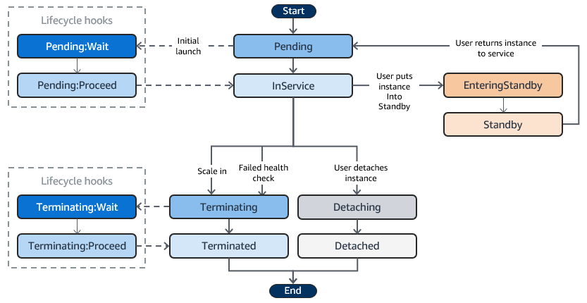

### EC2 Auto Scaling とは

- EC2 の自動スケーリング (Auto Scaling) 機能を管理するためのフルマネージドサービス

    - 自動スケーリング機能とは、EC2 インスタンスの台数を自動で増減するサービスのこと

        - 負荷の状況や日時などの条件によって、EC2 インスタンスの台数を増やしたりｍ減らしたりすることができる

 

- EC2 Auto Scaling の利用料金は無料     

---

### EC2 Auto Scaling をより理解するための用語

- #### Auto Scaling Group

    

    引用: [【初心者向け】Amazon EC2 Auto Scalingについてまとめてみた](https://blog.serverworks.co.jp/2023/03/09/122924)

     

    - 管理対象の EC2 インスタンスの論理的なグループのこと

    - このグループ内で EC2 の台数を増減させる

 

- #### 起動テンプレート

    

    引用: [【AWS初学者向け・図解】EC2 AutoScalingとは？現役エンジニアがわかりやすく解説](https://o2mamiblog.com/aws-ec2-autoscaling-beginner)

     

    - 起動テンプレートには EC2 インスタンスの `最小数`、`最大数` および `希望する数` を設定する

        - 希望する数の EC2 を維持し、指定した最小数～最大数の範囲内で、EC2 の数が自動調整される

 

- #### スケーリングポリシー

    - EC2 を増減させる条件を定義したもの

    - 複数の[スケーリング方法](./EC2_AutoScaling_Policies.md)から1つを選択してスケーリングポリシーを定義する

 

- #### ウォームプール

    

     

    - Auto Scaling Group に紐づけられた `初期化済みの EC2 インスタンスのプール` のこと

     

    - スケールアウト時には、ウォームプールからインスタンスを起動

        - ウォームプールのインスタンスは初期化済みのため、早く起動可能

     

    - スケールイン時

        - インスタンスを停止してウォームプールにプールする

 
 

参考サイト

[【AWS初学者向け・図解】EC2 AutoScalingとは？現役エンジニアがわかりやすく解説](https://o2mamiblog.com/aws-ec2-autoscaling-beginner/)

[【初心者向け】 Amazon EC2 Auto Scaling について](https://www.sunnycloud.jp/column/20210712-01/)

[【初心者向け】Amazon EC2 Auto Scalingについてまとめてみた](https://blog.serverworks.co.jp/2023/03/09/122924)

---

### EC2 Auto Scaling のライフサイクル

引用: [Amazon EC2 Auto Scaling インスタンスのライフサイクル](https://docs.aws.amazon.com/ja_jp/autoscaling/ec2/userguide/ec2-auto-scaling-lifecycle.html)

 

- Auto Scaling Group による EC2 の起動 ~ 終了までのライフサイクル

 

#### ライフサイクルフック (Lifecycle hooks)

- `Pending: Wait` か `Termination: Wait` の状態の時に、カスタムアクションを実行できる機能

- インスタンス終了前にログをデータベースに出力したり、インスタンス起動時に特定のスクリプトを実行したい時に利用できる

 
 

参考サイト

[AWSでAuto Scaling Groupsを用いた耐障害性を考える](https://qiita.com/tech4anyone/items/aed5c5644468cf62c393)