### 大まかな流れ

1. [起動テンプレートの作成](#起動テンプレートの作成)

    - Auto Scaling グループで起動する EC2 インスタンスについての設定

 

2. [Auto Scaling Group の作成](#auto-scaling-group-の作成)

    - EC2 Auto Scaling でのスケーリング方法や対象の AZ 、サブネットなどの設定

---

### 起動テンプレートの作成

1. AWS マネージドコンソールにログイン後、EC2 画面に遷移し、サイドメニューの `インスタンス` から `起動テンプレート` を選択する

    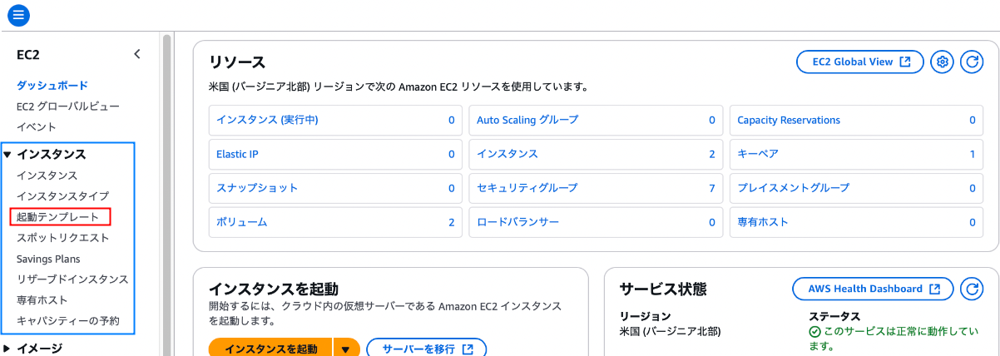

 

2. `起動テンプレートの作成` をクリックする

    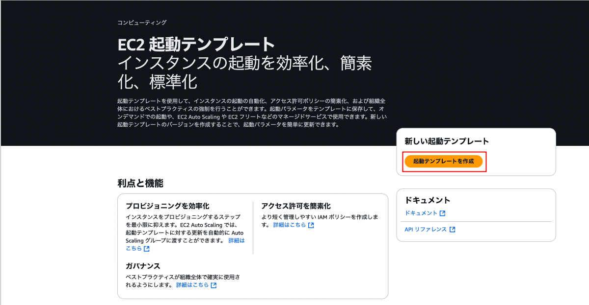

 

3. 設定項目を記入し、`起動テンプレートを作成` を選択する

    #### 起動テンプレート名と説明    

    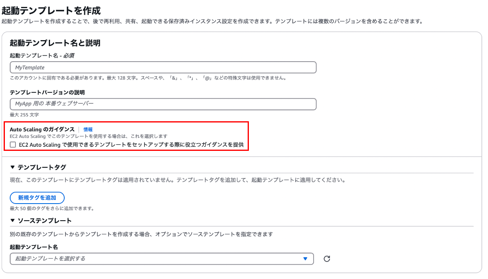

     

    - `起動テンプレート名`

        - 作成する起動テンプレートの名前

     

    - `テンプレートバージョンの説明`

        - 作成する起動テンプレートの説明

     

    - `Auto Scaling のガイダンス`

        - EC2 Auto Scaling で利用したい場合はチェックを入れる

     

    - `テンプレートタグ`

        - 作成する起動テンプレートに付与するタグ

     

    - `ソーステンプレート`

        - 別の起動テンプレートを元に当起動テンプレートを作成する場合、元となる起動テンプレートを指定する

     
     

    #### OSイメージやインスタンスファミリー、キーペアの設定

    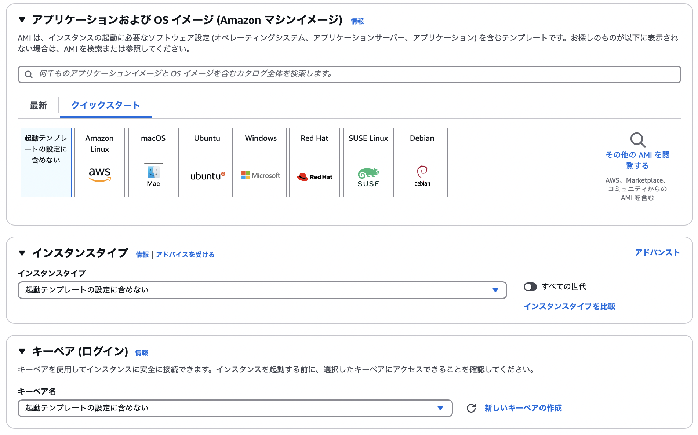

    - `マシンイメージ`

        - 当起動テンプレートで作成する EC2 インスタンスの OS のイメージ

     

    - `インスタンスタイプ`

        - 当起動テンプレートで作成する EC2 インスタンスのメモリや CPU の性能

     

    - `キーペア`

        - 当起動テンプレートを元に作成する EC2 インスタンスに接続する際に使用するキーペア (秘密鍵と公開鍵)

     
     

    #### ネットワーク設定

    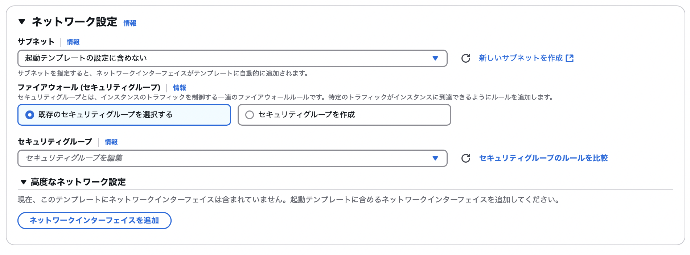

    - `サブネット`

        - 当起動テンプレートを元に作成する EC2 インスタンスが配置されるサブネット

        -  ★必須項目ではないので、柔軟に EC2 を配置したい場合は設定しなくて良い

     

    - `セキュリティグループ`

        - 当起動テンプレートを元に作成する EC2 インスタンスに付与するセキュリティグループ

     

    - `高度なネットワーク設定`

        - 当起動テンプレートを元に作成する EC2 インスタンスの [ENI](./ENI.md) に関連する設定

     
     

    #### 高度なネットワーク設定

    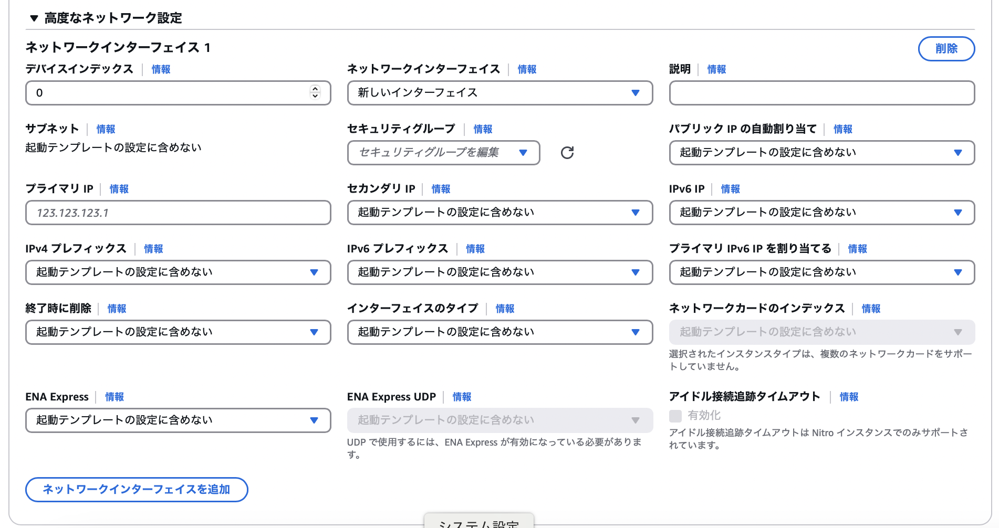
    
    *設定項目が多いので、今回使用する設定項目のみ説明する
    
     

    - `パブリック IP の自動的割り当て`

        - 当起動テンプレートを元に作成する EC2 インスタンスにパブリック IP アドレスを付与するかどうか
    
     

    - `終了時に削除`

        - EC2 インスタンス終了時に ENI も一緒に削除するかどうか

     

    - その他の設定項目に関する説明は[こちら](https://docs.aws.amazon.com/ja_jp/autoscaling/ec2/userguide/create-launch-template.html#change-network-interface)を参照

     
     

    #### ボリューム

    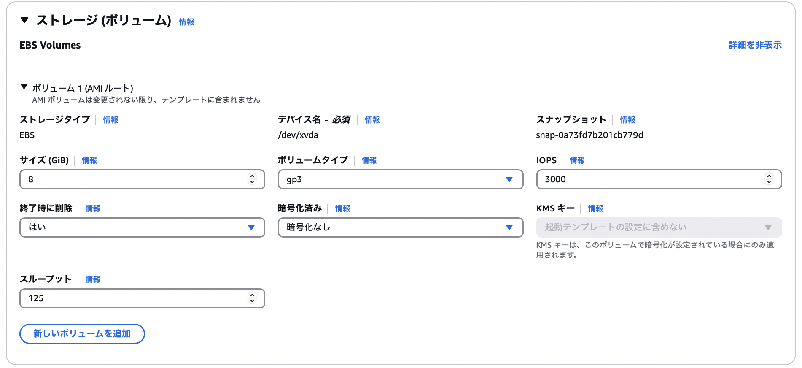

    - 各設定項目は[こちら](./EBS.md)を参照

     
     

    #### リソースタグ

    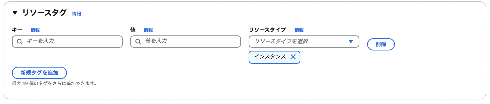

    - AWS のリソースの管理のために利用するタグ

     
     

    #### 高度な詳細

    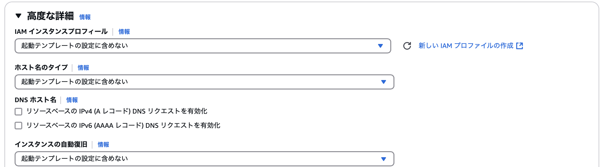

    - 当起動テンプレートを元に作成する EC2 インスタンスについての詳細な設定

    - 詳しくは[こちら](#高度な詳細について)を参照
    
 
 

参考サイト

高度なネットワーク設定について
- [Auto Scaling グループの起動テンプレートを作成する](https://docs.aws.amazon.com/ja_jp/autoscaling/ec2/userguide/create-launch-template.html#change-network-interface)

---

### Auto Scaling Group の作成

1. AWS マネージドコンソールにログイン後、EC2 画面に遷移し、サイドメニューの `Auto Scaling` から `Auto Scaling グループ` を選択する

    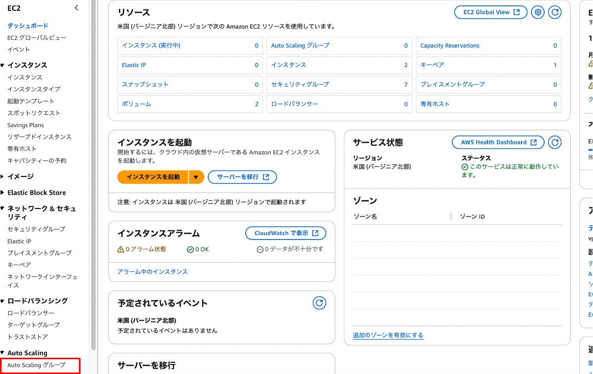

 

2. `Auto Scaling グループを作成する` をクリックする

    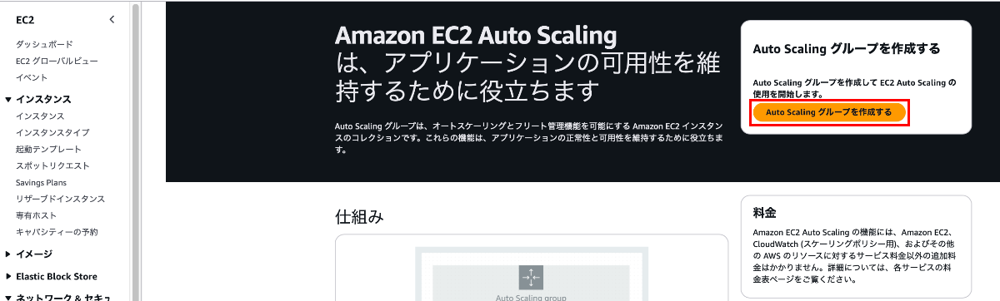

 

3. 設定項目を記入し、`起動テンプレートを作成` を選択する

    #### 起動テンプレートを選択

    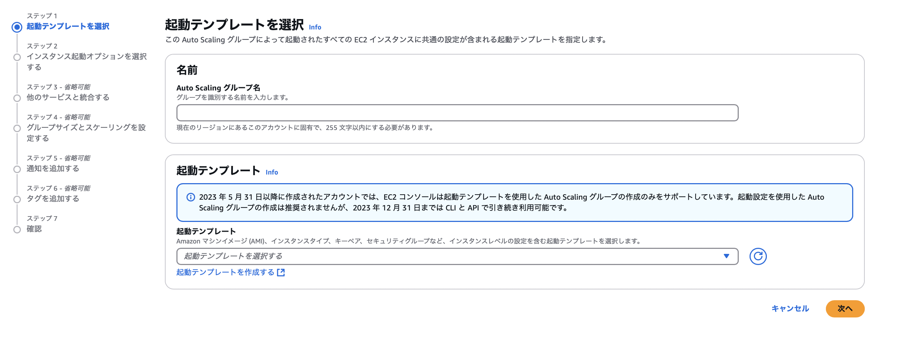

    ##### 名前

    - `Auto Scaling グループ名`

        - 作成する [Auto Scaling Group](./EC2_AutoScaling.md#ec2-auto-scaling-をより理解するための用語) 名

     
    
    ##### 起動テンプレート

    - `起動テンプレート`

        - Auto Scaing によって作成する EC2 インスタンスの[起動テンプレート](#起動テンプレートの作成)

     

    - `バージョン`

        - 起動テンプレートのバージョン

     
     

    #### インスタンス起動オプションを選択する

    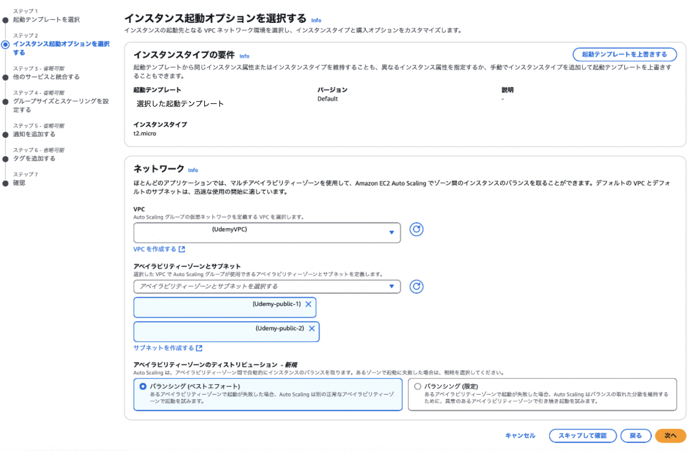

    ##### インスタンスタイプの要件

    - `起動テンプレートを上書きする`

        - [起動テンプレート](#起動テンプレートの作成)で定義した作成&起動する EC2 インスタンスの CPU や メモリの上書きをする

     

    ##### ネットワーク

    - `VPC`

        - EC2 を配置する VPC を選択

     

    - `アベイラビリティゾーンとサブネット`

        - EC2 を配置する AZ & サブネットを選択

     

    - [`アベイラビリティゾーンのディストリビューション`]((#アベイラビリティゾーンのディストリビューションについて))

        - EC2 インスタンスを配置する際の方針を選択

     
     

    #### 他のサービスと統合する

    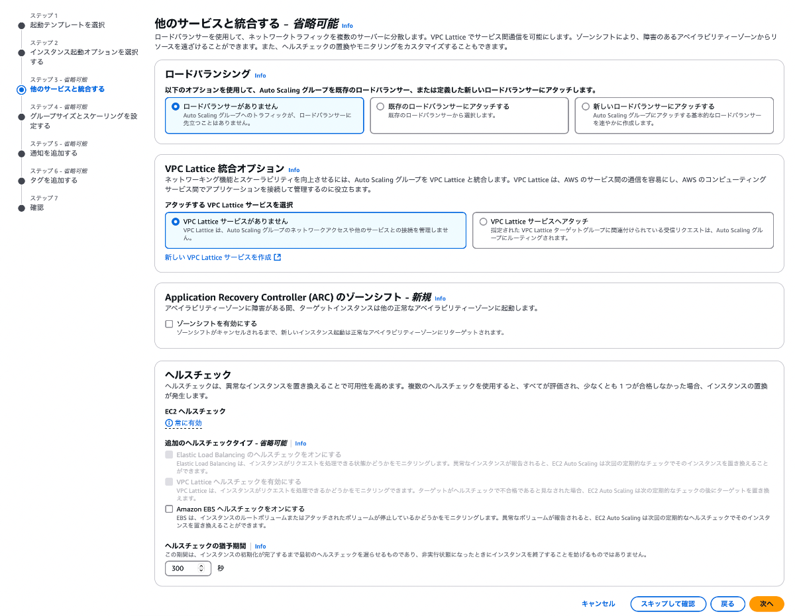

    ##### ロードバラシング

    - `ロードバランサーがありません`

        - あまり使わないオプション

        - ロードバランサーと EC2 Auto Scaling Group を連携しない選択肢
    
     

    - `既存のロードバランサーにアタッチする`

        - **作成ずみの**ロードバランサーと EC2 Auto Scaling Group を連携しない選択肢
    
     

    - `新しいロードバランサーにアタッチする`

        - 当 EC2 Auto Scaling Group と一緒にロードバランサーも作成し、連携させる

     

    ##### [VPC Lattice](#vpc-lattice) 統合オプション

    - `VPC Lattice サービスがありません`

        - VPC Lattice と当 EC2 Auto Scaling Group を連携しない

     

    - `VPC Lattice サービスへアタッチ`

        - VPC Lattice と当 EC2 Auto Scaling Group を連携させる

     

    ##### Application Recovery Contrller (ARC) のゾーンシフト

    - `ゾーンシフトを有効にする`

        - 異常と見なされた AZ の EC2 へトラフィックを送らないようにする機能を有効にするかどうか　

     

    ##### ヘルスチェック

    - `Elastic Load balancing のヘルスチェックを有効にする`

        - (ロードバランサーとの統合を有効にした場合) ロードバランサーへのヘルスチェックも行う

    - `VPC Lattice ヘルスチェックをオンにする`

        - (VPC Lattice との統合を有効にした場合) VPC Lattice へのヘルスチェックも行う

    - `Amazon EBS ヘルスチェックをオンにする`

        - EC2 インスタンスの [EBS](./EBS.md) にもヘルスチェックを行う

            - ヘルスチェックで異常と検知された場合、そのインスタンスを置き換える

    - `ヘルスチェックの猶予期間`

        -  ★インスタンスの内部的な準備が整う前に Auto Scaling のヘルスチェックが実施されてエラーになるのを防ぐ機能

            - EC2 インスタンスの起動時に何らかのスクリプトを実行し、アプリケーションのインストールを行うような場合、起動してすぐにヘルスチェックを行うと異常と検知され、さらに新しい EC2 インスタンを作成 & 入れ替え が発生する可能性がある

     
     

    #### グループサイズとスケーリングを設定する

    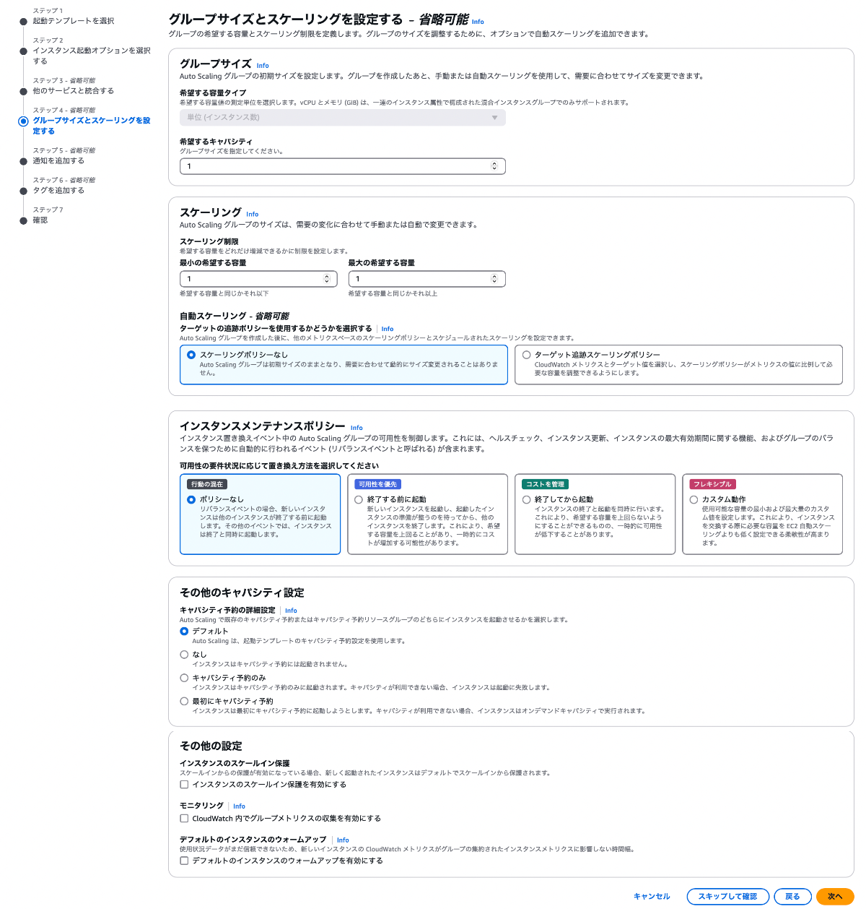

    ##### グループサイズ

    - `希望する容量タイプ`

        - TODO: 調べる
    
     

    - `希望するキャパシティ`

        - 当 Auto Scaling Group 起動時に起動させる EC2 インスタンスの数

     
    
    ##### スケーリング

    - `最小の希望する数`

    - `最大の希望する数`

    - `自動スケーリング`

        - スケーリングポリシーを 「無し」 か 「追跡スケーリングポリシー」 から選択

        - ★Auto Scaling Grouop 作成後でもスケーリングポリシーを変更することは可能

     

    ##### インスタンスメンテナンスポリシー

    - Auto Scaling によるインスタンスの置き換え (入れ替え) が発生する際のポリシーを選択

    - 詳しくは[こちら](https://aws.amazon.com/jp/blogs/news/introducing-instance-maintenance-policy-for-amazon-ec2-auto-scaling/)を参照

     

    ##### その他のキャパシティ設定

    - キャパシティ予約の詳細設定

        - TODO: 調べる

     

    ##### その他の設定

    - インスタンスのスケールイン保護

        - Auto Scaling Group 内の EC2 インスタンスをスケールインの際に終了 (= 削除) させないようにする設定ｋｋ
    
     

    - モニタリング

        - Auto Scaling のメトリクスを収集して CloudWatch で可視化できるようにする設定

     

    - デフォルトインスタンスのウォームアップ

        - EC2 インスタンスが作成されてからヘルスチェックが成功し、InService になってから、Auto Scaling グループのメトリクス収集の対象になるまでの期間の設定

     
     

    #### 通知を追加する

    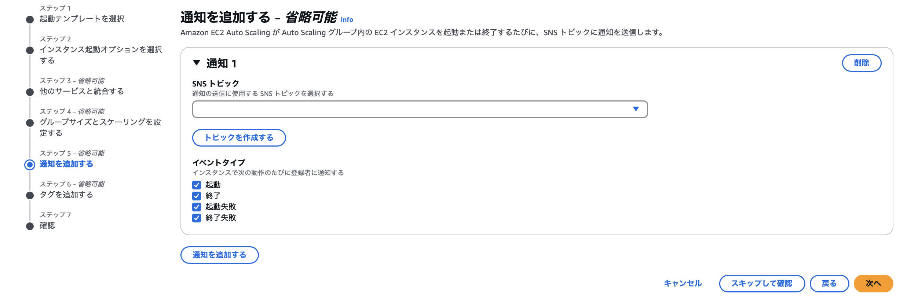

    - EC2 インスタンスの各イベントの通知の受け取り設定

     
     

    #### タグを追加する

    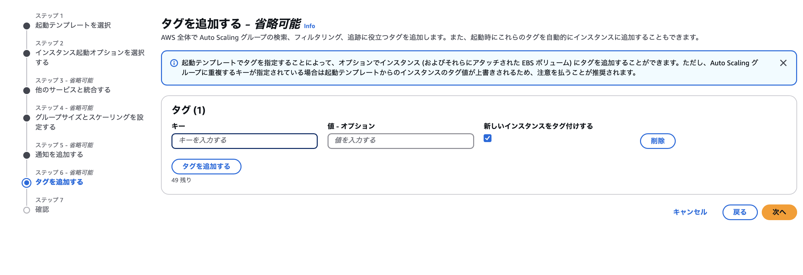

    - 当 Auto Scaling Group に付与するタグ

     
     

    #### 確認

    

    - 全体の設定項目を確認し、`Auto Scaling グループを作成する をクリック

 
 

参考サイト

ゾーンシフトについて
- [Amazon EC2 Auto Scaling でゾーンシフトが使用可能に](https://aws.amazon.com/jp/blogs/news/amazon-ec2-auto-scaling-jp/)

- [Amazon Application Recovery Controller（Amazon ARC）を利用した高可用性の実現～前編・解説編～](https://business.ntt-east.co.jp/content/cloudsolution/ih_column-148.html#section-1)

ヘルスチェックの猶予期間について
- [EC2 Auto Scaling の「ヘルスチェックの猶予期間」と「インスタンスのウォームアップ期間」の違いを教えてください](https://dev.classmethod.jp/articles/tsnote-what-is-healthcheck-grace-period-and-warm-up-period/)

メンテナンスポリシートについて
- [Amazon EC2 Auto Scaling インスタンスメンテナンスポリシーの紹介](https://aws.amazon.com/jp/blogs/news/introducing-instance-maintenance-policy-for-amazon-ec2-auto-scaling/)

---

### 高度な詳細について

---

### アベイラビリティゾーンのディストリビューションについて

- AZ のディストリビューションとは、新しいインスタンスを作成の際に異常が発生した時の対処方針のイメージ

    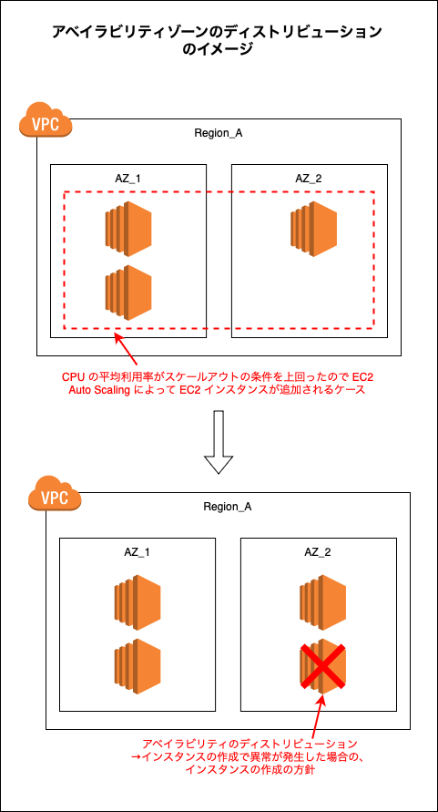

 
 

- バランシング (ベストエフォート)

    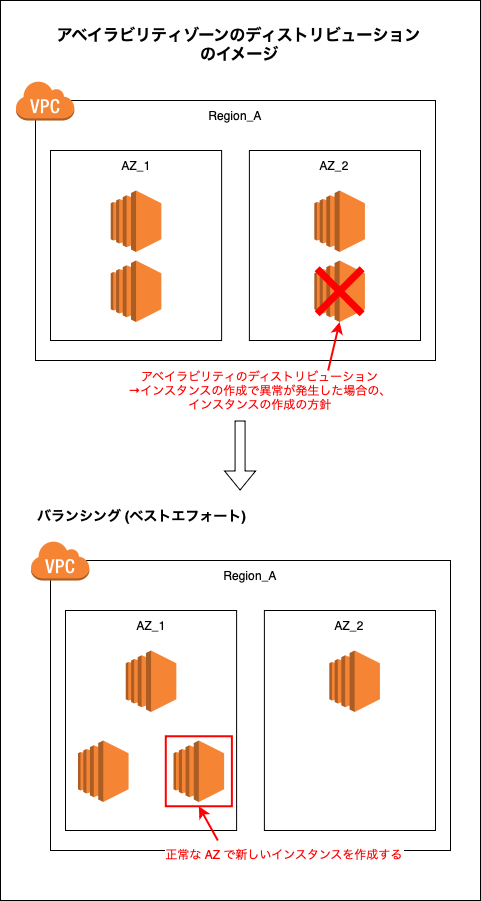

 
 

- バランシング (異常)
    
    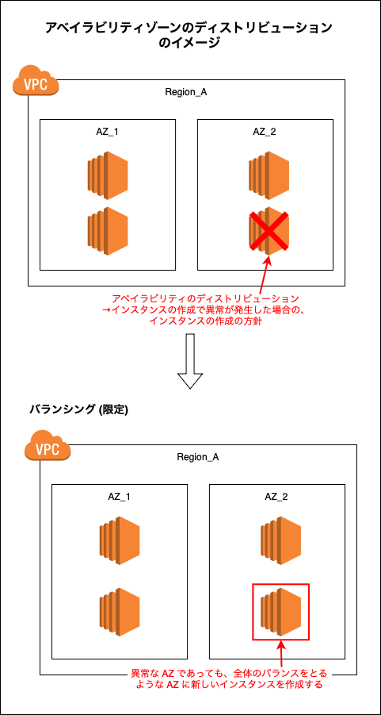

---

### VPC Lattice

#### VPC Lattice とは

- VPCをまたいだアプリケーション間の接続を簡略化するサービスのこと

    

    引用: [VPC Latticeワークショップで理解を深める！](https://qiita.com/har1101/items/53fce222db232810fd82)

 
 

参考サイト

[VPC Latticeワークショップで理解を深める！](https://qiita.com/har1101/items/53fce222db232810fd82)

[Amazon VPC Lattice解説（概要および構成要素編）](https://blog.serverworks.co.jp/vpc-lattice/summary)

[VPC Lattice ターゲットグループを使用してトラフィックフローを管理する](https://docs.aws.amazon.com/ja_jp/autoscaling/ec2/userguide/ec2-auto-scaling-vpc-lattice.html)

[AWS VPC LatticeがGAされたので触ってみた](https://zenn.dev/nnydtmg/articles/aws-vpc-lattice-workshop-1)