### 今回の構成

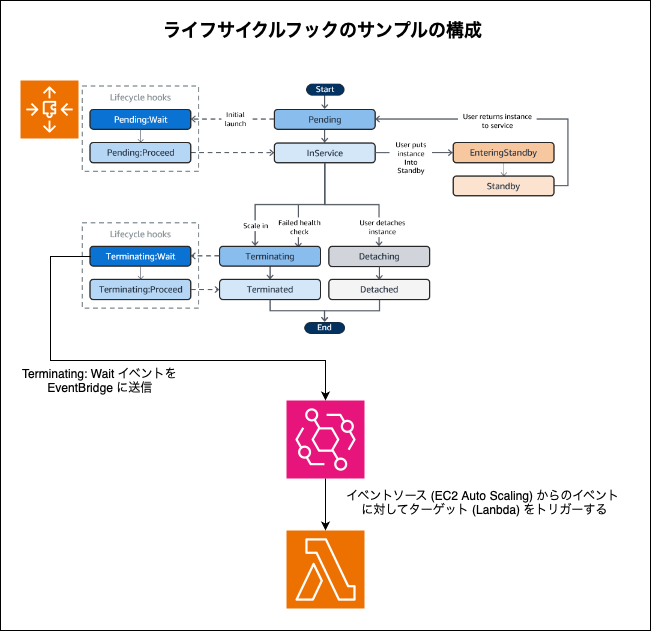

 

#### 手順

1. Auto Scaling Group の作成

   - 詳しくは[こちら](./EC2_Auto_Scaliingを使って見る.md)を参照

2. [Life Cycle Hooks を設定](#life-cycle-hooks-を設定)

3. [Lambda 関数を作成](#lambda-関数を作成)

4. [EventBridge を作成](#eventbridge-を作成)

5. [確認](#確認)

---

### Life Cycle Hooks を設定

1. ライフサイクルフックを設定したい Auto Scaling 　グループを選択し、 `インスタンス管理` タブにある `ライフサイクルフックを作成する` を選択

   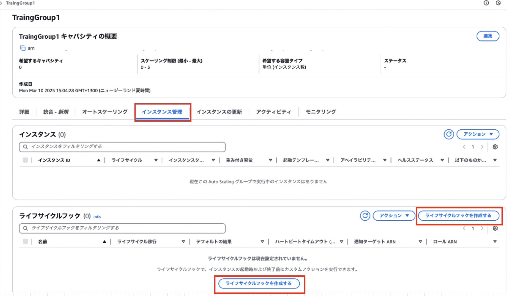

 
 

2. ライフサイクルフック作成画面 (モーダル) にて設定項目を記入し、`作成` をクリックする

   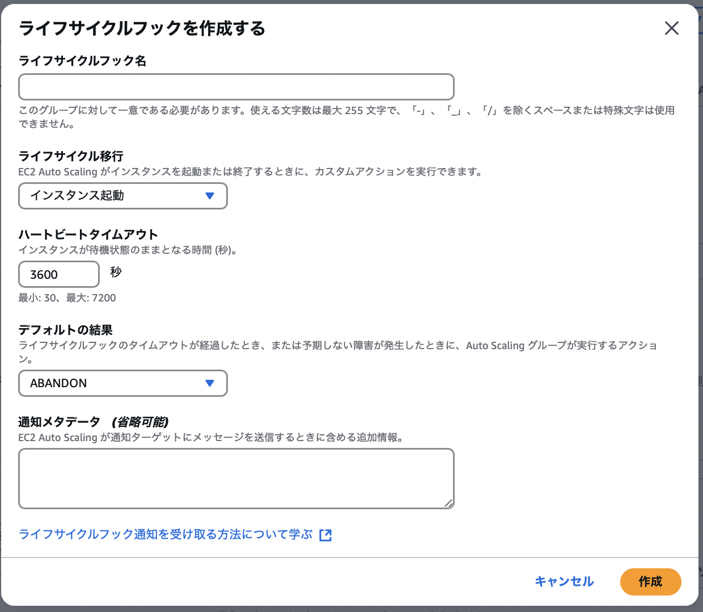

   - `ライフサイクルフック名`

      - 作成するライフサイクルフックの名前

    

   - `ライフサイクル移行`

      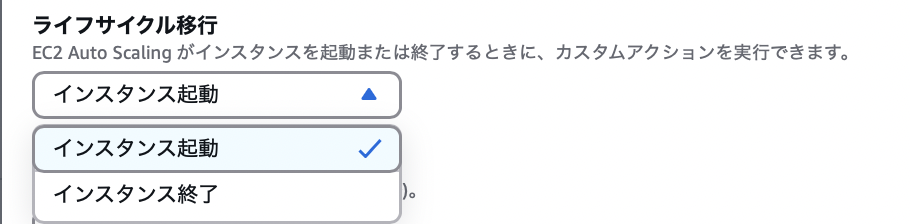

      - カスタムアクション (任意の処理) を実行したいタイミングを指定

      - インスタンス起動 = Pending Wait のタイミング

      - インスタンス終了 = Terminating Wait のタイミング

    

   - `ハートビートタイムアウト`

      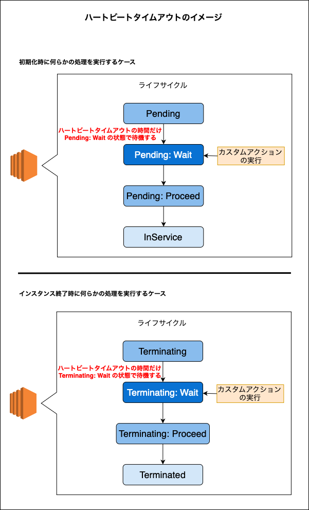

      - ★Pending Wait / Terminatiing Wait の待機時間

      - アクタムアクションにかかる時間とハートビートタイムアウトの調整を行うことが大事

    

   - `デフォルトの結果`

      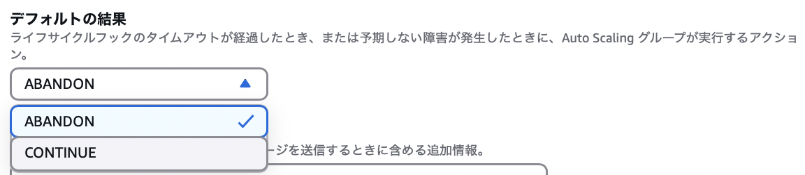

      - ハートビートタイムアウトが経過もしくは予期しない失敗が発生した際の挙動を指定する

      - CONTINUE

         - (ハートビートタイムアウト時間に達していなければ)残りのアクションを実行する。そしてインスタンスを起動/終了する

      - ABANDON

         - 残りのアクションを放棄し、インスタンスを直ちに終了する

    

   - `通知メタデータ`

      - カスタムアクションで送信したいその他のデータ

 
 

参考サイト

ハートビートタイムアウトについて
- [【新機能】Auto Scalingのインスタンス起動/破棄時に初期処理/終了処理を追加 – LifeCycleHook機能のご紹介](https://dev.classmethod.jp/articles/autoscaling-lifecyclehook/#PutLifecycleHook)

デフォルトの結果について
- [AutoScallingのライフサイクルフックを使用してスケールイン時にEC2インスタンス内のログを退避させる](https://dev.classmethod.jp/articles/autoscalling-terminating-log-upload/#%25E3%2583%25A9%25E3%2582%25A4%25E3%2583%2595%25E3%2582%25B5%25E3%2582%25A4%25E3%2582%25AF%25E3%2583%25AB%25E3%2583%2595%25E3%2583%2583%25E3%2582%25AF%25E3%2581%25AE%25E8%25A8%25AD%25E5%25AE%259A)

- [Auto Scaling GroupのライフサイクルフックでEIP割り当て](https://techblog.techfirm.co.jp/entry/asg-associate-eip-by-licecyehook#ライフサイクルフック)

---

### Lambda 関数を作成

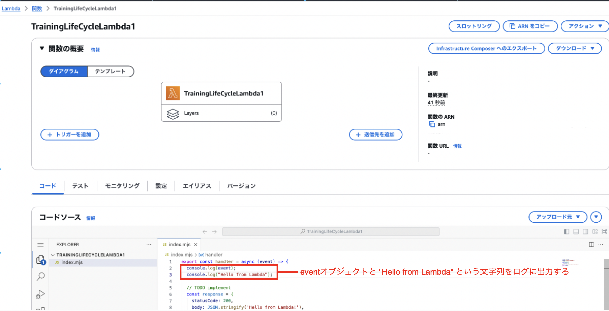

 

- 上記画像の Lambda 関数は event オブジェクトと文字列をログに出力するだけの関数

---

### EventBridge を作成

#### ルールの作成

1. EventBridge 画面のサイドメニューから `ルール` を選択し、`ルールの作成` をクリックする

   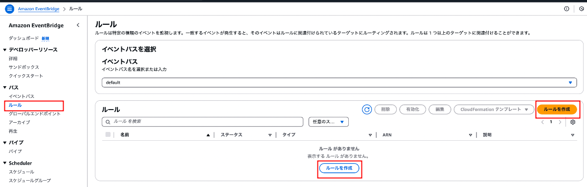

 

2. ルールの詳細の定義

   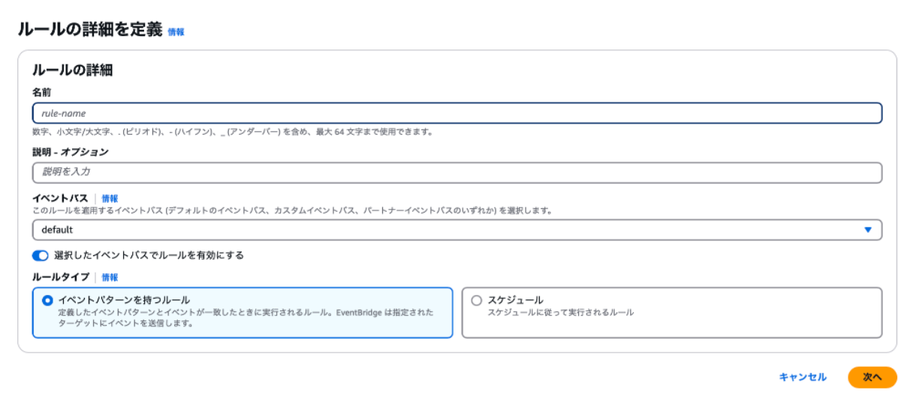

   - [`イベントバス`](./EventBridge.md#イベントバス): デフォルトを選択

   - [`ルールタイプ`](./EventBridge.md#ルール): イベントパターンを持つルールを選択

 

3. ★★★イベントパターンを構築★★★

   ##### イベント

   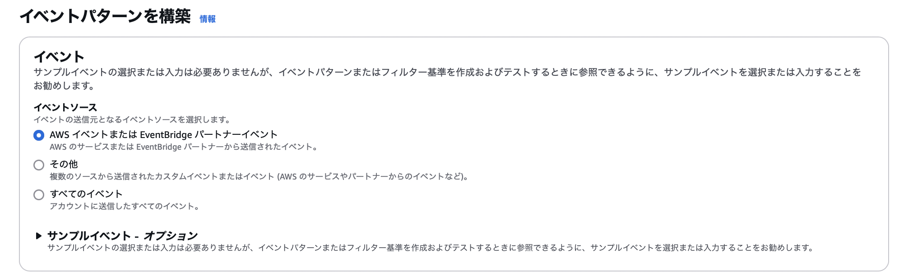

   - [`イベントソース`](./EventBridge.md#イベントソース): AWS イベントを選択
   
    

   ##### イベントパターン

   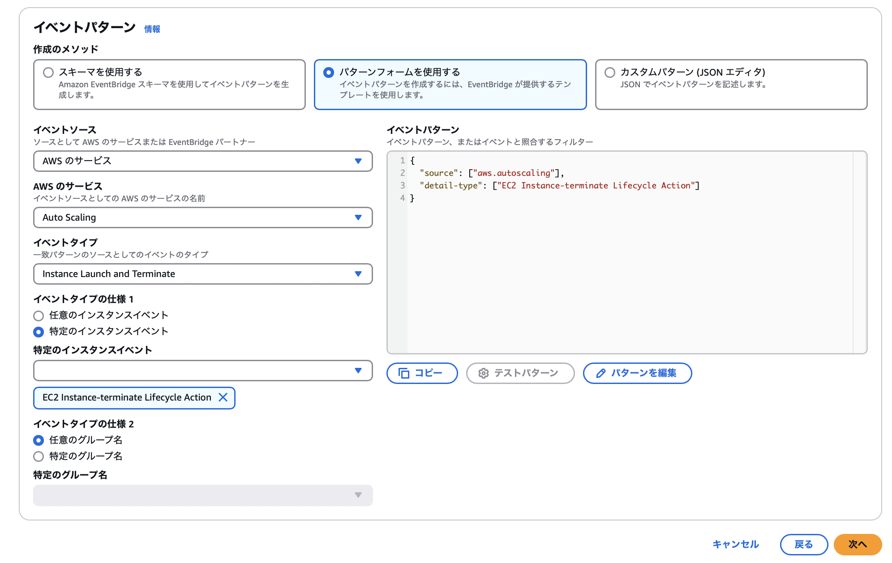

   - `イベントソース`: AWS のサービスを選択

   - `AWS のサービス`: Auto Scaling を選択

   - `イベントタイプ`: Instance Launch and Terminate を選択

   - `イベントタイプの仕様`: 特定のインスタンスイベントを選択し、EC2 Instance-terminate LifeCycle Action を選択

 

4. ★★★ターゲットを選択★★★

   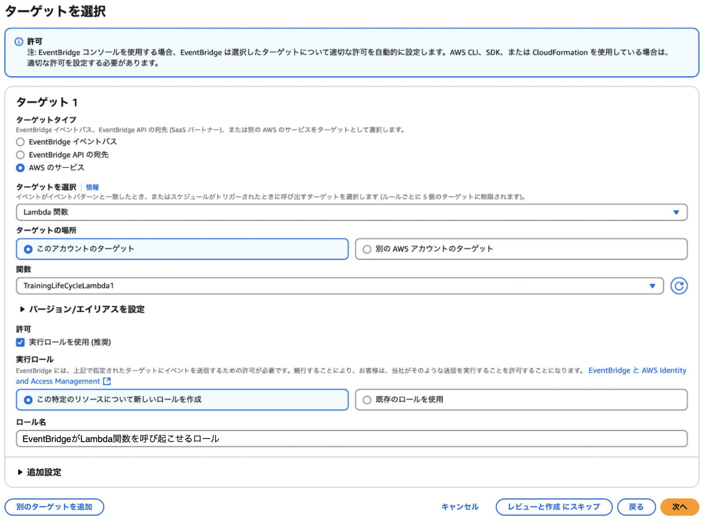

   - `ターゲットタイプ`: AWS のサービスを選択

    

   - `ターゲットを選択`: Lambda 関数を選択

    

   - `ターゲットの場所`: 呼び出す対象の Lambda 関数の所有者が同アカウントかどうかを設定

    
   

   - ``関数`: 呼び出す対象の Lambda 関数を指定する

    

   - `バージョン・エイリアスを設定`: 今回はデフォルトのLmabda関数を呼び出す (バージョンやエイリアスで指定する必要はない) のでこの設定を触る必要はない

    

   - `許可`: 実行ロールを付与して EventBridge が Lambda 関数を呼び出すようにしたいので許可にチェックを入れる

    

   - `実行ロール`: Lambda 関数を呼び起こせるロールの設定方法を指定。ここでは新規でロールを作成し付与している

    

   - `追加設定`: ターゲットへ渡すイベントのカスタマイズやデッドレターキューなどの設定する必要はないので触らなくていい

 

5. タグを設定

   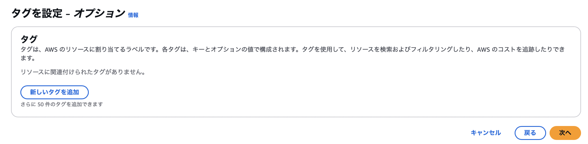

   - 特にタグを付与する必要はないのでスキップ

 

6. レビューと作成

   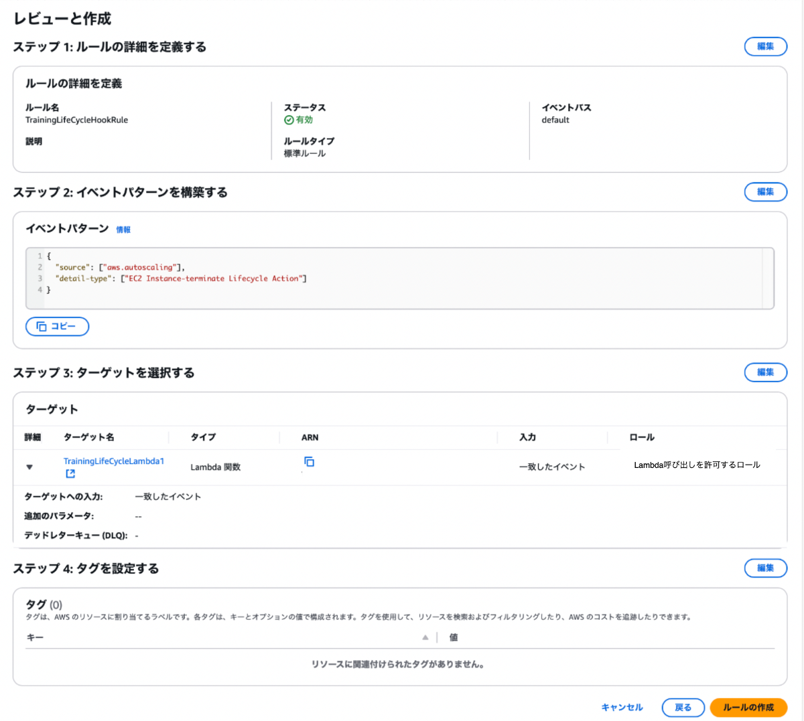

   - 設定内容を確認し、`ルールの作成` をクリック

---

### 確認

#### Auto Scaling Group のインスタンスを終了する

1. インスタンスを終了させたい Auto Scaling Group を選択し、`キャパシティの概要` にある `編集` をクリックする

   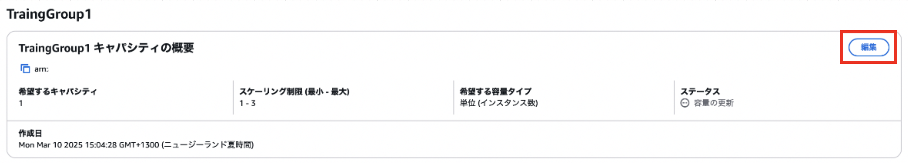
   
 

2. `希望するキャパシティ数` と `最小の希望する容量` に0を設定する

   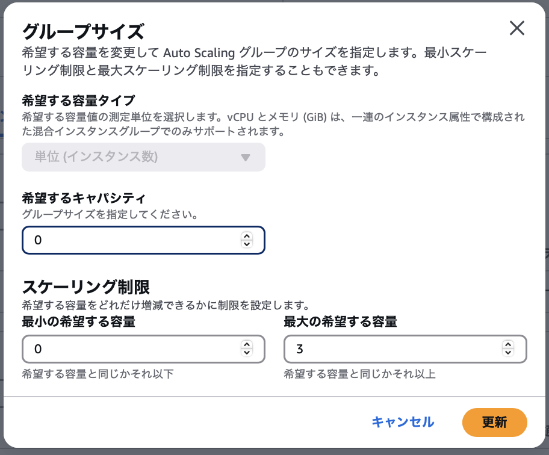
   

 
 

#### インスタンス管理タブからインスタンスが終了させる過程を確認

   1. インスタンス管理タブにて確認可能

      

 
 

#### CloudWatch Logs で Lambda 関数からのログを確認する

   1. CloudWatch ログ画面にて Lambda 関数のロググループを選択

      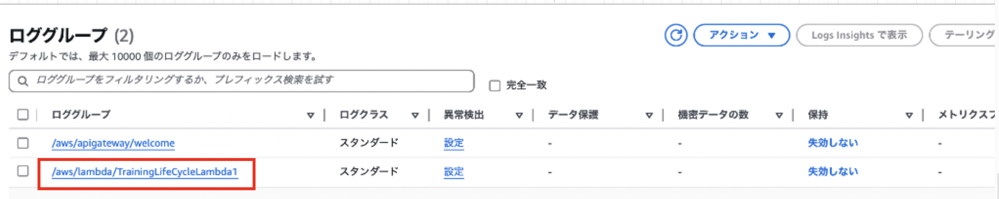

    

   2. 選択したロググループ内にログが出力されていることを確認 = Auto Scaling 内のインスタンスの終了時に Lambda 関数がトリガーされたことが確認できる
   
      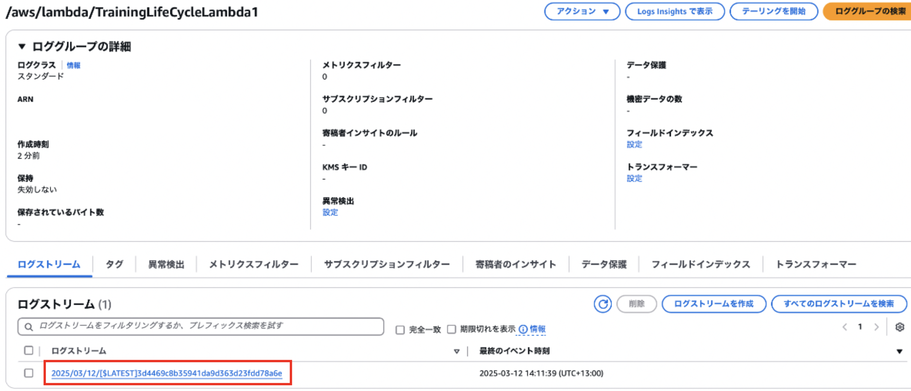

    

   3. ログに期待した内容が出力されていれば OK

      - 今回は event オブジェクトと "Hello from Lambda" という文字列がログに出力されていれば OK

      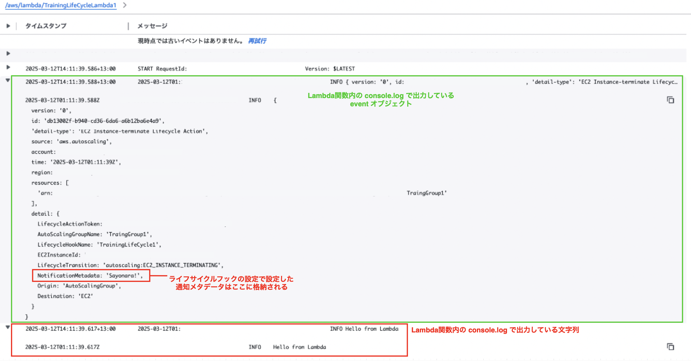