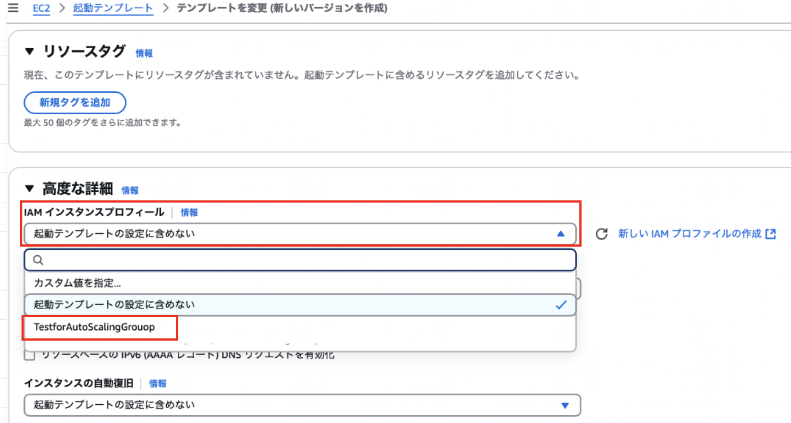
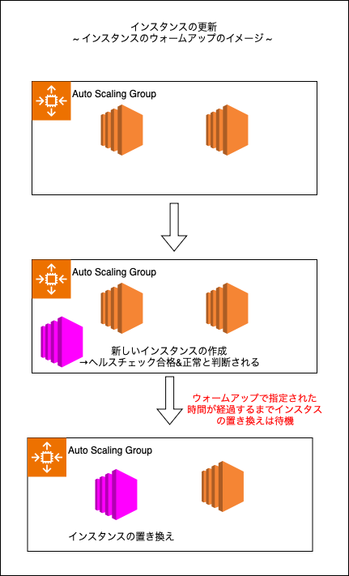

### インスタンスを更新する

1. 起動テンプレートを更新し、

---

### 起動テンプレートの更新

- 起動テンプレートにて、作成するインスタンスに適当な IAM ロールを付与するように更新してみる

 

1. EC2 の起動テンプレート画面から更新したい起動テンプレートを選択し、`アクション` から `テンプレートを変更 (新しいバージョンをバージョンを作成)` をクリック

    

 

2. [高度な設定](./EC2_Auto_Scaliingを使って見る.md#起動テンプレートの高度な詳細について)の`IAM インスタンスプロフィール` にてインスタンスに付与したい IAM ロールを選択する

    

---

### Auto Scaling Group のインスタンスの更新

1. インスタンスの更新を行いたい Auto Scaling Group を選択し、`インスタンスの更新`タブから `インスタンスの更新を開始する` をクリック

    

 

2. 各設定項目

    #### 可用性の設定

    

    - `インスタンスの置き換え方法`

        - どのようにして Auto Scaling Group 内のインスタンスと新しいインスタンスを入れ替えていくかについての設定項目

     

    - `正常率を設定`

        - 最小正常率

            

            - インスタンスを置き換えていく中で、保ちたい正常な (=動いている) インスタンスの割合

            - ★最小正常率を0%にすると、インスタンスを1度に置き換える

            - ★インスタンスの置き換え方法に `終了してから起動` もしくは `カスタム動作` を選択した場合のみ設定可能

         

        - 最大正常率

            

            - インスタンスを置き換えていく中で、Auto Scaling Group にて増加できるインスタンスの割合

            - ★インスタンスの置き換え方法に `終了する前に起動` もしくは `カスタム動作` を選択した場合のみ設定可能

     

    - `置き換えサイズが無効の場合に備えてフォールバック動作を設定する`

        

        - 可用性を優先するために最大正常率に違反するか、最小正常率に違反するかの選択

            - 設定されている最小正常率に基づいて1つのインスタンスも置き換えることができない時にどちらの正常率に違反するか

        - ★このオプションはインスタンスの置き換え方法に `終了してから起動` を選択した場合のみ現れる

     

    - `インスタンスのウォームアップ`

        

        - 新しいインスタンスがヘルスチェックに合格し、InService で正常であると看做されてから古いインスタンスに交換されるまでの待機時間

        - Auto Scaling Group にて設定した[デフォルトインスタンスのウォームアップ](./EC2_Auto_Scaliingを使って見る.md#スケーリング)も同じように機能する

     
     

    #### 設定を更新する

    

    - `チェックポイントを有効にする`

        - インスタンスの更新が一時停止する時点 (= チェックポイント) を設ける

        - インスタンスの置き換わりの進行度がチェックポイントに到達するとイベントを発火し、 [Event Bridge](./EventBridge.md) と連携することで、SNS でメッセージを飛ばすことができる

     
    
    - `ベイク時間`

        - ★インスタンスを置き換えてから置き換え完了と判断されるまでの待機時間 (= ベイクタイム) 時間の設定

            - (多分)**全ての**インスタンスの置き換えが終了してからそれが完了かどうかを判断するまでの待機時間

         

        - ★ウォームアップは各の新しいインスタンスが用意できてから古いインスタンスと入れ替えるまでの待機時間

     

    - `CloudWatch アラーム`

        - 任意の CloudWatch アラームを指定することで、インスタンスの更新注意にそのアラームが ALARM 状態になるとインスタンス更新のステータスを失敗にさせることができる

        - ロールバックと組み合わせることで、 ALARM 状態が検出されたことによるインスタンスの更新失敗は更新前の状態にロールバックすることができる

     

    - `スキップマッチング`

        - 最新の更新が行われているインスタンス (= 更新後のインスタンスと同じ状態のインスタンス) が存在する場合、そのインスタンスの更新を無視するかどうか

     

    - `スタンバイインスタンス`

        - [スタンバイ状態](./EC2_AutoScaling.md#ec2-auto-scaling-のライフサイクル)のインスタンスを検出した場合、そのインスタンスも更新するかどうか

     

    - `スケールインで保護されたインスタンス`

        - Auto Scaling Group の[スケールイン保護](./EC2_Auto_Scaliingを使って見る.md#その他の設定)が有効になっているインスタンスを発見した場合、そのインスタンスも更新するかどうか

     
     

    #### 必要な設定

    

    *以下の項目は `コンソールインターフェースを使用する` を選択した場合にのみ現れる

     

    - `起動テンプレートを更新する`

        - 特定の起動テンプレートを元に Auto Scaling Group のインスタンスを更新したい場合はこちらでその元となる起動テンプレートを指定する
        
        - 今回の例では、[更新した起動テンプレート](#起動テンプレートの更新)とそのバージョンを指定する

     

    - `起動テンプレートのインスタンスタイプを上書きするには、一連のインスタンスタイプと購入オプションを選択します`

        - 複数の異なるインスタンスタイプの EC2 をAuto Scaling Group で管理したい場合に利用できるオプションっぽい (多分)

        - 今回は単一のインスタンスタイプの利用なので説明は省略

     
     

    #### ロールバックの設定

    

    - `自動ロールバック`

        - インスタンスの更新を中断し、全て元に戻す機能

        - ★自動ロールバックオプションは、インスタンスの更新の開始の一部として必要な設定を指定した場合にのみ利用可能

 

3. 必要な項目を設定したら、`インスタンスの更新を開始する` をクリック

    

     

    - Auto Scaling Group の `インスタンス管理` タブでインスタンスの更新の様子を確認することができる

        
 
 

参考サイト

インスタンスの更新全般について
- [Auto Scaling グループでのインスタンスの更新の仕組み](https://docs.aws.amazon.com/ja_jp/autoscaling/ec2/userguide/instance-refresh-overview.html)

インスタンスの置き換え方法について
- [Amazon EC2 Auto Scaling インスタンスメンテナンスポリシーの紹介](https://aws.amazon.com/jp/blogs/news/introducing-instance-maintenance-policy-for-amazon-ec2-auto-scaling/)

ベイク時間について
- [インスタンスの更新のデフォルト値について説明する](https://docs.aws.amazon.com/ja_jp/autoscaling/ec2/userguide/understand-instance-refresh-default-values.html)