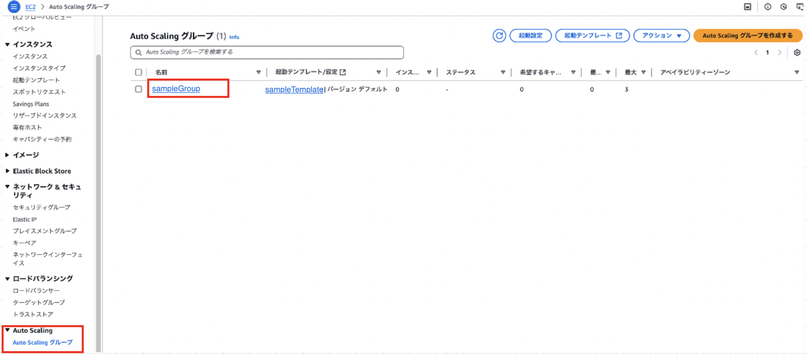
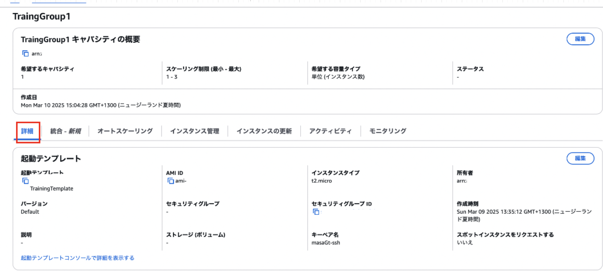
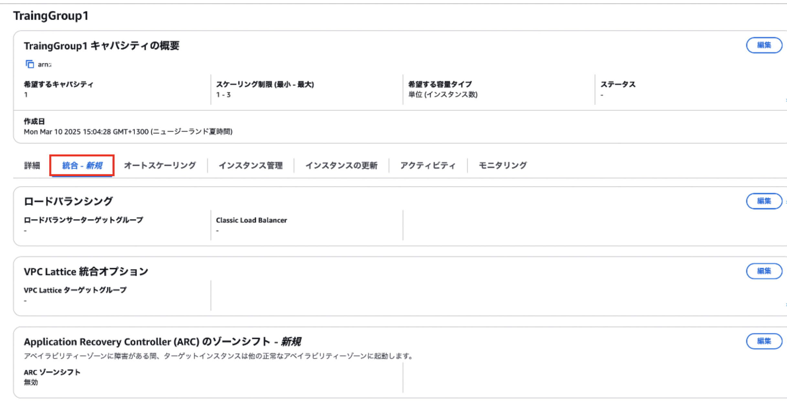
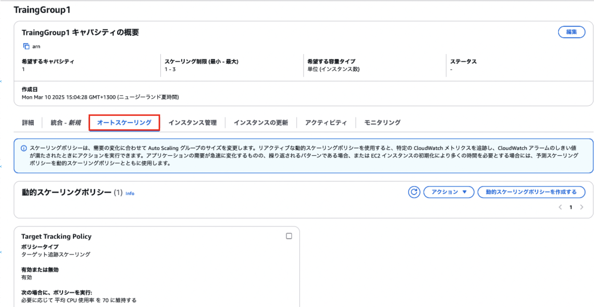
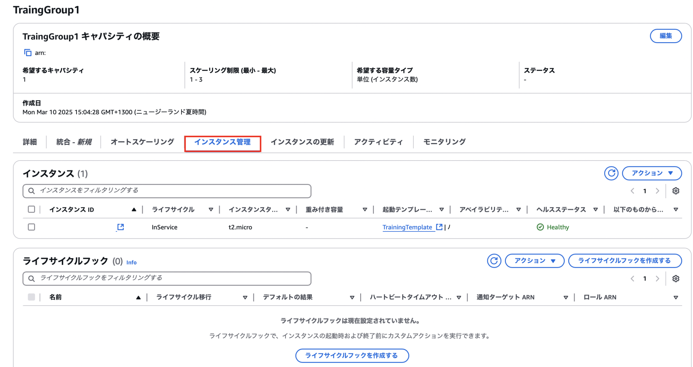
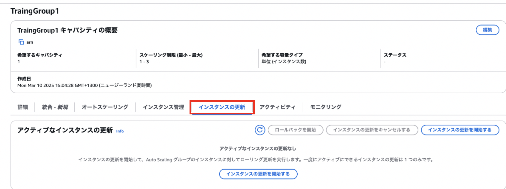
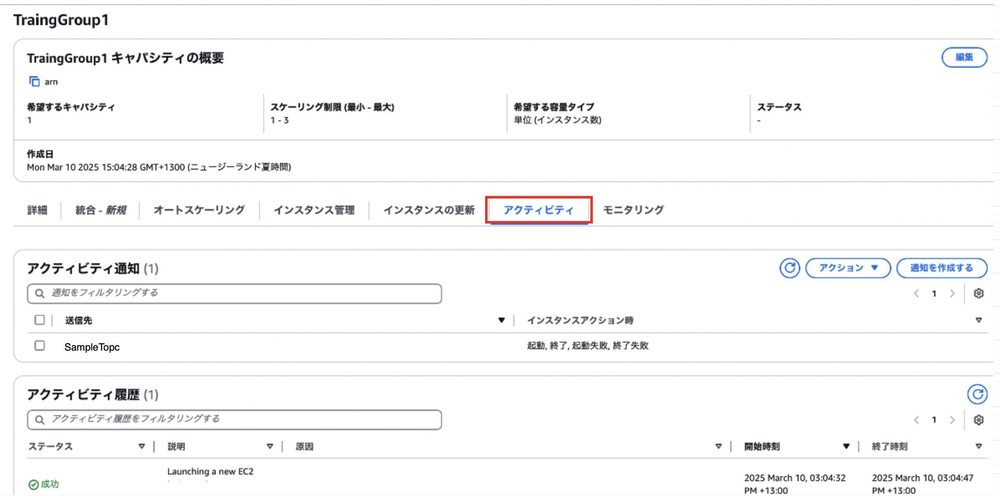
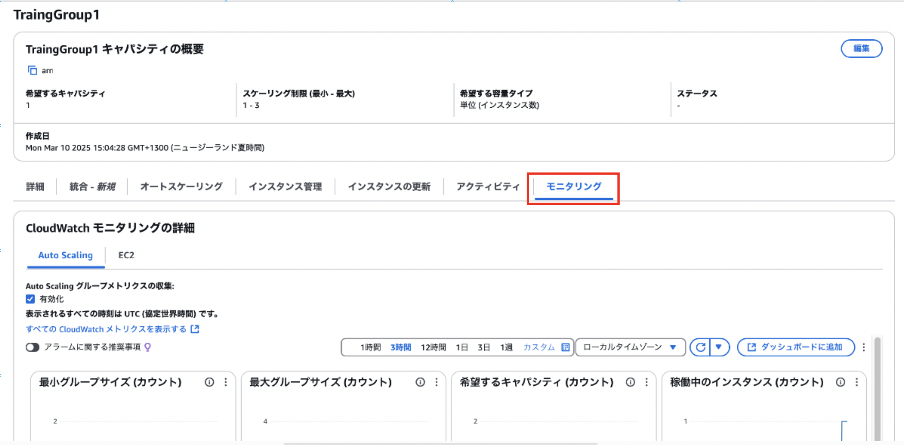

### 作成した Auto Scaling Group の確認

- AWS マネージドコンソールにログイン後、EC2 画面に遷移し、サイドメニューの `Auto Scaling グループ` から確認したいオートスケーリンググループを選択する

---

### 詳細

 

- Auto Scaling Group 作成時に設定した項目などを確認 & 設定することができる

- [スケールインポリシー](#スケールインポリシー)の設定なども可能

---

### 統合

 

- Auto Scaling Group と他のAWSサービス (ロードバランサーや AWS Lattice など)との連携の確認 & 設定ができる

---

### オートスケーリング

 

- Auto Scaling Group のスケーリングポリシーの確認 & 設定をすることができる

---

### インスタンス管理

 

- Auto Scaling Group 内で起動している EC2 の確認や[ライフサイクルフック](./EC2_AutoScaling.md#ライフサイクルフック-lifecycle-hooks)の設定などをすることができる

---

### インスタンスの更新

 

- 起動テンプレートでインスタンスタイプの変更を行なった場合など、それをもとに Auto Scaling Group 内のインスタンスを更新したい時に利用する

---

### アクティビティ

 

- Auto Scaling Group に設定されている通知の確認をすることができる

---

### モニタリング

 

- Auto Scaling Group のメトリクスを確認することができる

---

### スケールインポリシー

- どのようにインスタンスを終了させるかについての方針

- インスタンスの起動テンプレートの古いものから終了させたり、逆に新しいインスタンスから終了させたり設定することができる
