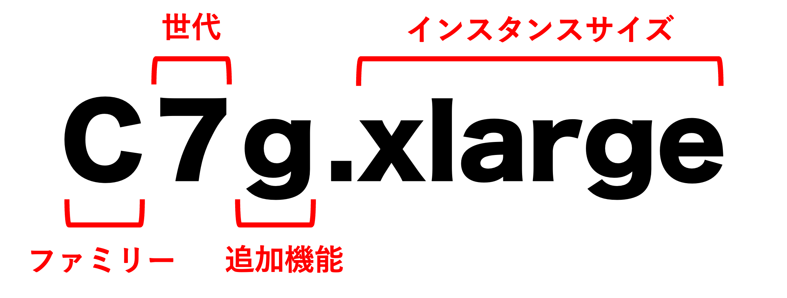

### インスタンスタイプとは

EC2 サーバーを作成する際、サーバーのインスタンスタイプを選択する

インスタンスタイプ = これから作成するサーバーのCUPやメモリなどのセット名

---

### インスタンスタイプの表記

引用: [Amazon EC2とは？初心者向けに基本情報やメリット・料金体系を解説](https://business.ntt-east.co.jp/content/cloudsolution/column-21.html#section-3)

 

上記画像のように4部分から構成されている

- ファミリー(ファミリータイプ)
    - そのインスタンスの特徴(主な用途?)を表す
    - インスタンスファミリーの一覧や覚え方は[こちらの記事](https://qiita.com/cloud-solution/items/c8dd9ed491abd3360516)がわかりやすい

- 世代
    - 数字が大きいものが新しい世代

- 追加機能
    - CPUをAMD製の物に変更できたりする項目

- インスタンスサイズ
    - ストレージのサイズだけではなく、CPU のコア数やネットワーク帯域なども含めたサーバーのサイズ

    - `nano → micro → small → ... → xlarge → ~xlarge` の順でインスタンスサイズが大きくなる

 
 

参考サイト

[EC2インスタンスファミリーの特徴と覚え方](https://qiita.com/cloud-solution/items/c8dd9ed491abd3360516)

[Amazon EC2とは？初心者向けに基本情報やメリット・料金体系を解説](https://business.ntt-east.co.jp/content/cloudsolution/column-21.html)

[EC2 インスタンスタイプの種類や選び方！AWS初心者向けに今一度整理](https://techblog.forgevision.com/entry/aws-ec2-instance-bgr)