### 踏み台サーバー (Bastion Server) とは

パブリックサブネットに配置された、プライベートサブネットに配置されたリソースにアクセスするための中継サーバー

下記画像でいう Public Subnet の Web Server が踏み台サーバーにあたる

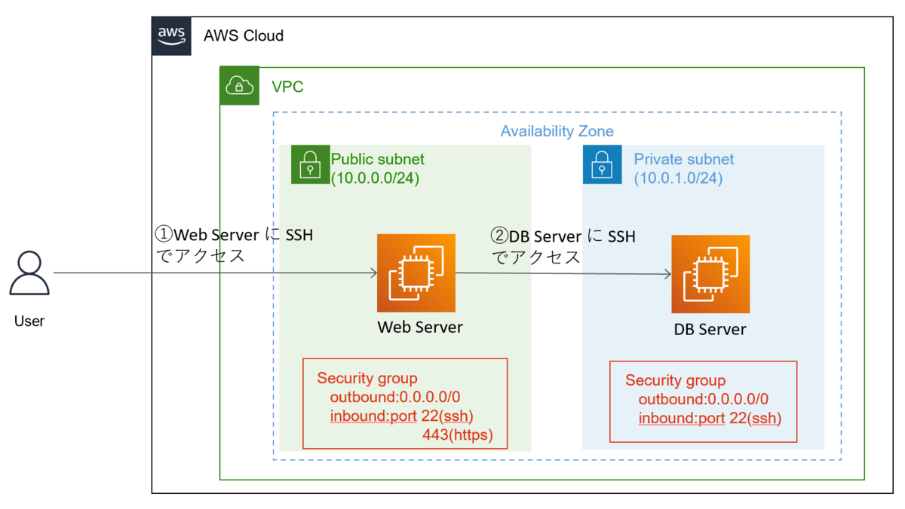

引用: [踏み台サーバーを経由してプライベートサブネットにある EC2 に SSH で接続する](https://www.aws-room.com/entry/ec2-bastion)

<br>

なぜ踏み台サーバーは必要なのか?

- プライベートサブネットに配置されたインスタンスへのアクセス元を1箇所に限定することで、外部からの侵入リスクを軽減する

- また、踏み台サーバーへアクセスできるIPを限定することでさらにリスクを軽減できる

<br>

踏み台サーバーは EC2 を利用して作成されることが多い

---

### 事前準備


踏み台サーバーには SSH で接続するため、自身が持つ密鍵とサーバーに配置する公開鍵が必要

1\. EC2 ダッシュボードより、「キーペア」を選択し「キーペアを作成」をクリック

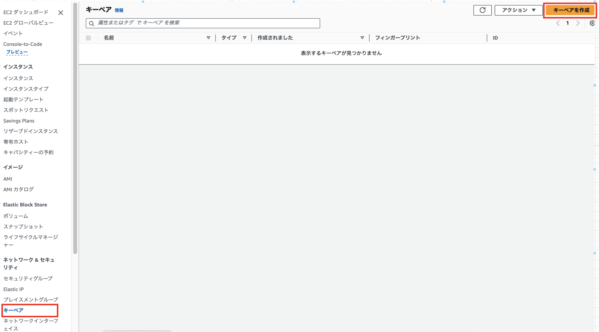

<br>

2\. キーペアの作成に必要な項目を設定したら、「キーペアを作成」をクリックする

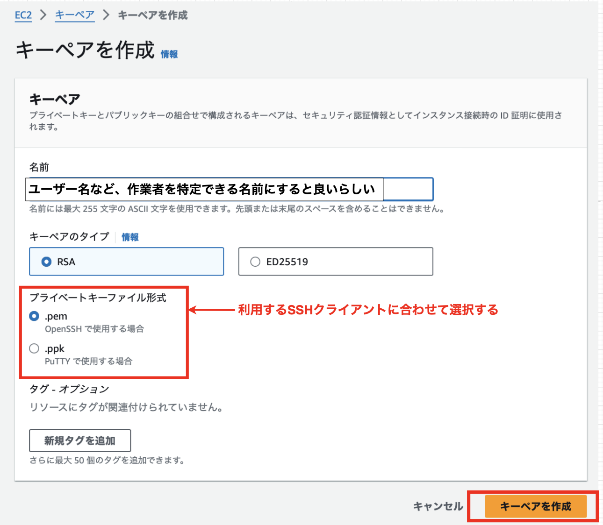

<br>

3\. 「キーペアを作成」クリック後に秘密鍵がダウンロードされる。また、キーペア画面にて作成されていることも確認する。

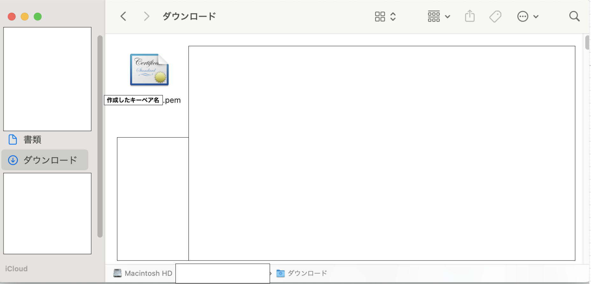

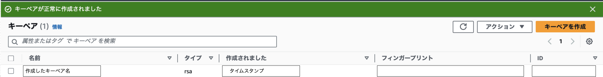

<br>
<br>

*作成後の秘密鍵のダウンロードに失敗した場合

-> 以降にダウンロードできる機会は無いため、作成したキーペアを削除し作り直す必要がある

---

### 踏み台サーバーの作成

1\. EC2ダッシュボードの「インスタンス」より、「インスタンスの起動」をクリック

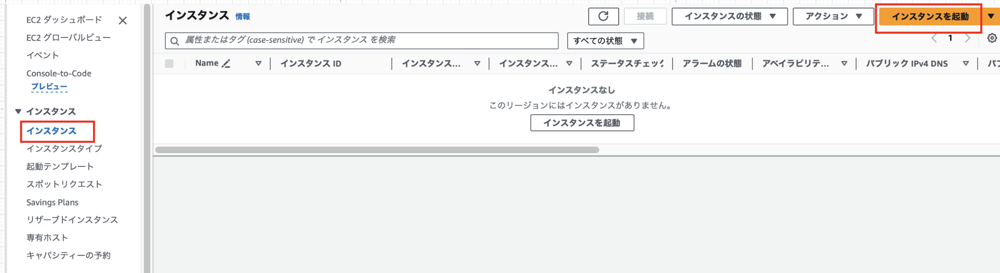

<br>

2\. EC2 の設定を行う

- EC2 インスタンス名と OS の設定を行う

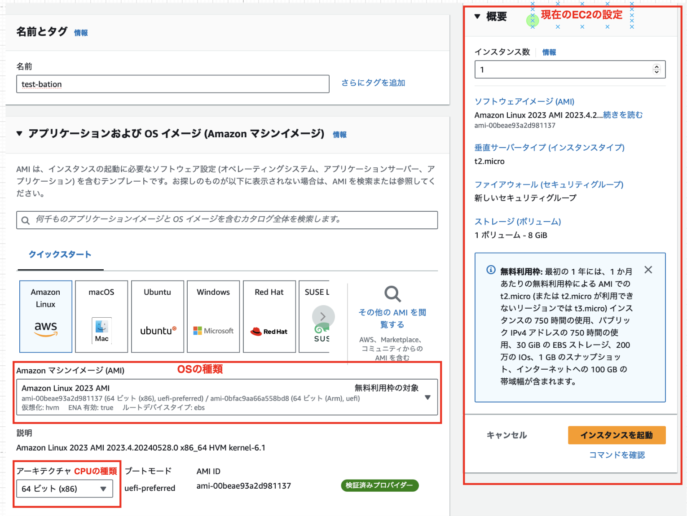

<br>

- インスタンスタイプ(マシンの性能)とサーバーにおく公開鍵を選択する

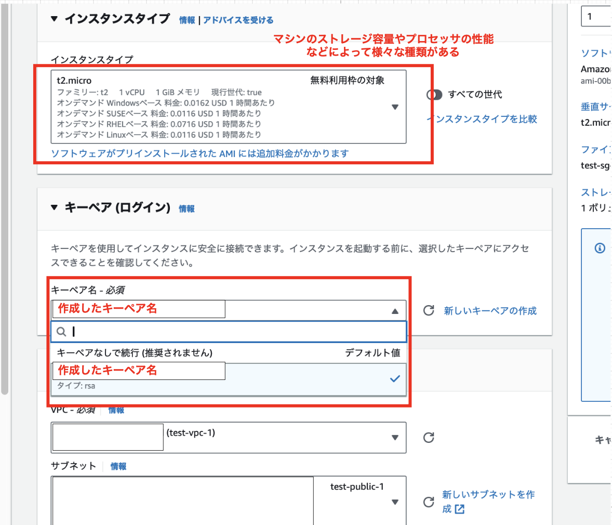

<br>

- 配置する VPC とそのサブネット、適用するセキュリティグループを設定する

    - *パブリックIPの自動割り当てについて
        - 今回のインスタンスはパブリックサブネットに配置し、外部からアクセスされるのでパブリックIPアドレスが必要

        - プライベートサブネットに配置されるインスタンスにはパブリックIPは必要ない **(たぶん)**

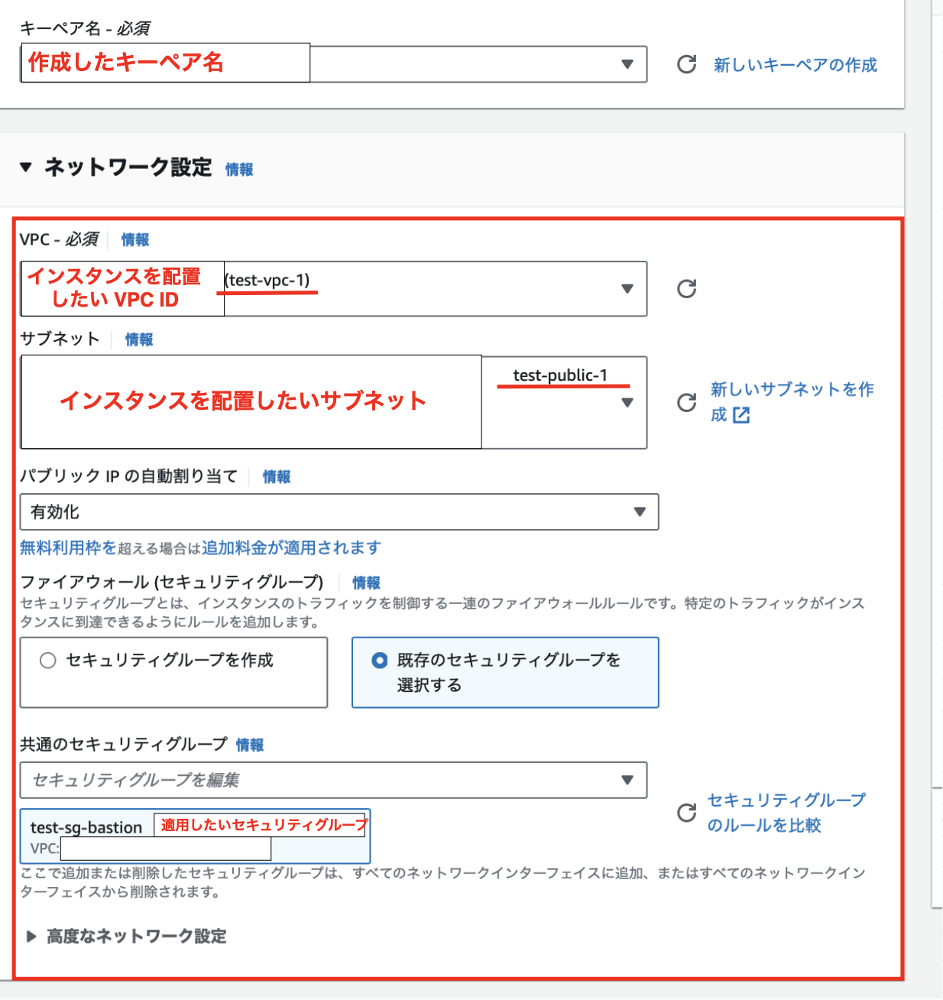

<br>

- インスタンスに割り当てるストレージ容量を設定する

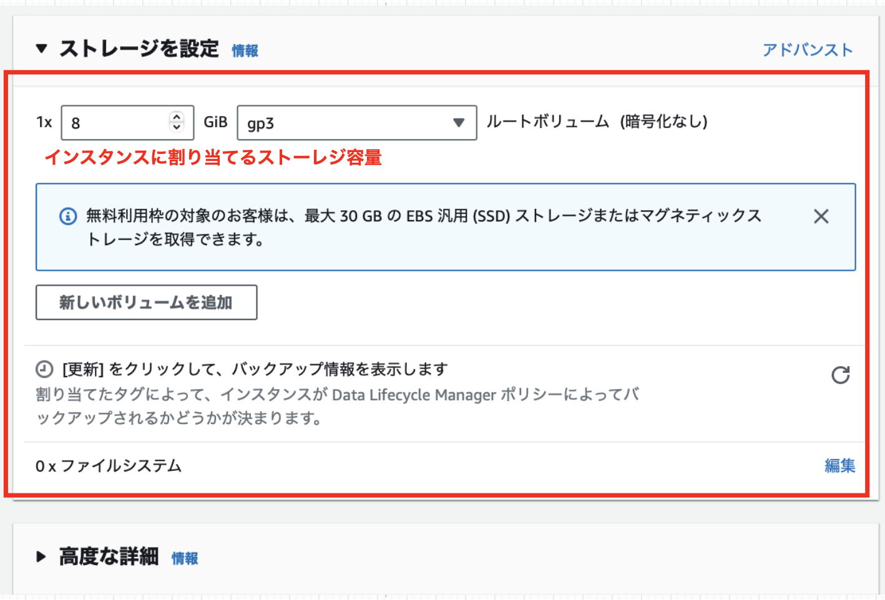

<br>

- 各項目の設定が完了したら、「インスタンスを起動」をクリックする

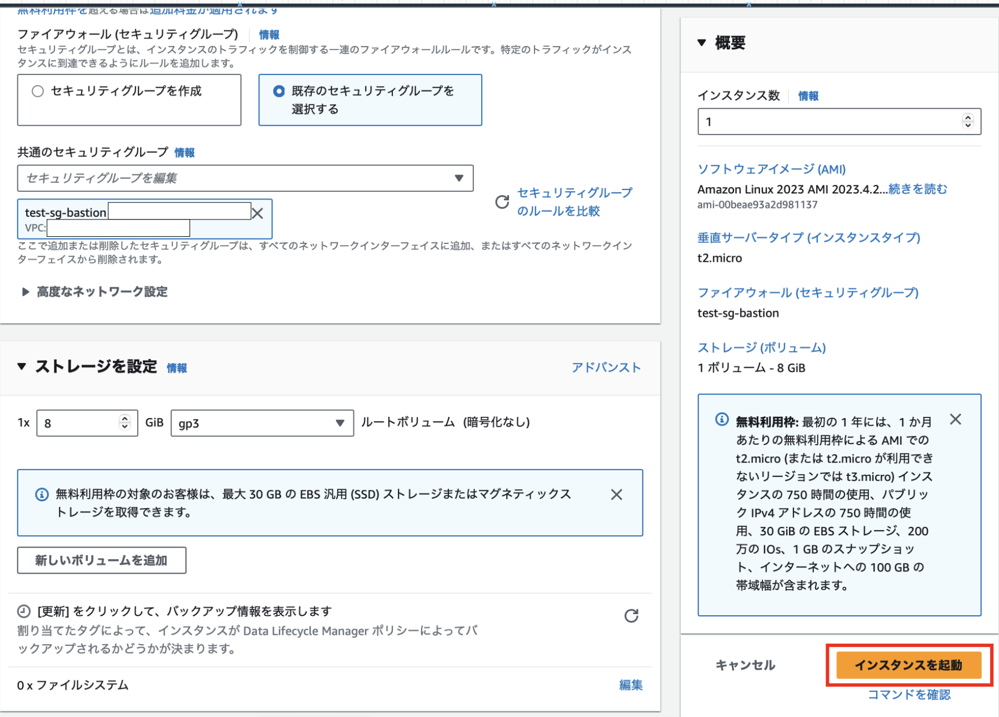

---

### 踏み台サーバーへ SSH 接続

Macでの操作

1\. terminal を起動

2\. ssh コマンドで接続

```bash
ssh -i 公開鍵のパス ユーザー名@踏み台サーバーのグローバルIPアドレス

# ユーザー名とはPCのユーザー名ではなく、AMI(EC2インスタンスのOS)のユーザー名

# -i オプション: 接続の際に使用する鍵のファイルを指定する
```

3\. 特に問題がなければ接続完了

<br>

*初回接続の際は以下の警告が表示され
る (問題がなければ yes、　)

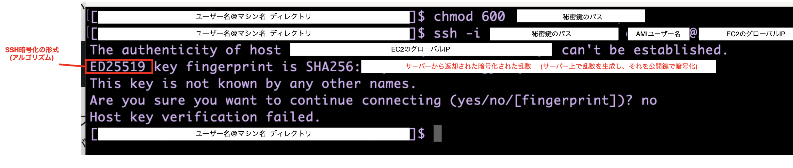

<br>

SSH暗号化の形式とは
- 以下の画像のように通信の内容を "6E~~" のように中身がわからないように変換するアルゴリズムのこと

- 上記コンソールでは、サーバー側がED25519という(公開鍵の)アルゴリズムを使って乱数を暗号化したということ

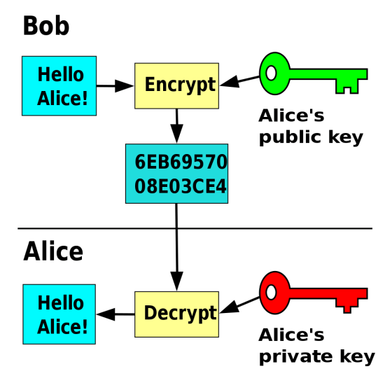

引用: [SSHの公開鍵暗号には「RSA」「DSA」「ECDSA」「EdDSA」のどれを使えばよいのか？](https://gigazine.net/news/20200828-ssh-encryption-algorithm/)

<br>

なぜコンソールに上記警告が表示されたのか?
- SSH で接続する際に、ユーザー配下にある .ssh というディレクトリを参照する

- .ssh 配下にある known_hosts というファイルに ユーザ固有の既知のSSH接続先とその公開鍵が登録されている

- 今回の EC2 インスタンスへ SSH 接続する際に、 known_hosts に接続先が登録されていなかったので警告が表示された

<br>
<br>

参考サイト

SSH コマンド: [【 ssh 】コマンド――リモートマシンにログインしてコマンドを実行する](https://atmarkit.itmedia.co.jp/ait/articles/1701/26/news015.html)

SSH で接続する際のユーザー名について: [【AWS】EC2でssh接続する際のユーザー名の備忘録](https://qiita.com/blpch7/items/069a16cd0a0559655298)

SSH の鍵の形式について: [SSHの公開鍵暗号には「RSA」「DSA」「ECDSA」「EdDSA」のどれを使えばよいのか？](https://gigazine.net/news/20200828-ssh-encryption-algorithm/)

SSH で初回接続の際に表示される警告について1: [ssh接続で初めてのホストへの接続を確認されないようにする方法](https://qiita.com/akko_merry/items/71789fcc889eabdea405)

SSH で初回接続の際に表示される警告について2: [エンジニアなら知らないとヤバいSSHの基礎](https://blog.mothule.com/tools/ssh/tools-ssh-basic#初回アクセスだと警告が表示される)

.ssh ディレクトリについて: [.sshディレクトリ 整理](https://zenn.dev/0kate/articles/4598d681fac824#)

---

### 初回接続時に確認されるフィンガープリントの確認方法

EC2 インスタンスに SSH で接続しようとすると、初めての接続時に確認メッセージが以下のように表示される


<br>

このとき、サーバーから帰ってきた暗号化された乱数が本当に接続先から返却されたものなのかを確認する方法

<br>
<br>

1\. EC2 ダッシュボードよりインスタンスを選択し、インスタンス一覧画面に移動する

<br>

2\. インスタンスを選択し、 「アクション」 から 「モニタリングとトラブルシューティング」を選び、「システムログを取得」をクリック

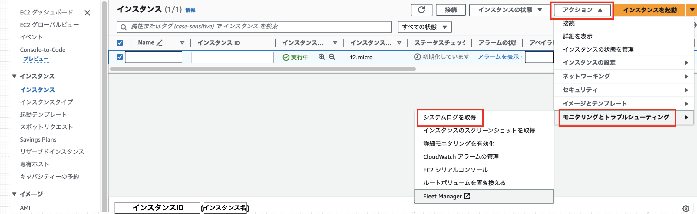

<br>

3\. 以下のようなログがあるので、フィンガープリントを確認する

```bash
ec2:#############################################################
ec2: -----BEGIN SSH HOST KEY FINGERPRINTS-----
ec2: 256 SHA256:l4UB/neBad9tvkgJf1QZWxheQmR59WgrgzEimCG6kZY no comment (ECDSA)
ec2: 256 SHA256:kpEa+rw/Uq3zxaYZN8KT501iBtJOIdHG52dFi66EEfQ no comment (ED25519)
ec2: 2048 SHA256:L8l6pepcA7iqW/jBecQjVZClUrKY+o2cHLI0iHerbVc no comment (RSA)
ec2: -----END SSH HOST KEY FINGERPRINTS-----
ec2: #############################################################
```

*インスタンスを再起動したらフィンガープリントのログが消えていたので、**インスタンス作成後にまずはチェックする**のが大事かも

<br>
<br>

参考サイト: [EC2 のホスト鍵を確認して接続する](https://qiita.com/hanohrs/items/1d90a372cce903d1c65e)

公式サイト: [Linux インスタンスへの接続](https://docs.aws.amazon.com/ja_jp/AWSEC2/latest/UserGuide/connect-to-linux-instance.html#connection-prereqs-fingerprint)