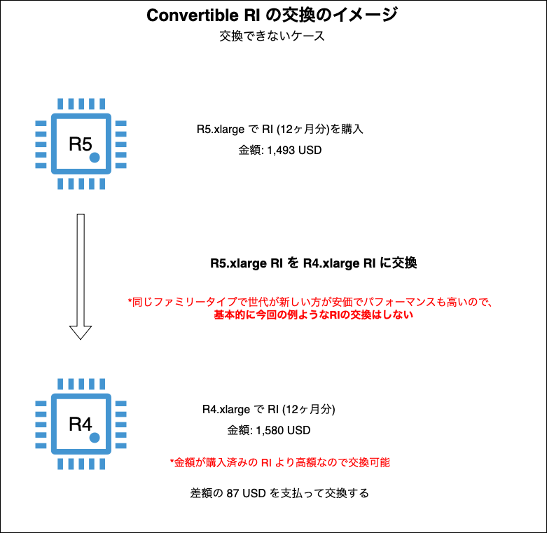
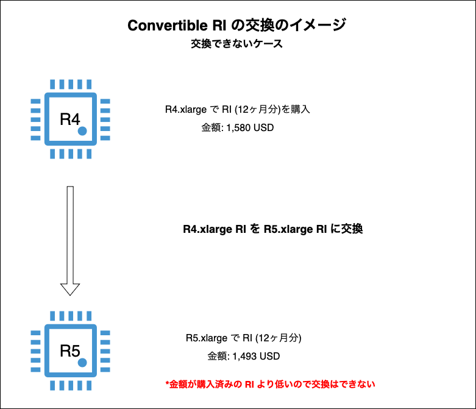
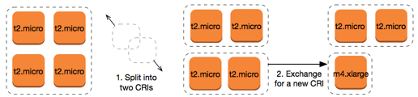
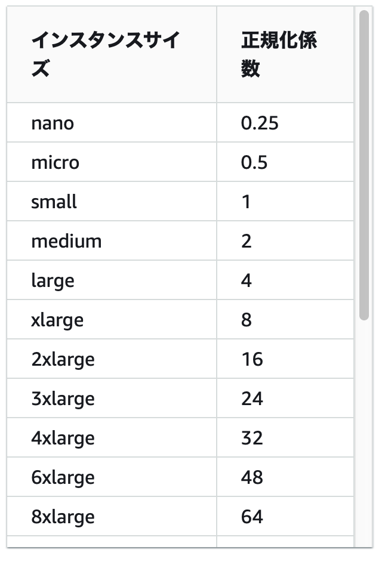
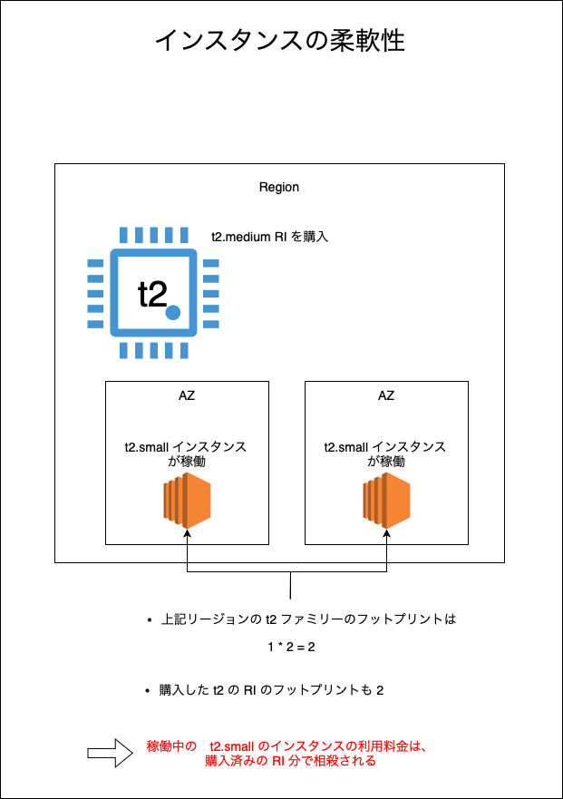
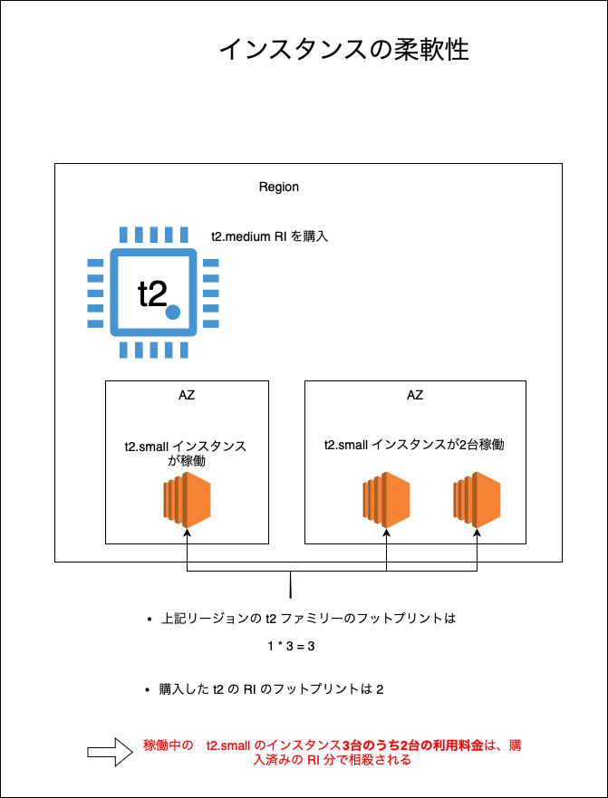
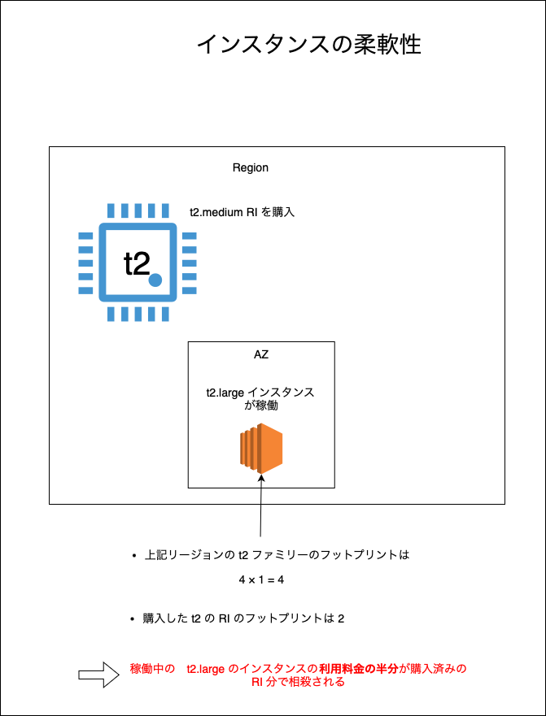
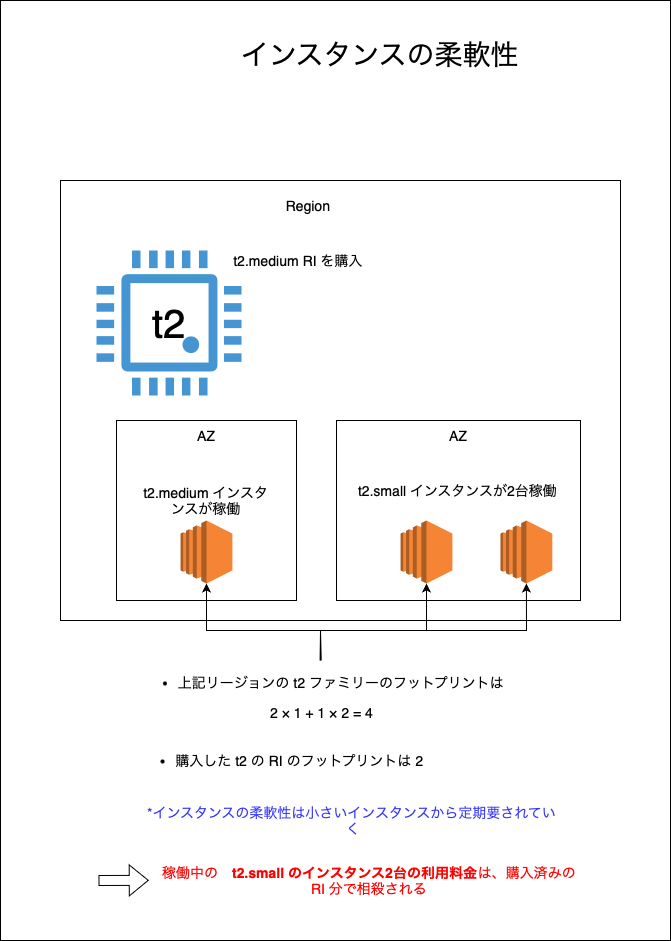
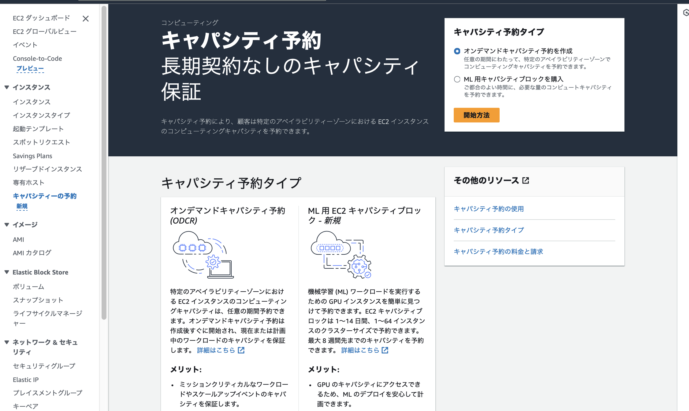

### リザーブドインスタンス

(OS/インスタンスタイプ等の)インスタンスの条件と利用期間を指定することで割引が適用される購入方法

以降はリザーブドインスタンスをRIで表記する

<br>
<br>

参考サイト

[AWS運用 交換ができるリザーブドインスタンス「コンバーチブル」とは？](https://aws.taf-jp.com/blog/58701)

[リザーブドインスタンスの種類について(スタンダード・コンバーティブル)](https://qiita.com/miyuki_samitani/items/41fa570054568bbbac5f)

---

### RIを購入する際に指定する条件(属性)

*RI を購入する際は他にも指定する項目があるが、以下の4項目を RI の属性と呼ぶ
- [インスタンスタイプ](./EC2_Instacne-Type.md)

- テナンシー

- プラットフォーム (OS)

- リージョン または アベイラビリティゾーン

    - リージョン を指定
        - [インスタンスサイズの柔軟性](#インスタンスサイズの柔軟性)が提供される

        - 購入したインスタンス分の割引は選択したリージョン内のインスタンスに自動で割り当てられる

    <br>

    - AZ を指定
        - インスタンスサイズの柔軟性は提供されない

        - 購入分のインスタンスの[キャパシティの予約](#キャパシティの予約とは)ができる

            → AZ を指定してRIを購入する場合のキャパシティ予約には料金が発生しない (RIの購入料金に含まれている)
    
    <br>

    *リージョン or AZ でRIの購入金額に違いは出ない

---

### 他の指定項目

#### 期間

- 1年 or 3年
    - 3年の方が割引が大きい

<br>

#### 支払い方法

- `全額前払い/一部前払い/前払いなし` から選択することができる

    - 一部前払い: 前払い分を引いた残額を月額で払う

    - 前払いなし: 月額で払う

        *たとえインスタンスを起動していなくても、$\color{red}RI の料金は発生する$

    - 割引率の高さ: 全額前払い > 一部前払い > 前払いなし

<br>

#### RIの クラス

- 詳しくは[こちら](#2種類のクラス)を参照

<br>
<br>

参考サイト

リージョンか AZ の指定による違い
- [購入済み EC2 のリージョン RI を AZ 指定に変更する方法](https://dev.classmethod.jp/articles/ec2_ri_modify_2019/)

支払い方法に関して
- [リザーブドインスタンスでAWS節約！](https://qiita.com/hiroaki-u/items/a5fcb0442187514c9736#支払いオプション)

---

### 2種類のクラス

- スタンダードクラス
    - 後述するコンバーティブルクラスに比べると割引率が高い

     - [マーケットプレイス](#reserved-instance-marketplace)で販売/購入ができる

     - 購入後の RI について[変更](#リザーブドインスタンスの変更と交換)できる幅がコンバーティブル RI に比べて狭い

<br>

- コンバーティブルクラス

    - RI の[交換](#リザーブドインスタンスの変更と交換)が可能
        - 異なる ファミリータイプや OS などの RI と交換することができる

    - マーケットプレイスでの販売/購入はできない

<br>

#### RI の変更と交換

- **変更**: 購入済みの RI の属性を変更する

    - アベイラビリティゾーンの変更
        - OS が Linux か Windows の RI なら可能

        - 上記条件を満たしていれば、スタンダードタイプでもコンバーティブルタイプでも AZ の変更可能

    - インスタンスサイズ
        - OS が Linux か UNIX の RI なら可能

        - 同じファミリータイプかつ同じ世代の異なるインスタンスサイズに変更する場合なら可能

        - 上記2つの条件を満たしていれば、スタンダードタイプでもコンバーティブルタイプでもインスタンスサイズの変更可能

    - スコープ: AZ ↔︎ リージョン の変更
        - OS が Linux か Windows の RI なら可能

        - AZ → リージョン　にスコープを変更すると、キャパシティ予約のメリットが失われる

        - リージョン → AZ にスコープを変更すると、インスタンスの柔軟性のメリットが失われる

        - OS の条件を満たしていれば、スタンダードタイプでもコンバーティブルタイプでもスコープの変更は可能

<br>

- **交換**: 異なるRIに変更する

    - イメージとしては、購入済みの RI を別の条件を指定した RI と交換する感じ

    - $\color{red}購入済みの RI とは別リージョンの RI には交換できない$

    - 交換条件を満たしていれば何回でも交換できる

    - 代表的な交換条件として、 $\color{red}購入済みの RI と同等もしくはそれ以上の価格の RI $にしか交換できない

        - 購入済みの RI 以上の価格の RI に交換する場合は、差額を追加で支払う必要がある

    
    
    

    <br>

    - 複数のコンバーティブル RI と1つの コンバーティブル　RI を交換することもできる


    

    引用: [コンバーティブルリザーブドインスタンス の交換](https://docs.aws.amazon.com/ja_jp/AWSEC2/latest/UserGuide/ri-convertible-exchange.html)

<br>
<br>

参考サイト

コンバーティブル RI の交換
- [EC2のコンバーティブルリザーブドインスタンス(RI) を変更してみた(R3→R5)](https://dev.classmethod.jp/articles/ri-convertible-exchange-r3-r5/)

- [コンバーティブルリザーブドインスタンス の交換](https://docs.aws.amazon.com/ja_jp/AWSEC2/latest/UserGuide/ri-convertible-exchange.html)

---

### Reserved Instance Marketplace

- 販売者としてマーケットプレイスに登録する必要があり、販売額の振り込み先として**アメリカの銀行の住所**を登録しなければならないため、基本的には反側としては利用することのないサービス

- マーケットプレイスで購入したスタンダードクラス RI は再びマーケットプレイスに出品することができる

<br>
<br>

参考サイト

[Amazon EC2リザーブドインスタンスマーケットプレイスでRIを出品して販売する](https://dev.classmethod.jp/articles/amazon-ec2-ri-sell-and-buy/)


---

### インスタンスサイズの柔軟性

#### インスタンスサイズの柔軟性とは
- インスタンスファミリー、テナンシー、プラットフォームが同じであれば購入済みの RI とは異なるサイズのインスタンスに割引が自動で適用される仕組み

    → 購入済みの RI とは異なるインスタンスサイズのインスタンスに割引が自動で適用される仕組み

<br>

#### インスタンスサイズの柔軟性が適用される条件

- RI のスコープがリージョン
- RI の OS が Linux か UNIX
- デフォルトテナンシー
- *いくつかのファミリータイプ(+世代)は上記条件を満たしていても、インスタンスサイズの柔軟性がサポートされない

<br>

#### フットプリントという単位

- インスタンスの柔軟性はフットプリントという単位を基準にして決定される

- フットプリント

    - $\color{red}インスタンスサイズごとに決まっている正規化係数を全て合計したもの$

    - インスタンスサイズが small のものを正規化係数1として...
        - インスタンスサイズが小さくなると、micro の正規化係数が0.5、 nano が0.25 と正規化係数も小さくなる

        - インスタンスサイズが大きくなると、medium の正規化係数が2、large が4と正規化係数も大きくなる

        <br>

    

    <br>

    ```
    例:
    とあるAZにて xlarge サイズのインスタンスが1つ、 small サイズのインスタンスが2つ、 nano サイズのインスタンスが1つ稼働している。この AZ のフットプリントは?

    答え:
    8×1 + 1×2 + 0.25 = 10.25

    より10.25
    ```

<br>







<br>

*インスタンスサイズの柔軟性による RI の割引価格適用はインスタンスサイズの小さいものから適用されていく

- 詳しくは[この記事](https://dev.classmethod.jp/articles/instance_size_flexibility/)を参照




<br>
<br>

参考サイト

[知らなかった。RIが小さいインスタンスタイプから順に適用されることを](https://dev.classmethod.jp/articles/instance_size_flexibility/)

[AWSのリザーブドインスタンスのススメ](https://www.webimpact.co.jp/banchoblog/?p=1991)

---

### キャパシティの予約とは

#### キャパシティとは

インスタンスを起動する際に、データセンター側でマシンのメモリが足りない場合、`Insufficient Instance Capacity` などのエラーが発生しインスタンスの起動ができないことがある

→ これをキャパシティ不足という


<br>

#### キャパシティの予約

キャパシティ予約とは、上記のキャパシティ不足が起きないようにする仕組み

- キャパシティ予約を実際に利用する例

    ```
    明日からとあるサービスの提供を開始するため、インスタンスの起動予約を行った

    しかし、当日のインスタンス起動時にキャパシティ不足のためインスタンスの起動に失敗し、計画していた時間からのサービス提供ができなくなってしまった

    キャパシティ予約をしていれば、起動に失敗することなく、計画通りにサービスの提供が可能になる
    ```

<br>

#### キャパシティ予約の方法

-AWS コンソールにて、 EC2 ダッシュボード画面のサイドメニューにある `キャパシティーの予約` から予約設定ができる

*上記キャパシティの予約はオンデマンドキャパシティの予約方法



<br>

#### RI のキャパシティ予約とオンデマンドキャパシティ予約

- RI のキャパシティ予約
    - スコープが AZ の RI はキャパシティの予約が自動で設定される

    - キャパシティ予約の料金が別途発生することはない

<br>

- オンデマンドキャパシティ予約
    - AZ ,任意のキャパシティ確保終了期間,インスタンスタイプ等を指定することで、その AZ にて指定された期間まではは対象のインスタンスタイプの為のキャパシティが確保される

    - オンデマンドキャパシティ作成後、対象インスタンスが実行されていなくても、$\color{red}対象インスタンスをオンデマンドで実行した時の料金が発生する$

        - 対象インスタンスが実行中の場合、普通に対象インスタンスの実行料金は発生するが、キャパシティ予約の料金は発生しない

            *キャパシティ予約の作成が完了すると、すぐにキャパシティの確保がされる = $\color{red}作成後すぐに料金が発生する$

    - キャパシティ作成後、手動でキャパシティ予約のキャンセルを行うか、指定したキャパシティ確保終了期間を過ぎるとキャパシティの予約はなくなる

<br>
<br>

参考サイト

[[アップデート] Amazon EC2 オンデマンドキャパシティ予約 に対する CloudWatch メトリクスが新規追加されました！](https://dev.classmethod.jp/articles/cloudwatch-metrics-amazon-ec2-on-demand-capacity-reservations/)

[【考察】インスタンスのキャパシティ不足が起こる裏側を考えてみる](https://shigirepo.com/2022/07/71/)

[AWS EC2 オンデマンドキャパシティー予約を詳しく知る](https://blog.serverworks.co.jp/ec2-capacity-reservations#キャパシティー予約とは何か)

[キャパシティーの予約 の料金と請求](https://docs.aws.amazon.com/ja_jp/AWSEC2/latest/UserGuide/capacity-reservations-pricing-billing.html)