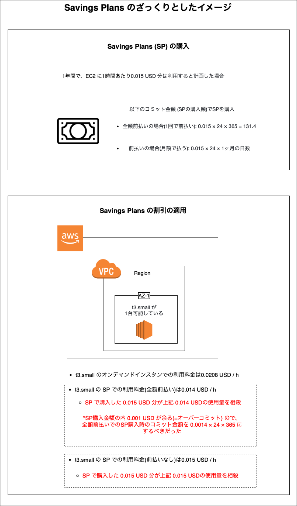
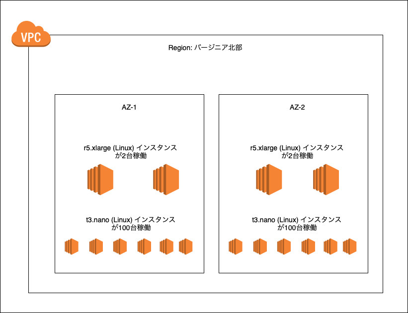
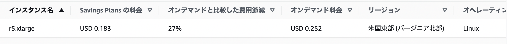
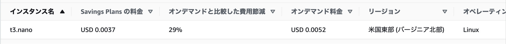
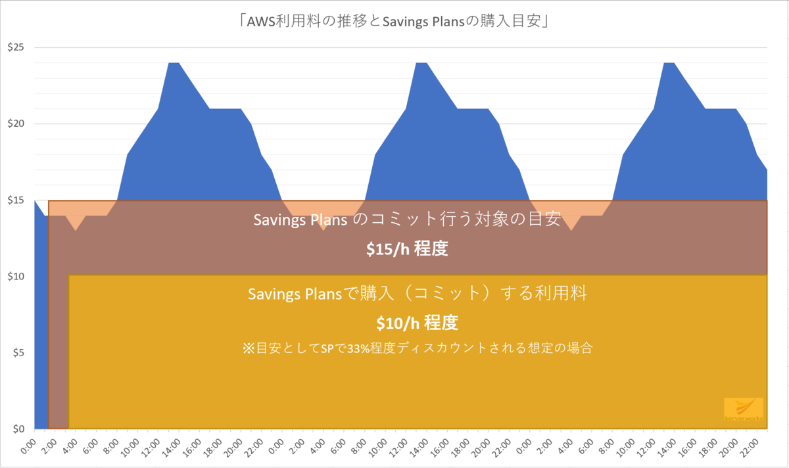

### Saving Plans とは

*Savings Plans は SP という省略形で表記されることもある  
*SP はEC2だけではなく、LmbdaやFargateにも適用されるが、当ノートでは EC2 に限定して SP について説明してく

 

#### 大まかな Savings Plans のイメージ

- もっと条件が緩くなった [RI](./EC2_RI.md) のイメージ

 

- Savings Plans は、1 年または 3 年の期間で、一貫したコンピューティング使用量 (USD/時間で測定) を契約する代わりに、Amazon EC2、AWS Lambda、AWS Fargate の低額の使用料金がオファーされる柔軟な料金モデル by [公式](https://aws.amazon.com/jp/savingsplans/compute-pricing/)

    - *購入後は指定したコンピューティング使用量 (USD / h) の変更はできない

    - ただし、SP を購入する際に指定したコンピューティング使用量が 100 (UDS / h) 以下で、かつ購入日から7日以内であれば返品が可能

 

- RI と異なる点
    - **コミット金額**という1時間ごとのEC2に払う金額を指定する

    - RI はインスタンスタイプ、リージョン or AZ など多くの条件を指定したが、 SP は　RI　ほど条件を指定せず、柔軟なコストの割引を受けることができる

 

 

#### 最大割引率
*あくまで最大なので、条件(指定する期間や支払い方法など)によっては割引率が下がる

- RI
    - スタンダードクラス: 72%
    - コンバーティブルクラス: 66%

- Saving Plans
    - Compute Savings Plans: 66%
    - EC2 Instance Savings Plans: 72%

 
 

参考サイト

[【徹底解説】AWSコスト削減、Savings Plansとは（第1回）](https://www.sunnycloud.jp/column/20220427-01/)

---

### 支払い方法

- [RI での支払い方法](./EC2_RI.md#支払い方法)と同じ

- 割引率も `全額前払い` > `一部前払い` > `前払いなし` の順で大きくなる

---

### 期間

- [RI での期間](./EC2_RI.md#期間) と同じ

- 割引率も3年の方が大きい

---

### SP のタイプ

SP には以下の2つのタイプがあり、購入時に選択する必要がある  
*本当は3つ存在するが、EC2に関連するのは下記の2タイプ

- Compute SP
    - 割引が適用されるのは EC2、 Lambda、　Fargate 
    - 後述する EC2 Instance SP より条件が緩いため、割引率は EC2 Instance SP より低い

    - RI のように以下の条件を指定する必要がない
        - インスタンスファミリー
        - インスタンスサイズ
        - リージョン
        - AZ
        - テナンシー
        - プラットフォーム (OS)

 

- EC2 Instance SP
    - 割引の適用は EC2 に限定

    - 下記の割引対象の条件を設定する必要がある
        - インスタンスファミリー
        - リージョン

    - Compute SP に比べると割引の適用条件が厳しいため、割引率は Compute SP より高い

---

### SP料金の適用のされ方 (Compute SP)

*今回は全てのケースで SP を前払いなしで1年間の購入することを考えてみる (全て前払いでも考え方は変わらない)

例として、以下の構成で EC2 を稼働しているとする

 

r5.xlarge と t3.nano のオンデマンドとCompute SP の利用料金

 
 

#### Savings Plansを全てのインスタンス使用に適用する場合

- r5.xlarge (Linux) の SP 料金は 0.0183 USD / h

- t3.nano (Linux) の SP 料金は 0.0037 USD / h

- 上記の EC2 インスタンスを全て SP でカバーするには

    - r5.xlarge (Linux) 4台分のコミット金額は $0.183 \times 4 = 0.732$ \(USD / h\)

    - t3.nano (Linux) 100台分のコミット金額は $0.0037 \times 100 = 0.37$ \(USD / h\)

    - よって合計のコミット額は $0.732 + 0.37 = 1.102$ \(USD / h\)
    より、 $\color{red}1.102 (USD / h)$ が最終的なコミット金額になる

    *ちなみにオンデマンドで利用すると、1時間ごとの合計金額は 1.528 \(USD / h\)

 

#### Savings Plans を一部のインスタンス使用に適用する場合

- コミット金額が 0.3 (USD / h)と設定した場合どのように SP が適用されるか

- $\color{red}SP はもっとも高い割引率のものから適用される$
    - 今回のケースだと t3.nano の方が r5.xlarge よりも優先的に SP が適用される

- ポイントはコミット金額がどの位の SP をカバーできるか
    - $0.3 \div 0.37 = 0.81$ これは 0.3 \(USD / h\) のコミット額は $\color{red}t3.nano の 0.81 \% の SP 料金をカバーすることができることを表す$

        → $100(台) \times 0.81 = 81$ 台分の SP 料金を 0.3 (USD / h)のコミット額でカバーできる

    - よって、(t3.nanoに関して)コミット額ではカバーしきれず発生するオンデマンド料金は $0.0052 \times 21 = 0.1092$ \(USD / h\) となる

    *AWS では$0.01未満の課金は小数点第三位で四捨五入される

 

- また、残りの r5xlarge (Linux) 4台も合計で $0.252 \times 4 = 1.008$ (USD / h)のオンデマンド料金が発生する

- よって、合計の請求金額(h)は $0.3 + 0.1092 + 1.008 = 1.4172$ USD となる

 

#### Savings Plans を一部(種類)のインスタンス群に適用する場合

- t3.nano (Linux) 100台分のコストを SP でカバーしたい場合
    - 必要なコミット額は $0.0037 \times 100 = 0.37$ \(USD / h\)

 
    
- ★★★r5.xlarge (Linux) 4台分のコストを SP でカバーしたい★★★
    - 必要なコミット額は $0.183 \times 4 = 0.732$ \(USD / h\) $\color{red}とはならない$

        → SP 料金は $\color{red}割引率の最も高いものから適用されていくから$

    - コミット額を 0.732 \(USD / h\) で SP を購入した場合
    
        - まずは t3.nano (Linux) 100台分の SP 料金 0.37 がカバーされ、残りのコミット額0.362 (USD / h)で r5.xlarge (Linux) の SP 料金をカバーする

            - 0.362 (USD / h)は r5.xlarge (Linux) 何台分の SP 料金をカバーするのか?

                - r5.xlarge (Linux) 4台分のSP料金は、0.732 (USD / h)

                    $0.362 \div 0.732 = 0.49$ より、49%の SP 料金をカバーする
                
                - では、それは r5.xlarge 何台分?

                    $
                    4 \times 0.49 = 1.96
                    $ 台分

                    → 残り2.04台はオンデマンド料金が発生する

        - したがって、残りのコミット額ではカバーしきれず発生するr5.xlarge (Linux) のオンデマンド料金は $0.252 \times 2.04 = 0.51$ (USD / h)

     

    $\color{red}もし$ 、コミット額 0.732 (USD / h) で r5.xlarge (Linux) 4台のSP料金がカバーされていたら、、、

    - t3.nano (Linux) 100台はオンデマンド料金 $0.0052 \times 100 = 0.52$ (UDS / h) が発生する

        → この結果は t3.nano に優先的に SP を適用するよりも$\color{red}高くつく$

        $\color{orange} AWS はこうならないように割引率の最も高いものから優先的に SP 料金を適用する$

 

#### Savings Plans と RI を併用する場合

- t3.nano (Linux) の RI を50台分購入し、かつコミット額 0.37 (USD / h) で SP を購入した

    - RI に SP が適用されることはない
        → 割引された RI を SP でカバーするのはユーザーにとって損でしかない

    - RI が適用された後、RI が適用されていないものに SP料金 を適用する
        - まずは t3.nano の RI が適用されない残りの50台に SP 料金が適用される

            $0.0052 \times 50 = 0.26$ (USD / h)

        - 残りのコミット額 0.11 (USD / h) で　r5.xlarge の SP 料金をカバーできる分だけカバーする

            - $0.11 \div 0.732 = 0.15$ より、残りのコミット額 0.11 (USD / h) は r5.xlarge 4台分の SP 料金の 15% をカバーする

            - ↑はつまり、$4 \times 0.15 = 0.6$ 台分の r5.xlarge の SP料金をカバーする

        - 残り 3.4 台分の r5.xlarge はオンデマンド料金 $0.252 \times 3.4 = 0.857$ (USD / h) が発生する

 

#### Compute SP と　EC2 Instance SP を併用する場合

- 適用範囲が狭い EC2 Instance SP から適用され、その後、まだ適用されていないものに　Compute SP が適用される

 

#### RI, Compute SP, EC2 Instance SP を併用する場合

- まずは RI が優先で適用される

- 次に、残りのインスタンスに　EC2 Instance SP が適用される

- 最後に、まだ何も適用されてない残りのインスタンスに Compute SP が適用される

 
 

参考サイト

[Savings Plans はどのように適用されるのか？](https://blog.serverworks.co.jp/tech/2019/11/26/sp-applying/)

[【AWS】Savings Plans がどのように適用されるのかを理解する](https://blog.jicoman.info/2020/04/understanding-how-savings-plans-apply-to-aws-usage/)

[Savings Plans が AWS の使用に適用される仕組みを理解する](https://docs.aws.amazon.com/ja_jp/savingsplans/latest/userguide/sp-applying.html#sp-example)

---

### SP料金の適用のされ方 (EC2 Instance SP)

---

### オーバーコミット

コミットした金額が実際の利用料金に対してオーバーしてしまうこと

 

#### オーバーコミットの例

- コミット金額 5 (USD / h)で　SP を購入した

- 稼働している全てのインスタンスの合計 SP 料金は 4.5 (UDS /h)だった

- 結果、　0.5 USD / h のコミット金額が余ってしまう

    →コミット額がカバーする　SP 料金が発生しなくても、購入時のコミット金額 (USD / h) は発生する　(この点は RI と同じ)

---

### Savings Plans の購入時のポイント

- オーバーコミットが発生すると勿体無い

 

以下画像にて、

- グラフの青い部分は、EC2 の使用料金(オンデマンドではなく SP 料金)の変化を表している

 

- もし、コミット額を 15 (USD / h) で SP を購入した場合、グラフの青い部分を上回る時間帯が出てくる = オーバーコミットが発生する時間帯がある

- コミット額を 10 (USD / h) で SP を購入した場合、オーバーコミットは発生しないことが見てとれる

    - *もし、SP の購入時には計画になかったサービスの停止などによってインスタンス数が減ったりすると、オーバーコミットが発生する可能性が出てくる

#### SP 購入時のポイント

- このオフピークを鑑みた上で「SPの値引率を加味した額」を購入（コミット）する

    - オフピークを調べるには AWS Cost Explorer が役に立つらしい (*オフピークを調べる機能は利用料金が発生する)

 
 

参考サイト

SP 購入時のポイントについて
- [Savings Plans はどのように適用されるのか？](https://blog.serverworks.co.jp/tech/2019/11/26/sp-applying/#sp-guide)

オフピークの調査について
- [AWS Cost Explorer の Hourly Usage report を使ったオフピーク分析](https://blog.serverworks.co.jp/tech/2020/01/23/aws-cost-explorer-supports-hourly-resource-level-granularity/)
- [AWS Cost Explorer が時間とリソースレベルの詳細度に対応開始](https://aws.amazon.com/jp/about-aws/whats-new/2019/11/aws-cost-explorer-supports-hourly-resource-level-granularity/)