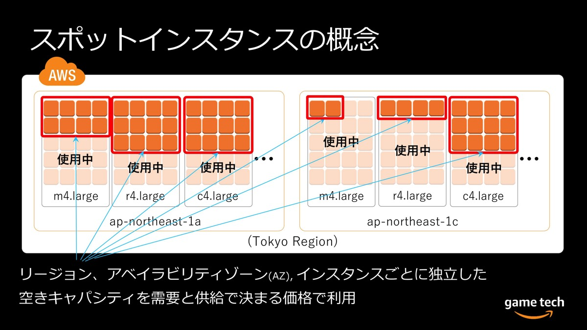

### スポットインスタンスとは

空き[キャパシティ](./EC2_RI.md)を利用することでインスタンスを安く稼働すること

引用: [AWSを活用してゲームサーバーのコストを劇的に下げる
スポットインスタンスを効果的に使うための基礎知識](https://logmi.jp/tech/articles/321685)

 

メリット

- インスタンスの購入方法で一番割引率が高い (キャパシティの空き具合によって変動することに注意)

    - 大量のインスタンスを稼働させる必要があるサービスなどに向いている

        → ただし、後述するデメリットが許容できる場合に限る
 

デメリット

- キャパシティの空き具合によっては、 AWS によって中断される可能性がある

 
 

参考サイト

[AWSを活用してゲームサーバーのコストを劇的に下げるスポットインスタンスを効果的に使うための基礎知識](https://logmi.jp/tech/articles/321685)

---

### 中断を見越した対策

#### スポットインスタンスの中断が発生するケース

どちらのケースも中断される前に警告を２分前に通知する (Amazon CloudWatch で監視可能)

- インスタンスが稼働している物理ホストのキャパシティの空きがなくなってきた場合

- スポットインスタンスを購入する際に指定する上限価格をスポットインスタンスの価格が上回った時

    - スポットインスタンスの価格は物理ホストのキャパシティの空き具合で変動するため

#### 中断が発生したら、もしくは発生してもいいように

- まずはスポットインスタンスを安全にシャットダウンする

 

- 複数のインスタンスタイプ(ファミリータイプ)のスポットインスタンスを組み合わせる

    - あるファミリータイプのスポットインスタンスが中断されても、他のファミリータイプのスポットインスタンスは稼働を続ける可能性がある

 

- 複数の AZ に分けてスポットインスタンスを稼働する

    - AZ-a のとあるファミリータイプのスポットインスタンスが中断されても、他の AZ で同じファミリータイプのスポットインスタンスは稼働を続ける可能性がある

 

- Auto Scaling や EC2 フリート を利用する

    - スポットインスタンスが中断される場合、オンデマンドインスタンスを代わりに立ち上げるように設定することができる

 
 

参考サイト

[[レポート] Amazon EC2 スポットインスタンスの各社の利用例についてご紹介 #AmazonGameTech #AmznGameTechJP](https://dev.classmethod.jp/articles/20191120-agdc-b4-ec2-spot-instance-introduction/)

[EC2フリート とは](https://qiita.com/miyuki_samitani/items/ab3b83d9ecc0de3123b7)

[EC2 フリートとスポットフリート](https://docs.aws.amazon.com/ja_jp/AWSEC2/latest/UserGuide/Fleets.html#ec2-fleet-features-and-benefits)