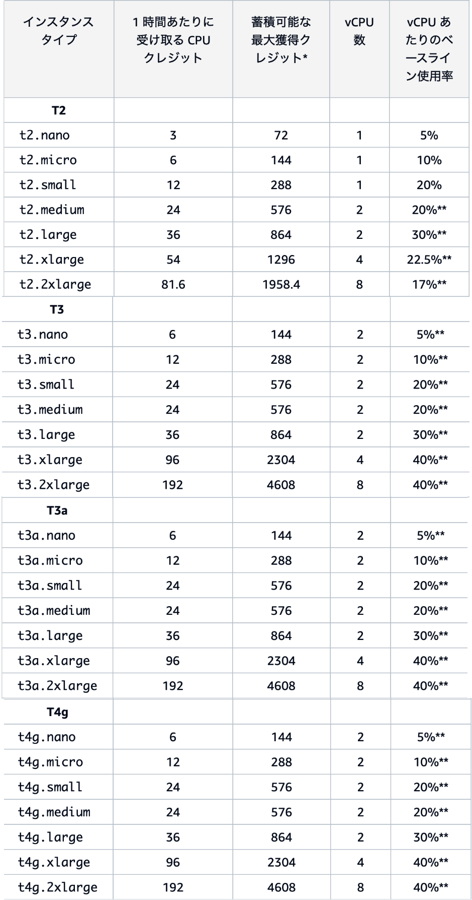
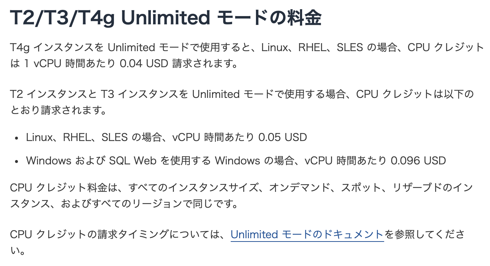

### バースト可能なインスタンスタイプとは

- T 系インスタンスファミリー (t3.large など) 特有の機能

 

- T 系インスタンスはその[インスタンスタイプ](./EC2_Instacne-Type.md#インスタンスタイプの表記)ごとにベースライン (= vCPU1つあたりの使用率) が決められている

 

- インスタンスの vCPU の使用率がベースライン以下の時には CPU クレジットが蓄積される

    - ★ `1時間あたりの獲得クレジット数 = ベースライン使用率 (%) × vCPU 数 (個)× 60 (分)`

        - 例: t3.nano は vCPU 数が2、ベースラインは5%である。1時間に獲得するCPUクレジットは`2 × 0.05 × 60 = 6 CPUクレジット`　(= 1分あたり 0.1 CPU クレジット貯まる)

     

    - ★ CPU クレジットとは、vCPUの使用率がベースラインを上回る時に消費されるもの

        - ★ `使用される CPU クレジット数 = vCPU 数 (個) × CPU 使用率 (%) × 使用時間 (分)`

     

    - 例えば、1 CPU クレジットを消費することで以下のことが可能になる

        - 1分間にわたって1つの vCPU を100%で使用できる 
            - 1CPU クレジット = 1 (vCPU数) × 1 (使用率%) × 1 (使用分数)

         

        - 2分間にわたって1つの vCPU を50%で使用できる(ベースラインが50%以下の場合)
            - 1CPU クレジット = 1 (vCPU数) × 0.5 (使用率%) × 2 (使用分数)

         

        - 1分間にわたって2つの vCPU を50%で使用できる(ベースラインが50%の場合)
            - 1CPU クレジット = 2 (vCPU数) × 0.5 (使用率%) × 1 (使用分数)

 

- CPU クレジットいは蓄積できる上限がある

    - インスタンスのサイズによって異なるが、通常は 24 時間以内に獲得できるクレジット数が上限。

 

- ★★ CPUクレジットを消費すると、「モードによってCPUの使用率がベースラインに制限される」 or 「CPUクレジットの前借り」が発生する

    - モードについては[こちら](#スタンダードモードと-unlimited-モード)を参照

 

- **[スタンダードモード](#スタンダードモードと-unlimited-モード) に設定された T1,T2 系インスタンスのみ**、インスタンスの起動時に CPUクレジットを獲得することができる

    - 起動時に獲得できるCPUクレジットはインスタンスタイプによって異なる
    
         

        引用: [バーストインスタンスのスタンダードモードの概念 - 起動クレジット](https://docs.aws.amazon.com/ja_jp/AWSEC2/latest/UserGuide/burstable-performance-instances-standard-mode-concepts.html#launch-credit-limits#launch-credits)

     

    - 起動 CPU クレジットは、獲得 CPU クレジットよりも先に消費される

    - ★ 起動時に獲得される CPU クレジットは CPU クレジットの上限にカウントされない

    - インスタンスが停止された時、起動 CPU クレジットは全て失われる

        - 再起動時にまた起動 CPU クレジットを獲得する

    - 起動 CPU クレジットを受け取る回数には制限があり、24時間に100回まで。

 
 

参考サイト

バーストとは
- [[AWS] T系インスタンスのクレジットを使い果たすとどうなるか？](https://ptune.jp/tech/t-type-instance/)

- [私はAWS EC2のt2インスタンスを誤解していた - CPUクレジットとベースラインパフォーマンス、そしてT2 Unlimited](https://tech.smartcamp.co.jp/entry/aws-ec2-t2-unlimited)

起動クレジットについて
[バーストインスタンスのスタンダードモードの概念 - 起動クレジット](https://docs.aws.amazon.com/ja_jp/AWSEC2/latest/UserGuide/burstable-performance-instances-standard-mode-concepts.html#launch-credit-limits#launch-credits)

その他良記事
- [EC2 (t系インスタンス)のCPUクレジットについて試してみた](https://blog.future.ad.jp/aws_elastic_beanstalk-0)

- [AWS CPU Credit を完全に理解する](https://speakerdeck.com/nyk510/aws-cpu-credit-wowan-quan-nili-jie-suru)

---

### インスタンスタイプとベースライン

- 各インスタンスタイプと、そのベースラインおよび CPU クレジットについては以下の通り

---

### スタンダードモードと Unlimited モード

- T 系のバースト可能インスタンスはスタンダードモードと Unlimited モードがある

- モードの違いで、 CPU クレジットを消費し切った時の挙動が異なってくる

 

#### スタンダードモード

- T2 系はデフォルトでスタンダードモードになっている

- ★ CPU クレジットを使い果たすと、そのインスタンスタイプのベースラインを超える vCPU の使用ができなくなる (CPUクレジットが貯まるまで)

    - 高負荷の処理が終わる前にインスタンスが CPU クレジットを使い果たすと、以降は処理能力がガクッと制限される

 

#### Unlimited モード

- T3、T4 系はデフォルトで Unlimited モードになっている

- T2 系インスタンスが Unlimited モードの場合、起動 CPU クレジットを獲得することができない

- ★ CPUクレジットを使い果たすと、**CPU クレジットの前借り (= 借金)** をする

    - 借金は以降に獲得する CPU クレジットで返済していく

    - しかし、以下の条件のどれか一つでも満たすと、前借り CPU クレジットに対して課金が発生する

        1. 前借りする CPU クレジットがインスタンスが24時間に獲得できる最大クレジット数を超えている場合

        2. CPU クレジットを前借りした状態でインスタンスを停止または終了した場合

        3. CPU クレジットを前借りした状態でインスタンスを Unlimited モードからスタンダードモードに切り替えた場合

     

    - 上記条件を満たしたときに発生する前借り CPU クレジットに対する課金額は以下の通り(08/11/2024)

        

        引用: [Amazon EC2 オンデマンド料金 - T2/T3/T4g Unlimited モードの料金](https://aws.amazon.com/jp/ec2/pricing/on-demand/#T2.2FT3.2FT4g_Unlimited_Mode_Pricing)

 
 

参考サイト

[それ、t2.micro選んで大丈夫？](https://speakerdeck.com/tsukuboshi/akiba-dot-aws-sore-t2-dot-microxuan-ndeda-zhang-fu?slide=15)

[Amazon EC2 オンデマンド料金 - T2/T3/T4g Unlimited モードの料金](https://aws.amazon.com/jp/ec2/pricing/on-demand/#T2.2FT3.2FT4g_Unlimited_Mode_Pricing)

[ちょっと待ってください!あなたが使うべきは本当にT系インスタンスですか!?](https://dev.classmethod.jp/articles/ec2-t-or-m/#toc-2)

---

### そもそも T系インスタンスを利用すべきか?

#### 本番環境

- 基本的にベースラインでCPU使用率が制限されている T 系インスタンスは本番環境で使ってはいけない

- 特に要件がない場合は T 系インスタンスではなく、汎用インスタンス (CPU・メモリ・ネットワークなどのリソースについてバランスの取れた性能のインスタンス) である **M 系インスタンス** を採用すべき

 

#### テスト環境

- テスト環境で本番環境と同一の環境を用意する必要がある場合は本番環境と同じインスタンスタイプを採用

- 上記のような条件がなく、コストを抑えたい場合には T 系もあり

 
 

参考サイト

[ちょっと待ってください!あなたが使うべきは本当にT系インスタンスですか!?](https://dev.classmethod.jp/articles/ec2-t-or-m/)

[それ、t2.micro選んで大丈夫？](https://speakerdeck.com/tsukuboshi/akiba-dot-aws-sore-t2-dot-microxuan-ndeda-zhang-fu?slide=18)
