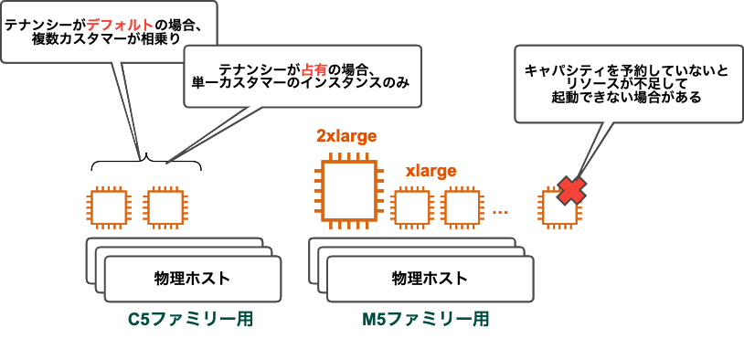

### EC2 利用に発生する料金

- [インスタンスの購入方法](#インスタンスの購入方法)

- インスタンスの起動時間

- インスタンスのデータ転送料金

- パブリック IP アドレスに対して発生する料金
    - Elastic IP でも　自動割り当てIPアドレスでも利用料金が発生するようになった
    - 1時間あたり 0.005USD → 1ヶ月あたり 500円ぐらい

---

### インスタンスの購入方法

- オンデマンドインスタンス
    - 一般的なインスタンスの購入方法
    - 使用した分だけ料金を払う

<br>

- [リザーブドインスタンス](#リザーブドインスタンス)

    - (OS/インスタンスタイプ等の)インスタンスの条件と利用期間を指定することで割引が適用される購入方法

    - **条件を指定するが、その条件通りのインスタンスを購入するのではない**

        → 購入時の条件に一致したインスタンスがあれば自動で割引が適用される

    - リザーブドインスタンスには `スタンダードクラス` と `コンバーティブルクラス` の２種類の[クラスタイプ](#2種類のクラス)がある
     
<br>

- スポットインスタンス

<br>

- [Savings Plans](#saving-plan)

    - インスタンスの1時間あたりの使用料金を指定することで割引が適用される購入方法
    - **条件を指定するが、その条件通りのインスタンスを購入するのではない**

        →購入時の条件に一致したインスタンスがあれば自動で割引が適用される

<br>
<br>

参考サイト

[RI /SP のギモン、解消します！#devio2021](https://www.youtube.com/watch?v=GFAy2Glqj88)

---

### リザーブドインスタンス

以下よりリザーブドインスタンスはRIで表記する

#### RIを購入する際に指定する条件(属性)

- [インスタンスタイプ](./EC2_Instacne-Type.md)

- テナンシー

- リージョン または アベイラビリティゾーン

    - リージョン を指定
        - [インスタンスの柔軟性](#インスタンスの柔軟性)が提供される

        - 購入したインスタンス分の割引は選択したリージョン内のインスタンスに自動で割り当てられる

    <br>

    - AZ を指定
        - インスタンスの柔軟性は提供されない

        - 購入分のインスタンスの[キャパシティの予約](#キャパシティの予約とは)ができる

            → AZ を指定してRIを購入する場合のキャパシティ予約には料金が発生しない (RIの購入料金に含まれている)
    
    <br>

    *リージョン or AZ でRIの購入金額に違いは出ない

<br>

#### 期間

- 1年 or 3年
    - 3年の方が割引が大きい

<br>

#### 支払い方法

- `全額前払い/一部前払い/前払いなし` から選択することができる

    - 前払いなし: 月額で払う

        *たとえインスタンスを起動していなくても、$\color{red}RI の料金は発生する$

    - 割引率の高さ: 全額前払い > 一部前払い > 前払いなし

<br>

#### 2種類のクラス

- スタンダードクラス
    - 後述するコンバーティブルクラスに比べると割引率が高い

     - [マーケットプレイス](#reserved-instance-marketplace)で販売/購入ができる

     - 購入後の RI について[変更](#リザーブドインスタンスの変更と交換)できる幅がコンバーティブル RI に比べて狭い

<br>

- コンバーティブルクラス

    - 購入後にインスタンスのファミリータイプや OS の変更ができるなど、スタンダードクラスRI よりも変更できる幅が広い

    - RI の[交換](#リザーブドインスタンスの変更と交換)が可能

    - マーケットプレイスでの販売/購入はできない

<br>

#### RI の変更と交換

- **変更**: 購入済みの RI の属性を変更する

    - アベイラビリティゾーンの変更
        - OS が Linux か Windows の RI なら可能

        - 上記条件を満たしていれば、スタンダードタイプでもコンバーティブルタイプでも AZ の変更可能

    - インスタンスサイズ
        - OS が Linux か UNIX の RI なら可能

        - 同じファミリータイプかつ同じ世代の異なるインスタンスサイズに変更する場合なら可能

        - 上記2つの条件を満たしていれば、スタンダードタイプでもコンバーティブルタイプでもインスタンスサイズの変更可能

    - スコープ: AZ ↔︎ リージョン の変更

<br>

- **交換**
    - 異なるRIに変更する

<br>

#### Reserved Instance Marketplace

- 販売者としてマーケットプレイスに登録する必要があり、販売額の振り込み先として**アメリカの銀行の住所**を登録しなければならないため、基本的には反側としては利用することのないサービス

- マーケットプレイスで購入したスタンダードクラス RI は再びマーケットプレイスに出品することができる

<br>

#### インスタンスの柔軟性


<br>
<br>

参考サイト

ざっくりとリザーブドインスタンスについて
- [AWS運用 交換ができるリザーブドインスタンス「コンバーチブル」とは？](https://aws.taf-jp.com/blog/58701)

- [リザーブドインスタンスの種類について(スタンダード・コンバーティブル)](https://qiita.com/miyuki_samitani/items/41fa570054568bbbac5f)

リージョンか AZ の指定による違い
- [購入済み EC2 のリージョン RI を AZ 指定に変更する方法](https://dev.classmethod.jp/articles/ec2_ri_modify_2019/)

支払い方法に関して
- [リザーブドインスタンスでAWS節約！](https://qiita.com/hiroaki-u/items/a5fcb0442187514c9736#支払いオプション)

マーケットプレイスについて
- [Amazon EC2リザーブドインスタンスマーケットプレイスでRIを出品して販売する](https://dev.classmethod.jp/articles/amazon-ec2-ri-sell-and-buy/)

---

### Saving Plan

---

### キャパシティの予約とは


#### キャパシティとは

インスタンスを起動する際に、データセンター側でマシンのメモリが足りない場合、`Insufficient Instance Capacity` などのエラーが発生しインスタンスの起動ができないことがある

→ これをキャパシティ不足という



<br>

#### キャパシティの予約

キャパシティ予約とは、上記のキャパシティ不足が起きないようにする仕組み

- キャパシティ予約を実際に利用する例

    ```
    明日からとあるサービスの提供を開始するため、インスタンスの起動予約を行った

    しかし、当日のインスタンス起動時にキャパシティ不足のためインスタンスの起動に失敗し、計画していた時間からのサービス提供ができなくなってしまった

    キャパシティ予約をしていれば、起動に失敗することなく、計画通りにサービスの提供が可能になる
    ```

<br>

#### キャパシティ予約の方法

-AWS コンソールにて、 EC2 ダッシュボード画面のサイドメニューにある `キャパシティーの予約` から予約設定ができる

*上記キャパシティの予約はオンデマンドキャパシティの予約方法


<br>

#### RI のキャパシティ予約とオンデマンドキャパシティ予約

- RI のキャパシティ予約
    - スコープが AZ の RI はキャパシティの予約が自動で設定される

    - キャパシティ予約の料金が別途発生することはない

<br>

- オンデマンドキャパシティ予約
    - AZ ,任意のキャパシティ確保終了期間,インスタンスタイプ等を指定することで、その AZ にて指定された期間まではは対象のインスタンスタイプの為のキャパシティが確保される

    - オンデマンドキャパシティ作成後、対象インスタンスが実行されていなくても、$\color{red}対象インスタンスをオンデマンドで実行した時の料金が発生する$

        - 対象インスタンスが実行中の場合、普通に対象インスタンスの実行料金は発生するが、キャパシティ予約の料金は発生しない

            *キャパシティ予約の作成が完了すると、すぐにキャパシティの確保がされる = $\color{red}作成後すぐに料金が発生する$

    - キャパシティ作成後、手動でキャパシティ予約のキャンセルを行うか、指定したキャパシティ確保終了期間を過ぎるとキャパシティの予約はなくなる

<br>
<br>

参考サイト

[[アップデート] Amazon EC2 オンデマンドキャパシティ予約 に対する CloudWatch メトリクスが新規追加されました！](https://dev.classmethod.jp/articles/cloudwatch-metrics-amazon-ec2-on-demand-capacity-reservations/)

[【考察】インスタンスのキャパシティ不足が起こる裏側を考えてみる](https://shigirepo.com/2022/07/71/)

[AWS EC2 オンデマンドキャパシティー予約を詳しく知る](https://blog.serverworks.co.jp/ec2-capacity-reservations#キャパシティー予約とは何か)

[キャパシティーの予約 の料金と請求](https://docs.aws.amazon.com/ja_jp/AWSEC2/latest/UserGuide/capacity-reservations-pricing-billing.html)