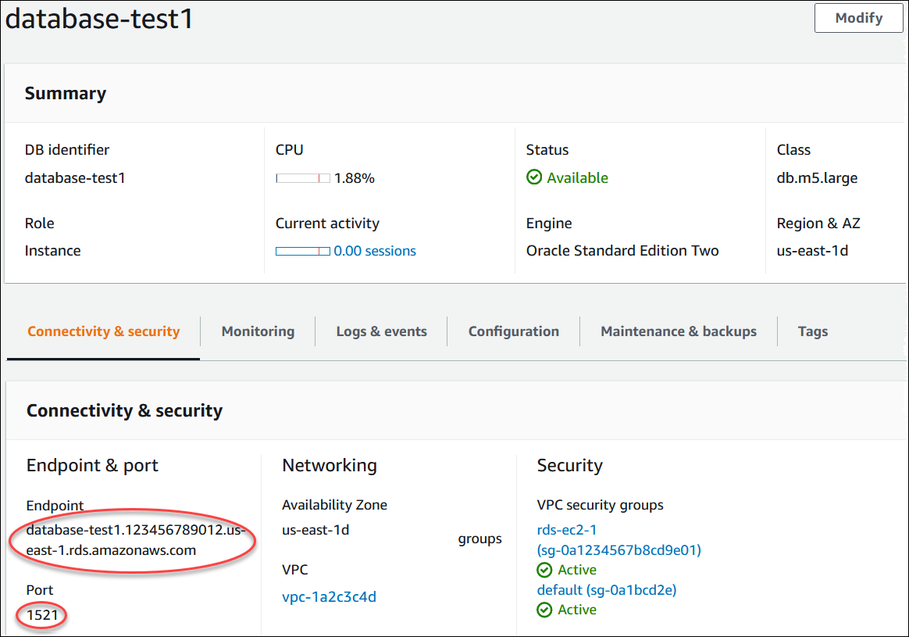
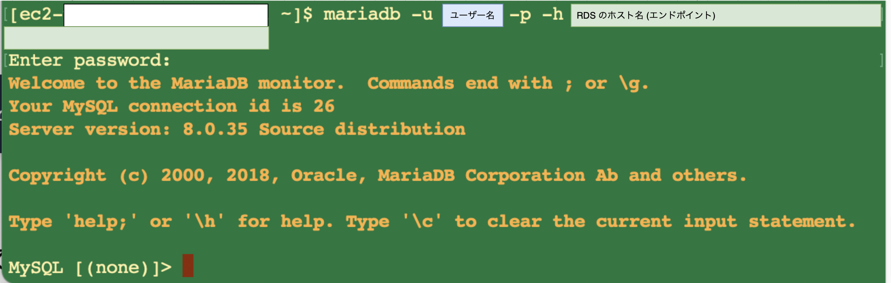

### EC2 に SSH で接続し、　その EC2 から RDS へ接続する

前提条件: RDS の DB エンジンは MySQL か MariaDB

1. EC2 に SSH で接続する

    [詳しくはこちらを参照](./踏み台サーバー.md#踏み台サーバーへ-ssh-接続)

2. EC2 に mariadb をインストールする

    MariaDB と MySQL クライアントには互換性があるため、RDS が MySQL でも MariaDB コマンドラインクライアントを Amazon Linux 2023 にインストールする

    参考サイト
    [Amazon Linux 2023からRDS MySQLに接続するときにMariaDBを使う方法](https://dev.classmethod.jp/articles/how-to-use-mariadb-connecting-to-mysql-from-amazon-linux-2023/)

3. mariadb コマンドで RDS に接続する

    - RDS のホスト名(エンドポイント)を確認する

    

    <br>

    - mariadb コマンドで、EC2 から RDS に接続する

    ```bash
    mariadb -u ユーザー名 -p -h RDSのエンドポイント
    ```

    

---

### 注意点

- RDS に付与されたセキュリティグループにて、 EC2 からのアクセスは許可されているか確認 (RDSのインバウンドルール)

