### IAM ロールの作成

EC2 に付与する S3 へのアクセス権限を作成する

1. AWS の IAM ダッシュボードより、「ロール」画面の「ロールを作成」をクリック

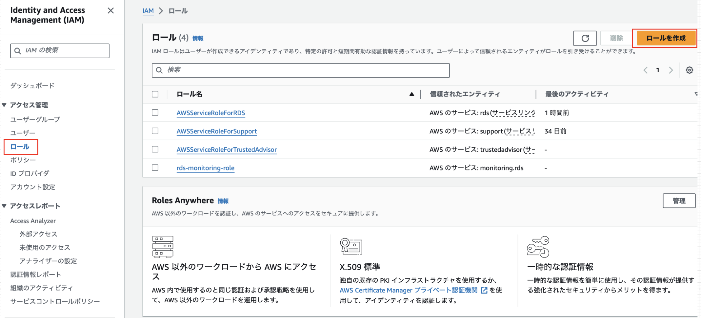

<br>

2. 今回は EC2 にアタッチするロールなので、「AWSサービス」を選択し、ユースケースに「EC2」を選択

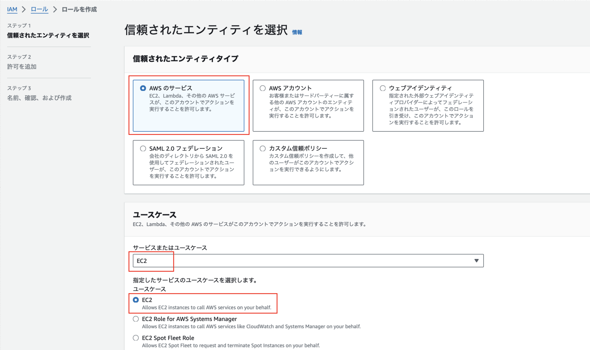

<br>

3. ロールに割り当てる S3 へのアクセス権限ポリシーを選択する

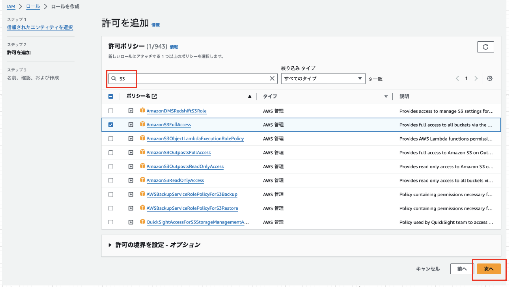

<br>

4. 作成するロールの名前をつけ、「ロールの作成」をクリック

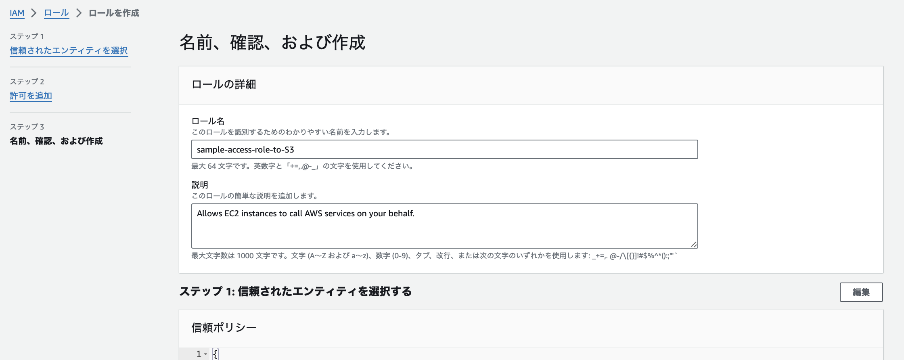
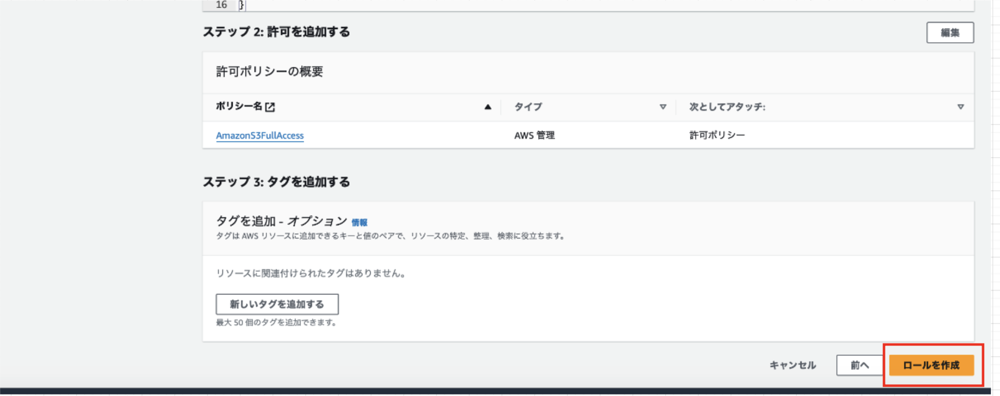

<br>

---

### IAM ロールを EC2 にアタッチする

1. AWS の EC2 ダッシュボードより、「インスタンス」画面で対象のインスタンスを選択する

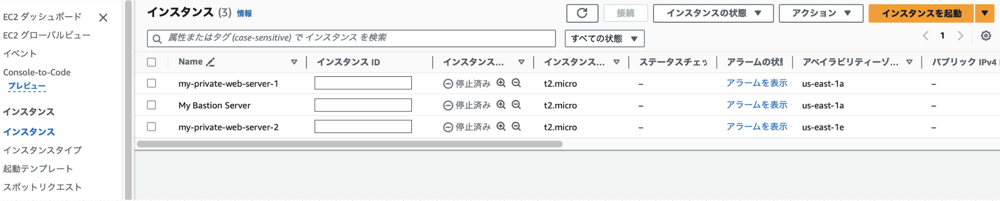

<br>

2. 選択したインスタンスに対し、「アクション」 → 「セキュリティ」 → 「IAM ロールを変更」をクリック

    *複数インスタンスを選択すると「IAM ロールを変更」がグレーアウトで選択できなくなるので、1つずつロールのアタッチを行う必要がある

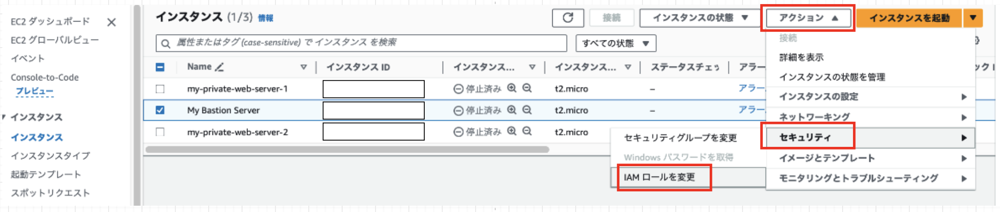

<br>

3. S3 へのアクセス権限のロールを選択し、「IAM ロールの変更」をクリック

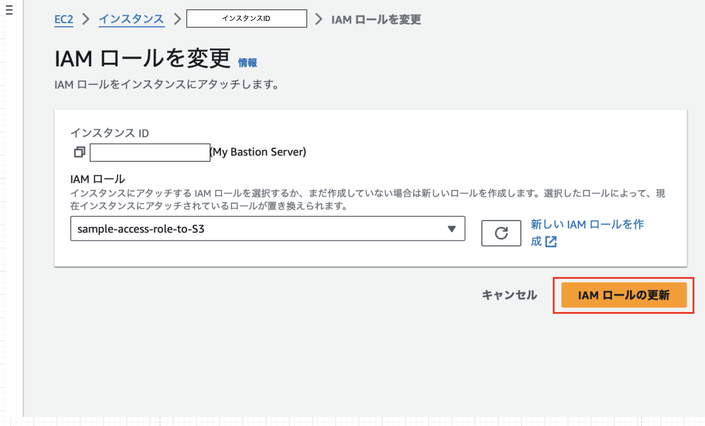

---

### EC2 から S3 へアクセスしてみる

1. EC2 に SSH で接続

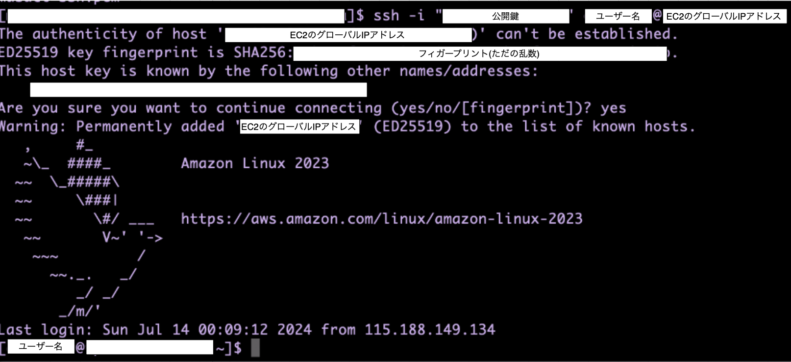

<br>

2. 適当なテキストファイル(S3にアップロードするファイル)を作成

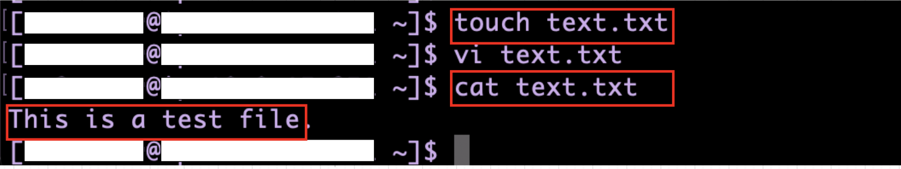

<br>

3. aws s3 コマンドで EC2 のローカルファイルを S3 にアップロードする

```bash
aws s3 cp アップロードするファイル s3://バケット名
```

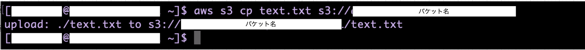

<br>

4. S3 ダッシュボードの「バケット」より、対象ばけっおｔにファイルがアップロードされたか確認する

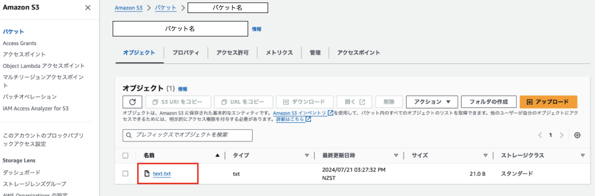

*ファイルをそのままS3内で放置していると、ストレージ料金が発生するので、必要なかったら削除する

<br>

その他の aws s3 コマンドは以下の qiita の記事で紹介されている
- [AWS CLIでS3を操作するコマンド一覧](https://qiita.com/uhooi/items/48ef6ef2b34162988295)