### ENI とは

- Elastic Network Interface の略

 

- EC2 などのインスタンスは、それ自体に プライベート/パブリック IP が付与されているわけではない

    - プライベート/パブリック IP が割り当てられるのは、**ENI**

 

- 1つの ENI に複数の IP を割り当てることもできる
    - 1つの ENI に割り当てることのできる IP アドレスの最大数は [インスタンスタイプ](./EC2_Instacne-Type.md) によって異なる 

        *同じインスタンスファミリーでも、サイズが大きいものほど1つの ENI に割り当てることのできる最大 IP アドレス数は多い

 

- 1つのインスタンスに複数の ENI を割り当てることができる
    - 1つのインスタンスに割り当てることのできる ENI の最大数は [インスタンスタイプ](./EC2_Instacne-Type.md) によって異なる 

        *同じインスタンスファミリーでも、サイズが大きいものほど1つのインスタンスに割り当てることのできる最大 ENI 数は多い

 

- ENI は再利用することができる

    - インスタンス A にアタッチしていた ENI を インスタンス B にアタッチすると、インスタンス A の プライベート/パブリック IP アドレスをインスタンス B が使用することができる　

    *ENI の再利用は 対象 ENI が作成された AZ 内のみで可能

 
    
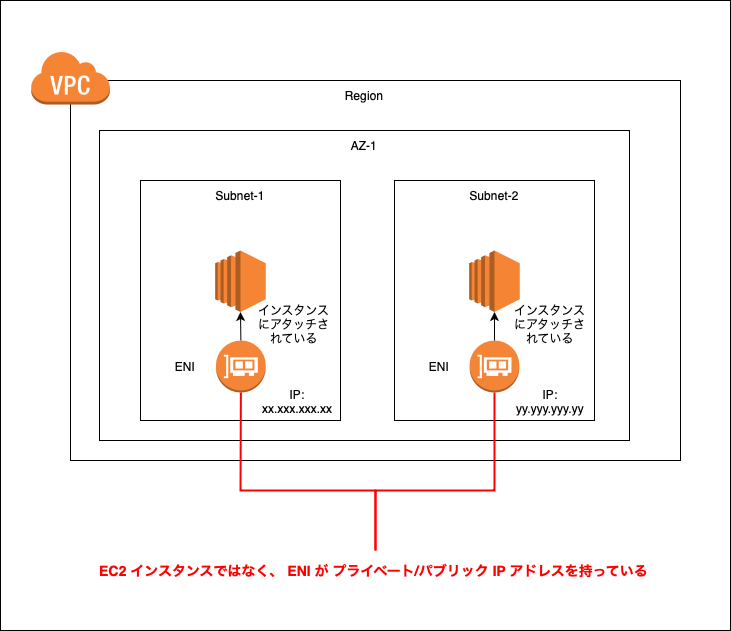

 
 

参考サイト

[AWS ENI を触ってみる](https://qiita.com/tkek321/items/e2b404ab54f22fb19ed3)

[Elastic Network Interface](https://docs.aws.amazon.com/ja_jp/AWSEC2/latest/UserGuide/using-eni.html)

---

### プライマリ ENI

- インスタンス作成時に自動で作成&アタッチされる ENI は $\color{red} \text{プライマリ ENI}$ と呼ばれる

- 既存インスタンスのプライマリ ENI は、ENI 単体での削除&変更ができない

- インスタンス削除時に、ENI を残すことで、プライマリ ENI でも再利用することができる

    →既存インスタンスが残っている限り、そのプライマリ ENI の再利用はできない

 
 

参考サイト

[EC2インスタンスのプライベートIPアドレスを引き継ぐ](https://blog.k-bushi.com/post/tech/tips/ec2-eni-take-over-ip/#gsc.tab=0)

---

### 1つの ENI に複数の IP　アドレスを割り当てる

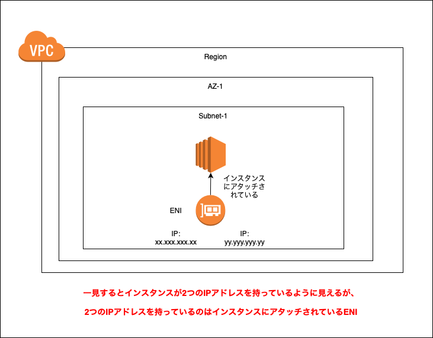

 

手順

1. VPC コンソールにログインし、EC2 ダッシュボードから `インスタンス` 画面に遷移し、複数IPを割り当てたい ENI を持つインスタンスを選択する

    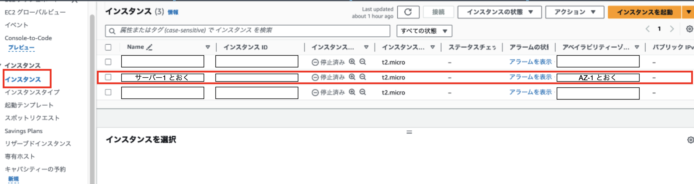

     

    *EC2 ダッシュボードのサイドメニューにある `ネットワークインターフェース` からでも、ENI 関連の操作をすることができる

    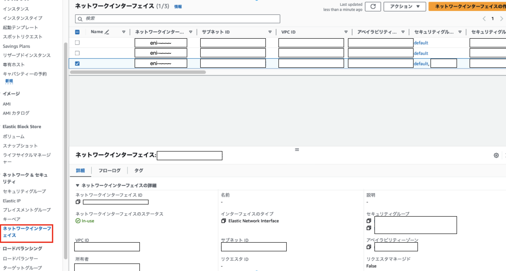

 

2. インスタンス詳細画面の `ネットワーキング` タブをクリックし、新しくIPアドレスを割り振りたい ENI を選択する

    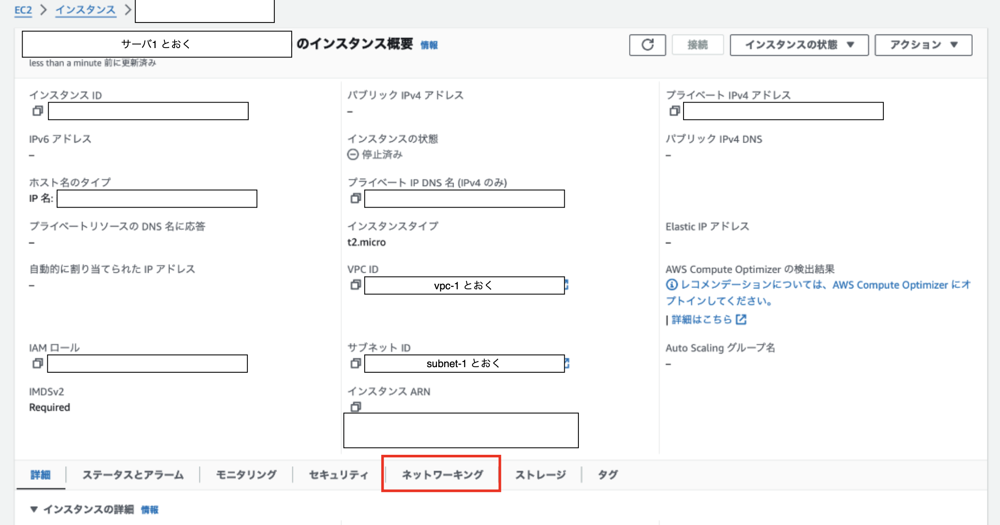
    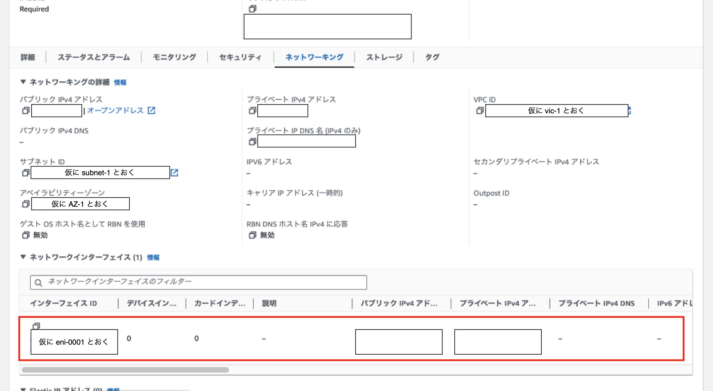

 

3. ENI 詳細画面にて `アクション` から `IP アドレスの管理` を選択

    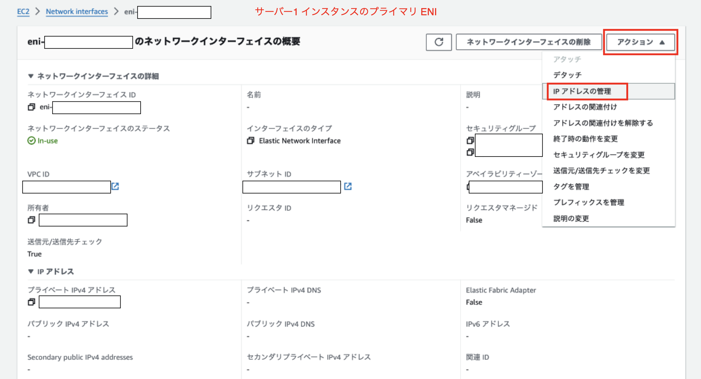

 

4. 選択した ENI の IP アドレスの管理画面にて、`新しい IP アドレスの割り当て` をクリックする

    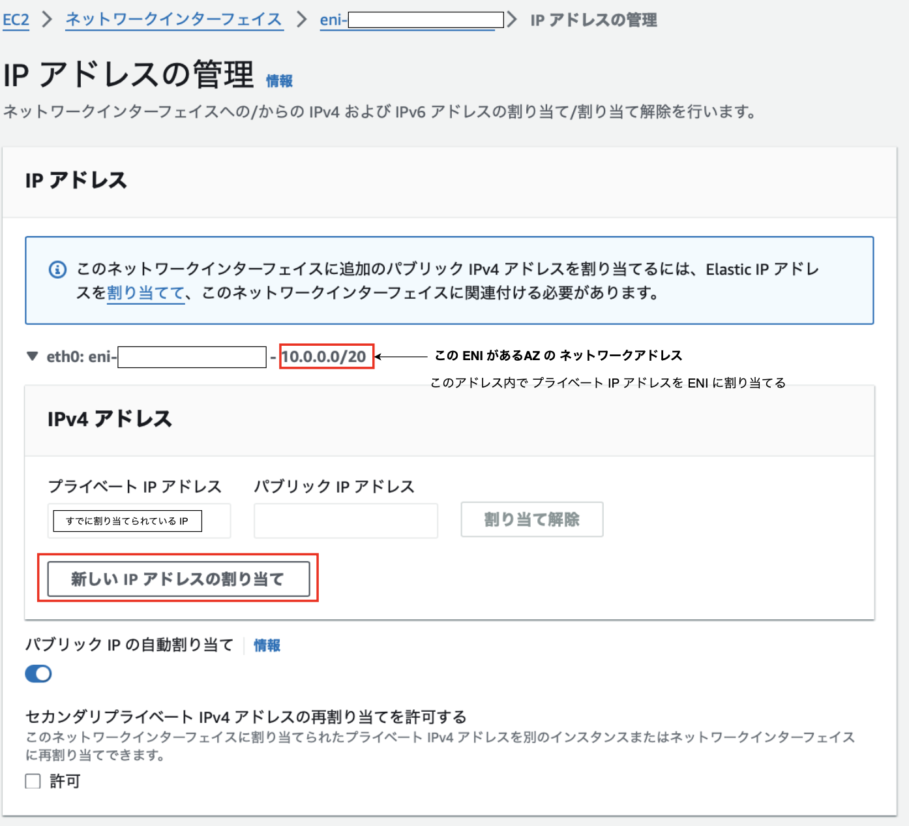

 

5. 新たに追加する IP アドレスがなんでもいいんだったら自動割り当てのまま `保存` をクリック

    *有効な見割り当ての プライベート IP を自分で指定することもできる

    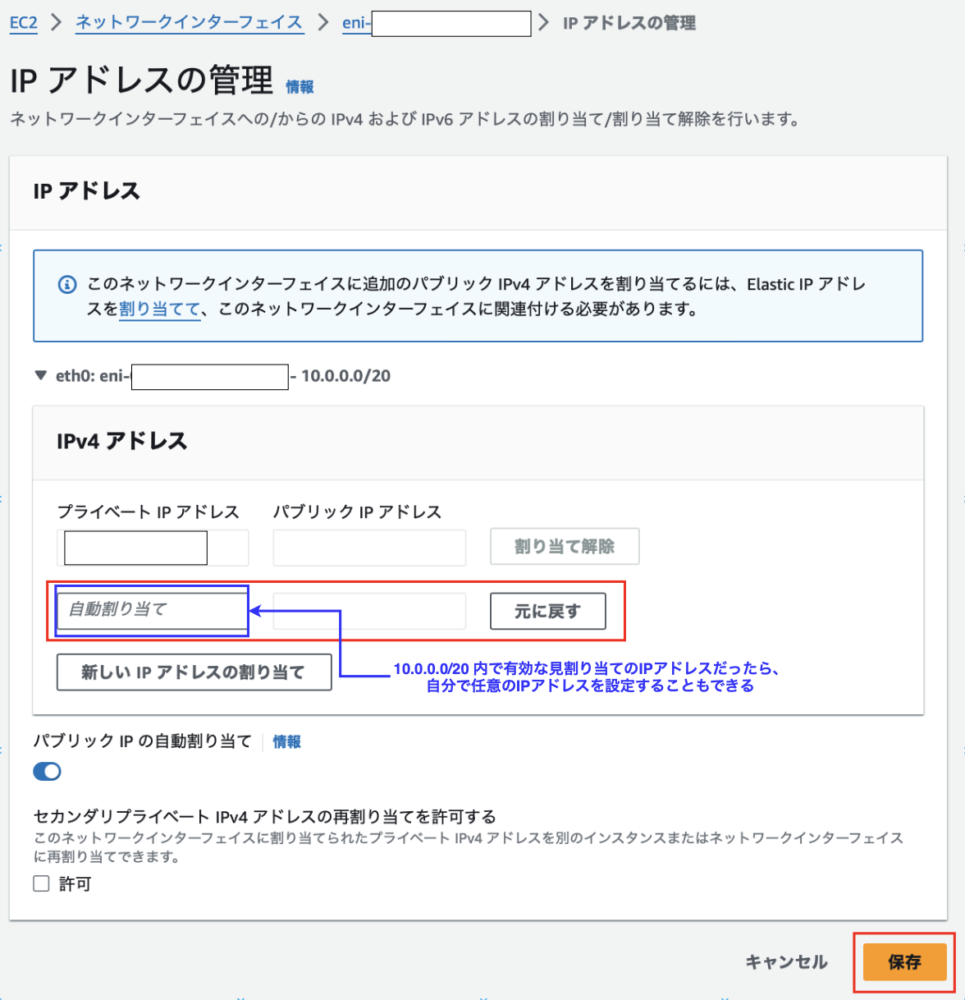

 

6. 確認

    - ENI に`セカンダリプライベート IP アドレス` として2つ目のプライベート IP アドレスが追加されていることを確認できた

    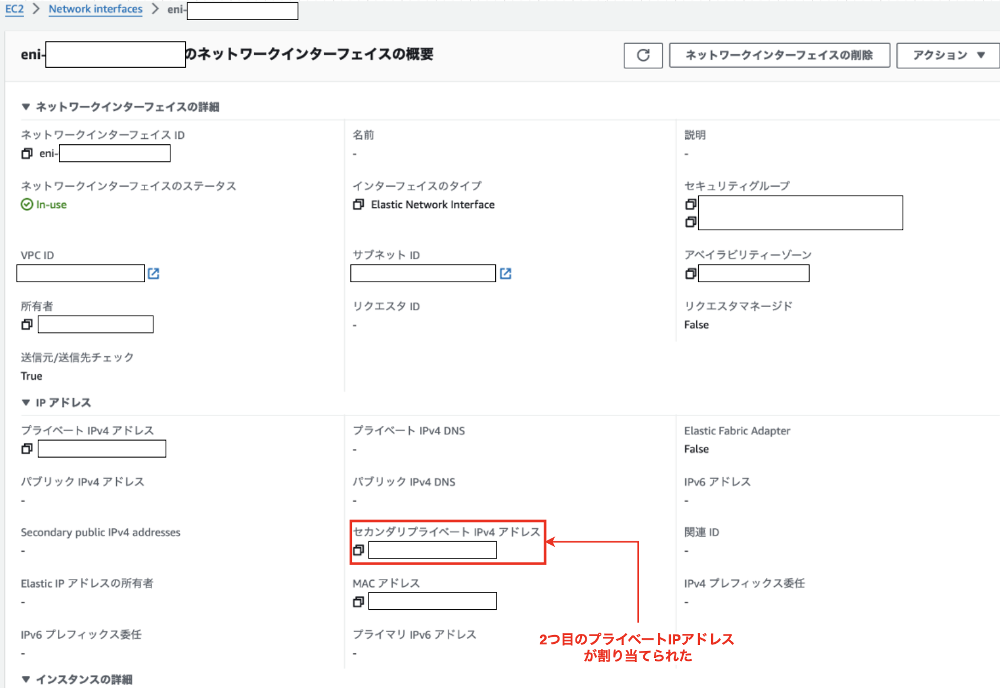

 

#### セカンダリパブリック IP を割り当てる場合

- 1つの ENI に複数のパブリック IP を割り当てること

 

#### 割り当てた IP アドレスの解除

---

### 1つのインスタンスに複数の ENI をアタッチする

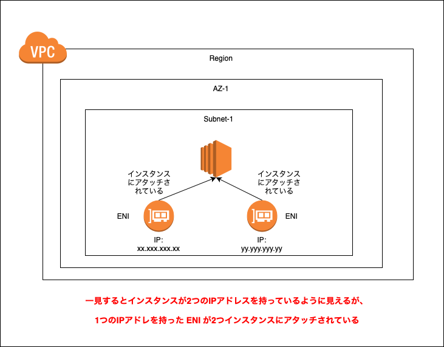

 

手順

1. VPC コンソールにログインし、EC2 ダッシュボードのサイドメニューから `ネットワークインターフェース` に遷移し、 `ネットワークインターフェースの作成` をクリックする

    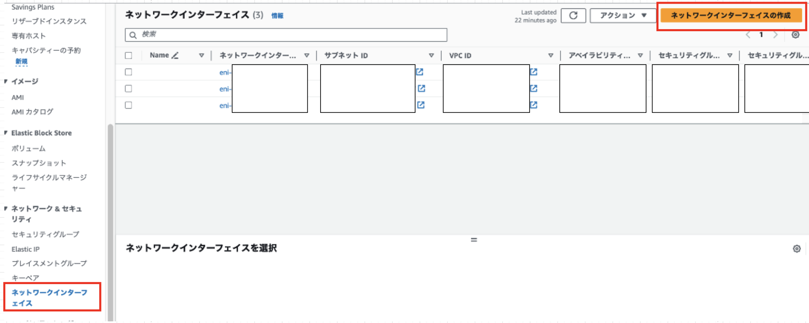

 

2. 必要項目を記入し `ネットワークインターフェースの作成` をクリックする

    - Description: 作成する ENI の説明 (ENI 一覧画面で表示される項目の一つ)　

    - サブネット
        - ENI を作成する**サブネット**を選択する (VPCではなくサブネット)

    - プライベートIPアドレス
        - 自動割り当て:どんな IP アドレスでもいい場合

        - カスタム: 自分で プライベート IP を決めたい or 決める必要がある場合

        - Elastic Fabric Adapter: [EFA](#ena-efa-とは) を有効化するかどうか

    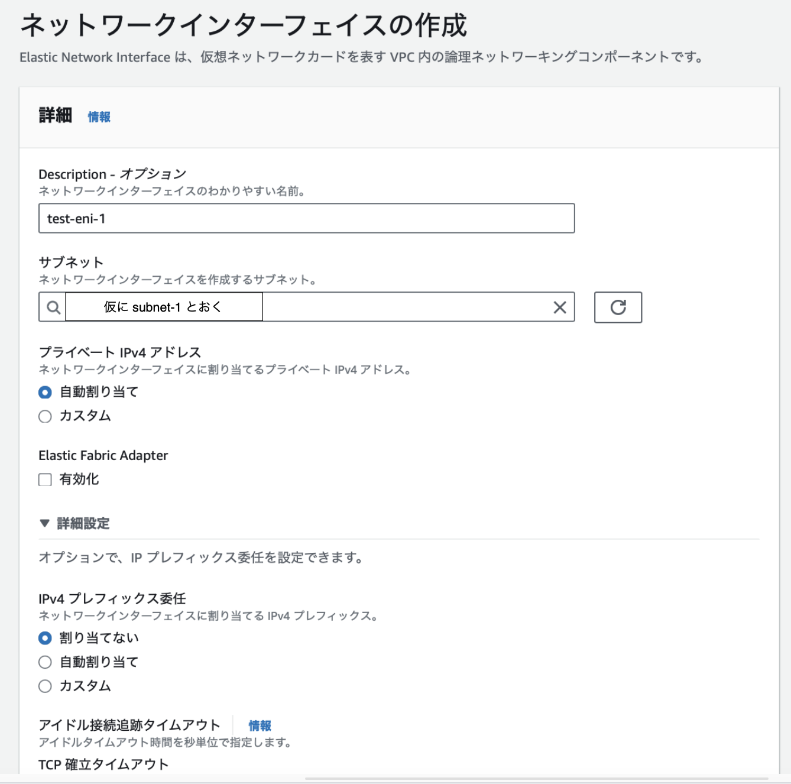

    - 詳細設定

        - IPv4 プレフィックス委任

    - アイドル接続追跡タイムアウト: 接続が何秒間ハングが続いたらタイムアウトとするのかを設定する項目

        - TCP 確立タイムアウト: 確立されたTCP接続が何秒ハングしたらタイムアウトとするかを決める項目 (秒)

        - UDP ストリームタイムアウト: (UDPで) ストリームとしてデータを連続して送信することが期待されており、何秒内にデータが受信できない場合にタイムアウトするかを決める項目 (秒)

        - UDP タイムアウト: UDPを使用してデータを送信する際、一方向のデータ送信が行われるが、相手からの応答を待つ場合、何秒内に応答が返ってこなければタイムアウトとするかを決める項目 (秒)

    - セキュリティグループ: 作成する ENI にアタッチするセキュリティグループを選択する

    - Tags: タグ

    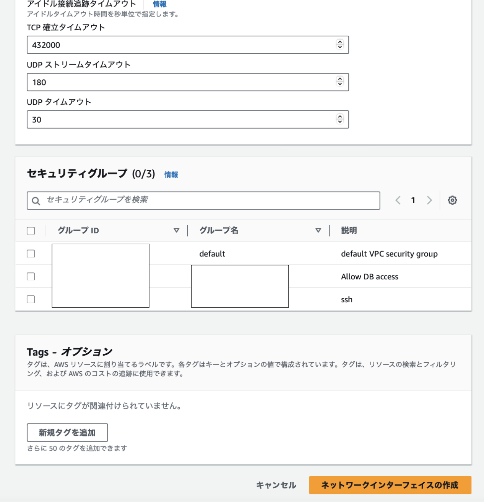

 

3. TODO: 確認および、EC2にアタッチする手順まで追記する

 

#### IPv4 プレフィックス委任とは

 
 

参考サイト

IPプレフィックスの委任について

- [IPv4 プレフィックス委任に割り当てた CIDR ブロック内の IP アドレスが 他 EC2 インスタンスで使用できるか確認してみた](https://dev.classmethod.jp/articles/ec2-prefixdelegation-1/)

---

### インスタンスの IP アドレスを他のインスタンスに引き継がせる

---

### ENA、 EFA とは

*どちらを利用しても、料金は発生しない

#### ENA (Elastic Network Adapter)

- EC2 インスタンスで高スループット、高いパケット毎秒 (PPS)、安定した低レイテンシーを実現できるよう最適化されたカスタムネットワークインターフェイス

     

    → ざっくり言うと、**EC2 インスタンス の以下の項目についてより高いパフォーマンスを実現できるようにする機能**

 

- スループット: コンピューターやネットワーク機器が一定時間あたりに転送できるデータ量
    - こうスループットであれば、より多くのアクセスをスムーズに処理できる

- PPS: コンピューターが毎秒処理できるパケット数

- レイテンシー: コンピューターがデータのリクエストを受けてからその転送処理が完了するまでの時間

    - 低レイテンシーであればあるだけ、そのコンピュータは、データの転送処理が早いということになる

 

#### EFA (Elastic Fabric Adapter)

- ENA + OSバイバスという機能

    → ENA の高度バージョン?

    - 機械学習アプリケーションの高速化などに利用するといいらしい

 
 

参考サイト

ざっくりと ENA、EFA 両者について
- [AWS ENIとは？仮想ネットワークインターフェースの特徴をわかりやすく解説](https://and-engineer.com/articles/ZiYjjxEAABkWSTLv#heading2-4)

ENA について
- [C2 インスタンス向けの次世代ネットワークインターフェイス、Elastic Network Adapter (ENA) を導入](https://aws.amazon.com/jp/about-aws/whats-new/2016/06/introducing-elastic-network-adapter-ena-the-next-generation-network-interface-for-ec2-instances/)

EFAについて
- [Elastic Fabric Adapter HPC アプリケーションと ML アプリケーションを大規模に実行](https://aws.amazon.com/jp/hpc/efa/)

- [AWS ソリューションアーキテクトアソシエイト試験勉強](https://qiita.com/n_net/items/93e98f71aa23a391aab1)

スループットについて
- [スループットとは? 意味やレイテンシとの違い、種類、単位、測定方法を解説](https://www.ntt.com/business/services/rink/knowledge/archive_06.html)

レイテンシーについて
- [レイテンシとは。Ping値や遅い場合の改善法を徹底解説！](https://www.winserver.ne.jp/column/about_latency/)

スループットとレイテンシーの違いについて
- [スループットとレイテンシーの違いは?](https://aws.amazon.com/jp/compare/the-difference-between-throughput-and-latency/)