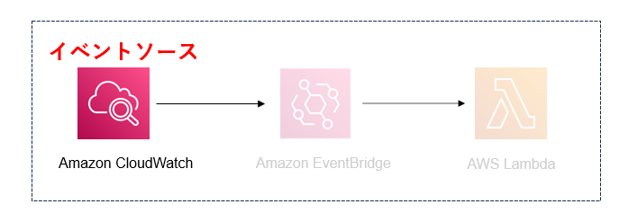
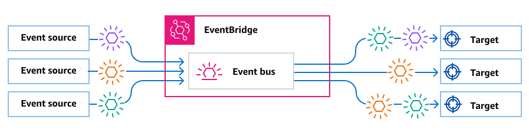
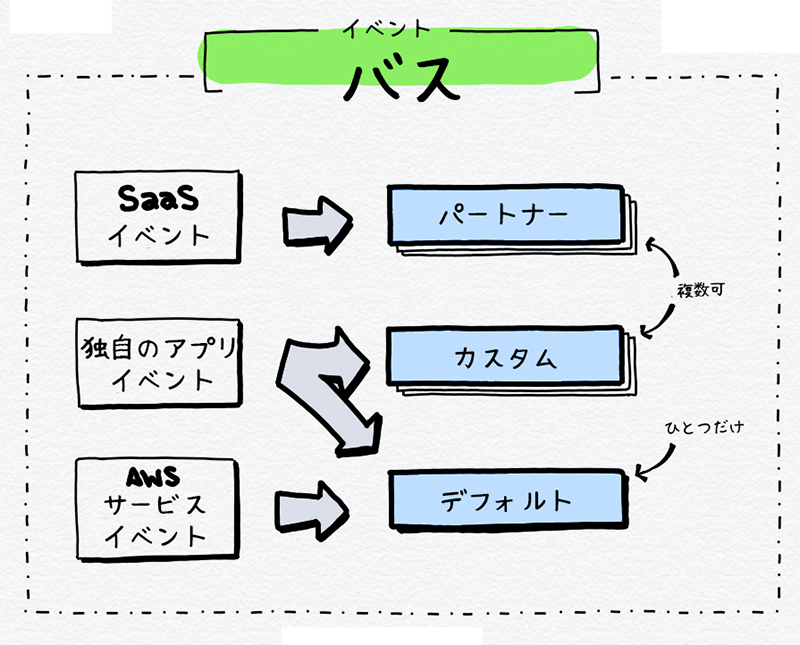
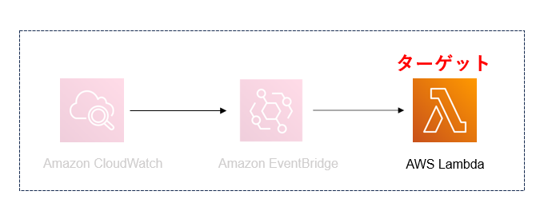
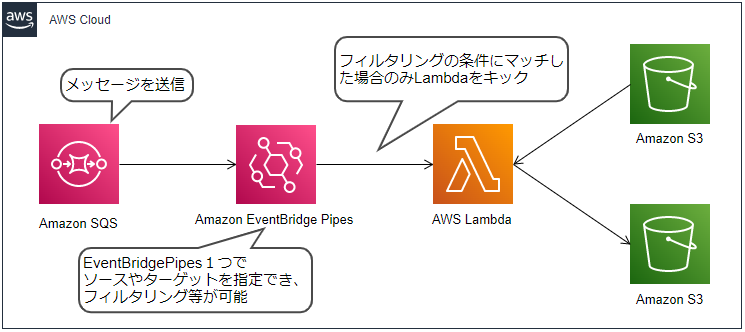
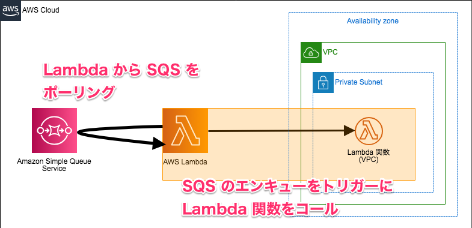
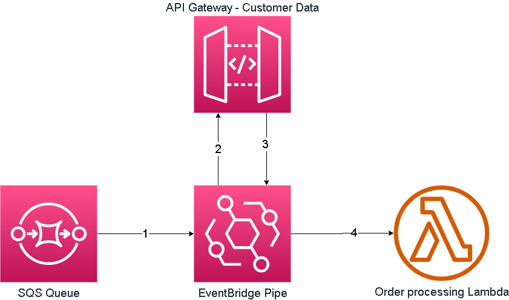
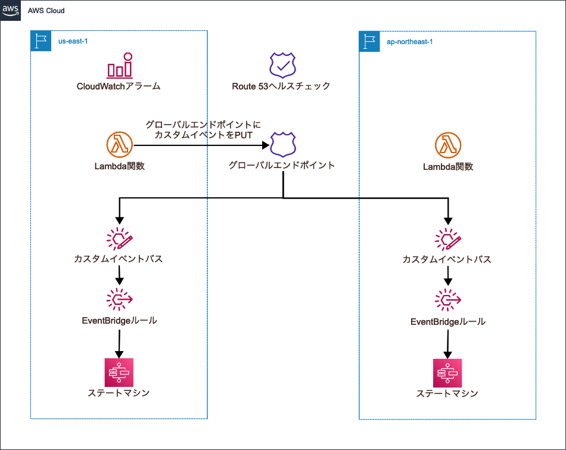

### EventBridge とは

- AWSが提供するサーバーレスのイベントバスサービス

 

- 異なるサービスやアプリケーション間でイベントを簡単に取り扱うための仕組みを提供するサービス

    - 他の AWS サービスや独自のアプリケーション、 SasS からのイベントを他のサービスやアプリケーションに連携させることができる

 

- EventBridge スケジューラという機能を利用することで、作成したスケジュールに沿って他のサービスをトリガーすることができる

    - 定期的なバッチ処理なんかに便利

 

- 同様のサービスとして CouldWatch Events がある

    - EventBridge は CloudWatch Eventsをベースに構築された、CloudWatch Events発展版のサービスと考えて良い

        - EventBridge では AWS 以外のサービスとも連携できるが、CloudWatch Events ではできないなどの特徴がある

 
 

参考サイト

[Amazon EventBridgeとは何か](https://qiita.com/ishibashi-futoshi/items/586ebe17b174a478eb6a)

[【徹底解説】Amazon EventBridgeとは？](https://www.sunnycloud.jp/column/20210802-01-2/)

[Amazon EventBridgeとは](https://docs.aws.amazon.com/ja_jp/eventbridge/latest/userguide/eb-what-is.html)

---

### EventBridge で重要な用語

 

#### イベントソース

引用: [【AWS】Amazon EventBridgeとは？初心者向けにまとめてみた](https://bftnagoya.hateblo.jp/entry/2023/08/21/140855)

 

- **イベントの送信元であるアプリケーションやサービスのこと**

- イベントソースには以下の3種類がある

    - AWS サービス

    - SasS パートナー
        - 他社が開発、提供している Amazon EventBridge と連携しているSaaS アプリケーション

    - 独自のアプリケーション
        - Python、Node.js、Java、Go などを含む開発言語で作られたアプリケーション

 

#### イベント

- [イベントソース](#イベントソース)から EventBridge の[イベントバス](#イベントバス)または[パイプ](#パイプ)に送信される JSON オブジェクト

 

#### イベントバス

引用: [Amazon のイベントバス EventBridge](https://docs.aws.amazon.com/ja_jp/eventbridge/latest/userguide/eb-event-bus.html)

 

- イベントを受信するルーターのイメージ

    - イベントをどのターゲットにルーティングするのかという機能を提供

    - 多数のターゲットにルーティングすることもできる

- イベントバスに[ルール](#ルール)を関連付けると、設定されたルールに一致したイベントのみターゲットに送信することができる (イベントのフィルタリングみたいなイメージ)

- イベントバスには以下の3種類がある (イベントソースのタイプに合わせてイベントバスを選択する必要がある)

    

    引用: [サーバーレスのイベントバスって何 ? Amazon EventBridge をグラレコで解説](https://aws.amazon.com/jp/builders-flash/202009/awsgeek-eventbridge/)

     

    - デフォルトイベントバス

        - AWS サービスと独自のアプリケーションの両方に使用できるイベントバス
        
        - SaaS 側でAWS のアカウント登録などなどをしないと基本的に利用できない

            - 例: [Mackerelというサーバー監視サービスからEventBridgeにイベントを送信する方法](https://mackerel.io/ja/docs/entry/howto/alerts/eventbridge)

     

    - カスタムイベントバス

        - 独自のアプリケーション用のイベントバス

     

    - パートナーイベントバス

        - SaaS パートナー用のイベントバス

        - SaaSサービス側で登録する必要がある
        
 

#### ターゲット

 

 

- **受け取ったイベントの送信先となるアプリケーションやサービスのこと**

- ターゲットとして指定できるもの

    - AWS サービス

    - 外部 API

    - 別のアカウントまたはリージョンの[イベントバス](#イベントバス)

 

#### ルール

- **イベントバスで受信したイベントのうちどのイベントをターゲットに送信するかの定義**

- ルールはイベントバスに対して設定する

- 1つのルールで最大5ターゲットにイベントを送信できる

- 1つのイベントバスに最大300のルールを設定可能

    - サービスクォータの引き上げ申請をすれば設定できるルールの数を増やすことが可能

- 以下の2つのルールの定義方法がある

    - イベントパターンによる定義

        - イベントバスが受信したイベントから特定のイベントを抽出するためのマッチングパターンを定義する方法

     

    - スケジュールによる定義 (以下の2種類がある)

        - 特定の日時にターゲットにイベントを送信する方法 (月の第一月曜日や毎日午前8時などなど)

        - 一定の間隔でターゲットにイベントを送信する方法 (6時間ごとなど)

        - ★ スケジュールされたイベントはすべて UTC+0 タイムゾーンを基準にする

 
 

参考サイト

[【AWS】Amazon EventBridgeとは？初心者向けにまとめてみた](https://bftnagoya.hateblo.jp/entry/2023/08/21/140855)

[連携機能で SaaS をより便利に Amazon EventBridgeのご紹介](https://pages.awscloud.com/rs/112-TZM-766/images/20211125_12th_ISV_DiveDeepSeminar_Amazon_EventBridge.pdf)

[サーバーレスのイベントバスって何 ? Amazon EventBridge をグラレコで解説](https://aws.amazon.com/jp/builders-flash/202009/awsgeek-eventbridge/)

[Amazon でのイベントバスの概念 EventBridge](https://docs.aws.amazon.com/ja_jp/eventbridge/latest/userguide/eb-what-is-how-it-works-concepts.html)

イベントパターンについて
- [Amazon EventBridgeルールをデバッグする](https://techblog.techfirm.co.jp/entry/eventbridge-rules-debugging)

ルール - スケジュールによる定義について
- [Amazon でスケジュールに従って実行されるルールの作成 EventBridge](https://docs.aws.amazon.com/ja_jp/eventbridge/latest/userguide/eb-create-rule-schedule.html)

---

### 特徴 / 機能

 

#### スキーマレジストリ

- 一元的にイベントスキーマを管理する場所

    - **EventBridge の(イベント)スキーマとは?**

        - EventBridge に送信されるイベントの構造を定義する JSON 形式のデータ

        - バージョン、ID、詳細タイプ、発生元、AWSアカウントID、発生時間、リージョン、関連するAWSリソース、詳細データなどが含まれる

 

- コードバインディング機能

    - スキーマ定義を言語ごとにダウンロード可能にする機能

    - ダウンロードしたスキーマ定義をインポートしておくことで、プログラムコード側で簡単にイベントを参照することができる

 

- スキーマ検出 (Schema Discovery)

    - SaaSイベントやカスタムイベントがイベントバスに送信されると、そのスキーマ情報がスキーマレジストリに登録される機能

 

- ★ スキーマレジストリの使用は無料

- ★ スキーマ検出機能は有効

 

#### (イベント)パイプ

- 1つのイベントソースと1つのターゲットを繋ぐバージョンの[イベントバス](#イベントバス)みたいなもの

- イベントバストの違いは何か?

    - パイプのイベントソースに設定できるのは**メッセージングやイベントデータを取り扱う** AWS サービス　(SQS や DynamoDB Stream など)

        

        引用: Amazon EventBridge Pipesを使ってEventBridge内でフィルタリングしてみる](https://blog.serverworks.co.jp/2022/12/13/134812)

     

    - パイプ無しだと Lambda で上記サービスイベントをポーリングしていたらしい
    
        

        引用: [プライベートな Lambda 関数で SQS をイベントソースに設定しても Lambda 関数は動作しないと勘違いしていた話](https://dev.classmethod.jp/articles/sqs-to-vpclambda/)

- イベントフィルタリング

    - イベントバスに設定する[ルール](#ルール)のように特定のイベントのみをターゲットに発信できる機能

- エンリッチメント

    - ターゲットに送信前にイベントデータのペイロード部分を加工する機能

        - 例: イベントソースからイベントを受け取ったら、EventBridge Pipes にて API Gateway を呼び、返却されたデータをイベントデータに付け加えてターゲットに発信する

            

            引用: [Introduction to EventBridge Pipes](https://majestic.cloud/introduction-to-eventbridge-pipes/)

- パイプとイベントバスを一緒に使うこともできる

    - パイプのターゲットにイベントバスを設定するようなユースケース

- パイプの利用には料金が発生する 

 

#### スケジューラー

- スケジュールによる定義する[ルール](#ルール)の上位互換版

- 様々なタイムゾーンをサポートしている

- 1回限りのスケジュールの設定も可能

- スケジューラーの利用には料金が発生する

 

#### グローバルエンドポイント

引用: [Amazon EventBridge にイベントを別リージョンに自動でフェイルオーバーするグローバルエンドポイントが追加されました](https://dev.classmethod.jp/articles/amazon-eventbridge-global-endpoints-automatic-failover-recovery/)

 

- イベントの配信先をセカンダリリージョンのイベントバスに自動でフェイルオーバーできる機能

- イベントを常時セカンダリリージョンにレプリケーションすることもできる

- グローバルエンドポイントの利用には [Route 53 ヘルスチェック](./Route53.md#route-53-ヘルスチェック) の作成と プライマリリージョンで `IngestionToInvocationStartLatency` をモニタリングする CloudWatch Alarm の作成が必要

    - `IngestionToInvocationStartLatency`: イベントがAmazon EventBridgeに取り込まれてから、ルールの中でターゲットが最初に呼び出されるまでの処理時間のメトリクスのこと

- ターゲットは PutEvent というアクションでグローバルエンドポイントににイベントを送信する必要がある

- ★ グローバルエンドポイントには追加料金はかからないが以下の料金は発生する

    - グローバルエンドポイントはカスタムイベントのみに使用なので、グローバルエンドポイントからそイベントバスに送信されたカスタムイベントの件数分カスタムイベント数に対する料金が発生する

 

#### イベントアーカイブ

- アーカイブ(Archive)は指定したイベントバスで受信したイベントを保存する機能

- 定義したイベントパターンに一致した場合のみイベントを保存することもできる

- 、保存期間を指定することができる (無期限を指定することもできる)

 

#### イベントリプレイ

- アーカイブしたイベントを再送信することができる機能

- イベントリプレイの利用には料金が発生する

 

#### API Destinations

- EventBridge イベントバスから任意の外部 API にイベントを送信することができる機能

- API Destination の利用には料金が発生する

 
 

参考サイト

イベントスキーマについて
- [イベント駆動 on AWSを考える](https://zenn.dev/tech4anyone/articles/6ea607af6139ab#イベントスキーマ)

スキーマレジストリについて
- [[AWS Black Belt Online Seminar] Amazon EventBridge](https://d1.awsstatic.com/webinars/jp/pdf/services/20200122_BlackBelt_EventBridge.pdf)

パイプについて
- [EventBridge Pipes で Tweet をあれこれする - あなたと「|」したい...後記 -](https://track3jyo.com/2022/12/pipes-with-you/)

グローバルエンドポイントについて
- [Amazon EventBridge にイベントを別リージョンに自動でフェイルオーバーするグローバルエンドポイントが追加されました](https://dev.classmethod.jp/articles/amazon-eventbridge-global-endpoints-automatic-failover-recovery/)

---

### コスト

#### イベントバスの利用料金

- イベントバスが受け取っとイベントの数に対して料金が発生する

- ★ AWS サービスからのイベントには料金はかからない

    - カスタムイベント、SaaSイベントおよび、クロスアカウントイベントに料金が発生する

 

#### パイプの利用

- パイプがターゲットに送信するイベントの数に応じて料金が発生する

- イベント100万件ごとに \~~ USD の料金形態

- パイプが送信するイベントはペイロードが 64KB までは1リクエスト (イベント送信) として課金される

    - それ以上のサイズのペイロードは複数リクエストに分け課金される

    - 例: パイプがターゲットに送信するイベントのペイロードが 256KB の場合、4リクエスト分の請求が発生する

 

#### スケジューラーの利用料　

- 無料利用枠として　1400万回分のスケジュール起動回数料金が無料になる

- 以降はスケジュール起動回数100万回ごとに \~~ USD という料金形態

 

#### API Destnations の利用料　

- 外部 API へのイベント送信件数に応じて料金が発生する

- イベント送信件数100万件ごとに \~~ USD という料金形態

- 送信するイベントはペイロードが 64KB までは1リクエスト (イベント送信) として課金される

     - それ以上のサイズのペイロードは複数リクエストに分け課金される

    - 例: API Destinations が外部 API に送信するイベントのペイロードが 256KB の場合、4リクエスト分の請求が発生する

- インターネットへのデータ転送にはデータ転送料が発生する

 

#### イベントリプレイの利用には料金が発生する

- TODO: アーカイブ処理、ストレージはOK。　リプレイの料金とは?

 

#### スキーマレジストリの利用料

- スキーマの検出機能をONにすると料金が発生する

    - 受け取ったイベントの件数に対して料金が発生する

    - 無料利用枠として、500万件分のイベント受け取り料金は無料

    - 以降は受け取ったイベント100万件あたり \~~ USD という料金形態

 

#### 練習問題
