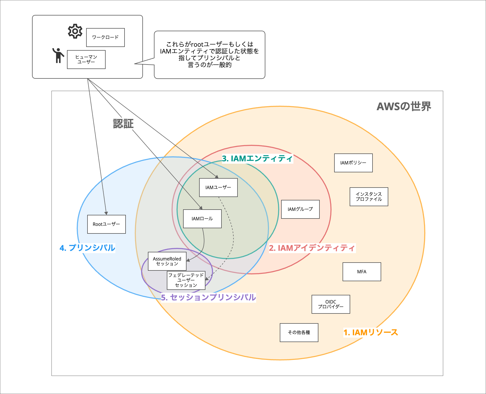
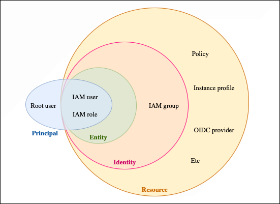
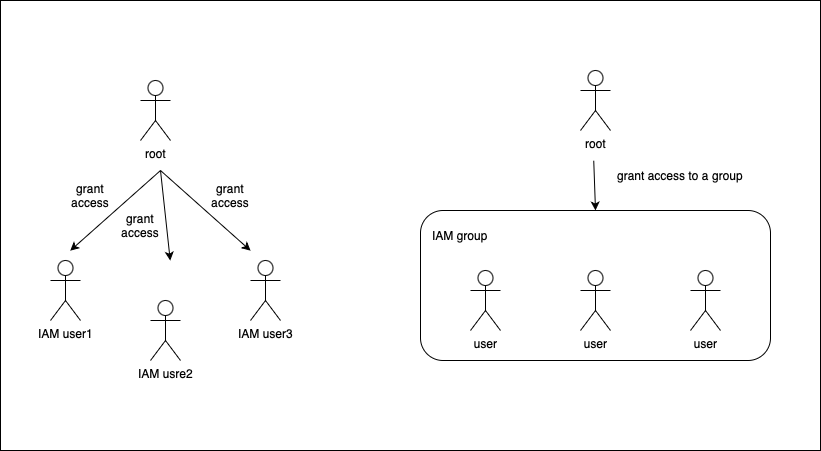
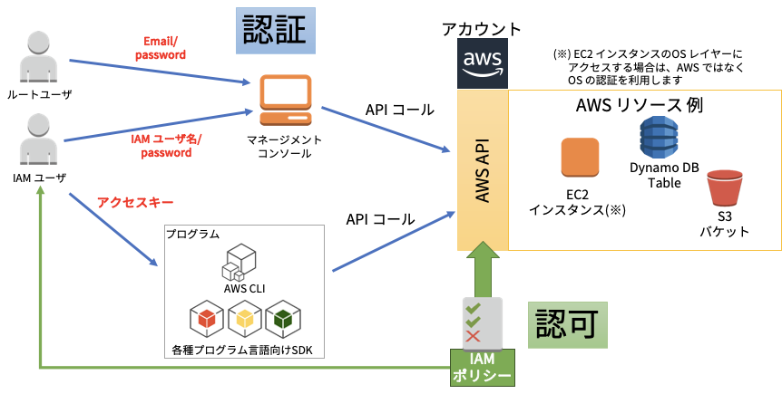

### IAM とは

- Identity and Access Management

- AWS のリソース(サービスのエンティティ)へのアクセス権限を管理するためのサービス

    - アクセス権限をユーザー/グループ/インスタンスに付与することができる

 

- ルートユーザーは全てのサービスにアクセスできるが、そのユーザーが乗っ取られると大変なことになってしまう

    -> 特定のリソースにのみアクセスできるユーザーを作成し、そのユーザーでリソースを運用していくことで乗っ取られた場合でも最小限の被害で済む

---

### IAM での用語

引用: [AWS入門ブログリレー2024〜AWS IAM編〜](https://dev.classmethod.jp/articles/introduction-2024-aws-iam/#toc-aws-iam-1)

 

引用: [IAM ID と認証情報を比較する](https://docs.aws.amazon.com/ja_jp/IAM/latest/UserGuide/introduction_identity-management.html)

---

### ユーザーとグループ

root ユーザーが個別にユーザーを作成し、その都度個別に権限を設定することもできるが、めんどくさいしミスも起きる可能性が高い

root ユーザーがグループを作成し、そのグループに権限を与えることで、そのグループに属するユーザーは自動的にそのグループの権限が設定される

---

### IAM のベストプラクティス

- root ユーザーはその権限でしかできないこと以外に利用しない

- root ユーザーの[アクセスキー](#access-key)は生成しない

- アクセスキーは極力使わない

- root ユーザーの [MFA](./Terminology.md) を有効化
    - root ユーザーでログインし、 MFA を有効化、その際に表示される QR コードをスマホアプリの Authenticator で読み込む

- 権限を付与した IAMグループにIAMユーザを所属させることで権限を付与する

- ReadOnlyAccess より強い権限を持つIAMユーザには、MFAを適用する

- IAM ユーザーをチーム内で使い回さない

- 不要な IAM ユーザーは定期的に削除する

---

### Access key

アクセスキーとは $\color{red}\text{AWS のサービスを web コンソールからのログインなしに利用できるようになる認証情報のこと}$

root ユーザーのアクセスキーが漏洩すると、悪意のあるプログラムからサーバーを大量に立てられ、仮想通貨のマイニングなどに利用されてしまう

---

### ポリシーとロール

- [IAM Policy](./IAM_Policy.md)
    - リソースへのアクセス権限

    - **「どの AWS サービスの」**、**「どのリソースに対して」**、**「どんな操作を」**、**「許可or拒否」** を定義したもの 

 

- [IAM Role](./IAM_Role.md)
    - IAM Policy の集まり

    - AWS インスタンスや、**他 AWS アカウント** に対して付与する権限

 
 

参考サイト

[【AWS初学者向け】IAMとは何か分かりやすく徹底解説](https://academ-aid.com/qualif/aws/iam)

[【覚え書き】実装で学ぶIAMポリシーとIAMロールとAssumeRole](https://zenn.dev/fusic/articles/1538897dd8f092#iamナントカってなんだっけ？)

---

### IAM の仕組み

引用: [AWS 初心者必見! AWS の認証と認可を理解し、AWS アカウントをMFA で保護しよう Part1](https://blog.nijot.com/aws/protecting-your-aws-account-with-mfa-part1/)

 

- メールアドレス (or IAM ユーザー名) & パスワードでログインし、AWS マネージドコンソールから GUI で AWS リソースを操作しようが、アクセスキー (アクセスキー & シークレットアクセスキー) を使って CLI で AWS リソースを操作しようが**結局は裏で API をコールして AWS リソースの操作を行なっている**

 

#### IAM の認証機能

- IAM ユーザー
    - ログインの際のユーザー名&パスワードで認証
    - CLI での API 呼び出しの際のアクセスキー&シークレットアクセスキーで認証

- [IAM ロール](./IAM_Role.md)
    - Assuem ロール (=ロール引き受け) の際に STS からアクセスキー、シークレットアクセスキー、セッショントークンという3つの情報で認証

 
 

#### IAM の認可機能

- IAM ユーザー、IAM グループ、 IAM ロールに**ポリシー**を付与することで、特定のアクションの**許可/拒否**を設定することができる

    - [許可ポリシー](./IAM_Policy.md#許可ポリシーと信頼ポリシー)というものが IAM での認可機能を担っている