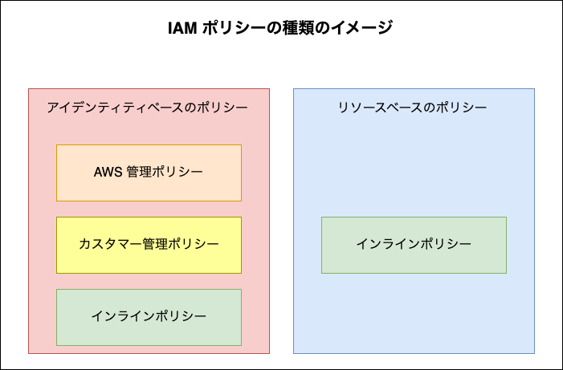
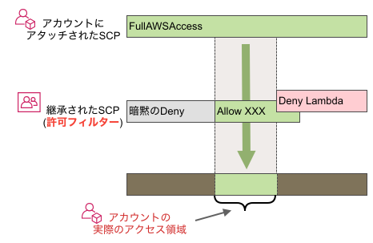

### IAM Policy 

### ポリシーの基本

- Policy の正体は JSON

- 主体 (誰/何が)、 対象 (何を)、 操作 (どうする)、　許否　(許可/拒否) を定義するもの

 
 

参考サイト

[AWS IAMポリシーを理解する](https://dev.classmethod.jp/articles/aws-iam-policy/)

---

### ポリシーの種類

- IAM Policyにはいくつかの種類がある

    1. #### [アイデンティティベースのポリシー](#アイデンティティベースのポリシー-1)

        - アイデンティティベースのポリシーにも種類がある

            1. ##### AWS 管理ポリシー

                - AWS 側で提供しているポリシー

                - ポリシー単独で存在でき、使いまわすことができる
        
             

            2. ##### カスタマー管理ポリシー

                - ユーザーが自分で作成するポリシー

                - AWS 管理ポリシーと同様にポリシー単独で存在でき、使いまわすことができる

             

            3. ##### インラインポリシー

                - ユーザーが自分で作成するポリシー

                - ポリシー単独で存在できないため、使いまわすことができない

    2. #### [リソースベースのポリシー](#リソースベースのポリシー)

        - リソースベースのポリシーはインラインポリシーだけ

 
 

参考サイト

[AWSのポリシーを使いこなそう　ポリシー設計につまづかないためのポイントを整理](https://devlog.arksystems.co.jp/2020/03/12/9338/)

---

### アイデンティティベースのポリシーとリソースベースのポリシー

#### アイデンティティベースのポリシー

- 操作する側 (認証主体) にアタッチするポリシーのこと

    - **操作する側に対して**何を許可し、何を拒否するのかを定義するポリシー

    - 認証主体とは、IAM アイデンティティ (IAM ユーザーや IAM グループ、IAM ロール) のこと

 
 

#### リソースベースのポリシー

- その名の通りリソースにアタッチするポリシーのこと

    - IAM ユーザー、IAM グループ IAM ロールも [IAM のリソース](./IAM.md#iam-での用語)

        - IAM ロールの[信頼ポリシー](#許可ポリシーと信頼ポリシー)はインラインポリシー

- **操作される対象 (=リソース) に対して**何を許可し、何を拒否するのかを定義するポリシー

 

#### ポイント

- アイデンティティベースのポリシーは操作主体にアタッチするので、プリンシパルの定義は必要ない

- リソースベースのポリシーは操作対象にアタッチするので、そのリソースを操作する主体をプリンシパルで指定する必要がある

 
 

#### クロスアカウント

- リソースと操作主体が異なるアカウントによって所有されている場合、操作対象と操作主体の両方でアクションがポリシーによって許可されていないとそのアクションが実行できないことに注意

    - 詳しい例は[こちら](./S3_BucketPolicy.md#クロスアカウントアクセスとは)を参照

 
 

参考サイト
YouTube
- [くろかわこうへいのAWS講座IAM編#1【IAMロール、ポリシー、アクセスキー、ユーザー、グループ】](https://www.youtube.com/watch?v=uMB1toQ9Z7A)

---

### 許可ポリシーと信頼ポリシー

#### 許可ポリシー

- その名の通り、操作の許可/拒否を定義するポリシー

 

#### 信頼ポリシー

- IAM ロールのみに定義するインラインベースのポリシー (信頼関係とも呼ぶ)

- 信頼ポリシーには**そのロールを誰が [Assume ロール](./IAM_Role.md#assume-ロール) 出来るのか**を定義する

 
 

- ★IAM ロールはアイデンティティベースの許可ポリシーとインラインベースの信頼ポリシーの両方を持つ

    

 
 

参考サイト

許可ポリシーについて
- [【PART11 IAMロール】ぜんぜんわからなかったIAMについてまとめてみました](https://note.com/koguma_gunso/n/n6010cb985127#bd8fe723-c243-4868-9d31-1b3f85ed4e22)

---

### アクセス境界ポリシー (Permissions Boundary Policy)

-  IAM ユーザーもしくはロールに設定するポリシーの1種
    
    - ★実態は管理ポリシー

 

- ★IAM ユーザーもしくは IAM ロールにアクセス境界ポリシーが設定されている場合

    - そのユーザー/ロールができる操作 (アクション) はアイデンティティベースの許可ポリシーとアクセス境界ポリシーの両方で明示的に許可されいるものに限定される

        

        引用: [IAM エンティティのアクセス許可境界](https://docs.aws.amazon.com/ja_jp/IAM/latest/UserGuide/access_policies_boundaries.html)

 

- アクセス境界ポリシーのイメージはIAM ユーザーもしくは IAM ロールに設定されているアイデンティティベースの許可ポリシーの範囲を限定するもの 

 
 

#### アクセス境界ポリシーの設定 (マネージドコンソールから)

- AWS マネージドコンソールにて IAM 画面に遷移し、アクセス境界ポリシーを設定したい IAM ユーザーか IAM ロールを選択。`許可` タブの `許可の境界` にてアクセス境界ポリシーを設定する

    

 
 

参考サイト

[IAM Permissions boundary（アクセス権限の境界）で明示的に許可していないアクションでも条件次第で実行できるということを評価論理の流れを眺めて再認識してみた](https://dev.classmethod.jp/articles/iam-policies-evaluation-logic-rikai/)

[IAM Permissions Boundary の本質](https://tech.dentsusoken.com/entry/essence_of_iam_permissions_boudary#Permissions-Boundary-とは)

---

### その他のポリシー

#### SCP (サービスコントロールポリシー)

- AWS Organizations の OU (Organization Unit = 組織単位) または OU に所属しているアカウントに指定するポリシー

    - ★SCP は IAM ポリシーではない

    

    引用: [AWS Organizations で何が出来るのかをまとめる](https://www.ios-net.co.jp/blog/20240703-2909/)

 

- IAM ポリシーとの違い

    - IAM ポリシー

        - そのアカウント内の対象のIAM ユーザー、グループ、ロールの権限を制限する
    
     

    - SCP

        - **対象の OU 内の全てのアカウント、もしくは対象のアカウントの権限を制限**

            = ★★そのアカウント内の全ての IAM ユーザー、グループ、ロールの権限を一括で制限する

 

- つまり、SCP が設定されている場合、その SCP で許可されているアクション以外はできない

    - イメージ的には SCP は許可のフィルターのようなものらしい

        = 最終的に SCP で許可されているアクションのみがふるいにかけられる
    
     

    

    引用: [[AWS Organizations] SCP(サービスコントロールポリシー)の継承の仕組みを学ぼう](https://dev.classmethod.jp/articles/organizations-scp-inheritance)

 
 

#### セッションポリシー

- [アクセス境界ポリシー](#アクセス境界ポリシー-permissions-boundary-policy)の IAM Role 版みたいなイメージ

    - Assume ロールの際に、オプションで指定することで、そのロールの権限をさらに限定するポリシー

        

        引用: [AWS IAM の結果整合性を避けるためセッションポリシーを用いてポリシーの動作確認を行う](https://dev.classmethod.jp/articles/aws-iam-eventual-consistency-session-policy/)

     

    - セッションポリシーが設定されている場合、そのロールのアイデンティティポリシーとセッションポリシーの両方で明示的に許可されているアクションのみが許可される

        

        引用: [AWS IAM の結果整合性を避けるためセッションポリシーを用いてポリシーの動作確認を行う](https://dev.classmethod.jp/articles/aws-iam-eventual-consistency-session-policy/)

 

- ★セッションポリシーを設定するには、CLI や SDK の引数に指定するらしい

    - マネージドコンソールから GUI で設定することはできないっぽい

 
 

参考サイト

SCP について
- [[AWS Organizations] SCP(サービスコントロールポリシー)の継承の仕組みを学ぼう](https://dev.classmethod.jp/articles/organizations-scp-inheritance/)
- [【AWS】SCPとは？(SCPとIAMの違い)](https://qiita.com/mzmz__02/items/8ad282f8e8ef091c8e66)
- [SCPの役割とIAMポリシーの違い及び特徴についてざっくり理解を深めたい](https://qiita.com/pontarou194/items/36c65824c662bf9a2f96)

セッションポリシーについて
- [【入門編】AWSにおけるアクセスポリシーの評価ロジックを整理してみる](https://blog.serverworks.co.jp/iam/policy/evaluation-logic#セッションポリシー)
- [AWS IAM の結果整合性を避けるためセッションポリシーを用いてポリシーの動作確認を行う](https://dev.classmethod.jp/articles/aws-iam-eventual-consistency-session-policy/)

---

### 明示的な拒否、明示的な許可、暗黙的な拒否

#### 明示的にな拒否

- ポリシーに Deny で指定されているアクション

- ★一番優先度が高い

    - 同じアクションが Deny と Allow の両方指定されいる場合、アクションは実行できない = Deny が優先される

 

#### 明示的にな許可

- ポリシーに Allow で指定されているアクション

 

#### 暗黙的な Deny

- Deny も Allow も指定されていないアクションは全て暗黙的な拒否 = 実行できない

 
 

参考サイト

[明示的な拒否と暗黙的な拒否の違い](https://docs.aws.amazon.com/ja_jp/IAM/latest/UserGuide/reference_policies_evaluation-logic_AccessPolicyLanguage_Interplay.html)

[新しくなった IAM 評価論理フローチャートをひとしきり愛でてみた](https://dev.classmethod.jp/articles/new-policy-evaluation-logic-flow-chart/)

[IAM の評価論理をやんわり押さえるセッション「やんわり押さえよう IAM の評価論理」で登壇しました #devio2021](https://dev.classmethod.jp/articles/devio-2021-iam-evaluation-logic/)

[【AWS】IAMポリシーのAllow/Denyの優先度について](https://www.guri2o1667.work/entry/2022/08/23/【AWS】IAMポリシーのAllow/Denyの優先度について)

---

### IAM ポリシーの評価順

- IAM ポリシーはその種類 (アイデンティティベース/リソースベース/アクセス許可ポリシーなど) によって評価される順番がある

- 詳しい評価順は参考サイトに挙げた Web ページを参照すること

 
 

参考サイト

[IAM Permissions boundary（アクセス権限の境界）で明示的に許可していないアクションでも条件次第で実行できるということを評価論理の流れを眺めて再認識してみた](https://dev.classmethod.jp/articles/iam-policies-evaluation-logic-rikai/)

[【入門編】AWSにおけるアクセスポリシーの評価ロジックを整理してみる](https://blog.serverworks.co.jp/iam/policy/evaluation-logic)