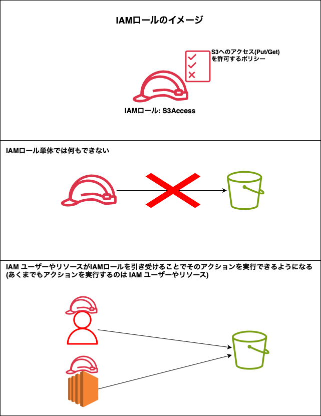

### IAM ロールとは

- 認証のために使用される IAM のリソース

- ロールの正体は許可ポリシー、信頼ポリシー、境界ポリシーの集まり

- AWS サービスや IAM ユーザに渡すもの

 

#### IAM ロールのポイント

- IAM ロールはユーザーやリソースと違って、**IAM ロール自身はアクションを実行できない**

    - ★★★IAM ユーザーやリソースが対象の IAM ロールを引き受けることで、IAM ロールで許可されたアクションを実行できる★★★

    

 

- 上記の IAM ユーザーやリソースが IAM ロールを引き受けることを [Assume ロール](#assume-ロール)という

 

- ★★★IAM ロールにはどのようなアクションを許可/拒否するのかを定義した許可ポリシーと、誰がそのロールを引き受ける (Assume ロール) ことができるのかを定義した信頼ポリシーを持つ★★★

    

 
 

参考サイト

[AWS再入門ブログリレー2022 AWS IAM編](https://dev.classmethod.jp/articles/re-introduction-2022-aws-iam/#toc-aws-stssecurity-token-service)

[テクニカルトレーナーと学ぶ AWS IAM ロール ~ ここが知りたかった ! つまずきやすい部分を理解してモヤっとを解消](https://aws.amazon.com/jp/builders-flash/202303/learn-iam-role/)

[【初心者向け】AWS IAM 入門！完全ガイド](https://zenn.dev/issy/articles/zenn-iam-overview#iam-ロール)

---

### Assume ロール

- 役割 (Role) を引き受ける (Assume)　する機能のこと

- もっと具体的にいうと **IAM ロールを引き受ける操作 (アクション)**

 

#### Assume ロールの仕組み

- IAM ユーザーが Assume ロー ルする例

    

 

- リソースが Assume ロールする例

    

    引用: [テクニカルトレーナーと学ぶ AWS IAM ロール ~ ここが知りたかった ! つまずきやすい部分を理解してモヤっとを解消](https://aws.amazon.com/jp/builders-flash/202303/learn-iam-role/)

 
 

#### ポイント

- ★STS (Security Token Service) とは?

    - STS とは一時的な認証情報、一時的なクレデンシャル (認証情報) を作成・提供してくれる IAM の補助的なサービスのこと

    - STS が発行する認証情報には期限 (セッション期限) がある

 

- ★IAM ロールの許可ポリシーには プリンシパルが **STS に対して Assume ロールの操作を許可する**よう定義する必要がある

 

- Assume ロールは期限付きでロールを引き受けること、ではリソースが STS に対して Assume ロールをリクエストするタイミングはいつ?

    - そこら辺は AWS 側で定期的に STS に Assume ロールをリクエストして認証情報をローテーションしてくれているため、こちら側が意識する必要はないらしい

        

        引用: [テクニカルトレーナーと学ぶ AWS IAM ロール ~ ここが知りたかった ! つまずきやすい部分を理解してモヤっとを解消](https://aws.amazon.com/jp/builders-flash/202303/learn-iam-role/)

 

- [Assume ロール後はロールを引き受けた IAM ユーザーやリソースがアクションを実行する](#iam-ロールのポイント) と記述したが、もっと正確にいうと、**STS によりロールを引き受けたセッション**がアクションを実行する主体になるらしい

    - なぜなら、アクションを実行する主体の ARN が IAM ユーザーやリソースと異なり、`arn:aws:sts::000000000000:assumed-role/ロール名/セッション名` のような形式で認識されるから

    - ちなみに、ARN は S3リソースであれば `arn:aws:s3::~~`、 IAM リソースであれば `arn:aws:iam::~~~` といったように `arn:aws:[AWSサービス]::~~` といった形式になる

 
 

参考サイト

[テクニカルトレーナーと学ぶ AWS IAM ロール ~ ここが知りたかった ! つまずきやすい部分を理解してモヤっとを解消](https://aws.amazon.com/jp/builders-flash/202303/learn-iam-role/)

[IAM ロールの PassRole と AssumeRole をもう二度と忘れないために絵を描いてみた](https://dev.classmethod.jp/articles/iam-role-passrole-assumerole/)

YouTube: [AWS IAM 絶対わかるAssumeRole編](https://youtu.be/s9gKqOA8kaI?si=vhfSDRfTZ4ylBD2I)

---

### スイッチロールとは

- ロールを付け替えること

#### Assume ロールとの違い

- Assume ロールは API = アクション

- スイッチロールはロールを付け替えることの名称

- スイッチロールするためには Assume ロールをする必要がある

 

---

### Pass ロール

-　Role を付与するアクション

- 例: とある IAM ユーザーで EC2 インスタンスを作成し、S3 へのアクセス許可を定義した IAM ロールを付与したい場合、IAM ユーザーに Pass ロールが許可されていないとその操作ができない

 

引用: [IAM ロールの PassRole と AssumeRole をもう二度と忘れないために絵を描いてみた](https://dev.classmethod.jp/articles/iam-role-passrole-assumerole/)

 
 

参考サイト

[IAMが昨日よりもちょっと好きになる](https://servithink.co.jp/blog/archives/tech-blog-i-love-iam)

[IAM ロールの PassRole と AssumeRole をもう二度と忘れないために絵を描いてみた](https://dev.classmethod.jp/articles/iam-role-passrole-assumerole/)