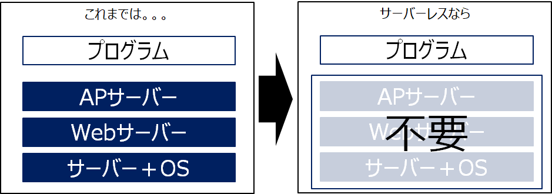
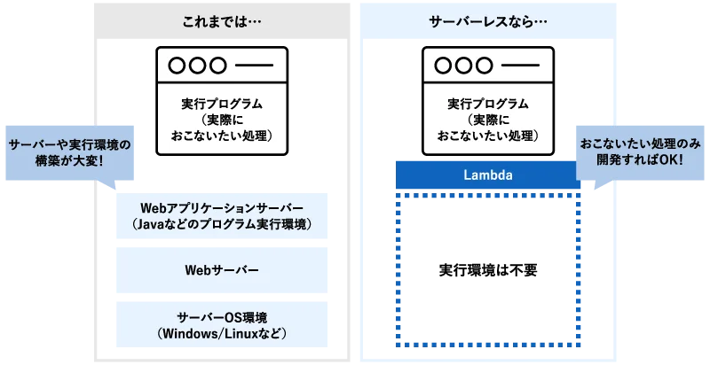
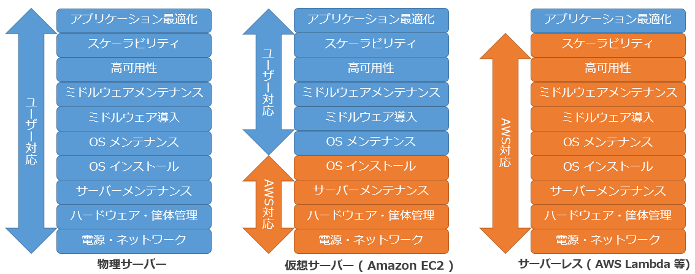

### Lambda とは

- サーバレスのFaaS(Function as a Service) サービス

    - FaaS: FaaSとは「Function as a Service」の略で、サーバレスでアプリケーション開発ができるクラウドサービスのこと

        - 開発者側でのサーバー管理 (必要な環境の構築) が不要になる

- わかりやすくいうと、プログラムコードとそれに関連する依存関係やライブラリを AWS Lambda にアップロードするだけでプラグラムを実行できるサービス

 

引用: [AWS Lambdaってなに？なにができるの？](https://www.stylez.co.jp/aws_columns/cloud-native_development_on_aws_and_serverless/what_is_aws_lambda/)

引用: [「Lambda」ってなにがスゴイんですか？](https://biz.nuro.jp/column/aws-mama-014/)

 

- EC2 にプログラムの実行環境とプログラムコードをおけば同じことが実現できるが、必要なソフトウェアやアプリケーションに必要なライブラリなどの用意はこちらがしなければならない

引用: [サーバーレスとは？](https://blog.serverworks.co.jp/2022/08/05/131624)

 

#### 利用例
- API Gateway と 組み合わせることで、API の実行処理部分を Lambda で行う

- Event Bridge と組み合わせることで、定期的なバッチ処理の実行部分を Lambda で行う

などなど

 
 

参考サイト

[AWS Lambdaってなに？なにができるの？](https://www.stylez.co.jp/aws_columns/cloud-native_development_on_aws_and_serverless/what_is_aws_lambda/)

[「Lambda」ってなにがスゴイんですか？](https://biz.nuro.jp/column/aws-mama-014/)

---

### Lambda の重要なコンセプト

#### ランタイム

- プログラムの実行に必要な環境

 

#### トリガー

- トリガーによって起動された Lambda は event を受け取る
    - event は JSON 形式のオブジェクトで、Lambda 関数内で参照可能

 

#### バージョン

- Lambda はバージョン管理が可能
    - Lambda関数を更新すると新しいバージョンとして管理される
    - 過去のバージョンもの残るので、過去のバージョンを実行することも可能

 

#### エイリアス
- Lambda 関数の特定のバージョンにつける別名
    - 1つのエイリアスは最大で 2つのバージョンにつけることが可能

- エイリアスはいつでも付け替え可能

 

#### レイヤー

- 複数の Lambda 関数 で共通するコードを zip に切り出して共有することができる機能

    - 同じライブラリを利用する Lambda 関数が複数ある場合、そのライブラリをLayerに切り離すことができる

- うまくレイヤーに切り離すことで、Lambda 関数自体のサイズを小さくすることができる

- ★ レイヤーもバージョン管理が可能

---

### 特徴、機能

#### 制約

- 最大実行時間は15分
    - 15分を超えると強制終了となる

---

### コスト

- Lamda を作成しただけでは料金は発生しない

- 実行時間に対して料金が発生する