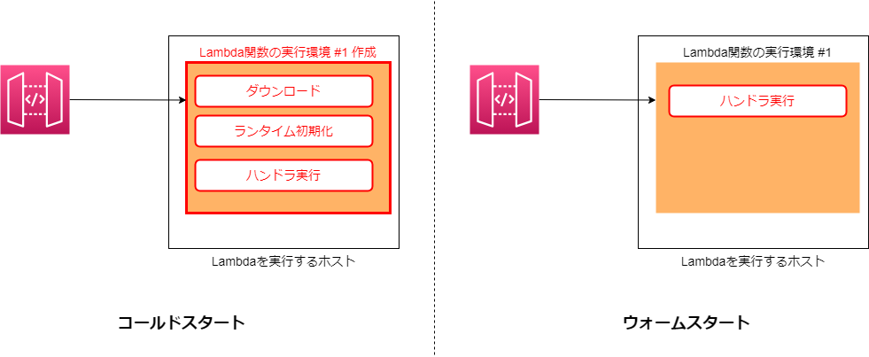
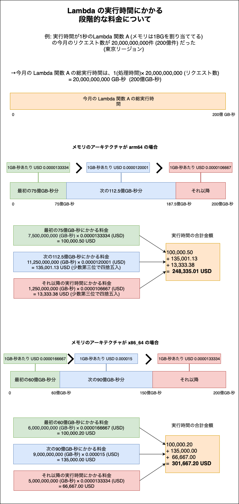

### Lambda とは

- サーバレスのFaaS(Function as a Service) サービス

    - FaaS: FaaSとは「Function as a Service」の略で、サーバレスでアプリケーション開発ができるクラウドサービスのこと

        - 開発者側でのサーバー管理 (必要な環境の構築) が不要になる

- わかりやすくいうと、プログラムコードとそれに関連する依存関係やライブラリを AWS Lambda にアップロードするだけでプラグラムを実行できるサービス

<br>


引用: [AWS Lambdaってなに？なにができるの？](https://www.stylez.co.jp/aws_columns/cloud-native_development_on_aws_and_serverless/what_is_aws_lambda/)


引用: [「Lambda」ってなにがスゴイんですか？](https://biz.nuro.jp/column/aws-mama-014/)

<br>

- EC2 にプログラムの実行環境とプログラムコードをおけば同じことが実現できるが、必要なソフトウェアやアプリケーションに必要なライブラリなどの用意はこちらがしなければならない


引用: [サーバーレスとは？](https://blog.serverworks.co.jp/2022/08/05/131624)


<br>

#### 利用例

- API Gateway と 組み合わせることで、API の実行処理部分を Lambda で行う

- Event Bridge と組み合わせることで、定期的なバッチ処理の実行部分を Lambda で行う

などなど

<br>
<br>

参考サイト

[AWS Lambdaってなに？なにができるの？](https://www.stylez.co.jp/aws_columns/cloud-native_development_on_aws_and_serverless/what_is_aws_lambda/)

[「Lambda」ってなにがスゴイんですか？](https://biz.nuro.jp/column/aws-mama-014/)

---

### Lambda の重要なコンセプト

<br>

#### Lambda 関数

- Lambda にアップロードするプログラムコードのこと

<br>

#### ランタイム

- プログラムコードの実行に必要なライブラリやパッケージのこと

- デフォルトでは、 `Node.js`, `Java`, `Python`, `Ruby`, `.NET` が選択できる
    
    - ★上記以外の言語のプログラムコードを実行したい場合は、`カスタムランタイム`を選択し、そのプログラムコードの実行に必要なものは自分で用意するで実行可能になる

<br>

#### トリガー

- ★ Lambda 関数は EC2 のように常に起動しているのではなく、トリガーによって起動される

- トリガー = Lambda 関数を呼び出すきっかけ (主に AWS サービスでのイベント)

- トリガーによって起動された Lambda は event を受け取る
    - event は JSON 形式のオブジェクトで、Lambda 関数内で参照可能

<br>

#### バージョン

- Lambda はバージョン管理が可能
    - Lambda関数を更新すると新しいバージョンとして管理される
    - 過去のバージョンもの残るので、過去のバージョンを実行することも可能

<br>

#### エイリアス
- Lambda 関数の特定のバージョンにつける別名

    - 1つのエイリアスは最大で 2つのバージョンにつけることが可能

- エイリアスはいつでも付け替え可能

<br>

#### レイヤー

- 複数の Lambda 関数 で共通するコードを zip に切り出して共有することができる機能

    - 同じライブラリを利用する Lambda 関数が複数ある場合、そのライブラリをレイヤーに切り離すことができる

- うまくレイヤーに切り離すことで、Lambda 関数自体のサイズを小さくすることができる

- ★ レイヤーもバージョン管理が可能

<br>

#### extensions

- TODO: extensions について追記する

<br>

#### 同期呼び出し / 非同期呼び出し

- **同期呼び出し**
    - 呼び出し元が Lambda 関数の処理結果を待ち、レスポンスを受け取りとる

- **非同期呼び出し**
    - 呼び出し元はリクエストを送信後、Lambda 関数の処理結果を待たずに後続処理を実行する

    - 内部では、トリガーからのイベントを Event Queue というキューに入れ、　Lambda 関数はそのキューから非同期にイベントを読み込んで処理を実行する    

    

    引用: [【初心者向け】AWS Lambdaの機能と役割について](https://asa3-cloud.com/aws-lambdaの機能と役割について/)


- ★ Lambda 関数の実行方式(同期・非同期)は、トリガーとなる AWS サービスによって異なる
    - 例: Amazon API Gateway がトリガーの場合は同期呼び出し、 Amazon S3 がトリガーの場合は非同期呼び出しとなる

<br>

#### コールドスタート / ウォームスタート



引用: [サーバレス時代の必須技術、AWS Lambdaを知ろう](https://www.itis.nssol.nipponsteel.com/blog/aws-lambda-01.html)

<br>

- **コールドスタート**
    - Lambda 関数の実行前に実行環境の作成やランタイムの初期化、レイヤーにあるライブラリなどのダウンロードが実行される

    - 上記初期化処理の後に Lambda 関数が実行されるため、その分遅れる

- **ウォームスタート**
    - 実行環境が残っている期間内に再び同じ Lambda 関数を呼び出すと、その環境が再利用されることがある
        - 実行環境作成などの初期化処理がいらないためすぐに Lambda 関数の実行ができる = ウォームスタート

        - コールドスタートに比べると、初期化処理などの時間分早く処理が完了する

    - ★実行環境がどのぐらいの期間残るのかを設定することはできない

- ウォームスタートの注意点

    - Lambda 関数の同時実行数によっては、新たにコールドスタートされるものもある

        

        <br>

    - 実行環境が複数残っている場合、同じクライアントが再び同じ Lambda 関数を呼び出したとしても、前回と同じ実行環境が使用されるとは限らない

        - ★ Lambda 関数のコードはステートレスにする必要がある

        

<br>
<br>

参考サイト

同期/非同期呼び出しについて
- [Lambdaの同期・非同期処理の理解](https://zenn.dev/mi_01_24fu/books/d91d10985a5a1a/viewer/lambda_synchronous_asynchronous#前提%3A-lambdaに非同期処理は存在する？)
- [そのLambdaの実行…同期？非同期？](https://qiita.com/is_ryo/items/009220083e179272cbda)

コールド/ウォームスタートについて
- [AWS Lambda 関数の実行の仕組みを知ろう !](https://aws.amazon.com/jp/builders-flash/202308/learn-lambda-function-execution/)
- [サーバレス時代の必須技術、AWS Lambdaを知ろう](https://www.itis.nssol.nipponsteel.com/blog/aws-lambda-01.html)

---

### 特徴、機能

#### 予約済み同時実行 (Reserved Concurrency)

- 対象の Lambda 関数の最大同時実行数をリージョンの最大同時実行数から確保できる機能

    

<br>

- この機能の利用には追加料金は発生しない

<br>

- ★ 予約済み同時実行数を超過する場合、予約されていない同時実行数が余っていてもスロットリングエラーが起きる

    

<br>

#### Provisioned Concurrency (プロビジョニングされた同時実行)

- Lambda 関数の実行環境を事前に作成し、その数を維持する機能

- ★ Reserved Concurrency のように対象関数の同時実行数の上限を設定する機能ではない

- Provisioned Concurrency で事前に作成された同時実行数を超える実行環境が必要になった場合は、コールドスタートが発生する

    

    引用: [AWS Lambda 関数の実行の仕組みを知ろう !](https://aws.amazon.com/jp/builders-flash/202308/learn-lambda-function-execution/)

    <br>

- プロビジョニングされた同時実行数の利用には追加料金がかかる


<br>

#### 関数URL


引用: [AWS Lambda 関数URLを設定しアクセスする方法【基礎】](https://kacfg.com/aws-lambda-function-urls-basic/)

<br>

- API Gateway を利用せずに、Lambda 関数 をHTTP(S) 公開する機能

    = Lambda 関数用の専用 HTTP エンドポイントを提供する機能

- 関数 URL の設定を作成し直すと、異なる URL アドレスで Lambda 関数が公開される

- 関数 URL のメリット
    - 遅延の低減: API Gateway による遅延がなくなる

    - コストの削減: API Gateway の利用コストを削減できる

    - タイムアウト上限: API Gateway を利用するとタイムアウト上限が 29秒 なのに対し、関数 URL を利用するケースではタイムアウト上限は 15 分

- API Gateway のメリット
    - 独自ドメイン名で Lambda 関数を HTTP 公開することが可能

    - [WAF](./WAF.md) を利用できる

    - IAM 認証以外の認証方法を利用可能

<br>

#### コード署名

- Lambda にコードがアップロードされた際にそのコードに署名の検証を行う機能

- 署名が行われていないコードがアップロードされた時に警告だけで済ますか、アップロードを失敗にするかの設定可能

- コードの署名には AWS Signer というサービスを使う
    - AWS Signer での署名には利用料金が発生しない

- コード署名機能の利用には料金は発生しない

<br>

#### 制約

- 最大実行時間は15分
    - 15分を超えると強制終了となる

- 最大同時実行数はリージョン単位で 1000
    - ★ **そのリージョンの全ての Lmbda 関数合わせた**同時実行数上限が 1000

    - サービスクォータの引き上げを申請すれば同時実行数を増やすことができる

    - [予約された同時実行数](#予約済み同時実行-reserved-concurrency) に設定できる最大値は、`そのリージョンの最大同時実行数 - 100` まで

    - 最大同時実行数以上の呼び出しはスロットリング (サービスが制限されること) され、実行されない

- 割り当てることのできるメモリの最大サイズは　10,240 MB (≒ 10GB)

- 割り当てることのできるストレージの最大サイズは 10,240 MB (≒ 10GB)


<br>
<br>

参考サイト

予約済み同時実行について
- [Lambdaを助けるのに理由がいるかい？（スロットリングの話）](https://kakehashi-dev.hatenablog.com/entry/2022/12/19/110000)

関数 URL について
- [【AWS】LambdaをHTTP接続する2つの方法（①API Gateway + Lambda, ②Lambda Function URLs)](https://ramble.impl.co.jp/2507/)
- [API Gateway不要!? Lambda関数URLでのAPI構築について考える](https://it.kensan.net/lambdafunctionurl-api-gateway.html)
- [AWS Lambda Function URLsとAmazon API Gatewayの違い](https://serverless.co.jp/blog/j94zz_4-m/)

コード署名について
- [[アップデート]信頼できる検証済みコード以外はデプロイ禁止！！Lambdaでコード署名による検証が利用可能になりました](https://dev.classmethod.jp/articles/lambda-support-verify-code-sign/)
- [[アップデート]AWS LambdaでAWS Signerを利用してコードの署名ができるようになったので試してみた](https://dev.classmethod.jp/articles/code-signing-for-aws-lambda/)
- [AWS SignerとLambdaによるコード検証](https://qiita.com/uirole/items/0f468add6b36a8732b25)
- [AWS Signerでコード署名についてまとめてみた](https://speakerdeck.com/atsuw0/aws-signertekotoshu-ming-nituitematometemita)

---

### コスト

- Lamda を作成しただけでは料金は発生しない

- 主に実行時間に対して料金が発生する
    - その他にも、リクエスト数やストレージなどにも料金が発生する

- 利用するリージョンによって金額が異なる

<br>

#### GB-秒　という単位について

- Lambda 関数に割り当てたメモリの容量(1GBとの比率) と Lambda 関数の実行時間の積

    ```
    4GB (4096 MB) のメモリを割り当てた Lambda 関数の今月の実行時間は20,000秒だった

    Q: 上記のケースは何GB-秒となるか?

    A: 4096 / 1024 (メモリ) × 20,000 (実行時間) = 80,000 GB-秒
    ```

- Lambda の実行時間にかかる料金やストレージ使用料は GB-秒 という単位で計算されることが多い

<br>

#### 基本コスト

- **実行時間分の料金**

    - Lambda 関数に割り当てるメモリの大きさによって実行時間にかかる料金も変化する

        - メモリを増量すればするほど実行時間に応じた料金は高くなる

        - ★ 一方で大きいメモリを割り当てると処理時間が短くなる = 実行時間が短くなるので、料金が安くなることもある

            - →メモリの大きさと実行時間のバランスを見つけることがコスト削減に繋がる

    <br>

    - メモリの種類によって実行時間の料金が違ってくる

        - `arm64` or `x86_64` が選択可能

        - arm64 の方がパフォーマンスも高く料金も安いので基本的には arm64 を選んで問題ない

    <br>

    - 無料利用枠として、毎月40万GB-秒の実行時間分の料金は無料になる

        - = 1GB のメモリを割り当てた Lambda 関数を 40万秒 (約111時間) までは無料で利用できる

            - = 512 MB のメモリを割り当てた Lambda 関数を 80万秒 (約222時間) までは無料で利用できる

            - = 2GB のメモリを割り当てた Lambda 関数を20万秒 (約55時間) までは無料で利用できる

    <br>

    - 1ヶ月の総実行時間が長ければ長いほど、実行時間にかかる料金は段階的に安くなる

        
<br>

- **リクエスト数に対する料金**

    - 100万リクエストあたり USD \~~ の料金形態

    - 無料利用枠として、毎月100万リクエストは無料になる

<br>

- **ストレージの料金**

    - Lambda 関数実行時にはデフォルトで 512 MB のストレージが割り当てられる

    - 512 MB 分のストレージは無料で利用可能

    - ストレージに 512 MB 以上割り当てた場合は、512 MB を超えた分だけ課金対象となる

        - `リージョンごとGB-秒あたりのストレージ料金` × `実行時間(GB-秒)` × `512 MB以上で超えたぶんのストレージ`

<br>

#### 追加機能のコスト

- **Provisioned Concurrency**

    - ★ Lambda の無料利用枠 (実行時間,リクエスト数,ストレージ) は Provisioned Cncurrency が有効になっている Lambda 関数には適用されない

    - ★ 通常の Lambda 関数は待機時間に料金は発生しないが、 Provisioned Concurrency を利用すると待機時間にも料金が発生する

    - Provisioned Concucrrency を有効にした Lambda 関数の実行時間に対して発生する料金は通常の Lambda 関数の実行時間に対して発生する料金と金額が異なる

        - Provisioned Concurrency を有効にした Lambda 関数の実行時間料金の方が安い

        - しかし、 Provisioned Concurrency を有効にした場合、待機時間に対しての料金も発生するので、Provisioned Concurrency の方が高くなるケースが多い

    - `実行時間(GB-秒)` × `1GB-秒あたりの実行時間料金` ＋ `待機時間(GB-秒)` × `1GB-秒あたりの対時間料金`
        - その他に通常のLambda関数と同様にリクエスト数、ストレージの料金が発生する
<br>

- **関数 URLs**

<br>

#### 練習問題

<br>
<br>

参考サイト

[AWS Lambda 料金](https://aws.amazon.com/jp/lambda/pricing/)

[Lambdaの利用料金を整理したい](https://zenn.dev/shimo_s3/articles/0263536627e377)

[AWS Lambda が段階的な価格設定を発表](https://aws.amazon.com/jp/about-aws/whats-new/2022/08/aws-lambda-tiered-pricing/)

[【AWS Lambda】AWS Lambda Power Tuningでコストを1円でも安く](https://blog.serverworks.co.jp/lambda-powertuning)