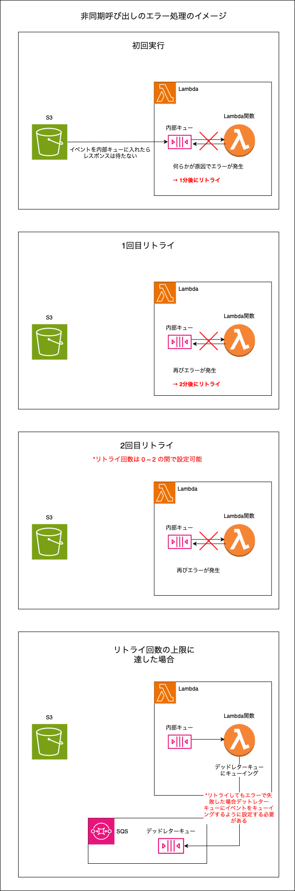

### Lambda 関数の呼び出し方

Lambda 関数の呼び出し方として以下の3つの方法がある

#### 1. 同期実行


<br>

- API Gateway, [Elastic Load Balancer](./LoadBalancer.md), Step Functions などのサービスがトリガーの場合、Lambda 関数は同期実行で呼び出される

- Lambda コンソール画面からの実行は常に同期呼び出し

- CLI, SDK から直接 Lambda 関数を呼び出す場合、呼び出し API の InvocationType リクエストパラメータに `RequestResponse` を設定することで同期呼び出しになる

- ★同期呼び出しで Lambda 関数にてエラーが発生した場合、**自動でリトライされることはない**

    - 同期呼び出しでエラーが発生した場合、以下のような処理でエラーをハンドリングする

        - エラーが発生した場合、呼び出し元に適切なエラーメッセージを返す

        - CloudWatchLogs で Lambda 関数の処理結果を監視し(サブスクリプションフィルター)、エラーのログがある場合、SNSなどで通知を送る

    

<br>

#### 2. 非同期実行


<br>

- S3, SNS, CloudFormation などのサービスがトリガーの場合、 Lambda 関数は非同期実行で呼び出される

- CLI, SDK から直接 Lambda 関数を呼び出す場合、呼び出し API の InvocationType リクエストパラメータに `Event` を設定することで非同期呼び出しになる

<br>



<br>

- ★非同期呼び出しで Lambda 関数にてエラーが発生した場合、**自動でリトライが行われる**

    - リトライ回数は 0 ~ 2 の間で設定可能

    - 内部キューにイベントを保持する期間を設定可能

    - リトライ回数の上限に達した場合、デッドレターキューにイベントを送信することで、問題のあったイベントを後から確認することができる    

<br>

#### 3. イベントソースマッピング (ストリーム / キュー)


<br>

- AWS EFS, [DynamoDB Stream](./DynamoDB_Stream.md), Amazon Kinesis, SQS などのサービス (キューやストリーム) がトリガーの場合、 Lambda 関数はイベントソースマッピングで呼び出される

    - キューやストリーム内のデータ (レコード) をまとめてバッチ処理したい場合に利用する

        - イベントソースマッピングは、Lambda が関数に送信する単一のペイロードにレコードをまとめてバッチ処理する

        - イベントソースマッピングでのバッチ処理のタイミングについて少しはカスタマイズできる (詳しくは[こちら](#バッチ処理のカスタマイズ)を参照)

<br>

- ★イベントソースマッピング Lambda 関数にてエラーが発生した場合、**自動でリトライが行われる**

    - 基本的にはストリーム / キューにレコードが残っている限りリトライが行われる

        - リトライの試行回数上限も設定できるっぽい

    - リトライの影響を受けるシャードは他の処理を一時停止する (シャードについては[こちら](./DynamoDB_Stream.md#詳しい仕組み)を参照)

    - イベントソースがキューの場合の Lambda 関数のリトライの間隔はイベントソース側の**可視性タイムアウト**で設定することができる

    - TODO: イベントソースがストリームの場合のリトライの間隔を調べる


<br>

- **非同期呼び出しとイベントソースマッピングの違い**

    - 非同期呼び出し

        - トリガーからイベントは Lambda の内部キューに格納される

        - 内部キューにイベントが送信されると、すぐに Lambda 関数が非同期で実行される

    <br>

    - イベントソースマッピング

        - ストリームやキューのサービスからのレコード (イベント?) は、そのサービス内部のキューに格納される (Lambda の内部キューでないことに注意)

        - ストリームやキューにレコードが追加されると Lambda 関数が実行される

            - [バッチウィンドウやバッチサイズ](#バッチ処理のカスタマイズ)の設定によっては、ストリームやキューのレコードがある程度貯まるまで待ってから Lambda 関数 (バッチ処理) を実行するように設定できる

<br>
<br>

参考サイト

同期実行時のエラーハンドリングについて
- [Lambdaの例外エラーの通知方法を考える](https://blog.nightonly.com/2022/05/28/lambdaの例外エラーの通知方法を考える/)
- [【Terraformハンズオン】同期呼び出しのLambda関数をデプロイしてみよう](https://envader.plus/article/466#Lambdaにおける同期呼び出しと非同期呼び出し)

イベントソースマッピングについて
- [[レポート] AWS Lambda and Apache Kafka for real-time data processing applications #SVS321](https://dev.classmethod.jp/articles/session-report-for-aws-lambda-and-apache-kafka-for-realtime/)

---

### バッチ処理のタイミングのカスタマイズ

- イベントソースマッピングの Lambda 関数の**処理開始のタイミング**は以下の3つの設定によってカスタマイズできる

- 以下の3つのうちどれか1つでも当てはまれば Lambda 関数が開始される

#### 1. バッチウィンドウ (MaximumBatchingWindowInSeconds)

- ストリーム / キュー にレコードが追加されてから Lambda 関数が実行するまでの**待ち時間**

    ```
    例: バッチウィンドウに0を設定した場合

    → ストリーム / キューにレコードが追加されると、すぐにイベントソースマッピングの Lambda 関数を実行する


    例: バッチウィンドウに5秒を設定した場合

    → ストリーム / キューにレコードが追加されてから5秒後にイベントソースマッピングの Lambda 関数を実行する
    ```


<br>    

#### 2. バッチサイズ (BatchSize)

- ストリーム / キュー に追加されるレコードの数

    - ★バッチサイズに指定した数のレコードが ストリーム / キューに貯まった場合、 イベントーソースマッピングの Lambda 関数が実行される

<br>

#### 3. ペイロードサイズ上限

- ここでのペイロードの意味

    - ストリーム / キューのレコードを1つにまとめたサイズ = イベントソースマッピングの Lambda 関数に送られるデータのサイズのようなもの

- ペイロードサイズが 6MB に達すると　イベントソースマッピングの Lambda 関数が実行される

- ペイロードサイズの上限は変更できない


<br>
<br>

参考サイト

[Lambda がストリームおよびキューベースのイベントソースからのレコードを処理する方法](https://docs.aws.amazon.com/ja_jp/lambda/latest/dg/invocation-eventsourcemapping.html)

---

### Destinations (送信先)

- **非同期実行される** Lambda 関数の結果によって実行される後続処理を指定する機能

    - 同期実行の Lambda 関数にて Destinations の指定はできないことに注意

<br>

- 現在(2024/12/5)のところ Destinations に指定できるサービスは以下の通り [by公式](https://docs.aws.amazon.com/ja_jp/lambda/latest/dg/invocation-async-retain-records.html)

    - SQS
        - 標準キューのみ指定可能
    - SNS
    - Lambda
    - EventBridge