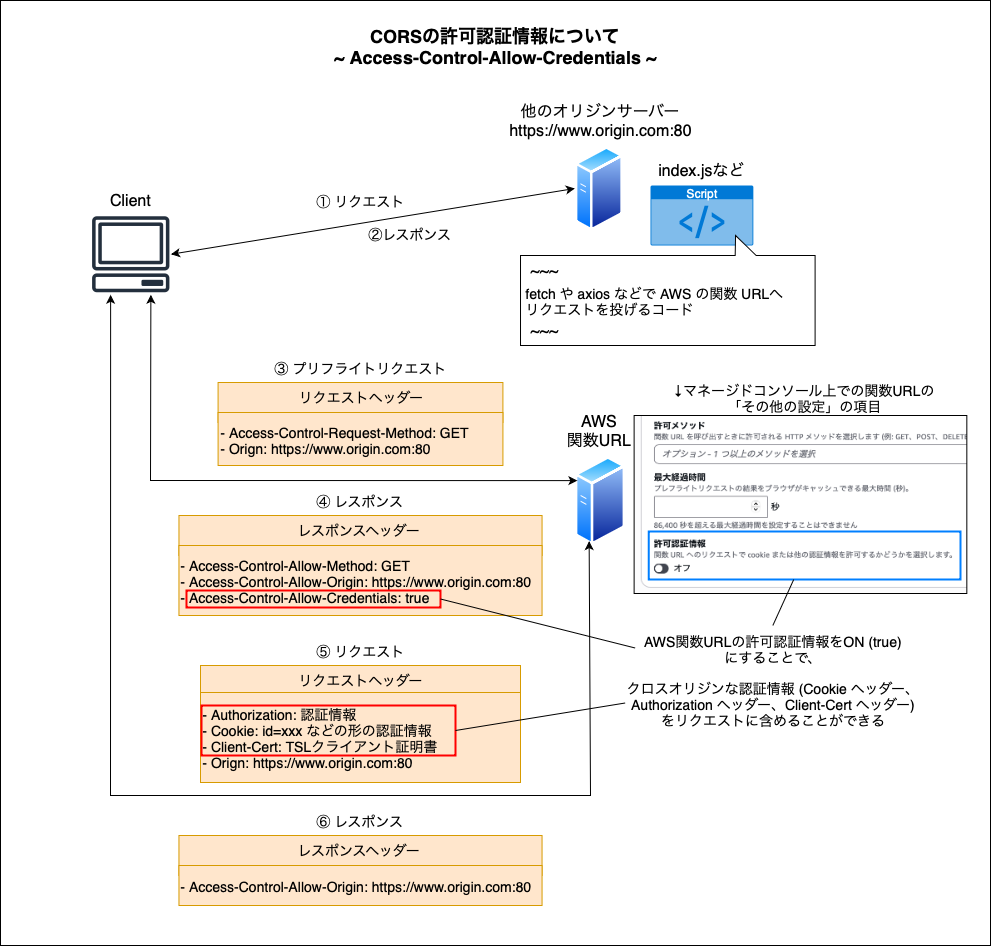

### 関数 URL の作成 (マネージドコンソール上)

- 関数 URL については[こちら](./Lambda.md#関数url)を参照

 

- #### Lambda 関数の作成と同時に関数 URL も有効にしたい場合

    - `1から作成` or `コンテナイメージから作成` の場合は、作成時から関数 URL を有効にすることができる

        

 

-  #### `設計図の使用` を選択して Lambda 関数を作成した場合、もしくは作成後に関数 URL を有効にしたい場合

    - 関数を選択し、`設定` → `関数URL` → `関数URLを作成 `をクリック

        

---

### 関数 URL の設定項目

 

- 認証タイプ

    - AWS_IAM

        - IAM ユーザー or ロールの認証情報があるリクエストのみ関数 URL を呼び出せるようにする
    
     

    - NONE

        - (非AWSユーザー含めて) どのユーザーからも関数 URL を呼び出せるようにする

            

 

- 呼び出しモード

    - BUFFERED

        - 通常のレスポンス方法: 完全なレスポンスを生成してバッファリングしてからクライアントに返す = レスポンスのデータが完全に用意できてからレスポンスを返す
    
     

    - RESPONSE_STREAM (別途料金が発生する)

        - レスポンスデータが利用可能になった時点、その都度呼び出し元にレスポンスを返す

 

- CORS

    

     

    - 許可オリジン

        - 特定の[オリジン](https://github.com/MasaGt/CS/blob/main/CORS.md)からの許可を設定する

        - 全てのオリジンからのアクセスを許可したい場合は `ワイルドカード (*)` を設定

     

    - 公開ヘッダー

        - オリジンが関数 URL レスポンスから取得できる HTTP ヘッダーを選択する

     

    - 許可ヘッダー

        - オリジンが関数 URL へのリクエストに含めることができる HTTP ヘッダーを選択する

     

    - 許可メソッド

        - オリジンが関数 URL にリクエストできるメソッドの種類を選択する

     

    - 最大経過時間

        - プリフライトリクエストの結果をキャッシュする最大時間 (秒)

            - プリフライトリクエストとは: オリジンからのリクエストがサーバー (関数URL) に受け入れられるかどうかを事前に確認 (リクエスト) するプロセスのこと

     

    - 許可認証情報

        - クレデンシャル（資格情報：Cookie・Authorization ヘッダー・TLS クライアント証明書など）を含んだクロスオリジンリクエストを許可するかどうか

            

             

        - セキュリティ上の理由で、無闇に true にするのは危険

        - 詳しくは[こちら](https://github.com/MasaGt/CS/blob/460ff8e4a2950b60b5dc1d8f9ef2341b20846570/CORS.md#%E8%AA%8D%E8%A8%BC%E6%83%85%E5%A0%B1%E3%82%92%E5%90%AB%E3%82%80%E3%83%AA%E3%82%AF%E3%82%A8%E3%82%B9%E3%83%88)を参照

 
 

参考サイト

[AWS Lambda レスポンスストリーミングの紹介](https://aws.amazon.com/jp/blogs/news/introducing-aws-lambda-response-streaming/)

[CORSを絶対に理解する](https://zenn.dev/syo_yamamoto/articles/445ce152f05b02#資格情報を含むリクエストについて)