### 3つの作成方法

1. [1から作成](#1から作成)

    - 1からプラグラムコードを書いて Lambda 関数を作成する方法

 

2. [設計図の使用](#設計図の使用)

    - AWS が用意しているサンプルプログラムをもとに Lambda 関数を作成する方法

 

3. [コンテナイメージ](#コンテナイメージ)

    - プラグラムコードが含まれているコンテナイメージから Lambda 関数を作成する方法

    - Amazon ECR というコンテナレジストリサービスを利用する必要がある
        - 作成したコンテナイメージを ECR にプッシュし、　Lambda をコンテナイメージから作成する場合は、 ECR に登録されているコンテナから選択する

---

### 1から作成

- 以下の項目を設定する必要がある

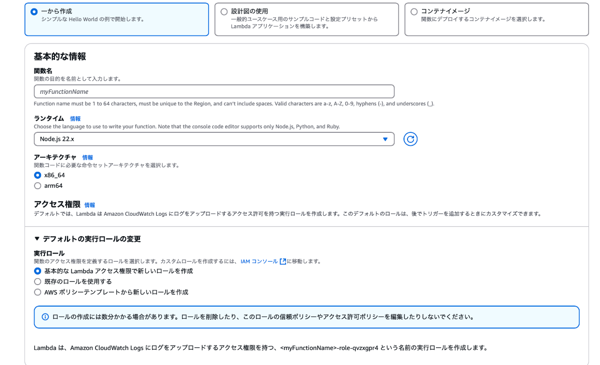

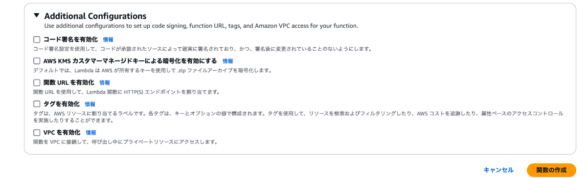

#### 基本的な情報

- 関数名
    - 作成する Lambda 関数の名前

 

- ランタイム    
    - プログラムコードの言語
    - カスタムランタイムの場合は  `Amazon Linux` を選択

 

- アーキテクチャ
    - CPU のアーキテクチャを `arm64` か `x86_64` から選択

 

#### アクセス権限

- 実行ロール

    - Lambda 関数に付与するアクセス権(IAM ロール) とは

        - Lambda 関数で Dynamo や RDS にアクセスする場合それらへのアクセス権を関数に付与する必要がある

        - 以下の3種類から選択することができる

    - `基本的な Lambda アクセス権限で新しいロールを作成
`
        - Lambda 関数作成時に IAM ロール (AWS 側で用意した) も作成する方法

            - *AWS CloudWatch Logs への権限しか用意されていないので、それ以外のリソースにアクセスしたい場合は自分でアクセス権を後から追加する必要があることに注意

    - `既存のロールを作成する`

        - 既存の IAM ロールを割り当てる方法

    - `AWS ポリシーテンプレートから新しいロールを作成`

        - 自分でポリシーを選択して新しい IAM ロールを作成する方法

 

#### Additional Configurations

- コード署名を有効化

    - [コード署名機能](./Lambda.md#コード署名)を有効にするかどうか

 

- AWS KMS カスタマーマネージドキーによる暗号化を有効にする
    - 「ユーザーが KMS で作成した」 or 「外部で作成して KMS にインポートした」 暗号化キーで zip ファイルを暗号化するかどうか

    - チェックを入れないと、AWS KMS マネージドキーで暗号化される

    - 詳しくは[こちら](#lambda-の暗号化について)を参照

 

- 関数 URL を有効化
    - [関数URL機能](./Lambda.md#関数url)を有効にするかどうか

 

- タグを有効化

    - Lambda 関数にタグをつけるかどうか

 

- VPC を有効化

    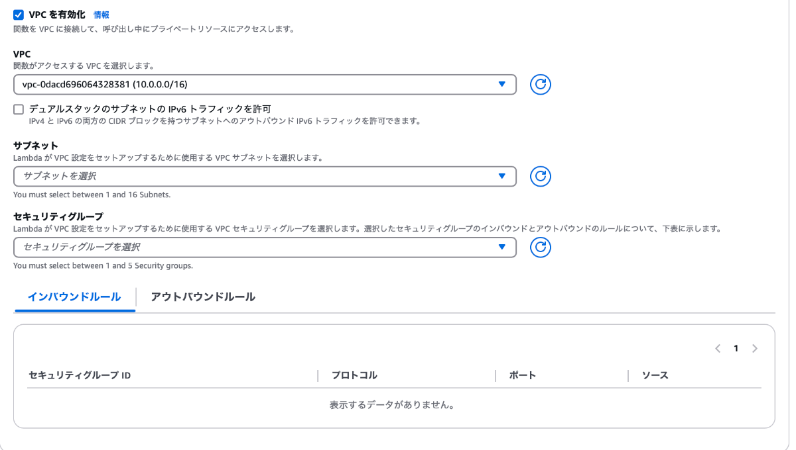

     

    - 有効にするとプライベートサブネットにあるリソースにアクセスできるようになる

    - 有効にすると Lambda 関数を VPC の内の選択したサブネットに配置する

    - Lambda 関数にセキュリティグループを設定する必要がある

    - 利用例: プライベートサブネットに配置した RDS にアクセスする Lambda 関数 を作成する場合に VPC を有効化にする必要がある

 
 

参考サイト

[AWS LambdaをVPC内に配置する際の注意点](https://devlog.arksystems.co.jp/2018/04/04/4807/#)

---

### 設計図の使用

- *ランタイムやCPUのアーキテクチャーは**作成時には**テンプレートが用意しているものから変更できない

    - Lambda 関数作成後ならば変更は可能

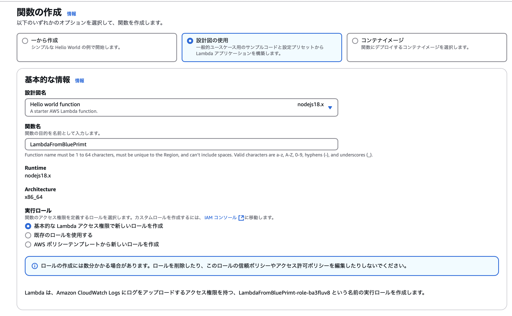

 

- また、プログラムコードも作成時は変更できないため、作成後に目的に応じて編集する必要がある

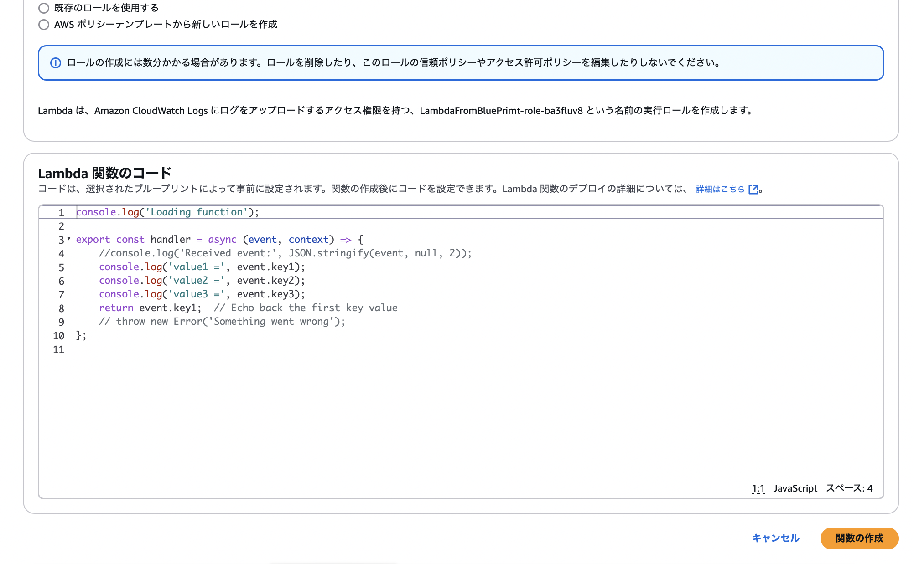

---

### コンテナイメージ

- Amazon ECR に事前にコンテナイメージをプッシュしておく必要がある

    - 上記以外は[1から作成](#1から作成)の設定に似ている

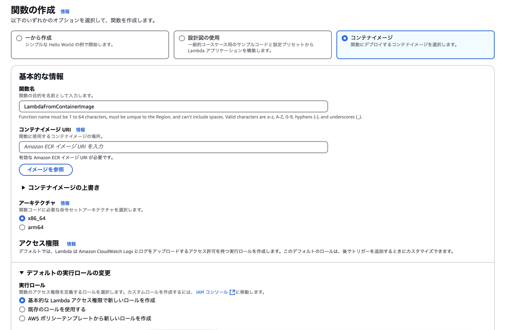
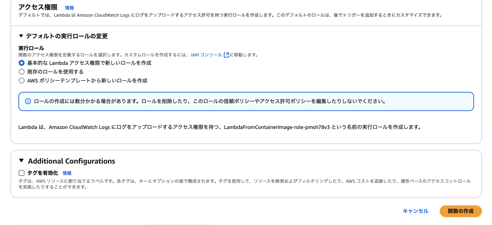

---

### 作成した Lambda 関数の確認 ~その１~

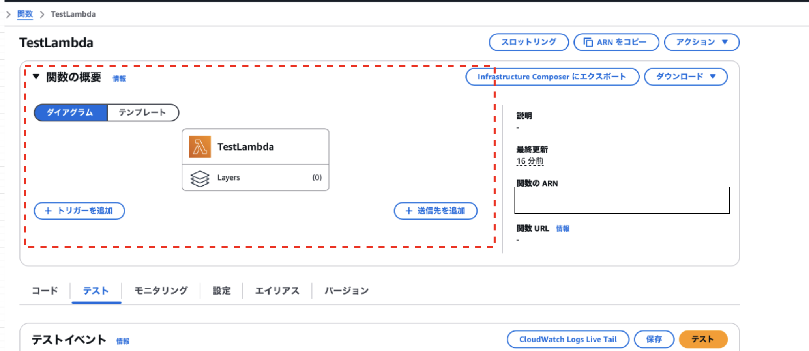

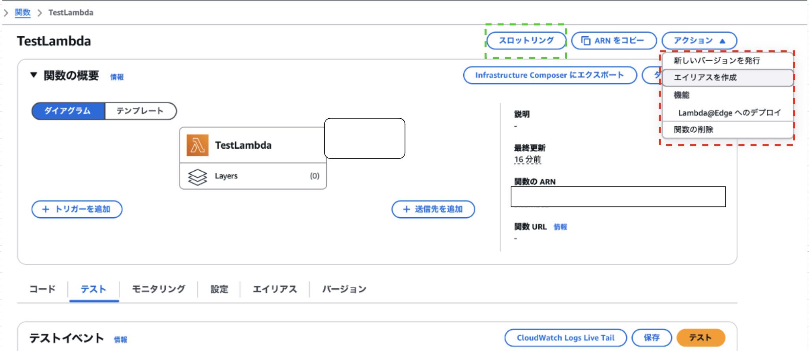

 

- 関数の概要
    - Lambda 関数のトリガー、レイヤー、ターゲット先が確認できる

- スロットリング
    - Lambda 関数の[予約済み同時実行数](./Lambda.md#予約済み同時実行-reserved-concurrency)を0にし、関数実行時にスロットリングエラーを発生させるように設定できる機能

- アクション
    - Lambda 関数の新しいバージョンを作成したり、エイリアスをつけたり、Lambda 関数の削除を行うことができる

 

 

- ダウンロード

    - プログラムコードや SAM ファイルのダウンロードができる

    - *SAMファイルとは

        - Serverless Application Model の略

        - ファイル形式は YAML (JSON も OK)

        - Lambda 関数の定義 (ランタイムや IAM ロール、メモリなどの設定) が記述されている

        - 利用例: ダウンロードした SAM ファイルとプログラムコードから他のリージョンに同じ構成の Lambda 関数を作成することができるようになる
    
 
 

参考サイト

SAM ファイルについて

- [AWS SAM ファイルを使用して Lambda 関数を別の AWS アカウントまたはリージョンに移行する方法を教えてください。](https://repost.aws/ja/knowledge-center/lambda-function-migration-aws-sam)

--- 

### 作成した Lambda 関数の確認 ~その2~

 

以下の項目を確認できる

1. コード

    - プログラムファイルの編集や新しくプログラムファイルのアップロードができる

    - [ランタイム](./Lambda.md#ランタイム)や[レイヤー](./Lambda.md#レイヤー)の編集もここで可能

    - プログラムのテストも可能

 

2. テスト

    - Lambda 関数のトリガーとなるテストイベントを作成することができる

    - プログラムコードのテスト実行も可能

 

3. モニタリング

    - Lambda 関数に関するメトリクスが表示される

        - 呼び出し回数や実行時間など

 

4. 設定

    - Lambda 関数に関する様々な設定を編集できる

        - 割り当てるメモリやストレージの変更

        - トリガー、送信先の編集、追加、削除

        - Lambda 関数に付与する IAM ロールの編集
        
        - 関数 URL の作成
            - エンドポイントが作成される

        - 環境変数の編集

        - [予約済み同時実行](./Lambda.md#予約済み同時実行-reserved-concurrency)の数の設定

        - 非同期呼び出しでエラーになった場合の挙動の設定

        - コード署名やVPCの有効化などなど

 

5. エイリアス

    - Lambda 関数の特定のバージョンに付与されているエイリアスの確認、新規作成、編集、削除が行える

 

6. バージョン

    - Lambda 関数にバージョンの発行、編集、削除が行える機能

---

### トリガーの追加

- 対象の Lambda 関数の詳細ページにて、上部の `トリガーの追加` もしくは設定タブのサイドメニューからトリガーを選択し、 `トリガーの追加` をクリック

    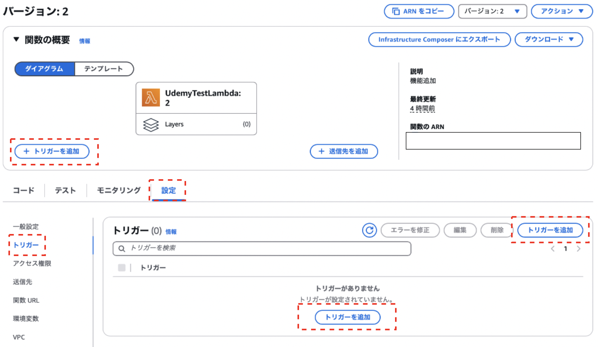

 

- トリガーとして様々な AWS サービスや外部サービスなどを選択することができる

    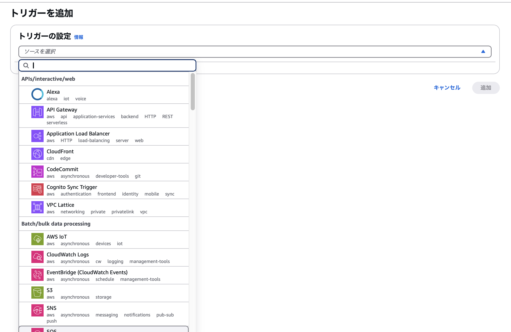

 

- *トリガーに設定するサービスによって設定項目が異なることに注意

    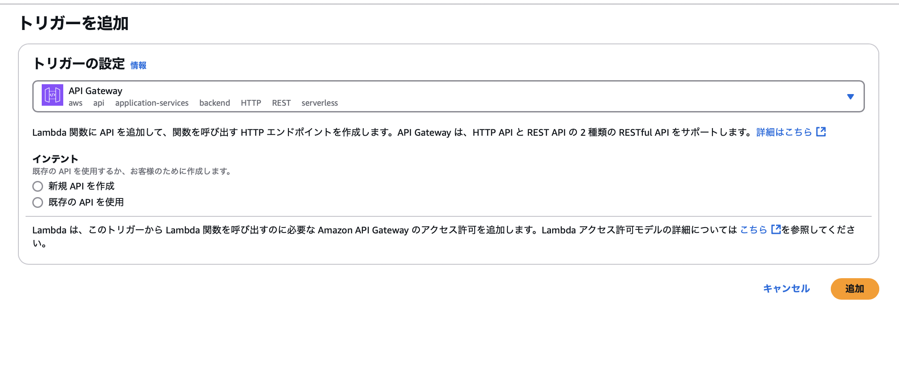
    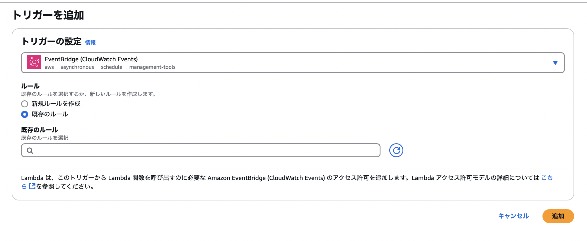
    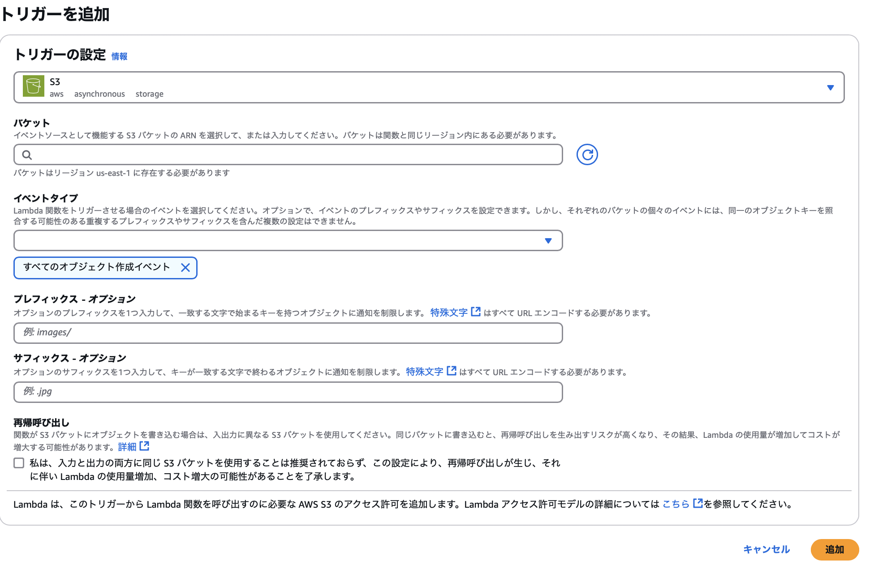

 

- トリガーとなるサービスの選択および項目の設定が完了したら `追加` をクリックする

- 追加されると、 Lambda 関数詳細画面上部にトリガーとなるサービスが表示される

    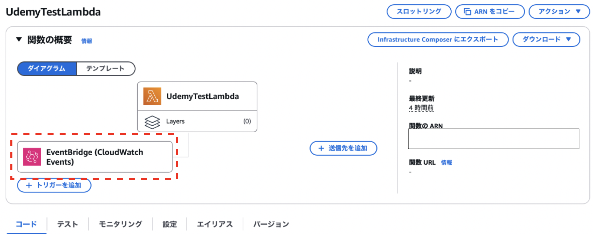

---

### 送信先の追加

- 送信先とは、当 Lambda 関数の実行完了がトリガーになり起動する AWS サービスのこと

- 詳しくは[こちら](./Lambda_2.md#destinations-送信先)を参照

- 対象の Lambda 関数の詳細ページにて、上部の `送信先を追加` もしくは設定タブのサイドメニューから送信先を選択し、 `送信先を追加` をクリック

    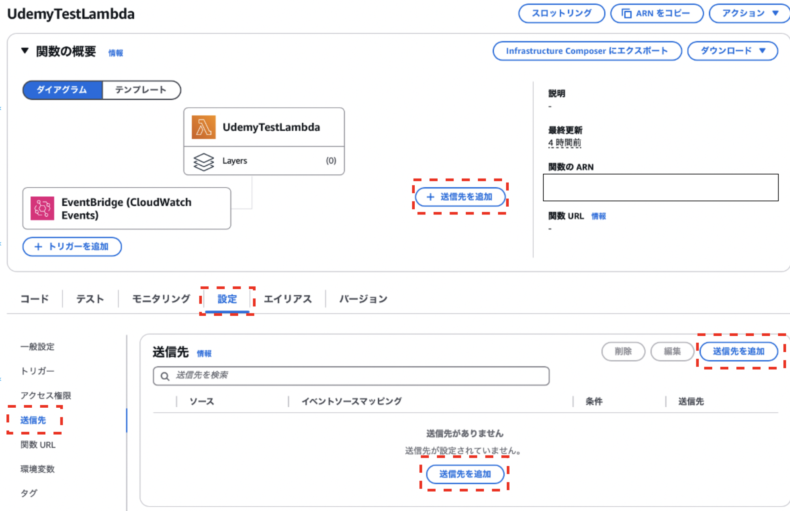

 

- 以下の設定項目を入力する必要がある

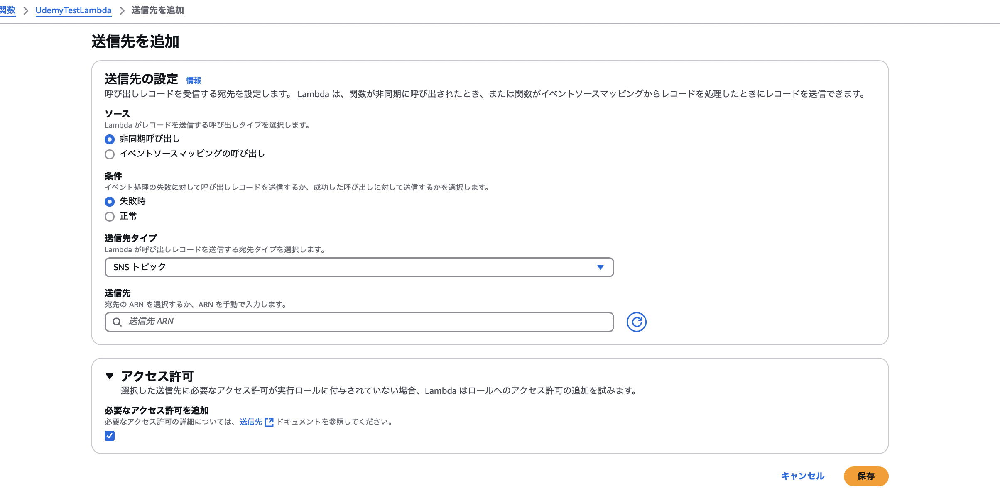

 

- ソース: 当 Lambda 関数を呼び出すトリガーおよびイベントソース

    - 非同期呼び出し: 成功時と失敗時のそれぞれで別の後続送信先を設定可能

        

     

    - イベントソースマッピングの呼び出し: 失敗時の後続送信先のみ設定可能
        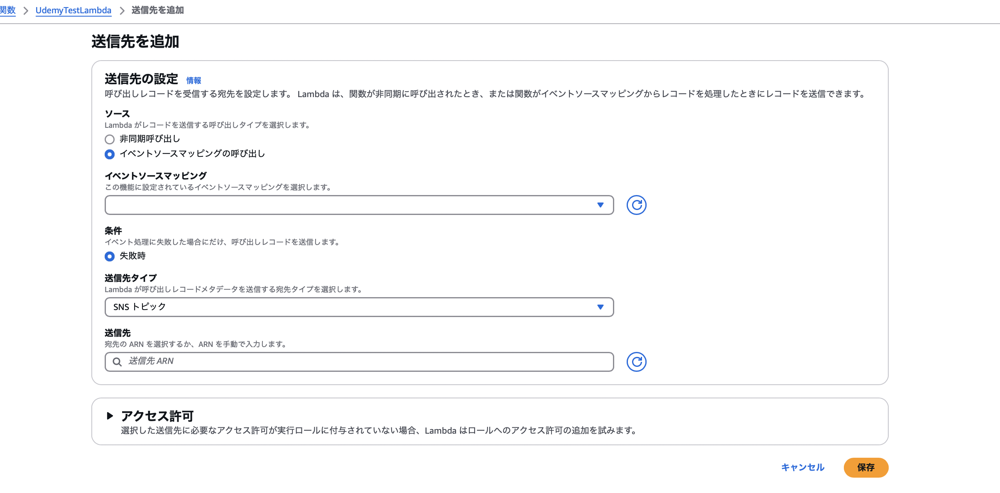

 

- 条件
    - 送信先をトリガーする際の条件 (lambda 関数の成功時か失敗時を条件に後続サービスを呼び出す)

 

- 送信先タイプ

    - Lambda 関数の処理完了をトリガーにして動く後続処理のサービスの種類

 

- 送信先

    - Lambda 関数の処理完了をトリガーにして動く後続処理のサービスの ARN

 

- アクセス許可

    - 送信先へのアクセスに必要なパーミッション(ポリシー)を自動で当 Lambda 関数に付与するかどうか

 
 

参考サイト

[[小ネタ]Lambdaのトリガーと送信先で障害時の送信先を同じSNSに設定した場合の挙動を確認する](https://dev.classmethod.jp/articles/setting-same-sns-in-lambda-destination-and-trigger/)

---

### バージョンの発行

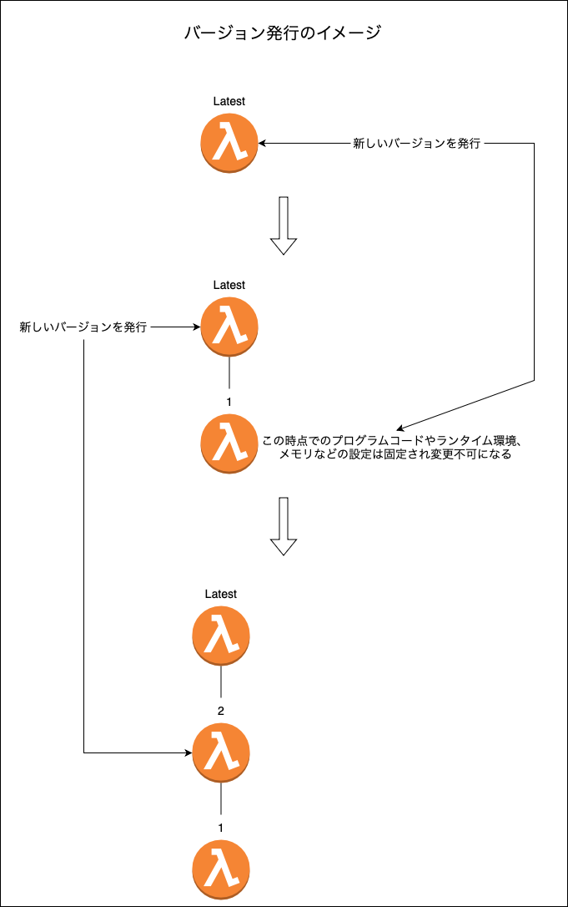

 

#### バージョンの発行方法

- 対象の Lambad 関数のバージョンタブにて `新しいバージョンを発行` をクリック

    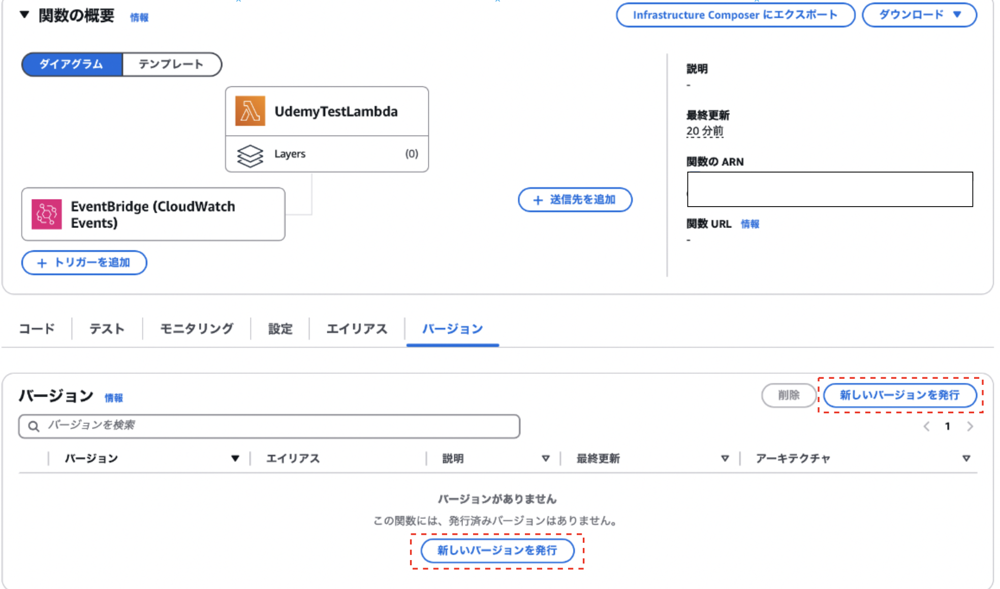

 

- 発行するバージョンに対する説明を付与して (任意) `発行`ボタンをクリック

    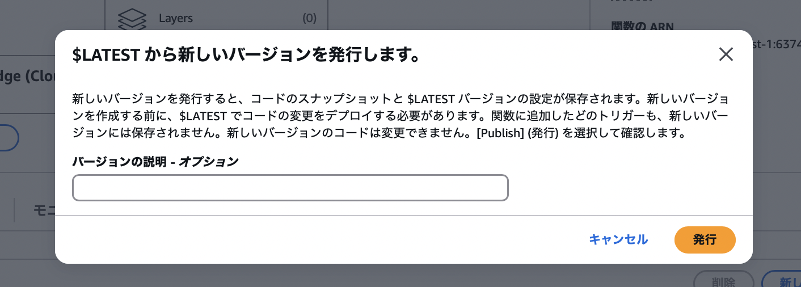

 

- バージョンを発行すると、そのバージョンへの ARN の末尾に `:[バージョン]` がつく

    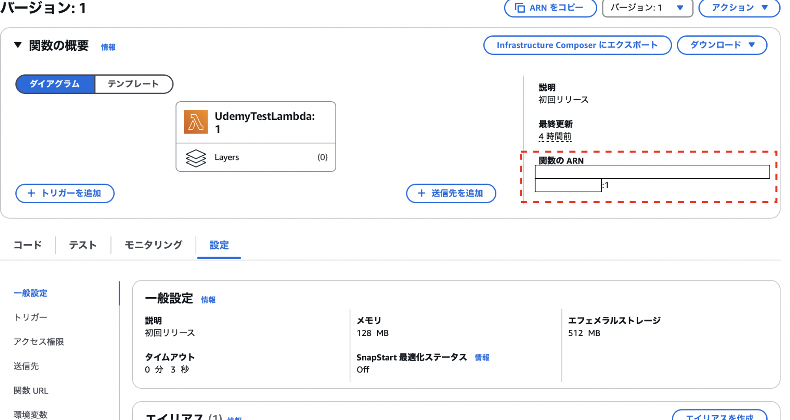

 
 

参考サイト

バージョンについて
- [AWS Lambdaバージョン管理のススメ](https://qiita.com/quotto/items/4c364074edc69cb67d70)

---

### エイリアスの付与

- 特定のバージョンに対して別名をつけることができる機能

#### エイリアス付与の方法

- 対象の Lambad 関数のエイリアスタブにて `エイリアスを作成` をクリック

    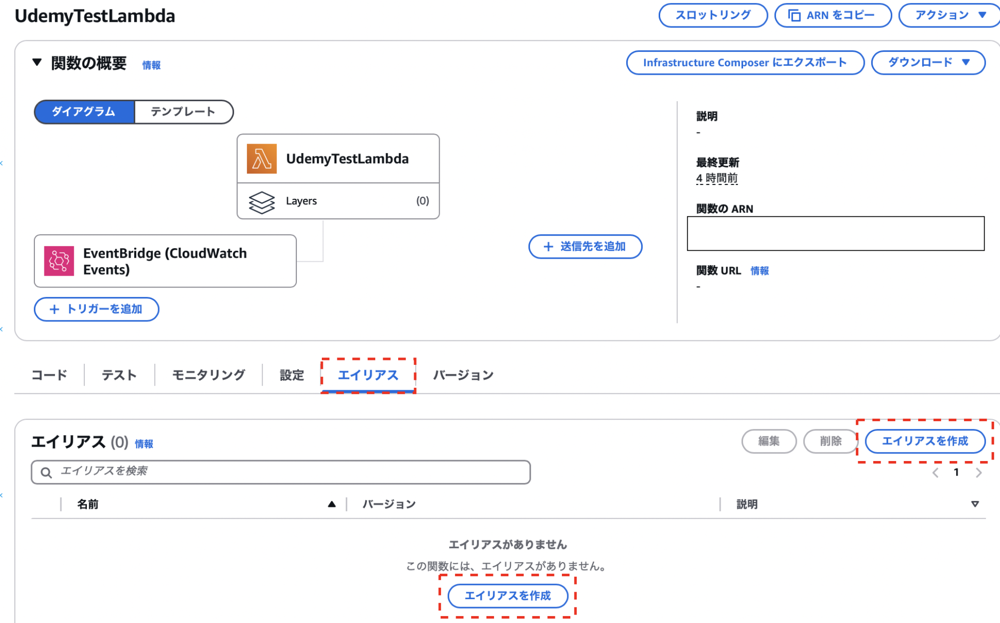

 

- 以下の項目を設定し、 `発行` ボタンをクリック

    - 名前: エイリアス

    - 説明: 作成するエイリアスに対する説明

    - バージョン: エイリアスの対象となるバージョン

    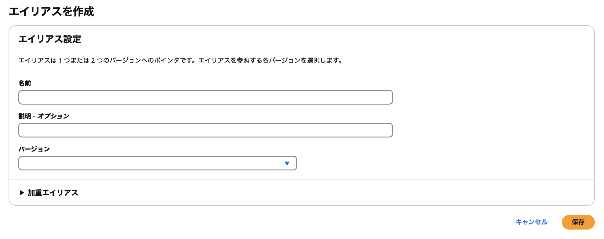

     

    - 加重エイリアスとは?

        - 2つのバージョンに対して重み付けを設定するエイリアスの付け方

            - 各バージョンに対して設定した割合でアクセスを分散させることができる

        - *以下はprod2 というエイリアスにアクセスする場合 50%の割合で Latest バージョン、 50%の割合で バージョン1にアクセスするような加重エイリアスの例

        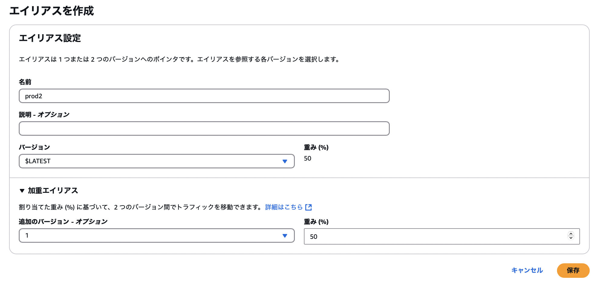

     

- エイリアスを付与すると、そのエイリアスへの ARN の末尾に `:[エイリアス名]` がつく

    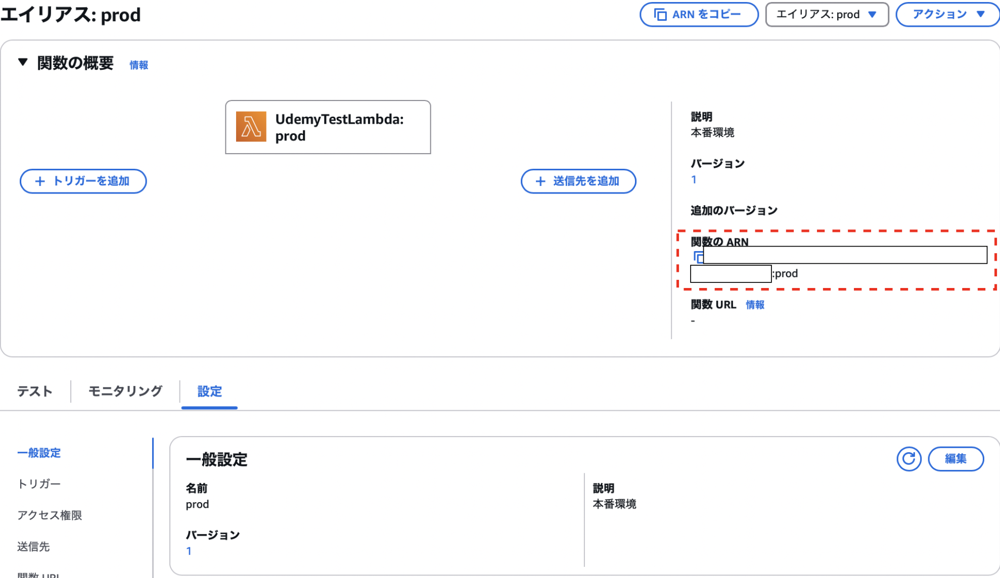

 
 

参考サイト

加重エイリアスについて
- [Lambdaのバージョン管理とエイリアスについてのハンズオン](https://cloud5.jp/lambda_version_aliases/)

---

### Lambda の暗号化について 

- ★KMS による暗号化を有効にしなくても、デフォルトで AWS が管理するキーによって Lamba 関数 (Zip) は暗号化される

 

- ★KMS やデフォルトキーが暗号化するのは環境変数とアーティファクト (zip) が対象で、**コンテナイメージから Lambda 関数を作成する場合、コンテナイメージの暗号化はしない** (ECR側の暗号キーで暗号化される)

    - Lambda 関数本体と環境変数は Lambda 内で別々に管理される

        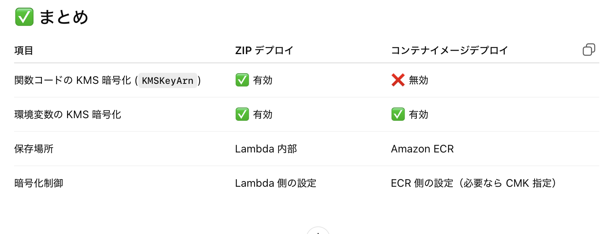

     

- KMS による暗号化を有効にすると、**別途 KMS の利用料金が発生する**

 

- 作成後に KMS による暗号化に切り替えることも可能

    - マネジードコンソールから切り替える場合、関数デプロイ時に KMS による暗号化にチェックを入れる

        