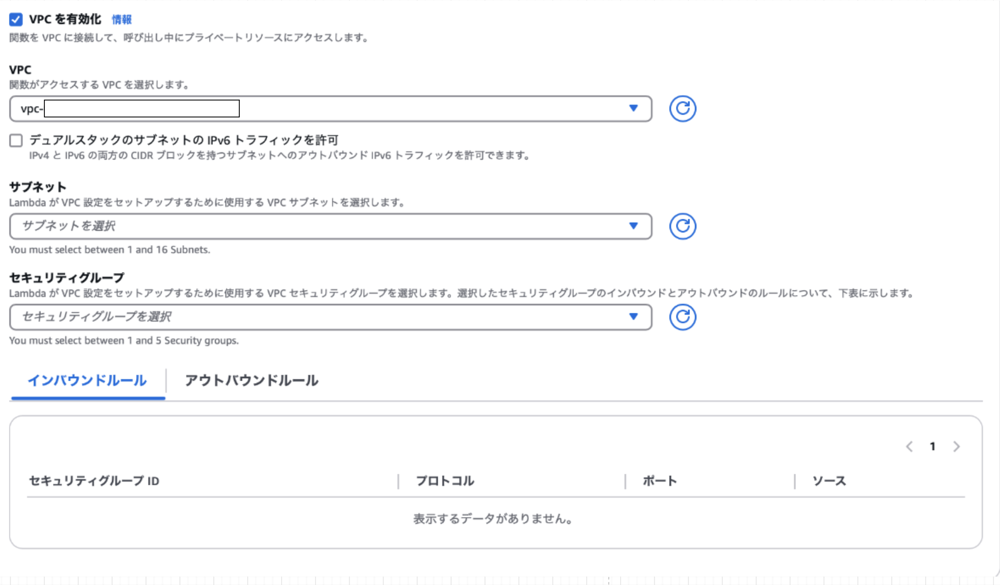
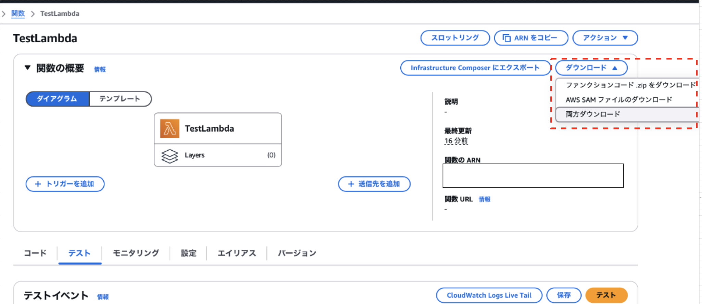

### 3つの作成方法

1. [1から作成](#1から作成)

    - 1からプラグラムコードを書いて Lambda 関数を作成する方法

 

2. [設計図の使用](#設計図の使用)

    - AWS が用意しているサンプルプログラムをもとに Lambda 関数を作成する方法

 

3. [コンテナイメージ](#コンテナイメージ)

    - プラグラムコードが含まれているコンテナイメージから Lambda 関数を作成する方法

    - Amazon ECR というコンテナレジストリサービスを利用する必要がある
        - 作成したコンテナイメージを ECR にプッシュし、　Lambda をコンテナイメージから作成する場合は、 ECR に登録されているコンテナから選択する

---

### 1から作成

- 以下の項目を設定する必要がある

#### 基本的な情報
- 関数名
    - 作成する Lambda 関数の名前

 

- ランタイム    
    - プログラムコードの言語
    - カスタムランタイムの場合は  `Amazon Linux` を選択

 

- アーキテクチャ
    - CPU のアーキテクチャを `arm64` か `x86_64` から選択

 

#### アクセス権限

- 実行ロール

    - Lambda 関数に付与するアクセス権(IAM ロール)

        - Lambda 関数で　Dynamoや RDS にアクセスする場合それらへのアクセス権を関数に付与する必要がある

    - 基本的な Lambda アクセス権限で新しいロールを作成

        - Lambda 関数作成時に IAM ロール (AWS 側で用意した) も作成する方法

            - *AWS CloudWatch Logs への権限しか用意されていないので、それ以外のリソースにアクセスしたい場合は自分でアクセス権を後から追加する必要があることに注意

    - 既存のロールを作成する

        - 既存の IAM ロールを割り当てる方法

    - AWS ポリシーテンプレートから新しいロールを作成

        - 自分でポリシーを選択して新しい IAM ロールを作成する方法

 

#### Additional Configurations

- コード署名を有効化

    - [コード署名機能](./Lambda.md#コード署名)を有効にするかどうか

 

- AWS KMS カスタマーマネージドキーによる暗号化を有効にする
    - ユーザーが KMS で作成した or 外部で作成して KMS に異でもポートした暗号化キーで zip ファイルを暗号化するかどうか

    - チェックを入れないと、AWS KMS マネージドキーで暗号化される

 

- 関数 URL を有効化
    - [関数URL機能](./Lambda.md#関数url)を有効にするかどうか

 

- タグを有効化

    - Lambda 関数にタグをつけるかどうか

 

- VPC を有効化

    

     

    - 有効にするとプライベートサブネットにあるリソースにアクセスできるようになる

    - 有効にすると Lambda 関数を VPC の内の選択したサブネットに配置する

    - Lambda 関数にセキュリティグループを設定する必要がある

 
 

参考サイト

[AWS LambdaをVPC内に配置する際の注意点](https://devlog.arksystems.co.jp/2018/04/04/4807/#)

---

### 設計図の使用

---

### コンテナイメージ

---

### 作成した Lambda 関数の確認 ~その１~

- 関数の概要
    - Lambda 関数のトリガー、レイヤー、ターゲット先が確認できる

- スロットリング
    - Lambda 関数の[予約済み同時実行数](./Lambda.md#予約済み同時実行-reserved-concurrency)を0にし、関数実行時にスロットリングエラーを発生させるように設定する

- アクション
    - Lambda 関数の新しいバージョンを作成したり、エイリアスをつけたり、Lambda 関数の削除を行う

 

- ダウンロード

    - プログラムコードや SAM ファイルのダウンロードができる

    - SAMファイルとは

        - Serverless Application Model の略

        - ファイル形式は YAML (JSON も OK)

        - Lambda 関数の定義 (ランタイムや IAM ロール、メモリなどの設定) が記述されている
    
--- 

### 作成した Lambda 関数の確認 ~その2~

 

以下の項目を確認できる

1. コード

2. テスト

3. モニタリング

4. 設定

5. エイリアス

6. バージョン