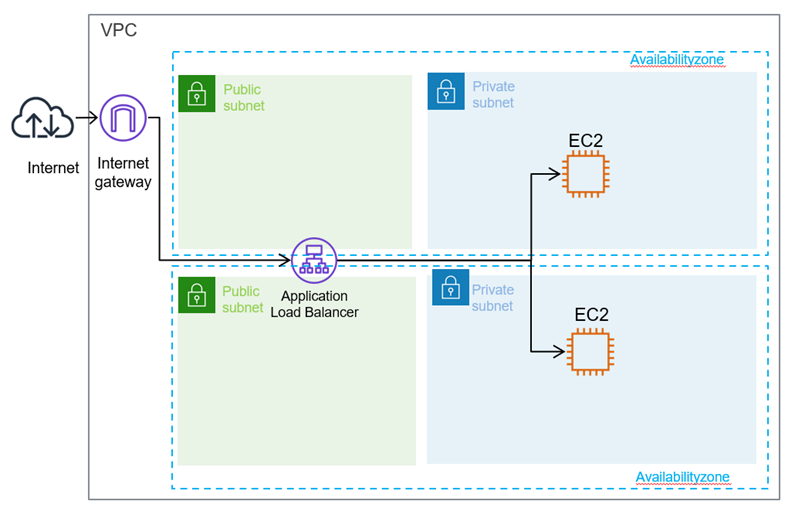
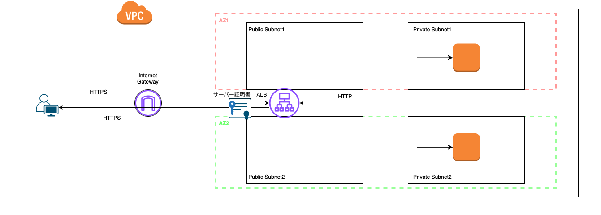
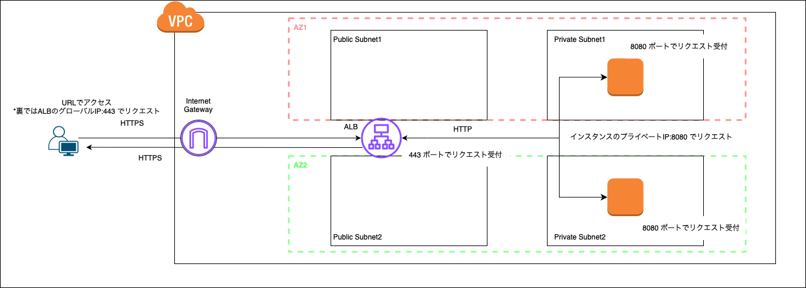
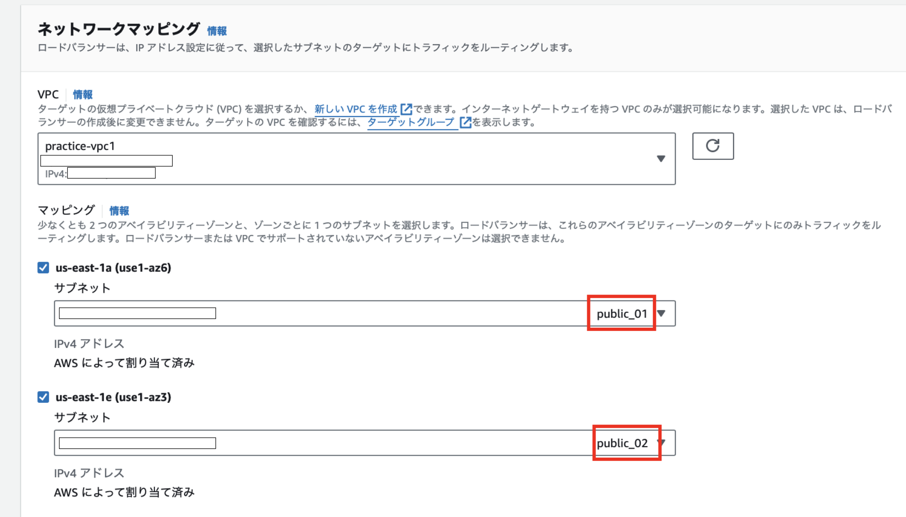
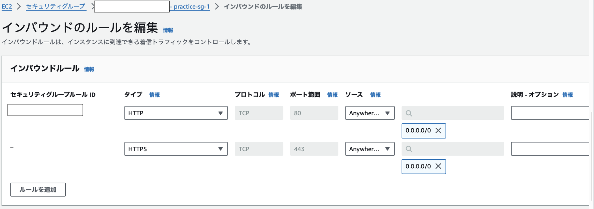

TODO: ALBの作成手順
    - セキュアリスナーの設定について記述

### ロードバランサーとは

サーバーへのアクセスを捌いていく装置

```
[例]
1つの Web サービスを2つのサーバーで運用している。
もし、大量のアクセスが1つの Web サーバーに集中したら、サーバーの負荷が増えレスポンスが遅くなったり、サーバーの故障につながる

[ロードバランサーの役割]
アクセスを均等に複数サーバーに割り振る

[結果]
1つのサーバーにアクセスが集中することをさけ、ユーザーが快適に Web サービスを利用することができる

また、サーバーに不具合が発生するリスクを減らす
```


引用: [【図で理解】ロードバランサーとは？負荷分散の仕組みを解説](https://www.kagoya.jp/howto/it-glossary/network/loadvalancer/)

<br>

ロードバランサーのポイント
- 同じユーザーは同一のサーバに割り振られる

    - 一貫したサービス(ユーザーエクスペリエンス?)を確保する = 以下の画像のようなことを防ぐ

    - *同じユーザーがずっと同じサーバーに割り振られるのではなく、同一セッション中は同じサーバーに割り振られるらしい


<br>
<br>

ロードバランサーに異常が発生してもサービスを提供し続けることができるように、ロードバランサー自体も複数用意することもある


引用: [「Linux Virtual Server」と「Keepalived」で作る冗長化ロードバランサ](https://knowledge.sakura.ad.jp/274/)

<br>

参考サイト1: [ロードバランサーの基本がマルわかり！仕組みから主要機能まで解説](https://it-trend.jp/server_application_management/article/114-0008)

参考サイト2: [【図で理解】ロードバランサーとは？負荷分散の仕組みを解説](https://www.kagoya.jp/howto/it-glossary/network/loadvalancer/)

同ユーザーは同サーバーに割り振られることについて: [知っておきたいロードバランサーの基礎技術](https://ascii.jp/elem/000/000/506/506272/2/)

---

### AWS で利用できるロードバランサー

Elastic Load Balancing (ELB)

AWS で利用できるロードバランサーは複数の種類がある

- ALB (Application Load Balancer)
    - 利用するには、2 AZ 以上が必要（1 AZ では起動できない
    - ロードバランサー自体への固定 IP 付与はできない
    - 対応プロトコル: HTTP、HTTPS
    
- NLB (Network Load Balancer)
    - 1 AZ または複数 AZ が可能
    - ロードバランサー自体への固定 IP 付与可能
    - 対応プロトコル: TCP、UDP、TLS
    - SSL 化処理を持たせることができる

- GLB (Gateway Load Balancer)
    - 1 AZ または複数 AZ が可能
    - ロードバランサー自体への固定 IP 付与はできない
    -　対応プロトコル: HTTP、HTTPS, TCP
    - AWS 上でサードパーティのセキュリティ製品(ファイアウォールなど)と組み合わせて使いたい場合に便利(**たぶん**)

*利用するロードバランサーによって料金が異なる

各種類のイメージ図が載っている参考サイト: [【初心者向け】Elastic Load Balancing(ELB) 入門！完全ガイド](https://zenn.dev/issy/articles/zenn-elb-overview#albapplication-load-balancer)

<br>
<br>

どのように使い分けをしたら良いのか?

ALB を選ぶケース
- HTTP,HTTPS リクエストの分散処理を行いたい
- ロードバランサーに SSL 化処理を行わせたい
- Web サービスを提供するケースで特に理由がなければ多分 ALB

<br>

NLB を選ぶケース
- 高速に処理を行わせたい、数秒間に何百万リクエストを捌かせたい
- リアルタイムのゲームとか
- HTTP/HTTPS以外のTCP、UDPを使用する場合

<br>

GLB を選ぶケース
- サードパーティのセキュリティ製品と組み合わせたい場合とか?

<br>

各種類の比較説明を行なっている参考サイト

参考1: [【初心者向け】Elastic Load Balancing(ELB) 入門！完全ガイド](https://zenn.dev/issy/articles/zenn-elb-overview)

参考2: [AWSのロードバランサーとは？　ALB・NLBの違いと用途について](https://business.ntt-east.co.jp/content/cloudsolution/ih_column-26.html#section-6)

---

### ALB (Application Load Balancer)

ポイント1
- アクセスの経路: ユーザー -> ロードバランサー -> プライベートサブネットに配置されたインスタンス
    - ロードバランサーから NAT ゲートウェイを経由してプラベートサブネットにアクセスはしない
    - $\color{red} NAT ゲートウェイはプライベートサブネットからインターネットアクセスの時に経由される$



引用: [AWSのロードバランサーとは？　ALB・NLBの違いと用途について](https://business.ntt-east.co.jp/content/cloudsolution/ih_column-26.html)

<br>

ポイント2
- ロードバランサーに公開鍵を配置し、インターネット間の通信を HTTPS (SSL 暗号化) で行うことができる

- 一方で、ロードバランサーと VPC 上の Web サーバーなどのインスタンス間の通信は HTTP で行うことで、 Web サーバーの負荷を減らしたり、鍵の管理を楽にすることができる



<br>

ポイント3
- **インターネットからのアクセスを割り振りたい場合**
、ALB を作成する際にロードバランサーに Public Subnet を関連づける必要がある

    - イメージ的には ALB をパブリックサブネットに配置するイメージ

<br>

ポイント4
- ALB はポートフォーワーディング機能も持つ
    - ロードバランサーは https(443) ポートでインターネットからのアクセスを待ち受け

    - アクセスを受けた場合、 プライベートサブネットにある http 通信を 8080 ポートで待ち受けているインスタンスにリクエストを送る (設定によって他ポートでも可)

    - AWS 上で[ターゲットグループ](TargetGroup.md#target-group)の作成が必要



<br>

ALB についての参考サイト1: [ロードバランサーのサブネットとルーティング](https://docs.aws.amazon.com/ja_jp/prescriptive-guidance/latest/load-balancer-stickiness/subnets-routing.html)

---
<div id="health-check"></div>

### ヘルスチェックとは

サーバーに異常が起きていないかを確認するために、ロードバランサーから定期的にリクエストを送ること

ヘルスチェックの種類
- アクティブ型
    - ロードバランサーからリクエストを振り分ける対象のサーバーにリクエストを送り、そのレスポンスを監視する方法

- パッシブ型
    - サーバーのクライアントへのレスポンスを監視する方法
    - ロードバランサーからはヘルスチェックのリクエストを送信しないのがポイント

<br>

ヘルスチェックの方法 (アクティブ型)

-  pingチェック (IP レベルのチェック)
    -　ping　が通るかのチェック

- ポートチェック (TCP レベルのチェック)
    - SYNパケット（接続要求）を送付し、それに対するACKパケット（確認応答）が返ってくるかどうかをチェックするらしい

- HTTP(S) チェック (コンテンツレベルのチェック)
    - サーバーへの HTTP(S) リクエストのレスポンスをチェックする
    - ALB のヘルスチェックがこれ

<br>

ポイント
- ヘルスチェックとは ELB 特有の機能ではなく、ロードバランサー全般が持つ機能のこと

<br>

ヘルスチェックの種類について: [F5 GLOSSARY
ヘルスチェック](https://www.f5.com/ja_jp/glossary/health-check)

ヘルスチェックの方法について: [ダウンサーバを回避して接続を維持する](https://atmarkit.itmedia.co.jp/ait/articles/0303/05/news001.html)

---

### ALB の作成

ポイント
- インターネットからの HTTP/HTTPS リクエストは ALB が受け付ける
    - 外部からの HTTP/HTTPS リクエストを受け付けるセキュリティグループを付与する

- VPC 内部での ALB からのリクエストをプライベートサブネットにあるインスタンスが受け付ける
    - (プライベートサブネットなので)インスタンスには外部からのアクセスは受けないセキュリグループを付与しておく (VPC内部からのアクセスは受ける)

<br>

1\. EC2 ダッシュボードのロードバランサーより、「ロードバランサーの作成」をクリックする


<br>

2\. ALB に関しての項目を設定してゆく


- ロードバランサー名

- スキーム
    - インターネット向け
        - ALB が外部からのアクセスを捌く場合に選択

    - 内部
        - ALB が VPC 内からのアクセスを捌く場合に選択

- IP アドレスタイプ
    - IPv4
        - クライアントが IPv4 アドレスを使用してロードバランサーと通信する場合は、IPv4 を選択する
    - Dualstack
        - クライアントが IPv4 および IPv6 アドレスの両方を使用してロードバランサーと通信する場合、デュアルスタックを選択する
    - Dualstack without public IPv4
        - ライアントが IPv6 アドレスのみを使用してロードバランサーと通信する場合、こちらを選択する

<br>



- VPC
    - ALB を配置したい VPC を選択
    
- マッピング
    - ALB が使うサブネットを指定する

    - 今回は、インターネット経由でのアクセスのやり取りをするので **パブリックサブネットを指定**する必要がある

    - ALB では、2つ以上のアベイラビリティーゾーンからのサブネットを選択する必要がある

<br>


- セキュリティグループ
    - ALB に適用するセキュリティグループを選択する

    - 以下の理由から、default と practice-sg-1 が選択されている

        - default: プライベートサブネットが ALB からのリクエストを受け入れてくれるようにするため

        

        - pratice-sg-1: ALB が外部からの HTTP/HTTPS リクエストを受け入れるようにするため

        

<br>


- リスナーとルーティング
    - プロトコル
        - ALB がどの通信プロトコルのリクエストを受け入れるか

    - ポート
        - ALB が何番ポートでリクエストを受け入れるか

    - デフォルトアクション
        - ALB が外部からのリクエストを受けた場合、そのリクエストの振り分け先

<br>

TODO: ここから
- セキュアリスナーの設定

    

参考サイト

公式: [Application Load Balancer の作成](https://docs.aws.amazon.com/ja_jp/elasticloadbalancing/latest/application/create-application-load-balancer.html#configure-load-balancer)

---

### 利用料金

ロードバランサーの料金が発生する仕組み

- 作成し、そのままにしておくと利用１時間ごとに使用料が発生する

- ロードバランサーへの接続アクセス数/処理したバイト数などのうち、**一番使用量の多い要素にのみ** に対してさらに費用が発生する

ロードバランサーの料金についての参考サイト: [【AWS入門】AWSのELBとは？ロードバランサーの種類、特徴、料金を紹介](https://cloudnavi.nhn-techorus.com/archives/3640#ELB)

---

### 追記

昔のロードバランサーは現在のようにアクセスを複数サーバーに振り分けるようなことはせず、100:0の振り分けをしていたらしい

で、稼働しているサーバーが止まったら他のサーバーに100:0で振り分ける


引用: [ロードバランサとは？わかりやすく解説！](https://academy.gmocloud.com/wp/qa/20170810/4591)