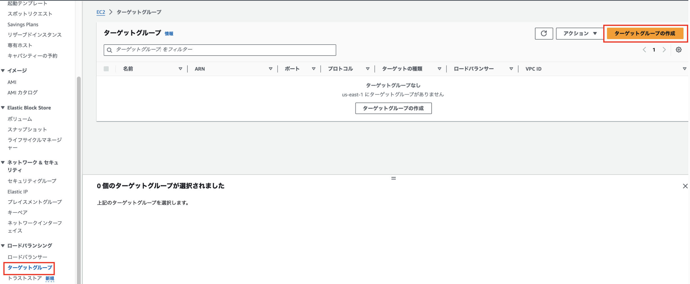
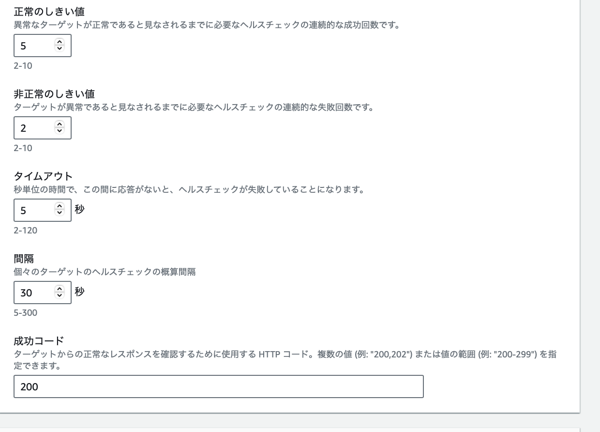

TODO: ターゲットグループの作成手順
TODO: ターゲットグループのHTTP通信のバージョンの説明(CSに新しくファイルを作りそこで説明S)
TODO: ヘルスチェックの説明
TODO: ALBの作成手順

### ロードバランサーとは

サーバーへのアクセスを捌いていく装置

```
[例]
1つの Web サービスを2つのサーバーで運用している。
もし、大量のアクセスが1つの Web サーバーに集中したら、サーバーの負荷が増えレスポンスが遅くなったり、サーバーの故障につながる

[ロードバランサーの役割]
アクセスを均等に複数サーバーに割り振る

[結果]
1つのサーバーにアクセスが集中することをさけ、ユーザーが快適に Web サービスを利用することができる

また、サーバーに不具合が発生するリスクを減らす
```


引用: [【図で理解】ロードバランサーとは？負荷分散の仕組みを解説](https://www.kagoya.jp/howto/it-glossary/network/loadvalancer/)

<br>

ロードバランサーのポイント
- 同じユーザーは同一のサーバに割り振られる

    - 一貫したサービス(ユーザーエクスペリエンス?)を確保する = 以下の画像のようなことを防ぐ

    - *同じユーザーがずっと同じサーバーに割り振られるのではなく、同一セッション中は同じサーバーに割り振られるらしい


<br>
<br>

ロードバランサーに異常が発生してもサービスを提供し続けることができるように、ロードバランサー自体も複数用意することもある


引用: [「Linux Virtual Server」と「Keepalived」で作る冗長化ロードバランサ](https://knowledge.sakura.ad.jp/274/)

<br>

参考サイト1: [ロードバランサーの基本がマルわかり！仕組みから主要機能まで解説](https://it-trend.jp/server_application_management/article/114-0008)

参考サイト2: [【図で理解】ロードバランサーとは？負荷分散の仕組みを解説](https://www.kagoya.jp/howto/it-glossary/network/loadvalancer/)

---

### AWS で利用できるロードバランサー

Elastic Load Balancing (ELB)

AWS で利用できるロードバランサーは複数の種類がある

- ALB (Application Load Balancer)
    - 利用するには、2 AZ 以上が必要（1 AZ では起動できない
    - ロードバランサー自体への固定 IP 付与はできない
    - 対応プロトコル: HTTP、HTTPS
    
- NLB (Network Load Balancer)
    - 1 AZ または複数 AZ が可能
    - ロードバランサー自体への固定 IP 付与可能
    - 対応プロトコル: TCP、UDP、TLS
    - SSL 化処理を持たせることができる

- GLB (Gateway Load Balancer)
    - 1 AZ または複数 AZ が可能
    - ロードバランサー自体への固定 IP 付与はできない
    -　対応プロトコル: HTTP、HTTPS, TCP
    - AWS 上でサードパーティのセキュリティ製品(ファイアウォールなど)と組み合わせて使いたい場合に便利(**たぶん**)

*利用するロードバランサーによって料金が異なる

各種類のイメージ図が載っている参考サイト: [【初心者向け】Elastic Load Balancing(ELB) 入門！完全ガイド](https://zenn.dev/issy/articles/zenn-elb-overview#albapplication-load-balancer)

<br>
<br>

どのように使い分けをしたら良いのか?

ALB を選ぶケース
- HTTP,HTTPS リクエストの分散処理を行いたい
- ロードバランサーに SSL 化処理を行わせたい
- Web サービスを提供するケースで特に理由がなければ多分 ALB

<br>

NLB を選ぶケース
- 高速に処理を行わせたい、数秒間に何百万リクエストを捌かせたい
- リアルタイムのゲームとか
- HTTP/HTTPS以外のTCP、UDPを使用する場合

<br>

GLB を選ぶケース
- サードパーティのセキュリティ製品と組み合わせたい場合とか?

<br>

各種類の比較説明を行なっている参考サイト

参考1: [【初心者向け】Elastic Load Balancing(ELB) 入門！完全ガイド](https://zenn.dev/issy/articles/zenn-elb-overview)

参考2: [AWSのロードバランサーとは？　ALB・NLBの違いと用途について](https://business.ntt-east.co.jp/content/cloudsolution/ih_column-26.html#section-6)

---

### ALB (Application Load Balancer)

ポイント1
- アクセスの経路: ユーザー -> ロードバランサー -> プライベートサブネットに配置されたインスタンス
    - ロードバランサーから NAT ゲートウェイを経由してプラベートサブネットにアクセスはしない
    - $\color{red} NAT ゲートウェイはプライベートサブネットからインターネットアクセスの時に経由される$


引用: [AWSのロードバランサーとは？　ALB・NLBの違いと用途について](https://business.ntt-east.co.jp/content/cloudsolution/ih_column-26.html)

<br>

ポイント2
- ロードバランサーに公開鍵を配置し、インターネット間の通信を HTTPS (SSL 暗号化) で行うことができる

- 一方で、ロードバランサーと VPC 上の Web サーバーなどのインスタンス間の通信は HTTP で行うことで、 Web サーバーの負荷を減らしたり、鍵の管理を楽にすることができる


<br>

ポイント3
- **インターネットからのアクセスを割り振りたい場合**
、ALB を作成する際にロードバランサーに Public Subnet を関連づける必要がある

    - イメージ的には ALB をパブリックサブネットに配置するイメージ

<br>

ポイント4
- ALB はポートフォーワーディング機能も持つ
    - ロードバランサーは https(443) ポートでインターネットからのアクセスを待ち受け

    - アクセスを受けた場合、 プライベートサブネットにある http 通信を 8080 ポートで待ち受けているインスタンスにリクエストを送る (設定によって他ポートでも可)

    - AWS 上で[ターゲットグループ](#target-group)の作成が必要


<br>

ALB についての参考サイト1: [ロードバランサーのサブネットとルーティング](https://docs.aws.amazon.com/ja_jp/prescriptive-guidance/latest/load-balancer-stickiness/subnets-routing.html)

---
<div id="target-group"></div>

### ターゲットグループ (Target Group)

ターゲットグループとは、 ELB によってリクエストが振り分けられる対象のこと

- 下の画像でいうと プライベートサブネット1 & 2 に配置されているインスタンス達


<br>

*ELB にターゲットグループを設定しないと、ELB はリクエストをどこに捌けばいいかわからないので、ターゲットグループの作成&設定は必ず必要

参考サイト: [【AWS】ロードバランサーを運用する上で重要！ターゲットグループのヘルスチェックの基本と設定方法](https://zenn.dev/takuh/articles/4446e12c607a6b#ターゲットグループとヘルスチェックの役割)

---

### ターゲットグループの作成

1\. EC2 ダッシュボードにて「ターゲットグループ」画面の「ターゲットグループの作成」をクリックする



<br>

2\. ターゲットグループの設定

- ターゲットタイプ

    - \[インスタンス\]: 以下のインスタンスにアクセスの分散が可能
        - ロードバランサーを設置する VPC 上のインスタンスをターゲットグループに指定する

    - \[IP アドレス\]: 以下のインスタンスにアクセスの分散が可能
        - ロードバランサーを設置するVPC に接続しているオンプレ上のインスタンス
        - ロードバランサーを設置する VPC にペアリング接続している他の VPC 上のインスタンス

    - *ロードバランサーを設置する VPC 内のインスタンスにリクエストを割り振る場合、ターゲットタイプはインスタンスでいい


<br>

- ターゲットグループ名
    - 名前の通りターゲットグループ名

<br>


- プロトコル: ポート
    - ロードバランサーが、「なんのプロトコル」で「何番ポート」にリクエストを振り分けるかの設定

    - ロードバランサーがユーザーとのやり取りを SSL 化していれば、 ロードバランサーとプライベートインスタンス(Webサーバー)間のやり取りは HTTP でいい

- IPアドレスタイプ
    - ターゲットグループに登録したいインスタンスのプライベートIPアドレスのタイプ

- VPC
    - ターゲットグループに設定するインスタンスがある VPC を選択

- プロトコルバージョン
    - ALB と　ターゲットのインスタンスとの間の通信プロトコルを指定

<br>

3\. ヘルスチェックの設定




- ヘルスチェックプロトコル
    - ロードバランサーからリクエスト振り分け対象のサーバーへ送るリクエスト (ヘルスチェック) のプロトコル

- ヘルスチェックパス
    - ヘルスチェックリクエストの際に、指定されたパスをリクエストする

- ヘルスチェックポート
    - ヘルスチェックリクエストの際に、指定するポート番号

    - トラフィックポート
        - 

    - 上書き
        - 

- 正常な閾値
    - リクエストを振り分ける対象のサーバーが正常であると見なすための基準: ヘルスチェックリクエストへのレスポンスが何回連続で成功したら正常と見なすか

-　非正常の閾値
    - リクエストを振り分ける対象のサーバーが正常であると見なすための基準: ヘルスチェックリクエストへのレスポンスが何回連続で失敗したら異常と見なすか

- タイムアウト
    - ヘルスチェックリクエストに何秒間応答がないと失敗(タイムアウト)と見なすか


<br>
<br>

ターゲットタイプに関する参考サイト一覧

ターゲットタイプとは: [【AWS】ロードバランサーを運用する上で重要！ターゲットグループのヘルスチェックの基本と設定方法](https://zenn.dev/takuh/articles/4446e12c607a6b#ターゲットグループとヘルスチェックの役割)

ターゲットタイプに IP アドレスを設定する意味: [[新機能] ALBのターゲットにIPアドレスを指定可能になりました](https://dev.classmethod.jp/articles/ip-target-for-alb/)


---

### ヘルスチェックとは

サーバーに異常が起きていないかを確認するために、ロードバランサーから定期的にリクエストを送ること

<br>

ポイント
- ヘルスチェックとは ELB 特有の機能ではなく、ロードバランサー全般が持つ機能のこと


---

### 利用料金

ロードバランサーの料金が発生する仕組み

- 作成し、そのままにしておくと利用１時間ごとに使用料が発生する

- ロードバランサーへの接続アクセス数/処理したバイト数などのうち、**一番使用量の多い要素にのみ** に対してさらに費用が発生する

ロードバランサーの料金についての参考サイト: [【AWS入門】AWSのELBとは？ロードバランサーの種類、特徴、料金を紹介](https://cloudnavi.nhn-techorus.com/archives/3640#ELB)

---

### 追記

昔のロードバランサーは現在のようにアクセスを複数サーバーに振り分けるようなことはせず、100:0の振り分けをしていたらしい

で、稼働しているサーバーが止まったら他のサーバーに100:0で振り分ける


引用: [ロードバランサとは？わかりやすく解説！](https://academy.gmocloud.com/wp/qa/20170810/4591)