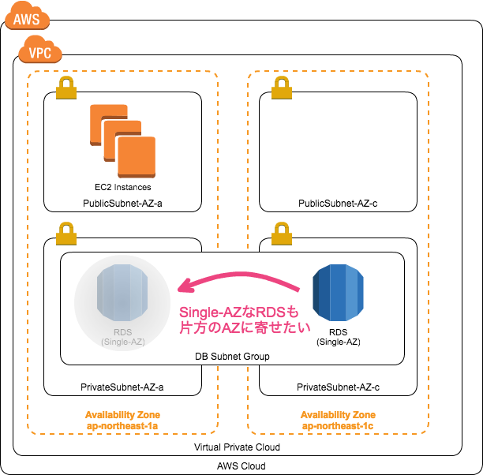
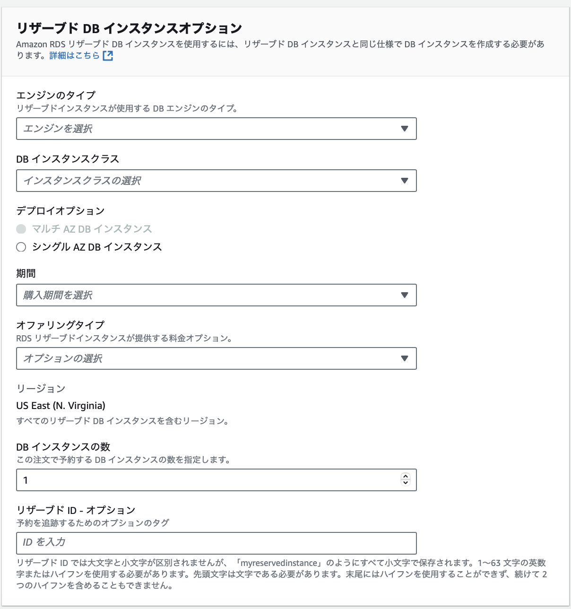
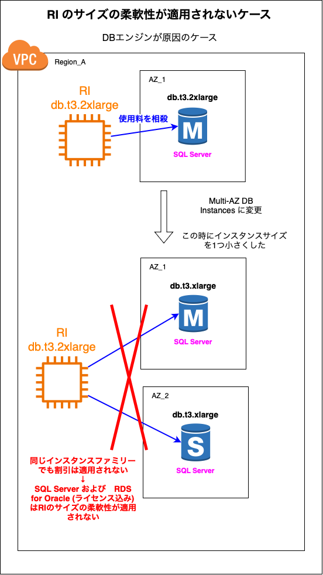

### RDS とは

AWS 上で提供される RDB サービス

MySQL、Oracle Database、Microsoft SQL Server など様々なものが選択できる

<br>

Q. なぜ EC2 ではなく RDS を利用するのか?

A. EC2 でサーバーを作成した後、対象の RDBMS のインストールなどの作業の手間がなくなるから (EC2 を作成し、 RDBMS をインストールし設定を行えば EC2 で DB サーバーをたてることは可能)

---

### RDS の特徴

自動バックアップ機能

<br>

負荷分散機能（リードレプリカ機能）
- リードレプリカという読み取り専用の DB を作成し、読み読み取りのリクエストに対応する
    - 詳しくは[こちら](./)を参照
- 書き込みの場合はマスター DB が対応することで、　**読み取り性能**の向上が期待できる
- 書き込み性能の向上はリードレプリカでなく、他の方法で行う必要がある

<br>

マルチ AZ 機能
- メインの AZ に加え、同一リージョンの別 AZ にスタンバイインスタンスを展開する機能
- プライマリインスタンスに障害が発生した際、スタンバイインスタンスにフェイルオーバーする

<br>

自動パッチ作業
- DB のソフトウェアを常に最新の状態に保つことができる

<br>

暗号化
- DB インスタンス、自動バックアップ、リードレプリカ、スナップショットなどを暗号化する機能
- 暗号化機能は RDS 作成時にのみ設定できる。作成後に暗号化の機能を有効/無効の切り替えはできない

<br>
<br>

参考サイト

[Amazon RDSとは？3分でわかる用語解説](https://www.itechh.ne.jp/blog/column/amazon-rds.html)

[Amazon RDSとは？仕組み、特徴、メリット、DBの種類や使い方をわかりやすく解説](https://www.ashisuto.co.jp/db_blog/article/amazon-rds.html#Index-1)

[Amazon RDS リソースの暗号化](https://docs.aws.amazon.com/ja_jp/AmazonRDS/latest/UserGuide/Overview.Encryption.html)

[【AWS】RDS暗号化の仕組み](https://avocado-system.com/2023/05/17/【aws】rds暗号化の仕組み/)

---

### RDS の構成

RDS は以下の4つで構成されている

- DB エンジン
    - = MySQL, PostgresSQL などの DB ソフトウェア
    
- パラメータグループ
    - DB エンジン固有の設定 (DBエンジンに紐づくデータベースサービスのコンフィグ（パラメーター）を管理する設定)
    - チューニング関連で利用する

- オプショングループ
    - RDS 固有の設定
    - RDS インスタンスの監視などはここで設定する

- サブネットグループ
    - RDS インスタンスを配置する VPC 内のサブネットを定義する設定
    - RDS インスタンスを複数の AZ に分散させて配置する際に利用される設定

---

### 料金

- RDS インスタンスの稼働時間に対して課金
    - インスタンスの種類によって料金は異なる
    - 使用する DB の種類によっても料金は異なる
    - 1時間あたり ~~ UDS の形の課金

- ストレージ利用料（データ保存料）
    - ストレージの種類によって料金は異なる
    - 1GB あたり ~~ UDS の形の課金
<br>
<br>

参考サイト

[Amazon RDSとは？～データベースの基礎からAmazon RDSのメリットまで徹底解説～](https://business.ntt-east.co.jp/content/cloudsolution/ih_column-76.html)

[Amazon RDSとは？仕組み、特徴、メリット、DBの種類や使い方をわかりやすく解説](https://www.ashisuto.co.jp/db_blog/article/amazon-rds.html)

---

### Multi-AZ DB Cluster と Multi-AZ DB Instances

#### Multi-AZ DB Cluster
- マスタ DB (Writer DB) とは異なる AZ に読み込み用の Reader DB (リードレプリカ) を配置する
    - 読み込み性能の向上が見込める

- フェイルオーバー時は最新の変更レコードを持っている Reader を Writer へ昇格させる
    - Multi-AZ DB Instances と比較してフェイルオーバーの高速化が見込める

- Writer DB と Reader DB の同期は非同期で行われる
    - Writer DB の変更がリードレプリカに反映される前に、 リードレプリカから古いデータを取得する可能性はある


<br>

#### Multi-AZ DB Instances
- マスタ DB とは異なる AZ にスタンバイ (マスタに問題が発生した時用の予備 DB) を配置する


<br>
<br>

参考サイト

マルチ AZ DB クラスターについて

- [Amazon RDSでマルチAZデプロイに読み取り可能なスタンバイインスタンス機能とは？](https://www.sunnycloud.jp/column/20230203-01/)

- [【新機能】Amazon RDS の高可用性構成で書き込み性能向上とフェイルオーバーが高速になる！新しい高可用性オプションの Multi-AZ DB Cluster が一般提供になりました](https://dev.classmethod.jp/articles/rds-multi-az-db-cluster-ga/)


マルチ AZ DB インスタンスについて

- [マルチAZ DB インスタンスのデプロイ](https://docs.aws.amazon.com/ja_jp/AmazonRDS/latest/UserGuide/Concepts.MultiAZSingleStandby.html)

---

### Optimized Write

2重書き込みバッファーという仕組みを OFF にすることで、書き込み性能の向上が見込める仕組み

**2重書き込みバッファーとは** DB にデータを保存する前に、doublewrite buffer 領域というところに先に保存し、その後 DB にデータを保存するというものらしい

<br>
<br>

参考サイト

Optimized Writeについて
- [[アップデート]RDS for MySQL で書き込みスループットが最大2倍になりました #reinvent](https://dev.classmethod.jp/articles/update-rds-optimized-writes/)

2重書き込みバッファーについて
- [InnoDB の DoubleWrite 技術をみる MySQL InnoDB](https://qiita.com/shimacpyon/items/3b34ca93eb31736a7562)

---

### シングルAZ構成にしたい場合

*前提: サブネットグループの作成には2つ以上の AZ を指定しなければいけない -> VPC は複数 AZ から構成されている必要がある

ここでのシングルAZという意味は EC2 などのDBのクライアントとなるインスタンスと RDS インスタンスを同じ AZ に配置するということ



引用: [[小ネタ] RDSのSingle-AZ構成でAvailability Zoneを変更する方法](https://dev.classmethod.jp/articles/rds-singleaz-change-az/)

<br>

具体的な方法
RDS インスタンス作成後にインスタンスが配置された AZ を確認。シングル AZ になっていなかったら、強制フェイルオーバーを実行することでインスタンスを他の AZ に配置し直す

<br>
<br>

参考サイト

- [RDSってなんでAZ(Availability Zone)を指定する項目がふたつあるの？](https://dev.classmethod.jp/articles/rds-has-two-configs-concerning-availability-zone/)
- [マルチAZ構成のRDS(MySQL)を強制フェイルバックさせてみた](https://dev.classmethod.jp/articles/multiaz-rds-failback/)
- [[小ネタ] RDSのSingle-AZ構成でAvailability Zoneを変更する方法](https://dev.classmethod.jp/articles/rds-singleaz-change-az/)

---

### リザーブドインスタンス

- [EC2 インスタンスの RI](./EC2_RI.md)　と同様にリージョンやインスタンスタイプを指定し、1年 or 3年の使用を約束することでインスタンス使用料の割引きを受けることができる購入方法

<br>

#### 非 Aurora RI

- 指定する項目
    

    - DBエンジン

    - インスタンスクラス

    - デプロイオプション
        - マルチ AZ DB インスタンス
            - プライマリとスタンバイ分の2つの RI を購入するオプション

        <br>

        - シングル AZ DB インスタンス
            - 1つの RI を購入するオプション

    - 期間
        - 1年 or 3年

    - オファリングタイプ
        - 支払い方法のこと
            - 全額前払い
            - 一部前払い
            - 前払いなし

    - リージョン

    - DB インスタンスの数
        - 購入する RI の数

    - リザーブド ID    

<br>

- ★ 購入したRI の DB エンジンが 「RDS for SQL Server」 または 「RDS for Oracle ライセンス込み」 の場合は、**RI のサイズの柔軟性は提供されない**

    → サイズの柔軟性とは、[EC2 のリージョンを指定して購入する RI](./EC2_RI.md#インスタンスサイズの柔軟性) と同様に、リージョンとインスタンスファミリーが同じであれば、購入済みの RI とは異なるサイズのインスタンスに割引が自動で適用される仕組み

    ```
    例: インスタンスタイプが db.t3.2xarge で シングル AZ の SQL Server の RI を購入。その後、SQL Server の RDS インスタンスをdb.t3.large でマルチ AZ 配置に変更した。

    Q: 変更後も RI の割引は適用されるか?

    A: SQL Server の RI はサイズの柔軟性が無いため、SQL Server の RDS インスタンスサイズを変更すると、RI の割引は適用されなくなる
    ```

    

<br>

#### Aurora RI

- 基本的に非 Aurora RI と同じ指定項目、インスタンスサイズの柔軟性、AZの柔軟性が提供される

- ★ Serverless の RI は無い

- ★ 料金体系による RI の購入数の違い


<br>
<br>

参考サイト

[]()
[]()