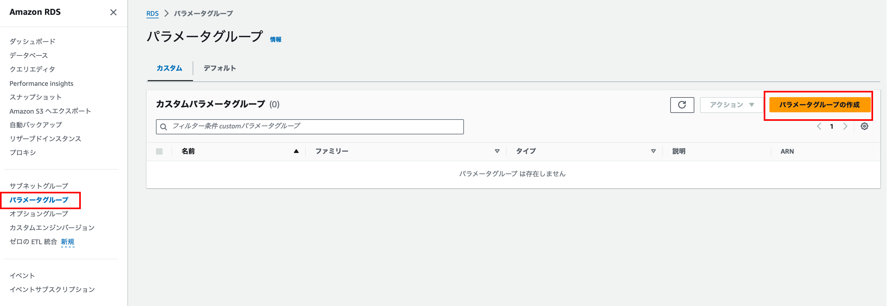
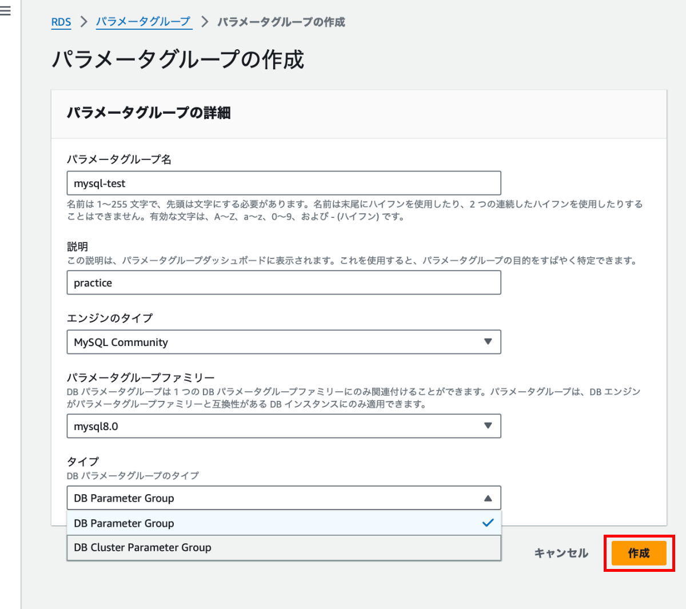
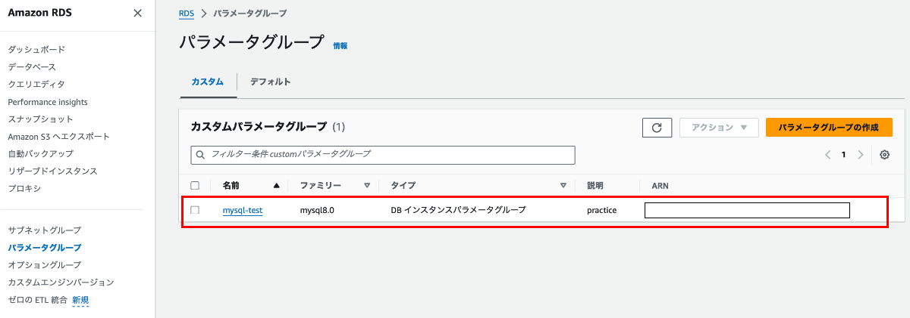
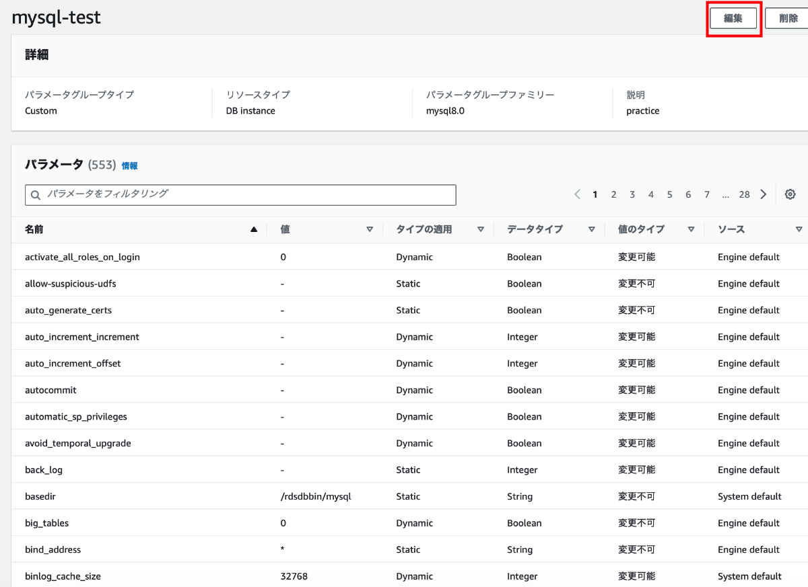
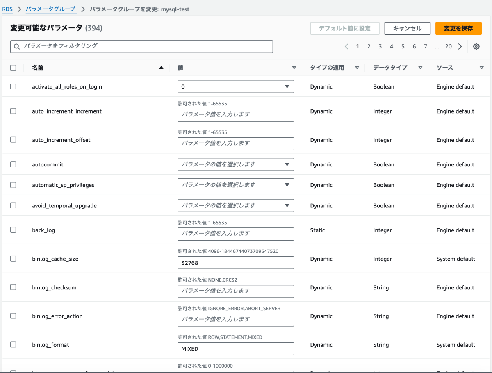

### RDS とは

AWS 上で提供される RDB サービス

MySQL、Oracle Database、Microsoft SQL Server など様々なものが選択できる

 

Q. なぜ EC2 ではなく RDS を利用するのか?
A. EC2 でサーバーを作成した後、対象の RDBMS のインストールなどの作業の手間がなくなるから (EC2 を作成し、 RDBMS をインストールし設定を行えば EC2 で DB サーバーをたてることは可能)

---

### RDS の特徴

自動バックアップ機能

 

負荷分散機能（リードレプリカ機能）
- リードレプリカという読み取り専用の DB を作成し、読み読み取りのリクエストに対応する
- 書き込みの場合はマスター DB が対応することで、　**読み取り性能**の向上が期待できる
- 書き込み性能の向上はリードレプリカでなく、他の方法で行う必要がある

 

マルチAZ機能
- メインのAZに加え、同一リージョンの別AZにスタンバイインスタンスを展開する機能
- プライマリインスタンスに障害が発生した際、スタンバイインスタンスにフェイルオーバーする

 

自動パッチ作業
- DB のソフトウェアを常に最新の状態に保つことができる

 

暗号化
- DB インスタンス、自動バックアップ、リードレプリカ、スナップショットなどを暗号化する機能
- 暗号化機能は RDS 作成時にのみ設定できる。作成後に暗号化の機能を有効/無効の切り替えはできない
WW
 
 

参考サイト

[Amazon RDSとは？3分でわかる用語解説](https://www.itechh.ne.jp/blog/column/amazon-rds.html)

[Amazon RDSとは？仕組み、特徴、メリット、DBの種類や使い方をわかりやすく解説](https://www.ashisuto.co.jp/db_blog/article/amazon-rds.html#Index-1)

[Amazon RDS リソースの暗号化](https://docs.aws.amazon.com/ja_jp/AmazonRDS/latest/UserGuide/Overview.Encryption.html)

[【AWS】RDS暗号化の仕組み](https://avocado-system.com/2023/05/17/【aws】rds暗号化の仕組み/)

---

### RDS の構成

RDS は以下の4つで構成されている

- DB エンジン
    - = MySQL, PostgresSQL などの DB ソフトウェア
    
- パラメータグループ
    - DB エンジン固有の設定 (DBエンジンに紐づくデータベースサービスのコンフィグ（パラメーター）を管理する設定)
    - チューニング関連で利用する

- オプショングループ
    - RDS 固有の設定
    - RDS インスタンスの監視などはここで設定する

- サブネットグループ
    - RDS インスタンスを配置する VPC 内のサブネットを定義する設定
    - RDS インスタンスを複数の AZ に分散させて配置する際に利用される設定

---

### RDS インスタンスの作成のための準備

RDS インスタンス作成のために前もって以下を作成しておく必要がある

- パラメータグループ
- オプショングループ
- サブネットグループ

---

### パラメータグループの作成

1. AWS コンソール画面から「パラメータグループ」画面に遷移し、「パラメータグループの作成」をクリック

 

2. パラメータグループ作成に必要な項目を設定し、「作成」をクリック

    - **パラメータグループ名**: その名の通り作成するパラメータグループ名

    - **説明**: 作成するパラメータグループ名の説明

    - **エンジンのタイプ**: 設定する DB 製品の種類

    - **パラメータグループファミリー**: DB 製品のバージョン

    - **タイプ**
        - **DB Parameter Group**: DB クラスター内の単一の DB インスタンスに適用される設定
        - **DB Cluster Parameter Group**: DB クラスター内のすべての DB インスタンスに適用される設定

 

3. パラメータグループが作成されていることを確認する

 

#### パラメータの編集

1. パラメータグループ一覧画面より、編集したいパラメータグループを選択する

 

2. 「編集」をクリック

 

3. 編集したい項目に設定値を入力し、「変更を保存」をクリック

---

### 料金

- RDS インスタンスの稼働時間に対して課金
    - インスタンスの種類によって料金は異なる

- ストレージ利用料（データ保存料）

 
 

参考サイト

[Amazon RDSとは？～データベースの基礎からAmazon RDSのメリットまで徹底解説～](https://business.ntt-east.co.jp/content/cloudsolution/ih_column-76.html)

[Amazon RDSとは？仕組み、特徴、メリット、DBの種類や使い方をわかりやすく解説](https://www.ashisuto.co.jp/db_blog/article/amazon-rds.html)
