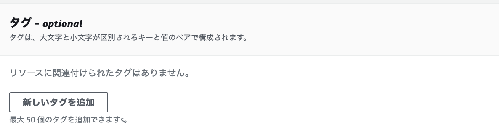
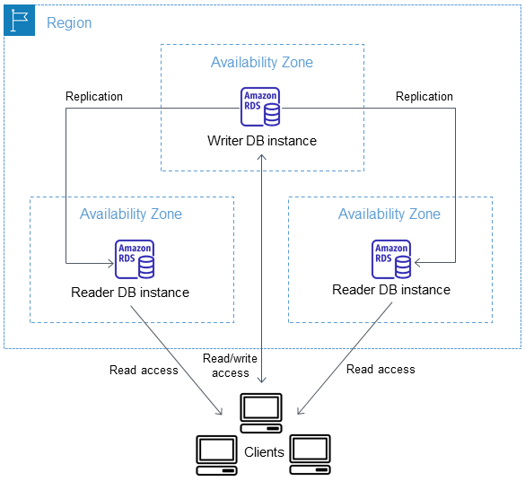

### RDS とは

AWS 上で提供される RDB サービス

MySQL、Oracle Database、Microsoft SQL Server など様々なものが選択できる

 

Q. なぜ EC2 ではなく RDS を利用するのか?
A. EC2 でサーバーを作成した後、対象の RDBMS のインストールなどの作業の手間がなくなるから (EC2 を作成し、 RDBMS をインストールし設定を行えば EC2 で DB サーバーをたてることは可能)

---

### RDS の特徴

自動バックアップ機能

 

負荷分散機能（リードレプリカ機能）
- リードレプリカという読み取り専用の DB を作成し、読み読み取りのリクエストに対応する
- 書き込みの場合はマスター DB が対応することで、　**読み取り性能**の向上が期待できる
- 書き込み性能の向上はリードレプリカでなく、他の方法で行う必要がある

 

マルチAZ機能
- メインのAZに加え、同一リージョンの別AZにスタンバイインスタンスを展開する機能
- プライマリインスタンスに障害が発生した際、スタンバイインスタンスにフェイルオーバーする

 

自動パッチ作業
- DB のソフトウェアを常に最新の状態に保つことができる

 

暗号化
- DB インスタンス、自動バックアップ、リードレプリカ、スナップショットなどを暗号化する機能
- 暗号化機能は RDS 作成時にのみ設定できる。作成後に暗号化の機能を有効/無効の切り替えはできない
WW
 
 

参考サイト

[Amazon RDSとは？3分でわかる用語解説](https://www.itechh.ne.jp/blog/column/amazon-rds.html)

[Amazon RDSとは？仕組み、特徴、メリット、DBの種類や使い方をわかりやすく解説](https://www.ashisuto.co.jp/db_blog/article/amazon-rds.html#Index-1)

[Amazon RDS リソースの暗号化](https://docs.aws.amazon.com/ja_jp/AmazonRDS/latest/UserGuide/Overview.Encryption.html)

[【AWS】RDS暗号化の仕組み](https://avocado-system.com/2023/05/17/【aws】rds暗号化の仕組み/)

---

### RDS の構成

RDS は以下の4つで構成されている

- DB エンジン
    - = MySQL, PostgresSQL などの DB ソフトウェア
    
- パラメータグループ
    - DB エンジン固有の設定 (DBエンジンに紐づくデータベースサービスのコンフィグ（パラメーター）を管理する設定)
    - チューニング関連で利用する

- オプショングループ
    - RDS 固有の設定
    - RDS インスタンスの監視などはここで設定する

- サブネットグループ
    - RDS インスタンスを配置する VPC 内のサブネットを定義する設定
    - RDS インスタンスを複数の AZ に分散させて配置する際に利用される設定

---

### RDS インスタンスの作成のための準備

RDS インスタンス作成のために前もって以下を作成しておく必要がある

- パラメータグループ
- オプショングループ
- サブネットグループ
- セキュリティグループ

---

### パラメータグループの作成

1. AWS コンソール画面から「パラメータグループ」画面に遷移し、「パラメータグループの作成」をクリック

 

2. パラメータグループ作成に必要な項目を設定し、「作成」をクリック

    - **パラメータグループ名**: その名の通り作成するパラメータグループ名

    - **説明**: 作成するパラメータグループ名の説明

    - **エンジンのタイプ**: 設定する DB 製品の種類

    - **パラメータグループファミリー**: DB 製品のバージョン

    - **タイプ**
        - **DB Parameter Group**: DB クラスター内の単一の DB インスタンスに適用される設定
        - **DB Cluster Parameter Group**: DB クラスター内のすべての DB インスタンスに適用される設定

 

3. パラメータグループが作成されていることを確認する

 

#### パラメータの編集

1. パラメータグループ一覧画面より、編集したいパラメータグループを選択する

 

2. 「編集」をクリック

 

3. 編集したい項目に設定値を入力し、「変更を保存」をクリック

---

### オプショングループの作成

1. AWS コンソールより RDS 画面に遷移。「パラメータグループ」画面に遷移し、「パラメータグループの作成」をクリック

 

2. オプショングループ作成に必要な項目を設定し、「作成」をクリック

 

3. オプショングループが作成されていることを確認する

 

#### オプションの編集

1. オプショングループ一覧画面より、編集したいオプショングループを選択する

 

2. 「オプションの追加」をクリック

 

3. 編集したい項目に設定値を入力し、「オプションの追加」をクリック

---

### サブネットグループの作成

EC2インスタンスの作成時はインスタンスの配置場所を指定して作成したが、RDSインスタンス作成の際は、サブネットを複数指定するだけで、**実際にどのサブネットにRDSインスタンスが配置されるかはAWSに任される**

1. AWS コンソールより RDS 画面に遷移。「サブネットグループ」画面に遷移し、「DBサブネットグループを作成」をクリック

 

2. サブネットグループ作成に必要な項目を設定し、「作成」をクリック

    -  VPC: 選択したいサブネットが属する VPC

    - アベイラビリティゾーン: 選択したいサブネットが属するAZ

    - サブネット: サブネットグループに指定するサブネット

 

**サブネットグループ作成の際には以下の条件を満たさなければならない**

- 少なくとも2つ以上のサブネットを指定する
- 指定するサブネットは2つ以上の異なるAZにまたがっていること

上記条件に違反するサブネットグループの作成はできない

- もし指定するサブネットが1つだった場合

 

- もし指定するサブネットが2つでも AZ は1つの場合

 
 

参考サイト

[【AWS】RDS作成前の事前準備（Part１）](https://qiita.com/ponponpoko/items/4b57170e5617f3259300)

---

### セキュリティグループの作成

*本来はプロジェクトの要件に合わせたセキュリティグループの作成が必要

- インバウンドルール
    - タイプ: 作成するRDSインスタンスのDBエンジンに合わせる

    - ソース: VPCインスタンスからのアクセスのみを想定しているので、 RDS インスタンスにアクセスする EC2 インスタンスにアタッチしたセキュリティグループ名を指定

 

- アウトバウンドルール
    - デフォルトのまま

 
 

参考サイト

[【AWS】RDS作成前の事前準備（Part１）](https://qiita.com/ponponpoko/items/4b57170e5617f3259300#セキュリティグループの作成ec2からrdsにアクセスするため)

[0から始めるAWS入門④：RDS編](https://qiita.com/hiroshik1985/items/6643b7323183f82297b2#db用セキュリティグループの作成)

---

### RDS インスタンスの作成

1. AWS コンソールにて RDS 画面に遷移。「データベース」画面にて「データベースの作成」をクリック

 

2. RDS の作成に必要な項目を設定する

**利用する DB エンジンによって設定項目が変わる**

今回は MySQL で RDS インスタンスを作成する

- データベースの作成方法
    - 標準作成: 自分で各項目の設定をし、インスタンスの作成を行う
    - 簡単に作成: ある程度の項目が自動で設定されいる状態でインスタンスを作成する

 

- エンジンのオプション (今回は MySQL で作成)
    - エンジンのタイプ: 利用する DB エンジン

    - バージョン

    *選択する DB エンジンによって設定項目が変わるので注意

 

- テンプレート
    - 本番稼働用と開発/テストの違いについて
        - 以降の設定項目にてデフォルト値が異なる
        - (多分)上記のデフォルト値のままで作成すると利用料金が本番と開発で結構違ってくる　

        [参考: RDSのおすすめ設定方法2021](https://www.cyberowl.co.jp/blog/technology/1214#hnbmb4to)

- 耐久性と可用性: マルチAZにおけるDBの配置構成についての項目
    - Multi-AZ DB Cluster
    - Multi-AZ DB Instances
    - 単一 DB インスタンス (サブネットグループのうちどこか1つに DB インスタンスを作成する)

    [Multi-AZ DB Cluster と Multi-AZ DB Instances について](#multi-az-db-cluster-と-multi-az-db-instances)

 

- 設定
    - DBインスタンス識別子: インスタンスを一意に識別するための名前

    - マスタユーザー名: DBインスタンスにログインする時に使用するユーザー名

    - マスタパスワード: DBインスタンスにログインする時に使用するパスワード

 

- インスタンスの設定: DB インスタンスのメモリやCPUの設定

    *積んでいるメモリやCPUの数が違うのでプロジェクトに合うサイズのインスタンスを選択すること

    バースト可能クラスとは? -> 特定の負荷のかかる場面のみCPUの機能をフルに活用させて、その他のときにはCPUの機能を抑え低いコストで運用するインスタンスのこと

    バースト可能クラスについての説明の参照: [RDSのおすすめ設定方法2021](https://www.cyberowl.co.jp/blog/technology/1214#be2vxh4f)

 

- ストレージ: DBインスタンスに割り当てるストレージのタイプと容量の設定

    - ストレージタイプ: マグネティックストレージは下位互換のために用意されているものみたいなので、基本的に汎用SSDかプロビジョンド IOPS (SSD) ストレージを選択するらしい

        *プロビジョンド IOPS ストレージとは SSD を利用したパフォーマンスの高いストレージのこと

        *IOPS: Input/Output Per Second の略

    - ストレージの自動スケーリング
        最後のストレージ容量変更から6時間以上経過している状態で、使用可能なストレージ容量が、割り当てられた容量の10%以下の状態が5分以上立っている場合に適用される

 

- 接続: RDS インスタンスとクライアント間の接続情報の設定

    - コンピューティングリソース: RDS/EC2間の接続の設定を手動で行うか否かの項目

    - Virtual Private Cloud (VPC): DB インスタンスを配置する VPC (*サブネットグループが作成ずみのVPCを選択する必要がある)

    - DB サブネットグループ: RDB インスタンスに適用するサブネットグループ

    - パブリックアクセス: VPCの外からDBインスタンスにアクセスする場合は、「あり」、そうでない場合は「なし」を選択

    - VPC セキュリティグループ (ファイアウォール): RDS インスタンスに適用するセキュリティグループ

    - アベイラビリティーゾーン: RDS インスタンスの配置先 AZ

    - RDS Proxy: RDS プロキシの ON/OFF

    *RDS Proxyとは、 RDSインスタンスとクライアント間に配置され、データベースの接続をより効率的に管理してくれる仕組み

    - 認証機関: クライアと RDS インスタン間で TLS 通信を行うためのサーバー証明書

    - データベースポート: データベースがアプリケーションの接続に使用する

 

- タグ: 認識しやすいように RDS インスタンスに付与するタグ名

 

- データベース認証: DBインスタンスにアクセスする際の認証方式の設定
    - パスワード認証: 一般的なユーザー認証方法

    - IAM データベース認証: 通常のパスワードを使ったデータベースの認証の代わりに、権限を付与したIAMロールを用いる事で認証を行う方式

    - Kerberos 認証: DB サーバーの他に認証サーバーとチケット発行サーバを利用した認証方法

 

- モニタリング: RDS インスタンスのパフォーマンスなどの情報をコンソールを通して見ることが可能になる (拡張モニタリングを有効化すると別途課金が発生するらしい)

 

- 追加設定: パラメータグループ、オプショングループの指定や、暗号化、バックアップ、メンテナンスに関する設定項目

データベースの選択肢

- データベース名: DB名 (DB インスタンス識別子は DB サーバー名)

- DB パラメータグループ: RDS インスタンスに適用するパラメータグループ (DBエンジンに関する設定)

- オプショングループ: RDS インスタンスに適用するオプショングループ (RDSに関する設定)

 

バックアップ

- バックアップの保持期間: S3に自動で作成される DB インスタンスのバックアップの保持期間

- バックアップウィンドウ: DBインスタンスのバックアップ作成の実行時間の設定

- バックアップレプリケーション: 有効にすると別のリージョンにもバックアップを作成する

 

暗号化

- KMS キー: DB の暗号化のためのキー

- ログのエクスポート: Amazon CloudWatch Logs に転送するログの選択

- IAM ロール: CloudWatch Logs にログをエクスポートするための IAM ロール

 

メンテナンス

- マイナーバージョン自動アップグレードの有効化: DB エンジンのマイナーバージョンのアップデートを自動で行うかどうかの設定

- メンテナンスウィンドウ: オペレーティングシステムのパッチ適用、ドライバーの更新、ソフトウェアやパッチのインストールなどの実行時間の設定

削除保護

- 削除保護の有効化: 有効にすると、誤って削除しないように RDS インスタンスを削除できなくする (削除したい場合は、有効化をOFFにしてからだと削除できるようになる)

 

3. 見積もり金額を確認し、大丈夫だったら「データベースの作成」をクリック

 
 

参考サイト

RDS の作成について
  
- [RDSのおすすめ設定方法2021](https://www.cyberowl.co.jp/blog/technology/1214#g8d0ra2k)

- [【AWS】RDS MySQL の作成（Part２）](https://qiita.com/ponponpoko/items/2187f2eef73135a18a59)

- [第２.５章：RDSの作成](https://zenn.dev/taiki_asakawa/books/dfc00287d5b8c7/viewer/62274e#rds(postgresql)の作成)

オートスケーリングについて
- [【Amazon RDS】RDSのオートスケーリングについて](https://qiita.com/tireidev/items/3880a8da8a29e4c8d8f0)

プロビジョンド IOPS ストレージについて
- [RDSのストレージ選択に気を付けよう](https://zenn.dev/yuta28/articles/rds-strage-attention)

RDS プロキシについて
- [【徹底解説】RDS Proxyとは？](https://www.sunnycloud.jp/column/20210502-01/)

IAM 認証について
[TypeORMからIAMデータベース認証でRDSへ接続する](https://tech.bitbank.cc/typeorm-iam-rds/)

ケロベロス認証について
- [Kerberos Authentication](https://www.infraexpert.com/study/security18.html)

- [Kerberos認証](https://xtech.nikkei.com/it/article/Keyword/20140114/529698/)

- [初心者にも分かるKerberos認証とspnegoの仕組み ～SSOのシーケンス,統合windows認証について～](https://milestone-of-se.nesuke.com/sv-advanced/activedirectory/kerberos-spnego/)

バックアップレプリケーションに関して

- [[アップデート] Amazon RDS で別リージョンへのバックアップレプリケーション機能が MySQL と MariaDB でもサポートされ、全エンジンで利用出来るようになりました](https://dev.classmethod.jp/articles/amazon-rds-mysql-mariadb-dr-capabilities-cross-region-automated-backups/)

削除保護の有効化した RDS を削除する方法
[削除保護が有効化されたRDSやらAuroraやらを消したい](https://engineerblog.mynavi.jp/technology/aws_delete/)

---

### 料金

- RDS インスタンスの稼働時間に対して課金
    - インスタンスの種類によって料金は異なる

- ストレージ利用料（データ保存料）

 
 

参考サイト

[Amazon RDSとは？～データベースの基礎からAmazon RDSのメリットまで徹底解説～](https://business.ntt-east.co.jp/content/cloudsolution/ih_column-76.html)

[Amazon RDSとは？仕組み、特徴、メリット、DBの種類や使い方をわかりやすく解説](https://www.ashisuto.co.jp/db_blog/article/amazon-rds.html)

---

### Multi-AZ DB Cluster と Multi-AZ DB Instances

Multi-AZ DB Cluster
- マスタ DB (Writer DB) とは異なる AZ に読み込み用の Reader DB を配置する
    - 読み込み性能の向上が見込める

- フェイルオーバー時は最新の変更レコードを持っている Reader を Writer へ昇格させる
    - Multi-AZ DB Instances と比較してフェイルオーバーの高速化が見込める

 

Multi-AZ DB Instances
- マスタ DB とは異なる AZ にスタンバイ (マスタに問題が発生した時用の予備 DB) を配置する

 
 

参考サイト

マルチ AZ DB クラスターについて

- [Amazon RDSでマルチAZデプロイに読み取り可能なスタンバイインスタンス機能とは？](https://www.sunnycloud.jp/column/20230203-01/)

- [【新機能】Amazon RDS の高可用性構成で書き込み性能向上とフェイルオーバーが高速になる！新しい高可用性オプションの Multi-AZ DB Cluster が一般提供になりました](https://dev.classmethod.jp/articles/rds-multi-az-db-cluster-ga/)

マルチ AZ DB インスタンスについて

- [マルチAZ DB インスタンスのデプロイ](https://docs.aws.amazon.com/ja_jp/AmazonRDS/latest/UserGuide/Concepts.MultiAZSingleStandby.html)

---

### Optimized Write

2重書き込みバッファーという仕組みを OFF にすることで、書き込み性能の向上が見込める仕組み

**2重書き込みバッファーとは** DB にデータを保存する前に、doublewrite buffer 領域というところに先に保存し、その後 DB にデータを保存するというものらしい

 
 

参考サイト

Optimized Writeについて
- [[アップデート]RDS for MySQL で書き込みスループットが最大2倍になりました #reinvent](https://dev.classmethod.jp/articles/update-rds-optimized-writes/)

2重書き込みバッファーについて
- [InnoDB の DoubleWrite 技術をみる MySQL InnoDB](https://qiita.com/shimacpyon/items/3b34ca93eb31736a7562)