### Aurora とは

- AWS RDS のデータベースエンジンの1つ
    - MySQL と互換性のある Aurora MySQL Compatible が利用可能

    - PostgreSQL と互換性のある Aurora PostgresSQL Compatible が利用可能

        → すでに運用している MySQL か PostgresSQL の DB を RDS Aurora に移行したい場合は楽に移行できる

    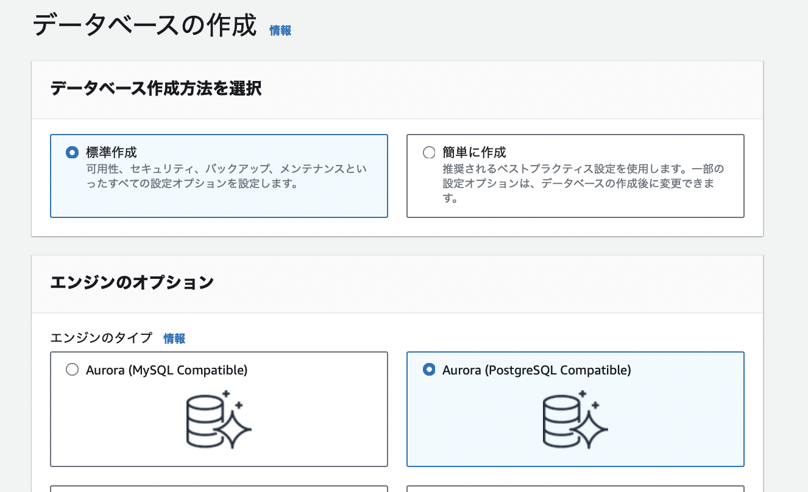

<br>

- 他のデータベースエンジンの RDS とは異なったアーキテクチャで構成される

<br>

- **作成時にストレージ容量を指定せず、運用時にはストレージが自動でスケーリングされるのが Aurora の大きな特徴**

<br>

- 他のデータベースエンジンの RDS とは異なった機能が提供されている

<br>

- Aurora と他のデータベースエンジンで利用できるインスタンスタイプが異なるので注意
    - Aurora ではメモリ最適化クラス(rクラスを含む),バースト可能クラス(tクラスを含む)のみ利用可能 

<br>

- 料金体系も他の RDS と少し違う

---

### RDS のアーキテクチャ

#### 特徴

- Aurora
    - RDS インスタンスとストレージが分離しているイメージ
    - デフォルトで**ストレージは自動でスケーリングされる** (特定の容量を指定してプロビジョニングできない)

    <br>

    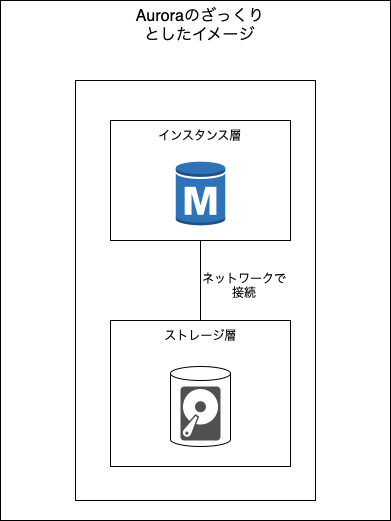

<br>

- 他の RDS
    - EC2 に RDBMS をインストールしたものを AWS が用意してくれるイメージ
    - ストレージは [EBS](./EBS.md) が RDS インスタンスにくっついている
    - オートスケーリングを有効にすればストレージが自動でスケーリングされる

    

---

### Aurora のアーキテクチャ

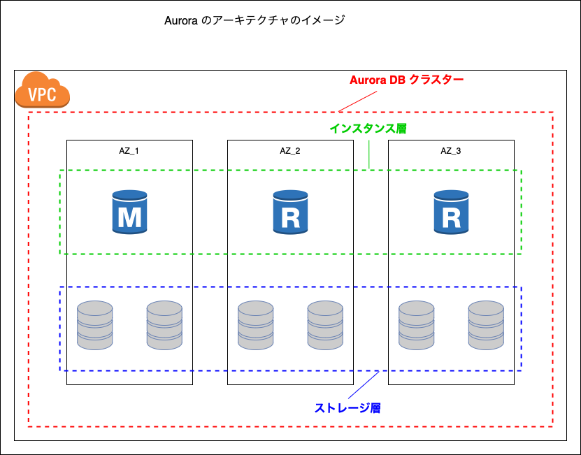

<br>

- Aurora は (Aurora DB) クラスターという単位で構成されており、以下の要素を持つ
    - 1つ以上の DB インスタンスから成るインスタンス層
    - データを保存するストレージ層

<br>

- インスタンス層
    - (最小構成) 1つのプライマリインスタンスと2つのリードレプリカ が異なる 3 AZ に分散配置される
    - リードレプリカは、1つの (Aurora DB) クラスター内で15個まで作成することができる

<br>

- ストレージ層
    - ストレージ層は、合計で6つのコピーから構成される
        - 3つの AZ に渡ってコピーを持つ
        - 各 AZ では、2つのストレージのコピーを持つ

    - プライマリもレプリカも同じストレージ層を参照 = 共有

    - 各ストレージの中身は 10GB ごとに、 Protection Group というグループで管理される

        - 実態は 10GB ごとにストレージノードにパーティショニングしてるっぽい

            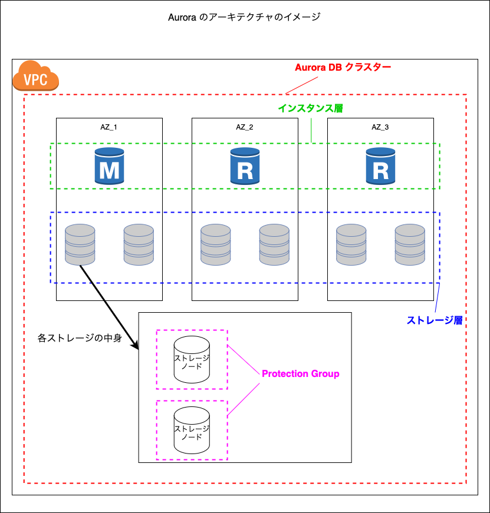

        <br>

        -  Protection Group はAZ をまたぐ

            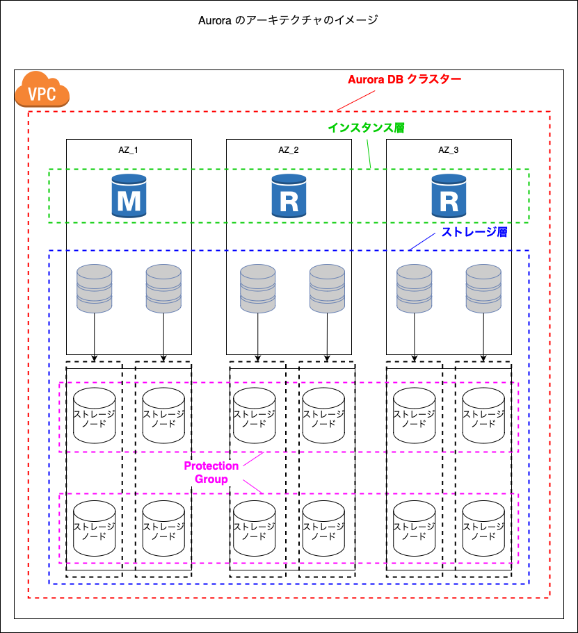

<br>

#### 書き込みと読み取り

- 書き込み
    - プライマリインスタンスが*書き込み*リクエストを受けると、6つのストレージに書き込みに行く
        - プライマリインスタンスからストレージへの書き込みは並行処理で行われる
        - プライマリインスタンスから Redo ログというログのみを各ストレージに送信して書き込みを行う
        
        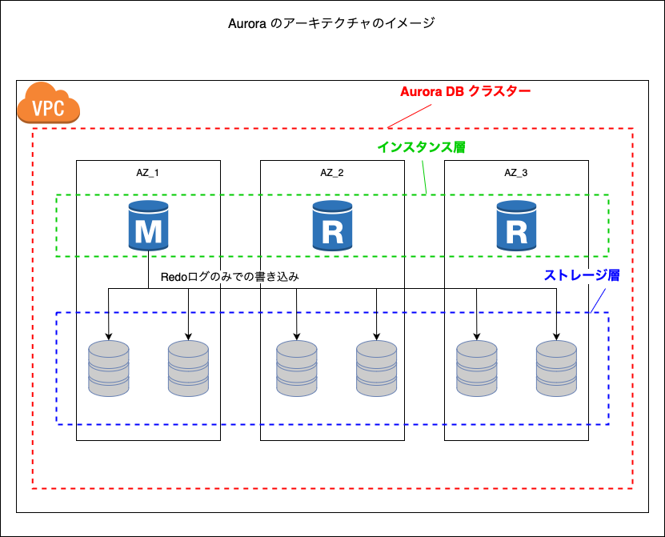

        <br>

    - プライマリへの書き込みの際、リードレプリカにもRedoログを送信してリードレプリカのキャッシュを更新する (非同期)

        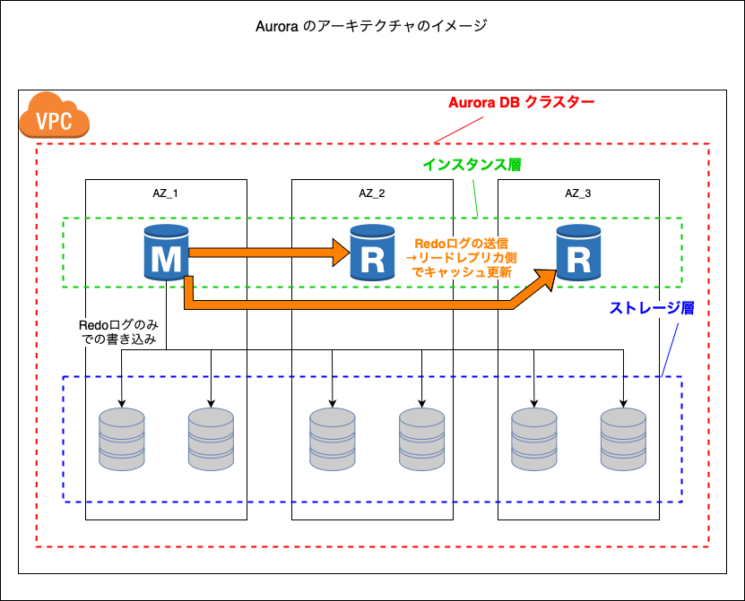

<br>

- 読み取り
    - まずはキャッシュを参照する
        - キャッシュにあれば、そのデータを返す
        - キャッシュになければストレージ層に問い合わせをする

        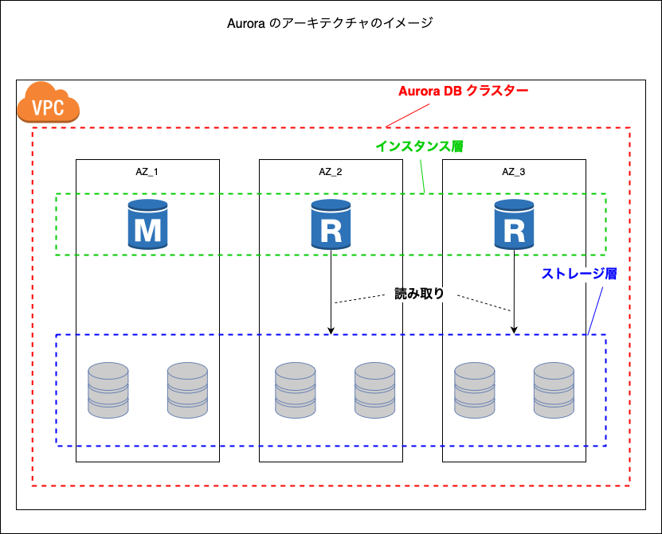

        <br>

    - リードレプリカへの読み取りの場合、最新データがキャッシュに反映されるまで20〜40msのラグがあるらしいので、常に最新データを読み取りたい場合はプライマリに読み取りに行く必要がある

<br>

#### Protection Group とリカバリ処理

- Protection Group (10GB ごとにストレージノードにパーティショニング) という機能により、リカバリ処理が他の RDS よりも早く完了できる

- スナップショットからデータ復旧 + ログを適用

    - 全 Protection Group に並列で復旧処理を行う + 各 Protection Group は最大 10GB の容量なのでリカバリ処理に時間をかけずに済む

    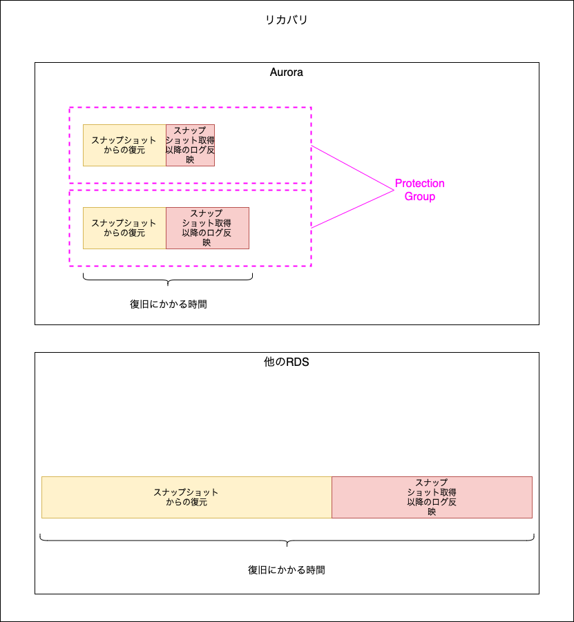

<br>
<br>

参考サイト

アーキテクチャ全般について
- [AuroraかRDSどちらを選ぶべきか比較する話をDevelopers.IO 2019 in OSAKAでしました #cmdevio](https://dev.classmethod.jp/articles/developers-io-2019-in-osaka-aurora-or-rds/#toc-rdsaurora)

- [Amazon Aurora のアーキテクチャまとめ](https://blog.okumin.com/entry/2017/05/21/194836)

Protection Group について
- [Amazon Aurora: Design Considerations for High Throughput Cloud-Native Relational Databases](https://pages.cs.wisc.edu/~yxy/cs764-f20/papers/aurora-sigmod-17.pdf)

読み取り、書き込みについて
- [Amazon Auroraのアーキテクチャについて調べる](https://zenn.dev/facengineer/scraps/0772c24cec1f4d)

---

### クォーラム

- 複数ノードにデータを冗長化して持つ場合、どのようにしてデータの整合性を保つかに関する仕組み(ルール)

    - 書き込みの際に、最低でも何個のノードに書き込む必要があるかを「書き込みクォーラム」という

    - 読み取りの際に、最低でも何個のノードから読み取る必要があるかを「読み込みクォーラム」という

    ```
    n 個のノードがあり、
    読み込みクォーラムを r、
    書き込みクォーラムを w、
    とおくと

    n < w + r を持たす場合、最新のデータを読み取ることを保証するらしい
    ```

<br>

- Aurora の場合、ノード(ストレージ)の数は6、書き込みクォーラムが4、読み込みクォーラムは3で運用される

    - 書き込みの際は、6つ中4つのストレージに書き込みが完了すると、書き込み成功となる
        - つまり、6つのストレージのうち2つ故障しても書き込み操作はできる = 高可用性

    - 読み込みの際は6つ中3つのストレージから読み込みが完了すると読み込み成功となる
        - つまり、6つのストレージのうち3つ故障しても読み込み操作はできる = 高可用性

    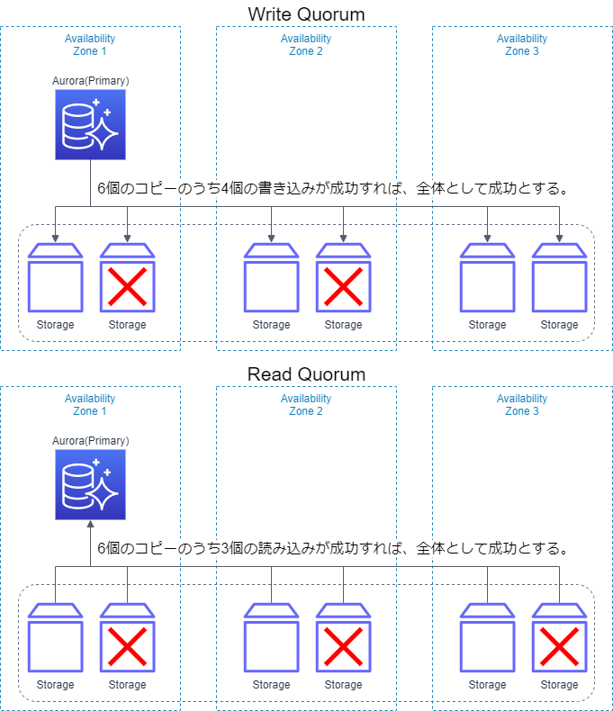

    引用: [クォーラムモデルを使用したAWSデータベースサービスの違い、共通点の比較 －Amazon Aurora、Amazon DocumentDB、Amazon Neptuneの比較表 －](https://tech.nri-net.com/entry/comparison_of_aws_quorum_model_databases)

<br>
<br>

参考サイト

[クォーラムモデルを使用したAWSデータベースサービスの違い、共通点の比較 －Amazon Aurora、Amazon DocumentDB、Amazon Neptuneの比較表 －](https://tech.nri-net.com/entry/comparison_of_aws_quorum_model_databases)

[最近よく聞くQuorumは過半数(多数決)よりも一般的でパワフルな概念だった](https://qiita.com/everpeace/items/632831371da5ff215995)

---

### Aurora のみで使える機能

- フェイルオーバー優先順位
    - プライマリがダウンした場合、どのレプリカを優先的にプライマリに昇格させるかを設定できる機能

<br>

- バックトラック
    - ★ **Aurora MySQL のみ利用可能**

    - DBクラスタを過去の状態に巻き戻す機能

    - スナップショットから復元するわけではないので、バックアップを取得する以前の状態にも復元可能

    - ポイントインタイムリカバリ (PITR) も特定の時点への DB クラスターの復元する機能だが、**バックトラックとは異なり、別のクラスターとして再作成してしまう**

<br>

- DevOps Guru
    - 機械学習 (ML) を活用してAmazon RDS 関連の問題を検出してくれるサービス

    - **他の RDS でも DB エンジンが PostgreSQL なら利用可能** 

<br>

- Aurora Serverless
    - インスタンスが自動でスケーリングされる機能
    - 詳しくは[こちら](./RDS_Aurora_Serverless.md)

<br>

- Aurora グローバルデータベース
    - 通常、 Aurora クラスターは単一リージョンに構築されるが、グローバルデータベースを利用すると複数リージョンにまたがって Aurora DB クラスターを構築できる

    - プライマリインスタンスがあるリージョンをプライマリリージョン、その他のリージョンをセカンダリーリージョンと呼ぶ

        - セカンダリリージョンの RDS インスタンスはリードレプリカのみ

        - リージョン間でのデータ同期は通常1秒未満で完了する

        - 最大5つのセカンダリリージョンを持てる

        <br>

    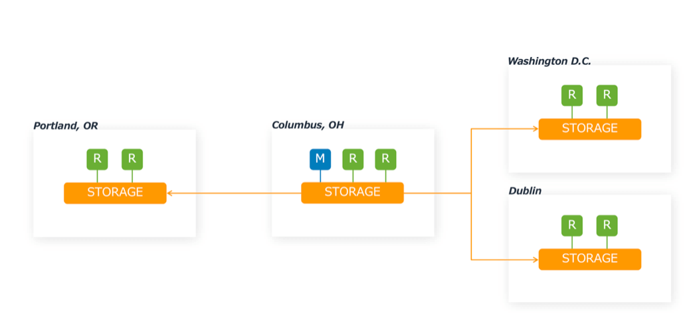

    引用: [AuroraかRDSどちらを選ぶべきか比較する話をDevelopers.IO 2019 in OSAKAでしました #cmdevio](https://dev.classmethod.jp/articles/developers-io-2019-in-osaka-aurora-or-rds/#toc-rdsaurora)

    <br>

    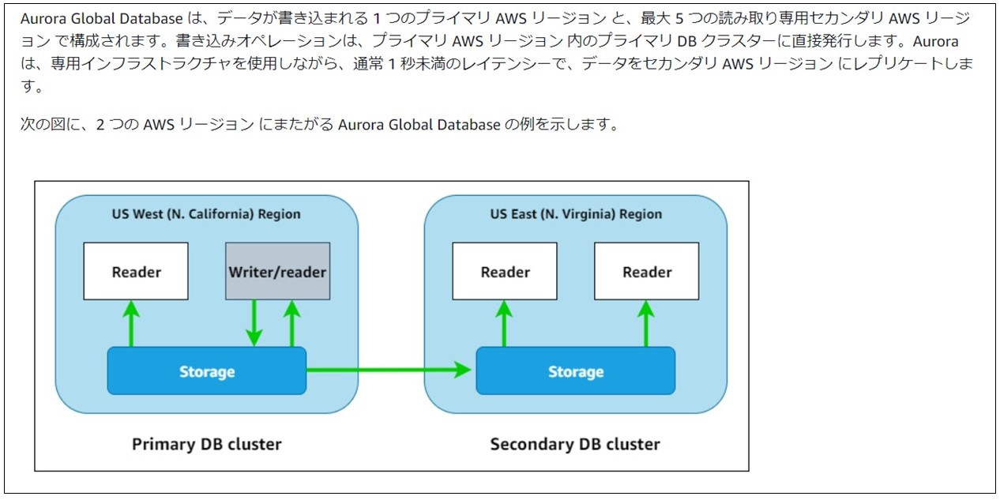

    引用: [Aurora Global Databaseを利用したDR自動切り替えについて](https://atlaxblogs.nri.co.jp/entry/20240910)

    <br>

    - グローバルデータベースのリージョン間レプリケーションの仕組みは、ストレージ層に Replication Fleet という機構が入り Aurora ストレージの変更分を転送するというもので、**DB インスタンスはレプリケーションに直接関与しない**

        - [この記事](https://speakerdeck.com/maroon1st/oshou-qing-niriziyonjian-drgadekiruaurora-global-databasefalseshi-li-wojian-temita?slide=44) によると、セカンダリリージョンに DB インスタンス無しでレプリケーション可能 = セカンダリリージョンの待機コストを抑えることができる

    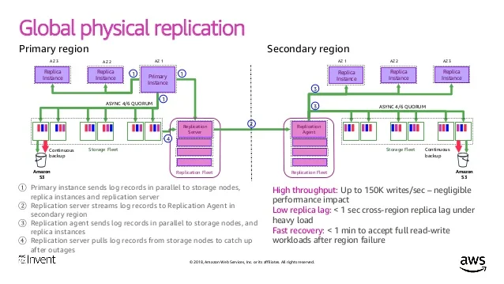

    引用:[Amazon Aurora Storage Demystified: How It All Works (DAT363) - AWS re:Invent 2018](https://www.slideshare.net/slideshow/amazon-aurora-storage-demystified-how-it-all-works-dat363-aws-reinvent-2018/124460195)

    <br>

    - **クロスリージョンリードレプリケーション**というリージョンをまたいでのレプリケーション機能もある

        - レプリケーションの仕組みとしては、リージョンをまたいでインスタンス間でログファイルを連携し、ログを受け取った他リージョンのインスタンスがそのリージョンのストレージを更新するというもの

    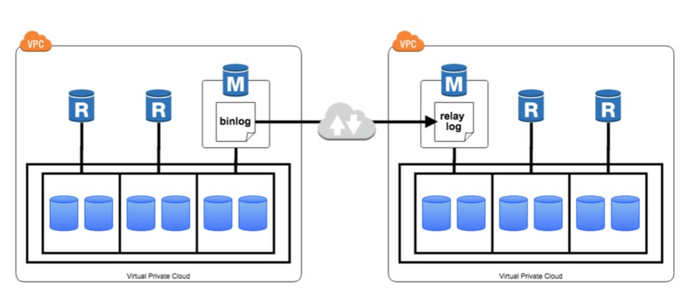

    引用: [AuroraかRDSどちらを選ぶべきか比較する話をDevelopers.IO 2019 in OSAKAでしました #cmdevio](https://dev.classmethod.jp/articles/developers-io-2019-in-osaka-aurora-or-rds/#toc-rdsaurora)

<br>

- クローン
    - Aurora DB クラスターのインスタンス層のみをコピーする機能

    - クローン先への書き込みは、クローン元に影響しない

    - クローン元のデータはクローン先からも参照可能

    - 本番データを使った開発・テストに利用できる

    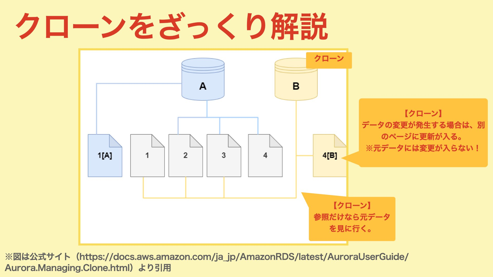

    引用: [【Aurora】バックアップが種類が多くて分からない。](https://study-infra.com/aurora-backup/#toc6)

<br>

- Auto Scaloing
    - リードレプリカの平均CPU使用率・接続数に応じて、リードレプリカの数を増加・減少を自動的に行わせる機能

    - Aurora Auto Scaling ポリシーを作成することで自動スケーリング可能

    - 詳しくはこちらに[記事](https://dev.classmethod.jp/articles/how-to-configure-amazon-aurora-auto-scaling/)を参照
    
    - 新しくリードレプリカを立ち上げるのに時間がかかるらしいので、急なアクセスのスパイクには対応出来なさそう

<br>
<br>

参考サイト

Aurora の機能全般について
- [AuroraとRDSの違いを一覧表でまとめてみた](https://dev.classmethod.jp/articles/aurora-or-rds-by-table/)

- [Amazon Auroraについてまとめてみました。](https://qiita.com/kuromame1020611/items/83643f14f0dd6ecd9dde#auroraグローバルデータベース)

- [AuroraかRDSどちらを選ぶべきか比較する話をDevelopers.IO 2019 in OSAKAでしました #cmdevio](https://dev.classmethod.jp/articles/developers-io-2019-in-osaka-aurora-or-rds/#toc-rdsaurora)

バックトラックについて
- [[小ネタ]Aurora MySQL の スナップショットの復元、ポイントインタイムリカバリ、バックトラックの違いを簡単にまとめてみた](https://dev.classmethod.jp/articles/aurora-mysql-snapshot-point-in-time-backtrack/)

DevOps Guru について
- [Amazon DevOps Guru for RDS をさわってみました](https://note.com/happyelements/n/nace9f2bf59a2)

グローバルテーブルについて
- [お手軽にリージョン間DRができるAurora Global Databaseの実力を見てみた](https://speakerdeck.com/maroon1st/oshou-qing-niriziyonjian-drgadekiruaurora-global-databasefalseshi-li-wojian-temita)

- [[アップデート] Auroraのストレージベースのリージョン間レプリケーションAurora Global Databaseが利用可能になりました #reinvent](https://dev.classmethod.jp/articles/reinvent2018-xx-xx-xx-2/)

- [Amazon Aurora Global Databaseを導入するまで](https://team-blog.mitene.us/mitene-multiregion-aws-aurora-global-database-c0434c60a204)

Auto Scaling について
- [レプリカをオートスケールさせるAmazon Aurora Auto Scalingの導入ポイントをまとめてみた](https://dev.classmethod.jp/articles/how-to-configure-amazon-aurora-auto-scaling/)

- [AuroraにAutoScalingを実装しようとしたら失敗した話](https://zenn.dev/momonga3939/articles/7b05e228a25fe1)

---

### コスト

#### 基本コスト

- インスタンスに対する使用料
    - プライマリ、レプリカそれぞれで料金が発生する
    - 利用するインスタンスタイプによって金額が異なる
    - 利用するリージョンによっても金額が異なる

    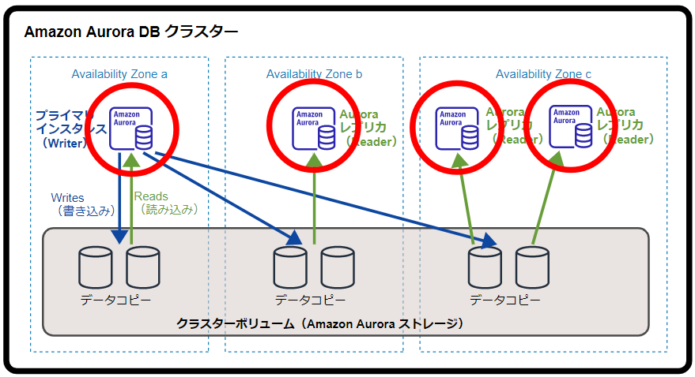

    引用: [Amazon Aurora の料金](https://blog.serverworks.co.jp/aurora-estimate#データベースストレージおよびIO)

<br>

- ストレージに対する使用料
    - 1GB あたり \~~ USD での課金方式
    - リージョンによって金額が異なる
    - ★ 6つのストレージ分ではなく、**1ストレージ分の料金が発生する**

    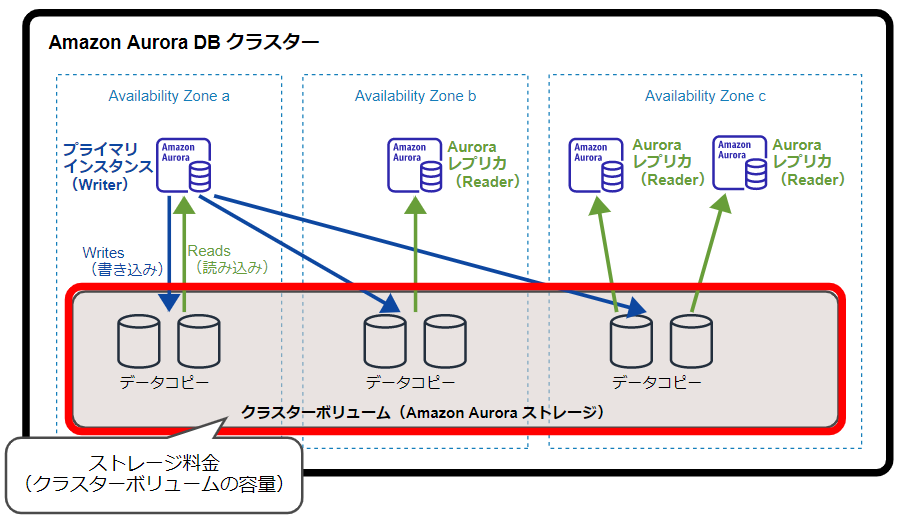

    引用: [Amazon Aurora の料金](https://blog.serverworks.co.jp/aurora-estimate#データベースストレージおよびIO)

<br>

- I/O リクエスト数に対する課金
    - 100万リクエストあたり \~~ USD での課金方式
    - リージョンによって金額が異なる
    - ★ 6つのストレージ分ではなく、**1ストレージ分の料金が発生する**

    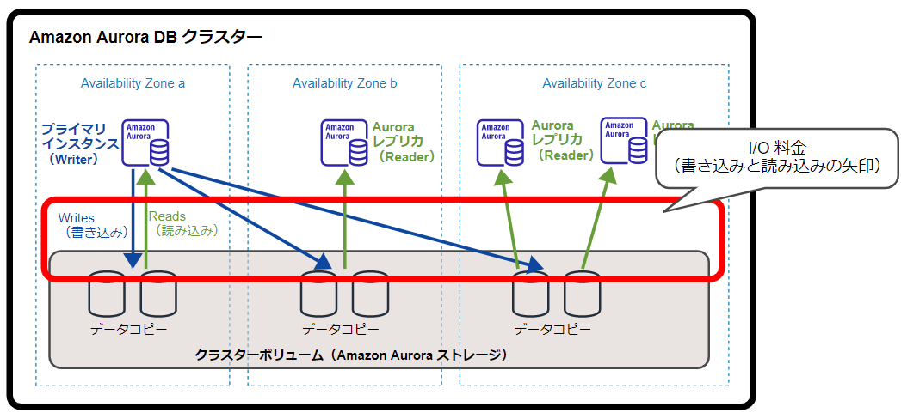

    引用: [Amazon Aurora の料金](https://blog.serverworks.co.jp/aurora-estimate#データベースストレージおよびIO)

    <br>

    - ★ I/O のカウントは**ストレージへの1回の読み込み、1回の書き込みでそれぞれ1 I/Oとは限らない**

        - 1回の**データベースページ**の読み取りで 1 I/O とカウントされる
            - データベースページについては[こちら](https://atmarkit.itmedia.co.jp/ait/articles/0405/19/news089.html)を参照
        
        <br>

        - 1回の書き込みで Redo ログが 4KB 以内の場合 1 I/O とカウントされる
            - 4KB 以上の場合は複数回の I/O が実行される

<br>

#### 2つの料金体系

- Aurora Standard
    - 上記の[基本コスト](#基本コスト)が発生する通常の料金体系

<br>

- Aurora I/O 最適化
    - 「ストレージの費用が 2.25 倍に増える」 + 「インスタンスの使用料金が1.3倍に増える」 代わりに I/O リクエスト費用が無料になる料金体系
    - Aurora請求金額の中で I/O の比重が大きい場合にこちらの料金体系に切り替えるとコストを抑えることができる場合もある　by [こちらの記事](https://zenn.dev/neinc_tech/articles/604b2687ee015d)

<br>

#### その他費用

- バックアップ
    - 他の RDS と同じ
    - [こちら](./RDS_Backup.md#コスト)を参照

<br>

- バックトラック
    - バックトラックによって変更されたレコード100万件あたり \~~ USD での課金方式
    - リージョンによって金額が異なる

<br>

- Aurora グローバルデータベース
    - セカンダリリージョンで起動しているインスタンスの使用料金が発生する
    - 同様に、セカンダリリージョンでのストレージおよび I/O リクエスト (セカンダリリージョンではリードレプリカのみなので読み込み I/O) にも料金が発生する
    - ★ プライマリリージョンの変更をセカンダリリージョンにレプリケーションする際の書き込み I/O 100万件あたり \~~ UDS の形で料金が発生する

    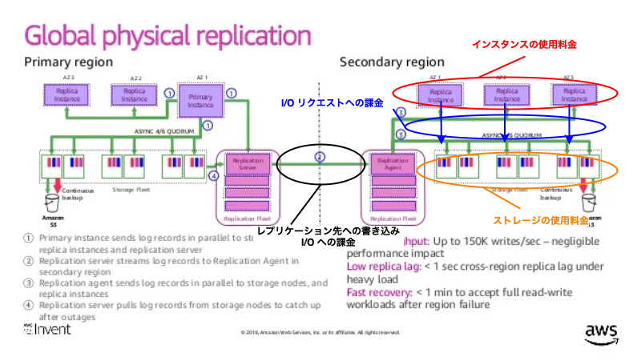

<br>

- クローン
    - クローンクラスター内の RDS インスタンス使用料が発生する
    - クローンクラスターの RDS によって作成されるストレージには使用料金が発生する
    - クローンクラスターの RDS による I/O リクエストにも料金が発生する

    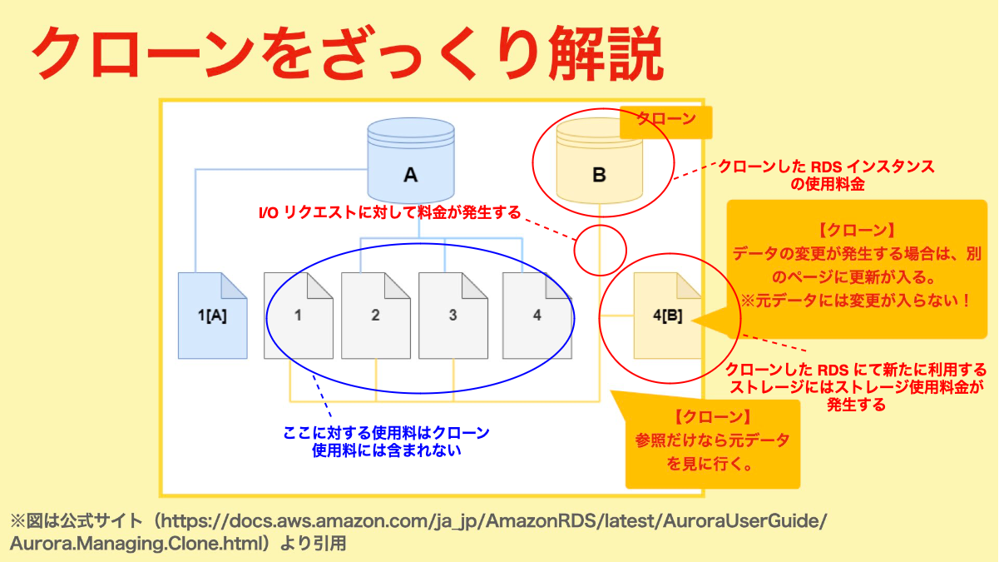

<br>

- データ転送
    - 他の RDS と同じ
    - [こちら](./RDS.md#料金)を参照

    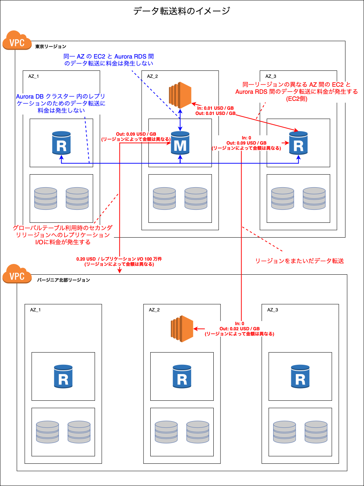

<br>
<br>

参考サイト

料金全般について
- [Amazon Aurora の料金](https://blog.serverworks.co.jp/aurora-estimate)

- [AWS再入門ブログリレー Amazon Aurora 編](https://dev.classmethod.jp/articles/re-introduction-2020-amazon-aurora/#toc-13)

I/O リクエストについて
- [Amazon Aurora のよくある質問 - Aurora の I/O オペレーションとは何ですか? どのように計算されるのですか?](https://aws.amazon.com/jp/rds/aurora/faqs/#What_are_I.2FO_operations_in_Aurora_and_how_are_they_calculated.3F)

- [Amazon AuroraのIO関連で見るべき指標](https://zenn.dev/tommyasai/articles/ef94f6f4fab7df#iopsとは)

Aurora I/O 最適化について
- [Amazon Aurora I/O-Optimized で Aurora のコスト最適化を実際に行った結果](https://blog.serverworks.co.jp/results-of-actual-cost-optimization-for-amazon-aurora-with-io-optimized#IO-リクエストが請求で問題になる場合)

クローンの I/O 料金について言及している記事
- [Planning I/O in Amazon Aurora](https://aws.amazon.com/jp/blogs/database/planning-i-o-in-amazon-aurora/)