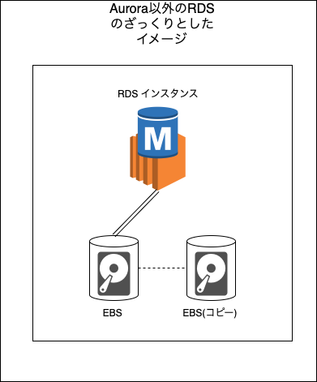

### Aurora とは

- AWS RDS のデータベースエンジンの1つ
    - MySQL と互換性のある Aurora MySQL Compatible が利用可能

    - PostgreSQL と互換性のある Aurora PostgresSQL Compatible が利用可能

        → すでに運用している MySQL か PostgresSQL の DB を RDS Aurora に移行したい場合は楽に移行できる

    

 

- 他のデータベースエンジンの RDS とは異なったアーキテクチャで構成される

 

- **作成時にストレージ容量を指定せず、運用時にはストレージが自動でスケーリングされるのが Aurora の大きな特徴**

 

- 他のデータベースエンジンの RDS とは異なった機能が提供されている

 

- 料金体系も他の RDS と少し違う

---

### RDS のアーキテクチャ

#### 特徴

- Aurora
    - RDS インスタンスとストレージが分離しているイメージ
    - デフォルトで**ストレージは自動でスケーリングされる** (特定の容量を指定してプロビジョニングできない)

     

    

 

- 他の RDS
    - EC2 に RDBMS をインストールしたものを AWS が用意してくれるイメージ
    - ストレージは [EBS](./EBS.md) が RDS インスタンスにくっついている
    - オートスケーリングを有効にすればストレージが自動でスケーリングされる

    

---

### Aurora のアーキテクチャ

 

- Aurora は (Aurora DB) クラスターという単位で構成されており、以下の要素を持つ
    - 1つ以上の DB インスタンスから成るインスタンス層
    - データを保存するストレージ層

 

- インスタンス層
    - (最小構成) 1つのプライマリインスタンスと2つのリードレプリカ が異なる 3 AZ に分散配置される
    - リードレプリカは、1つの (Aurora DB) クラスター内で15個まで作成することができる

 

- ストレージ層
    - ストレージ層は、合計で6つのコピーから構成される
        - 3つの AZ に渡ってコピーを持つ
        - 各 AZ では、2つのストレージのコピーを持つ

    - ストレージ層は

    - 各ストレージの中身は 10GB ごとに、 Protection Group というグループで管理される

        - 実態は 10GB ごとにストレージノードにパーティショニングしてるっぽい

            

         

        -  Protection Group はAZ をまたぐ

            

 

#### 書き込みと読み取り

- 書き込み
    - プライマリインスタンスが*書き込み*リクエストを受けると、6つのストレージに書き込みに行く
        - プライマリインスタンスからストレージへの書き込みは並行処理で行われる
        - プライマリインスタンスから Redo ログというログのみを各ストレージに送信して書き込みを行う
        
        

 

- 読み取り
    - TODO: 読み取りの仕組みを追記
 

#### レプリケーション

TODO: レプリケーションの仕組みを追記

 

#### Protection Group とリカバリ処理

TODO: Protection Group という仕組みによりリカバリの際のメリットを追記

 
 

参考サイト

アーキテクチャ全般について
- [AuroraかRDSどちらを選ぶべきか比較する話をDevelopers.IO 2019 in OSAKAでしました #cmdevio](https://dev.classmethod.jp/articles/developers-io-2019-in-osaka-aurora-or-rds/#toc-rdsaurora)

- [Amazon Aurora のアーキテクチャまとめ](https://blog.okumin.com/entry/2017/05/21/194836)

Protection Group について
- [Amazon Aurora: Design Considerations for High Throughput Cloud-Native Relational Databases](https://pages.cs.wisc.edu/~yxy/cs764-f20/papers/aurora-sigmod-17.pdf)

----

### Aurora のみで使える機能

- フェイルオーバー優先順位
- バックトラック
- DevOps Guru
    - 他の RDS でも DB エンジンが PostgreSQL なら利用可能 
