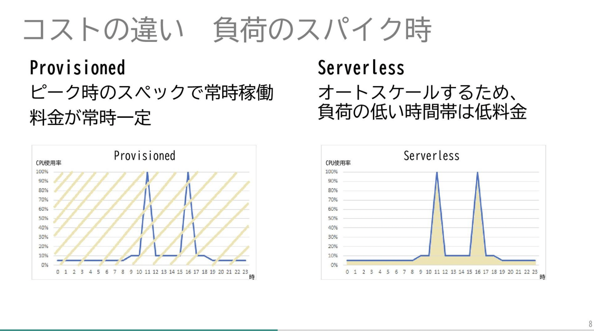

### Aurora Serverless　とは

- RDS インスタンスも利用状況に応じてスケーリング (スケールアップ/ダウン) する機能

<br>

- 新しいサービスで必要な DB インスタンスのサイズがわからない場合に適しているかも

<br>

- 現在は Serverless v2 がリリースされ、そちらの方が v1 よりも性能が高い
    - スケーリングの速度がかなり早くなった = 急なスパイクにも対応可能
    - スケーリングの単位が細かくなった
    - こちらの[記事](https://aws.amazon.com/jp/builders-flash/202402/awsgeek-amazon-aurora-serverless/)が v1 と v2 の (仕組み的な) 違いを分かりやすく説明している

<br>

- 利用するには、Serverless v2 に対応するDB エンジンバージョンを指定する必要がある

    - Serverless v2 に対応する Aurora DB エンジンバージョンを指定すると、インスタンスタイプの設定にて、サーバーレスが選択可能

    

    引用: [待たせたな！噂のAuroraサーバーレスv2がGA。初心者にも分かりやすくまとめてみた](https://qiita.com/minorun365/items/2a548f6138b6869de51a#aurora-serverless-v2で良くなったところ)
 
<br>
<br>

参考サイト

[Amazon Aurora Serverless v2 がGAしました](https://blog.serverworks.co.jp/aurora-serverless-v2-ga)

[【レポート】スパイクにもすぐにオートスケールするようになったAmazon Aurora Serverless v2のDeep Dive #reinvent #EMB023](https://dev.classmethod.jp/articles/reinvent-2020-new-launch-aurora-serverless-v2/)

[Amazon Aurora Serverless をグラレコで解説](https://aws.amazon.com/jp/builders-flash/202402/awsgeek-amazon-aurora-serverless/)

[待たせたな！噂のAuroraサーバーレスv2がGA。初心者にも分かりやすくまとめてみた](https://qiita.com/minorun365/items/2a548f6138b6869de51a)

---

### Aurora Capacity Unit (ACU) 

- Aurora 容量ユニット (ACU) とは、 Aurora Serverless で利用されるインスタンスの処理能力の指標

- 1 ACU 当たり、**約 2 GiB のメモリ**とそれに対応する CPU とネットワークが割り当てられている
    - 2 ACU だと **約 4 GiB のメモリ**とそれに対応する CPU とネットワークが割り当てられている
    - Aurora Serverless v2 では 最小 ACUは 0.5 (= 1GB の RAM)、 最大 ACU は 128 (= 256GB の RAM)
    - Aurora Serverless v2 では ACU は 0.5 単位でスケーリングされる
    - ★ RDS インスタンスが全く利用されていない時でも、最小 ACU の 0.5 が割り当てられることに注意

<br>
<br>

参考サイト

[Amazon Aurora Serverless をグラレコで解説](https://aws.amazon.com/jp/builders-flash/202402/awsgeek-amazon-aurora-serverless/#Aurora_Capacity_Unit_.E3.81.AE.E8.A8.AD.E5.AE.9A)

[Aurora Serverless v1とv2のACUの考え方の違い](https://qiita.com/__hskw/items/7c33a0db400d81f9d4b2)

---

### ポイント

- 非サーバーレス Aurora の一部機能を使えない
    - バックトラックや Aurora Auto Scaling などは利用できなくなる

<br>

- プロビジョニング済み Aurora DB クラスターに Serverless インスタンスを混在させることが可能

<br>

- Serverless v1 ではインスタンスのスケールアップが発生したら5分間のクールダウンが発生する (= 5分間はインスタンスのスケーリングができなくなる)
    - 一方 Serverless v2 では明示的なクールダウン期間はなく、ミリ秒単位でシームレスにスケーリングすることができる

- Serverless v1 ではインスタンスのスケールダウンが発生したら15分間のクールダウン発生する (= 5分間はインスタンスのスケーリングができなくなる)
    - 一方 Serverless v2 では明示的なクールダウン期間はなく、ミリ秒単位でシームレスにスケーリングすることができる

<br>
<br>

参考サイト

[待たせたな！噂のAuroraサーバーレスv2がGA。初心者にも分かりやすくまとめてみた](https://qiita.com/minorun365/items/2a548f6138b6869de51a)

[Aurora Serverless v2 への移行](https://docs.aws.amazon.com/ja_jp/AmazonRDS/latest/AuroraUserGuide/aurora-serverless-v2.upgrade.html#aurora-serverless.comparison)

---

### コスト

- インスタンス使用料以外は普通の Aurora と同様のコストがかかる

<br>

#### Serverless インスタンスの使用料
- 通常の Aurora のようにインスタンスタイプを指定して作成する RDS インスタンスとは異なり、 ACU に応じて1時間 \~~ USD という課金方式
- リージョンによって金額が異なる
- 料金体系(Aurora Standard / Aurora I/O 最適化)によって金額が異なる

<br>
<br>

#### RDS Proxy の利用料金

- 詳しくは[こちら](./RDS_Proxy.md#コスト)を参照


参考サイト

[Amazon Aurora の料金](https://aws.amazon.com/jp/rds/aurora/pricing/?pg=pr&loc=1#Pricing_by_database_instances)

---

### 非サーバーレスとサーバーレスのコストの比較



引用: [Amazon Aurora徹底比較 Provisioned vs Serverless](https://speakerdeck.com/chiharutsuboi/amazon-aurorache-di-bi-jiao-provisioned-vs-serverless?slide=8)

- ケースによってはプロビジョンドインスタンスを利用する方が安くなることがある

- 新しいサービスで必要な DB インスタンスのサイズがわからない場合には適しているかも

<br>

#### 練習問題

1. 基本的に低負荷だが、数時間だけアクセスが急激に増えるケース

    ```
    東京リージョンで運用
    基本的にアクセスは低負荷で 2GB のRAMがあれば捌けるが、1日のうちにアクセスが高まる時間が2時間ほどある。その際には 32GB の RAM で対応したい。

    ------------------

    [プロビジョンドの場合 (MySQL)]
    - ピーク時を捌けるスペックのインスタンスタイプで作成
        - 例: db.r6g.xlarge (32 GB RAM) で作成

    - 1ヶ月のインスタンス使用料金は以下の通り
        → 0.51 (インスタンスの東京リージョンでの使用料) × 24 (時間) × 31 (日)= 379.44 USD

    ------------------

    [Serverless v2 の場合]
    - 基本的には 1 ACU で捌ける

    - ピーク時には 16 ACU にスケールアウトする

    - 1日の料金は以下の通り
        → { 0.20 (1 ACU の東京リージョンでの使用料(Auroa Standard)) × 22 (時間) } + { 3.2 (8 ACU の東京リージョンでの使用料(Auroa Standard)) × 2 (時間) } = 10.8 USD 

    - 上記より、1ヶ月のインスタンス使用料金は 10.8 (インスタンスの1日の料金) × 31 (日) = 334.8 USD

    ------------------

    結果: Serverless v2 の方がお得
    ```

<br>

2. いつも低負荷のケース

    ```
    東京リージョンで運用
    いつも低アクセスなので 2GB RAM あれば問題ない

    ------------------

    [プロビジョンドの場合 (MySQL)]
    - db.t4g.small (2GB RAM) で作成

    - 1ヶ月のインスタンス使用料は以下の通り
        → 0.05 (インスタンスの東京リージョンでの使用料) × 24 (時間) × 31 (日) = 37.2 USD

    ------------------

    [Serverless v2 の場合]
    - 基本的には 1 ACU で捌ける

    - 今回は 0.5 ACU にスケールダウンするケースは考えない

    - 1ヶ月のインスタンス使用料は以下の通り
        → 0.20 (1 ACU の東京リージョンでの使用料(Auroa Standard)) × 24 (時間) × 31 (日) = 148.8 USD

    ------------------

    結果: プロビジョンドインスタンスの方がかなりお得
    ```

<br>
<br>

参考サイト

[私がAmazon Aurora Serverless v2を選択すべきか質問されたときに答えたこと](https://fintan.jp/page/11632/)

[Amazon Aurora徹底比較 Provisioned vs ](https://speakerdeck.com/chiharutsuboi/amazon-aurorache-di-bi-jiao-provisioned-vs-serverless)

[Aurora Serverless v2とAurora Provisionedのコスト比較　3つの変数を“羅針盤”に優位境界面を探る](https://logmi.jp/brandtopics/328375)