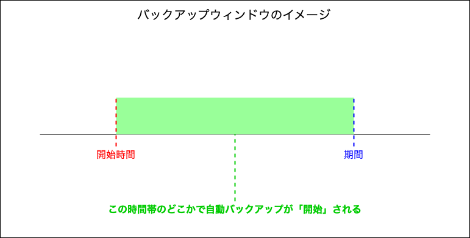
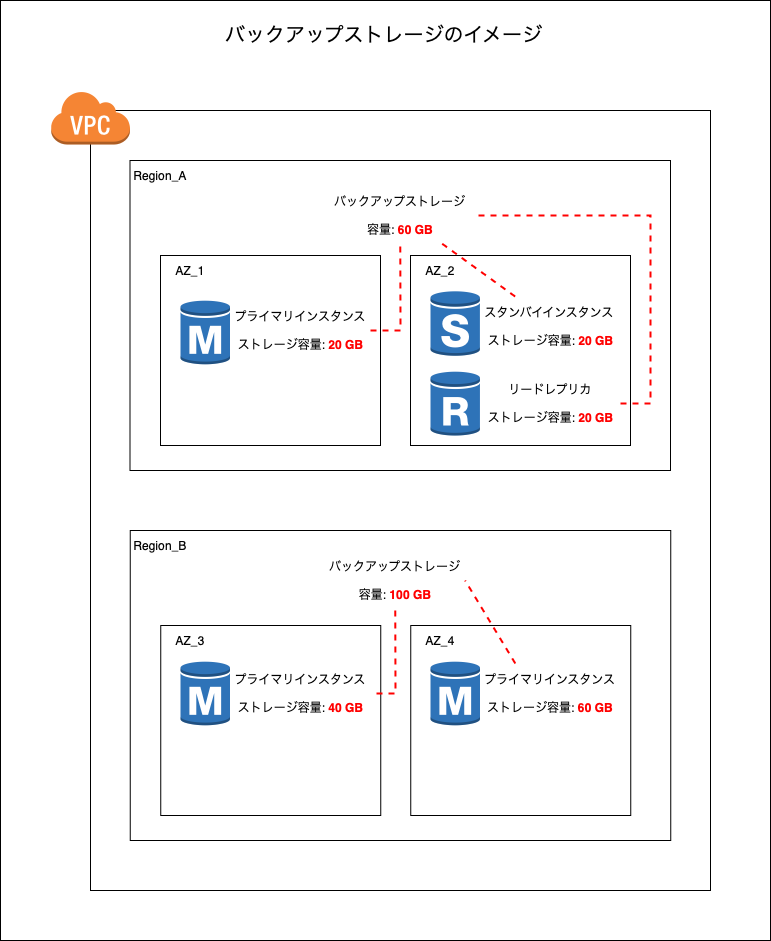

### RDS のバックアップ

#### 自動バックアップ

- AWS 側で定期的に取得してくれる RDS のスナップショット
    - 初回のスナップショット取得の時だけフルバックアップ
    - 以降のスナップショットは増分バックアップ (前回のバックアップからの変更分のみのバックアップ)
    
 

- 自動バックアップで取得されたスナップショットの保存期間は最大で 35 日間まで
    - 自動バックアップで取得されたスナップショットは 35 日を過ぎると自動で削除される
    - 35 日間以上保存したい場合、 S3 などにスナップショットをエクスポートする必要がある

 

- DB のスナップショットだけではなく「トランザクションログ」も取得 & 保存される
    - トランザクションログは 5分ごとに取得され、S3 に保存されるらしい

 

- 復元の際はスナップショット + トランザクションログでレストアするため、障害が発生する 5 分までの状態を復元できる

 

- 自動バックアップのスケジュール(=バックアップウィンドウ)を設定することができる
    - バックアップのスケジュールを指定しなかった場合、[リージョンごと設定されているスケジュール](https://docs.aws.amazon.com/ja_jp/AmazonRDS/latest/UserGuide/USER_ManagingAutomatedBackups.html#USER_WorkingWithAutomatedBackups.BackupWindow)に従って自動バックアップが実行される

 

- スナップショットからの RDS をリストアする際は、新しい RDS インスタンスが作成されることに注意

 

#### 手動バックアップ

- 普通のバックアップ。 自分で RDS のスナップショットを取得すること
    - 手動バックアップ = フルバックアップ

 

- 手動バックアップで取得したスナップショットは、保存期間の期限はない

 

- 手動バックアップで取得したスナップショットから復元する場合、スナップショットだけでレストアするので、手動バックアップを取得した時点のみに復元可能

 

- スナップショットからの RDS をリストアする際は、新しい RDS インスタンスが作成されることに注意

 

#### ポイント (自動/手動バックアップ共通)

- RDS インスタンスの状態が停止の場合はスナップショットは取得されない

 

- スナップショット (+ トランザクションログ) を別リージョンにコピーすることで、コピー先で RDS インスタンスの復元をすることも可能

    - スナップショット (+ トランザクションログ) を別リージョンにコピーする際に、**[データ転送料金](#復元コスト)が発生する**ことに注意

 

- Single-AZ DB インスタンス構成の場合、**スナップショットの取得開始時にI/O が短時間中断する**(データ容量によって数秒 ~ 数分)
    - [Multi-AZ DB Instances](./RDS.md#multi-az-db-instances) 構成の場合、スタンバイインスタンスからスナップショットを取得するため I/O は中断しない

    - [Multi-AZ DB Cluster](./RDS.md#multi-az-db-cluster)も[こちらの記事](https://aws.amazon.com/jp/blogs/database/choose-the-right-amazon-rds-deployment-option-single-az-instance-multi-az-instance-or-multi-az-database-cluster/)によると、スナップショット取得にて I/O の中断は発生しないらしい

 
 

参考サイト

[【RDS(PostgreSQL)】バックアップとリストアを完璧に理解したい](https://study-infra.com/rds-postgresql-backup-restore/#toc2)

[RDS のスナップショットを作成するには、状態が available である必要があります。](https://dev.classmethod.jp/articles/tsnote-rds-snapshot-stopped-001/)

[Choose the right Amazon RDS deployment option: Single-AZ instance, Multi-AZ instance, or Multi-AZ database cluster](https://aws.amazon.com/jp/blogs/database/choose-the-right-amazon-rds-deployment-option-single-az-instance-multi-az-instance-or-multi-az-database-cluster/)

---

### バックアップウィンドウ

- = バックアップスケジュール
    - 「開始時間」と「期間」を指定する

    *期間 = バックアップの取得にかかる時間ではないので注意

 

 
 

参考サイト

[Amazon RDS for Db2: スナップショットの作成とリストア](https://qiita.com/nishikyon/items/947695b0d41ae24665ce)

[AWS RDSのバックアップ・リカバリを試してみた](https://qiita.com/Unimaru/items/e1f6fc12a94b5f11a664)

---

### バックアップストレージ

- RDS の自動バックアップ、手動バックアップのスナップショットが保存される場所

 

- バックアップストレージは、「そのリージョンに配置されている RDS のストレージの総容量」と同じ容量が確保される
    
    

 

#### 注意点

- スナップショットを別リージョンに移動させると、移動先リージョンのバックアップストレージを消費する (+さらにリージョン間でのデータ転送料が発生する)

 

- リージョンのバックアップストレージの容量を超えてスナップショットを保存している場合、 0.095 UDS / GB のバックアップストレージ使用料金が毎月発生するので注意 (Auroraの場合、金額が異なる)

 

- RDS イスタンスの削除時にスナップショットを保持するを選択するとそのスナップショットに 0.095 UDS / GB のバックアップストレージ使用料金が毎月発生するので注意 (Auroraの場合、金額が異なる)

 
 

参考サイト

[バックアップの概要](https://docs.aws.amazon.com/ja_jp/AmazonRDS/latest/UserGuide/USER_WorkingWithAutomatedBackups.html#USER_WorkingWithAutomatedBackups.BackupStorage)

---

### コスト

#### バックアップストレージコスト

- 該当するリージョンのバックアップストレージが 100% を超えるまでは、バックアップストレージに対する追加料金は発生しない

    - (Aurora以外) リージョンのバックアップストレージの容量を超えてスナップショットを保存している場合、 0.095 UDS / GB のバックアップストレージ使用料金が毎月発生する

        - Aurora の場合はもっと安い (リージョンによって異なるが、高くてもサンパウロで 0.037 UDS / GB)

     

    - (Aurora以外) 削除された RDS インスタンスのスナップショットには 0.095 UDS / GB のバックアップストレージ使用料金が毎月発生する

        - Aurora の場合はもっと安い (リージョンによって異なるが、高くてもサンパウロで 0.037 UDS / GB)

 

#### 復元コスト

- 基本的にはかからない

    - スナップショット (+ トランザクションログ) を他リージョンにコピーし、コピー先で復元する場合、スナップショット (+ トランザクションログ) のデータ転送料 (Out) が発生する
        - 異なるリージョンからのデータ転送料 (In) には料金は発生しない
        - 異なるリージョンへのデータ転送料 (Out) は 0.02 USD / GB

     

    - スナップショットのコピー先で RDS インスタンスがない場合、コピーしたスナップショットに[バックアップストレージ使用料金](#バックアップストレージ)が発生する (バックアップストレージの容量を超えた場合に発生するバックアップストレージ使用料金)

 
 

参考サイト

[Amazon RDS の料金](https://aws.amazon.com/jp/rds/pricing/)