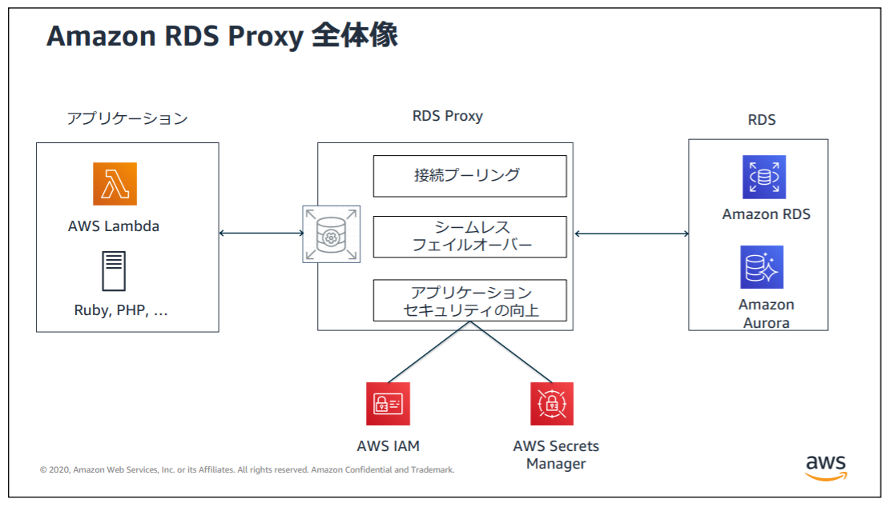

### RDS Proxy とは

#### ざっくり概要

- アプリケーション(クライアント)と RDS の間に設置するフルマネージド型データベースプロキシサービス



引用: [【徹底解説】RDS Proxyとは？](https://www.sunnycloud.jp/column/20210502-01/)

<br>

#### 機能

- コネクションをプーリングする + 複数のDBクライアントでプーリングしたコネクションを使い回す (コネクションプーリングについては[こちら](https://gihyo.jp/dev/serial/01/db-academy/000502#sec1_h5)がわかりやすい)

    → 接続の開閉による負荷を軽減することができる

<br>

- セキュリティの向上が見込める
    - RDS がユーザー名/パスワード認証しか受け付けない場合でも、 クライアントと RDS Proxy 間では IAM 認証で接続し、 RDS Proxy と RDS 間でユーザー名/パスワード認証で接続することができる
        - クライアント側ユーザー名/パスワードを使う必要がなくなるし、管理も不要

<br>

- フェイルオーバーの時間を短縮することができる
    - フェイルオーバー: メイン RDS に障害が発生した時にスタンバイ RDS に切り替えること

    - RDS Proxy 無しのマルチ AZ 構成時のフェイルオーバーだと、 DNS の RDS へのレコードを変更する必要が出てくる (AWS がやってくれる)

    - RDS Proxy を利用すると、DNS レコードを変更する前に RDS Proxy が接続先を切り替えてくれるので、フェイルオーバーの時間短縮が期待できる (約32%早くなるらしい)

<br>
<br>

参考サイト

RDS Proxy 全般について
- とてもわかりやすかった記事: [第1回 「Amazon Aurora と RDS Proxy」を視聴した](https://tech.akat.info/?p=3795)

- [[プレビューリリース]PostgreSQLにもRDS Proxyが来ました！](https://dev.classmethod.jp/articles/rds-proxy-with-postgresql-compatibility/)

- [【徹底解説】RDS Proxyとは？](https://www.sunnycloud.jp/column/20210502-01/)

- [RDS Proxyと戯れた話【AWS】](https://qiita.com/s0mpt15/items/2d325fc5e170721102d2#rds-proxyとは)

- [既存システムへのAmazon RDS Proxy導入記](https://engineerblog.mynavi.jp/technology/introduce-amazon-rds-proxy/)

RDS のフェイルオーバー時間の短縮について

- [第1回 「Amazon Aurora と RDS Proxy」を視聴した](https://tech.akat.info/?p=3795)

- [Amazon RDS Proxy を使用したアプリケーションの可用性の向上](https://aws.amazon.com/jp/blogs/news/improving-application-availability-with-amazon-rds-proxy/)

コネクションプーリングについて

- [最終回　治療としてのパフォーマンスチューニング―システムの病気はどう治す？（2）](https://gihyo.jp/dev/serial/01/db-academy/000502#sec1_h5)

---

### 「ピン留め」とは

- RDS Proxy と DB 間のコネクションを特定のクライアントが占有してしまう状態のこと

    - そのコネクションを他のクライアントが使い回せなくなくなってしまう

<br>

#### ピン留めが発生する条件

- クライアントがSETコマンド(character set や time zoneなどを指定するコマンド)を利用する時

- クライアントがプリペアードステートメントを利用する時

- クライアントのステートメント(クエリ)のテキストサイズが 16 KB以上の時

などなど

<br>

#### ピン留めに対して RDS Proxy 側ができること

- セッション固定フィルタ
    - クライアントからの特定の操作をピン留め対象外にすることができる機能

<br>

- 初期化クエリ
    - SQL 文(クエリ)を記述でき、そのクエリは RDS Proxy から RDS に接続を確立する際の初期化処理として実行する機能

    - クライアント側で SETコマンドを使うのではなく、 Proxy 側で使わせるイメージ

<br>
<br>

参考サイト

[RDS Proxyが無意味になる恐怖の現象「ピン留め」を回避するための基本的な設定値について](https://dev.classmethod.jp/articles/rds-proxy-avoid-session-pinning/)

[【Lambda＋RDS Proxy】RDS Proxy利用時に'?'などのパラメータを用いているSQLである「プリペアドステートメント」を使った場合、ピン留めが発生して悪影響が出た](https://qiita.com/kss_nm/items/251394aeb6c488c4ae7f)

[AWS LambdaとRDS Proxyとコネクションプールの話](https://tech.buysell-technologies.com/entry/2021/04/23/175313#Lambda-RDS-Proxy間で発生するピン留めについて)

[RDS Proxyのピン留めを許容できるケースについて考えてみる](https://dev.classmethod.jp/articles/rdsproxy-usecase-that-allows-pinning/)

---

### コスト

- RDS Proxy を利用するリージョンによってコストが異なる

#### 非 Aurora RDS の場合

- RDS Proxy を利用する RDS のインスタンスタイプの **vCPU 数**によって、最終的なコストが違ってくる

    - RDS のインスタンスの vCPU 数 × 時間

    - ★たとえ Proxy に接続する RDS のインスタンスタイプの vCUP の数が1でも、**RDS Proxy の利用には最低でも 2vCPU分 の課金が発生する**

- 1時間あたり ~~ USD の形の料金形態

<br>

#### 非サーバーレスの Aurora の場合

- RDS proxy は接続先に RDS DB インスタンス、Aurora DB クラスターを設定できる

    

    <br>

- Aurora DB クラスターに接続すると、料金は**クラスター内の全ての DB インスタンスの総 vCUP 数** × 時間で計算される

- ★ たとえ利用する RDS のインスタンスタイプの vCUP の数が1でも、**RDS Proxy の利用には最低でも 2vCPU分 の課金が発生する**


<br>

#### Serverless の場合

- RDS proxy は接続先に、 RDS DB インスタンス、Aurora DB クラスターを設定できる

- Aurora DB クラスターに接続すると、料金は**クラスター内の全ての DB インスタンスの総 ACU 数** × 時間で計算される

- ★ たとえ利用する RDS のインスタンスの ACU が 1 ACU でも、**RDS Proxy の利用には最低でも 8ACU分 の課金が発生する**

<br>

#### 練習

1. バージニア北部リージョンに作成した RDS のインスタンスタイプが db.t2.large (2vCPU) の場合、 RDS Proxy の利用料金は1時間あたりいくらか?

    ```
    [ポイント]
        - リージョンはバージニア北部
        - プロビジョニングインスタンス
        - RDS のインスタンスタイプの vCPU は2

    よって
    0.015 (バージニア北部) × 2 (vCPU) = 0.03 USD / h かかる
    ```

<br>

2. 東京リージョンに作成した RDS のインスタンスタイプが db.t2.small (1vCPU) の場合、 RDS Proxy の利用料金は1時間あたりいくらか?

    - ★ RDS のインスタンスタイプの vCPU の数が1でも **RDS Proxy の利用には最低でも 2vCPU分 の課金が発生する**

    ```
    [ポイント]
        - リージョンは東京
        - プロビジョニングインスタンス
        - RDS のインスタンスタイプの vCPU は1だが、RDS Proxy には最低でも 2vCPU 分の課金が発生する

    よって、
    0.018 (東京) × 2 (vCPU) = 0.036 USD / h かかる
    ```

<br>

3. バージニア北部リージョンに作成した Aurora DB クラスターに RDS Proxy を接続した。 Aurora DB クラスターの構成は db.r5.large (2vCPU) のプライマリと同じインスタンスタイプの2つのリードレプリカである。RDS Proxy の利用料金は1時間あたりいくらか?

    ```
    [ポイント]
        - リージョンはバージニア北部
        - プロビジョニングインスタンス
        - 各 RDS のインスタンスタイプの vCPU は2
        - Aurora クラスターに接続する = クラスター内の総 vCPU 数は 2 * 3 = 6 vCPU

    よって、
    0.015 (バージニア北部) × 6 (vCPU) = 0.09 USD / h かかる
    ```

<br>

4. 東京リージョンに作成した Aurora DB クラスターに RDS Proxy を接続した。Aurora DB クラスターの構成は Serverless v2 のプライマリと同じくServerless v2 の2つのリードレプリカである。RDS インスタンスの平均 ACU は 10 ACUである。RDS Proxy の利用料金は1時間あたりいくらか?

    ```
    [ポイント]
        - リージョンは東京
        - インスタンスは Serverless v2
        - Aurora クラスターに接続 = クラスター内の総 ACU 数は 10 * 3 = 30 ACU

    よって、
    0.025 (東京) × 30 (ACU) = 0.75 USD / h かかる
    ```

<br>

5. バージニア北部リージョンに作成した Aurora DB クラスターに RDS Proxy を接続した。Aurora DB クラスターの構成は Serverless v2 のプライマリと同じくServerless v2 の2つのリードレプリカである。RDS インスタンスの平均 ACU は 1 ACUである。RDS Proxy の利用料金は1時間あたりいくらか?

    - ★ たとえ利用する RDS のインスタンスの ACU が 1 ACU でも、**RDS Proxy の利用には最低でも 8ACU分 の課金が発生する**

    ```
    [ポイント]
        - リージョンはバージニア北部
        - インスタンスは Serverless v2
        - Aurora クラスターに接続 = クラスター内の総 ACU 数は 1 * 3 = 3 ACU
        - 最低でも 8ACU分 の課金が発生する

    よって、
    0.015 (バージニア北部) × 8 (ACU) = 0.12 UDS / h かかる
    ```

<br>
<br>

参考サイト

- [[プレビューリリース]PostgreSQLにもRDS Proxyが来ました！](https://dev.classmethod.jp/articles/rds-proxy-with-postgresql-compatibility/)