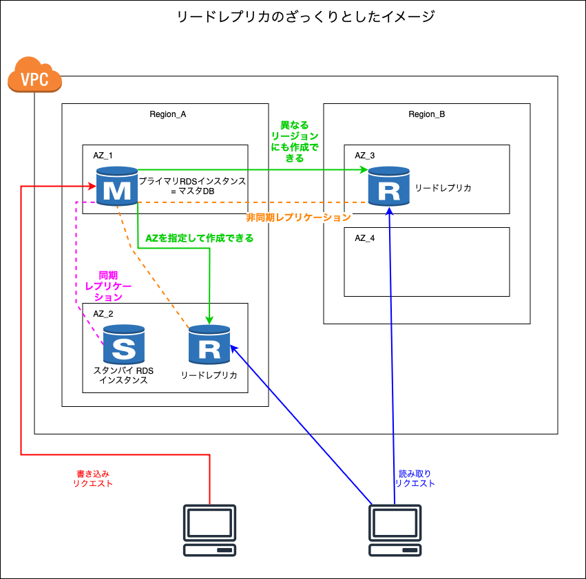
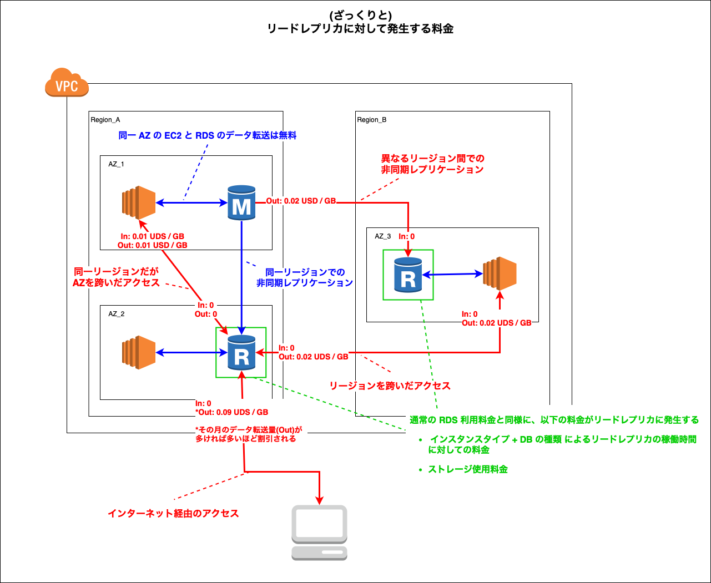

### リードレプリカとは

 

- リードレプリカという読み取り専用の DB を作成し、読み読み取りのリクエストに対応する

 

- 書き込みの場合はマスター DB が対応することで、　**読み取り性能**の向上が期待できる

    - 書き込み性能の向上はリードレプリカでなく、他の方法で行う必要がある

 

- マスタ RDS とは異なるリージョンにリードレプリカを作成することも可能

 

- リードレプリカは設置する AZ を選択できる

 

- リードレプリカの作成は RDS インスタンス作成後に可能

 

- [Multi-AZ DB Clutster](./RDS.md#multi-az-db-cluster) はこのリードレプリカを同リージョンの他 AZ に展開する機能

    - Multi-AZ DB Cluster
        - プライマリ RDS インスタンスと**同じリージョンの他 AZ** に自動でリードレプリカを作成する

        - プライマリ RDS に障害が発生した場合、 **AWS 側でリードレプリカをプライマリインスタンスに昇格させる**

    - リードレプリカ
        - プライマリ RDS インスタンスと別リージョンにもリードレプリカを作成可能 (AZ は自分で指定)

        - プライマリ RDS に障害が発生した場合、**自分で**リードレプリカをプライマリインスタンスに昇格させる必要がある

 
 

参考サイト

[【Amazon RDS】マルチAZとリードレプリカの違い](https://qiita.com/tireidev/items/85954500a2c667f0e898)

[Amazon RDS リードレプリカ](https://aws.amazon.com/jp/rds/features/read-replicas/)

---

### リードレプリカの作成

TODP: RDS のリードレプリカの作成方法を追記

---

### リードレプリカを利用する場合に発生するコスト

 

- リードレプリカには通常の RDS インスタンスと同様に以下の料金が発生する
    - リードレプリカの稼働時間に対して利用料金
    - ストレージ利用料金

 

- データ転送量料金
    - プライマリ RDS とは**異なるリージョン**に配置されたリードレプリカへの非同期レプリケーションの際のデータ転送
        - プライマリ RDS 側のデータ転送 (Out) に料金が発生する

     

    - 同リージョンかつ異なる AZ 間での AWS サービス(EC2 など) とリードレプリカでのデータ転送
        - EC2 側でデータ転送 (In & Out) に料金が発生する

     

    - 異なるリージョン間での AWS サービス(EC2 など) とリードレプリカでのデータ転送
        - リードレプリカ側のデータ転送 (Out) に料金が発生する
        - EC2 側のデータ転送 (In & Out) に料金が発生する

     

    - リードレプリカからインターネットへのデータ転送
        - リードレプリカ側のデータ転送 (Out) に料金が発生する

 
 

参考サイト

[Exploring Data Transfer Costs for AWS Managed Databases](https://aws.amazon.com/jp/blogs/architecture/exploring-data-transfer-costs-for-aws-managed-databases/)

[Amazon RDS よくある質問 - リードレプリカの料金はいくらですか? 請求はいつ開始され、いつ終了しますか?](https://aws.amazon.com/jp/rds/faqs/#product-faqs#amazon-rds-read-replicas-cost-billing-trigger)

[Amazon RDS の料金](https://aws.amazon.com/jp/rds/pricing/)