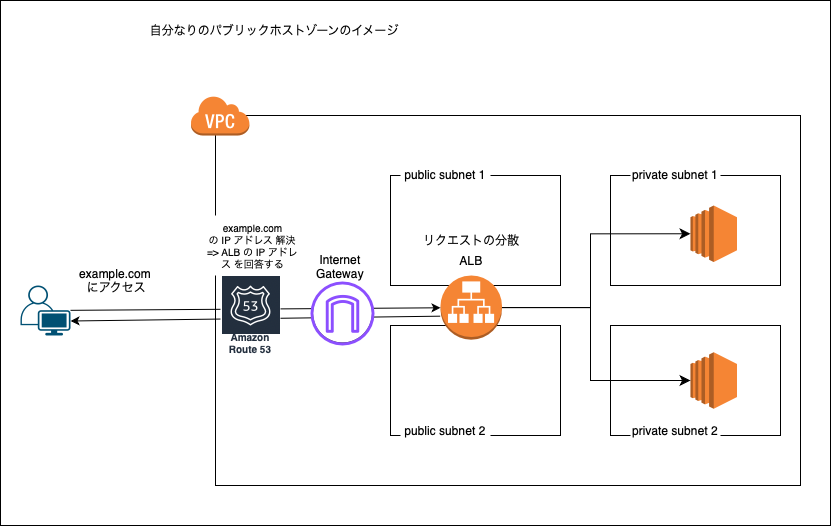
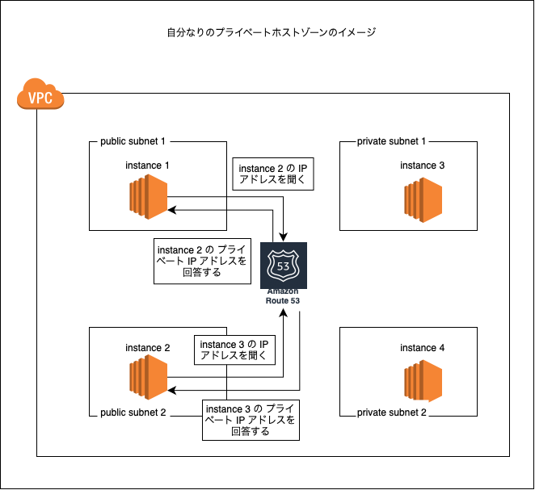
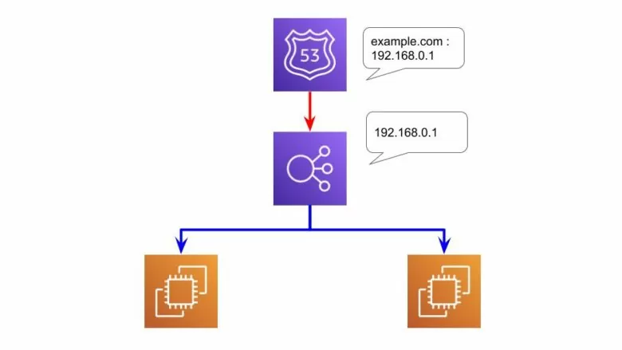
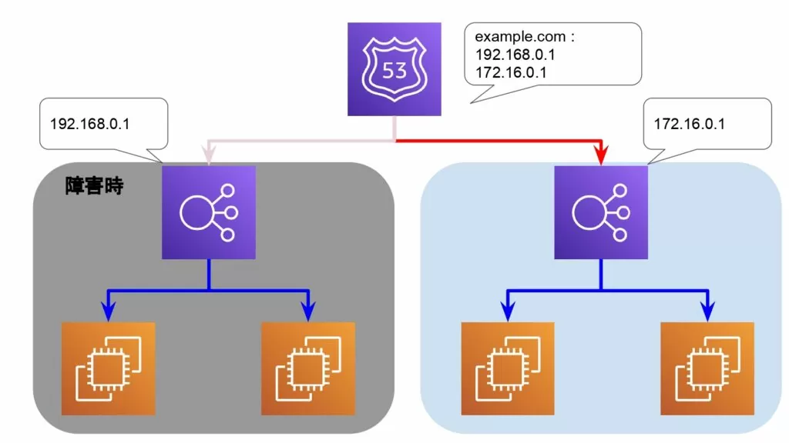
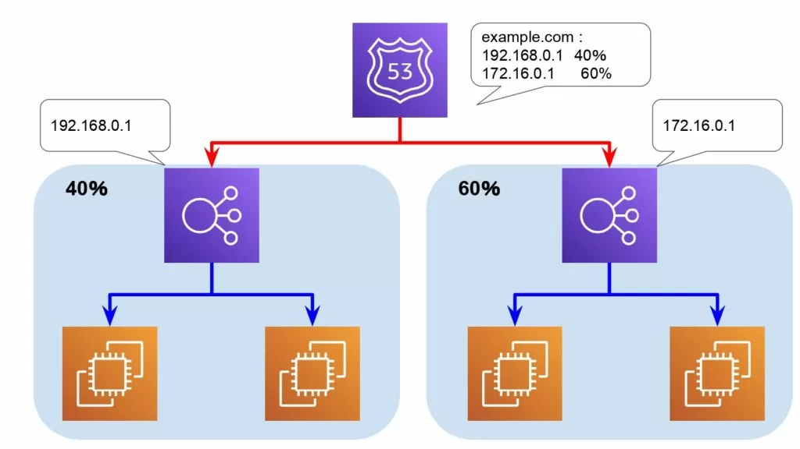
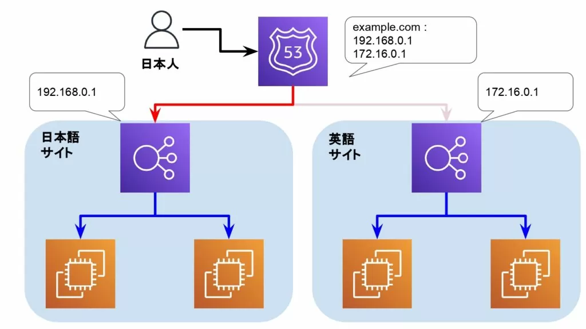
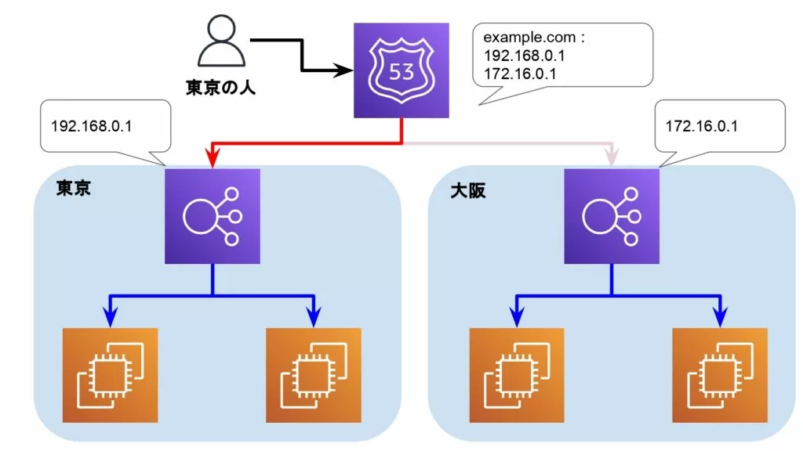
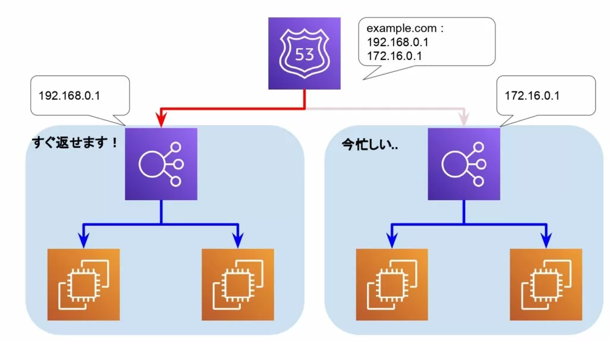
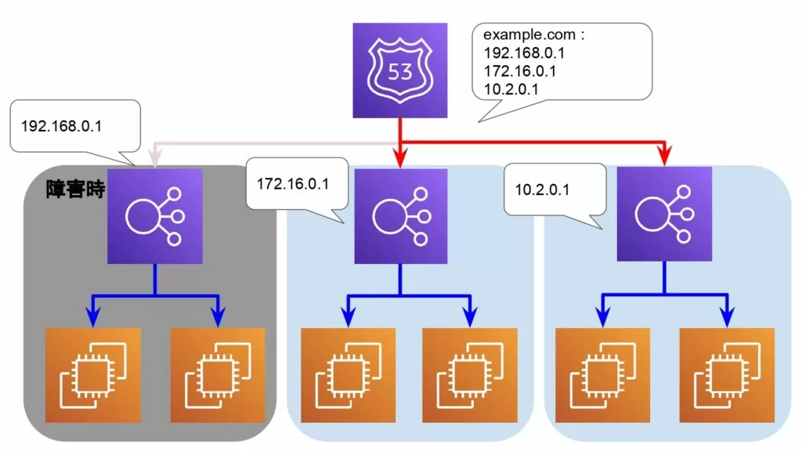
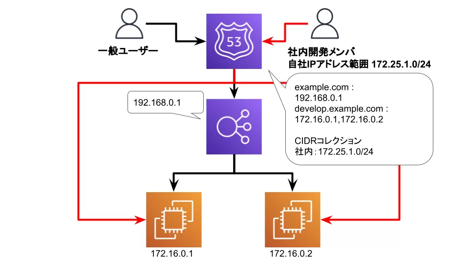

### Route 53 とは

AWS で 提供される DNS サービス

主な機能
- ドメイン名の新規登録と管理
    - Route 53 でドメイン名を購入可能 (有料: 購入料、更新料など)
    - 外部サービスでドメイン名を取得し、それを Route53 で利用することも可能 (ドメインの移管が必要になる)

- DNS サーバーとしてドメインの名前解決を行う (権威 DNS サーバー)
- ヘルスチェック(ドメイン名と対応する IP のサーバーのヘルスチェックを行う)
- クライアントが入力したドメイン名に対して Route53 がどうルーティングするかを設定する機能  (ルーティングポリシーの設定)

 
 

参考サイト

ALBについてその1 -> [【初心者向け】Amazon Route 53 とは](https://www.sunnycloud.jp/column/20210602-01/)

ALBについてその2 -> [【図解AWS】Route53とは？初心者にもわかりやすく解説！](https://en-junior.com/route53)

---

### パブリックホストゾーンとプライベートホストゾーン

ホストゾーンは Route53 の概念であり、従来の DNS のゾーンファイルのイメージに違い

ホストゾーン = DNS レコードのコンテナ

 

2種類のホストゾーン
- パブリックホストゾーン
    - インターネット上に公開された DNS ドメインのレコードを管理するコンテナ
    - ネットからアクセスされるドメイン名の管理をするコンテナ
    - ドメイン名の取得が必要
    - ドメイン名とグローバル IP アドレスを紐づける

 

- プライベートホストゾーン
    - VPC に閉じたプライベートネットワーク内の DNS ドメインのレコードを管理するコンテナ
    - VPC 内でアクセスされるドメイン名の管理をするコンテナ
    - Route53 や他のサービスからドメイン名を取得しなくても良い
    - ドメイン名とプライベート IP アドレスを紐づける

 
 

参考サイト

パブリックホストゾーンとプライベートホストゾーンの違い、利用ケースの例などもあったサイト -> [【初心者向け】Amazon Route 53 とは](https://www.sunnycloud.jp/column/20210602-01/)

プライベートホストゾーンを利用して、VPC内でドメインメイン名でアクセスできるようにしている参考サイト -> [【Part 3/4】AWSの環境構築で学ぶトラブルシューティング【Route53】](https://envader.plus/article/262)

---

### ルーティングポリシーとは

Route53 (DNSサーバー) にドメイン名の解決の問い合わせが来たときに、どのように解決するかについての方針のこと

いくつかの方針(ポリシー)があり、 DNS レコードごとにポリシーを選択できる

 

代表的なルーティングポリシー

- シンプルルーティング
    - 1つの DNS A レコードに対し、1つの IP アドレスを返すようにルーティングするポリシー

    - 複数の IP アドレスを1つの A レコードに設定することもでき、その場合はランダムな IP アドレスにルーティングされる

引用: [【AWS初学者向け・図解】Route53ルーティングポリシーを現役エンジニアがわかりやすく解説](https://o2mamiblog.com/aws-route53-routingpolicy-beginner/)

 

- フェイルオーバールーティング
    - プライマリ (特に問題がない限りルーティングされるインスタンス) と セカンダリ (プライマリに異常が発生した場合にルーティングされるインスタンス)

    - Route53 のヘルスチェックによって、異常を検知する

引用: [【AWS初学者向け・図解】Route53ルーティングポリシーを現役エンジニアがわかりやすく解説](https://o2mamiblog.com/aws-route53-routingpolicy-beginner/)

 

- 加重ルーティング
    - 1つのドメイン名に対して2つの A レコードを作成し、各々のレコードに重みづけをする

    - ~%は IP アドレス xxx.xx.xx.x に、 ~%は yyy.yyy.yy.y にルーティングするというポリシー

引用: [【AWS初学者向け・図解】Route53ルーティングポリシーを現役エンジニアがわかりやすく解説](https://o2mamiblog.com/aws-route53-routingpolicy-beginner/)

 

- 位置情報ルーティング
    - ユーザーのアクセス位置情報に基づいてルーティングする(接続先のサーバーを決める)ポリシーです

    - 1つのドメイン名に対して2つの A レコードを作成し、各々のレコードでアクセス場所が~~だったら、IP アドレス xxx.xxx.xx.x にルーティングするという設定を行う

引用: [【AWS初学者向け・図解】Route53ルーティングポリシーを現役エンジニアがわかりやすく解説](https://o2mamiblog.com/aws-route53-routingpolicy-beginner/)

 

- 地理的近接性ルーティングポリシー
    - 位置情報ルーティングに似ている

    - ユーザーのアクセス位置情報と、リソース(サーバー)の位置情報に基づいてルーティングするポリシー

    - このポリシーを設定するためには、Route53 のトラフィックフローという機能を使用する必要がある

引用: [【AWS初学者向け・図解】Route53ルーティングポリシーを現役エンジニアがわかりやすく解説](https://o2mamiblog.com/aws-route53-routingpolicy-beginner/)

 

- レイテンシールーティング
    - レイテンシーが最小になるリソースを優先的にアクセスさせるルーティングするポリシー

    - レイテンシーの計測計測の対象は AWS のリソースのみなので、オンプレなどのリソースに対してレイテンシールーティングを設定した場合、十分に機能しない可能性がある

引用: [【AWS初学者向け・図解】Route53ルーティングポリシーを現役エンジニアがわかりやすく解説](https://o2mamiblog.com/aws-route53-routingpolicy-beginner/)

 

- 複数値回答ルーティングポリシー
    - 1つのドメイン名に対して複数の A レコードを作成し、ヘルスチェックで正常と判断された IP にランダムにルーティングするポリシー

    - シンプルルーティングとの比較
        -  同じ
            - 1つのドメイン名に対して複数の A レコードを作成できる
            - ドメイン名に対応する IP アドレスをランダムにルーティングする

        - 違い
            - シンプルルーティングポリシーではヘルスチェックを行うことができない

引用: [【AWS初学者向け・図解】Route53ルーティングポリシーを現役エンジニアがわかりやすく解説](https://o2mamiblog.com/aws-route53-routingpolicy-beginner/)

 

- IPベースルーティングポリシー
    - アクセス元のIP アドレス範囲に応じてトラフィックをルーティングするポリシー
    
    - 利用例
        - 社内のネットワークアドレスに属している IP アドレスから対象のドメイン名でのアクセスは xxx.xxx.xx.x にルーティングする
        - それ以外の一般のユーザーから対象のドメイン名でのアクセスは yyy.yyy.yy.y にルーティングする

引用: [【AWS初学者向け・図解】Route53ルーティングポリシーを現役エンジニアがわかりやすく解説](https://o2mamiblog.com/aws-route53-routingpolicy-beginner/)

 
 

参考サイト

各ルーティングポリシーの説明画像がとてもわかりやすかったサイト -> [【AWS初学者向け・図解】Route53ルーティングポリシーを現役エンジニアがわかりやすく解説](https://o2mamiblog.com/aws-route53-routingpolicy-beginner/)

各ルーティングポリシーの設定方法の説明をしているサイト -> [[初心者向け]Route53のトラフィックルーティングを実装する](https://dev.classmethod.jp/articles/implement-route53-routing-for-begineer/)

公式の各ルーティングポリシーについての説明ページ -> [Choosing a routing policy](https://docs.aws.amazon.com/Route53/latest/DeveloperGuide/routing-policy.html)

---

### Route53 にかかってくる料金

- DNSクエリへの応答時に発生する費用

- ホストゾーンの維持・管理に発生する費用

- Route53 でドメイン名を取得した場合、取得したドメインの維持費用

- Route53 以外取得したドメインでも、 Route53 に移管する場合移管の費用が発生する (たぶん)
