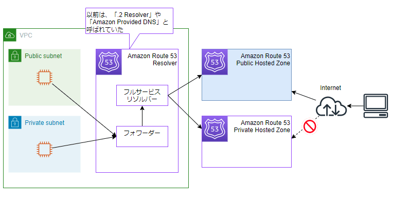

### Route 53 Resolver とは

- Amazon VPC に標準で配備された DNS サーバー (フォワーダー + フルサービスリゾルバー)

- VPC にデフォルトのキャッシュ DNS サーバーを配置するイメージ

引用: [【初心者向け】Amazon Route 53 入門！完全ガイド](https://zenn.dev/issy/articles/zenn-route53-overview#route-53-resolver)

 
 

参考サイト

[20191016 AWS Black Belt Online Seminar Amazon Route 53 Resolver](https://www.slideshare.net/slideshow/20191016-aws-black-belt-online-seminar-amazon-route-53-resolver/183378011#21)

[【ざっくり解説】Route 53 ResolverとResource Access Managerについて3段階で図解説する](https://dev.classmethod.jp/articles/explain-route53-resolver-ram/#toc-1-route-53-resolver)

---

### Route 53 Resolver for Hybrid Clouds

- VPC とオンプレミスで共通の名前解決の手段を提供する機能

    - Route53 Resolver の拡張機能

 

- ユースケース1

    

    引用: [イラストで理解するRoute53の名前解決](https://zenn.dev/fdnsy/articles/1b4933f719f98f)
    
     

    - オンプレミス側から AWS の DNS サーバー (Route53) に問い合わせてドメイン名を解決する

    - ★Inbout Endpoint というものを作成する必要がある

 

- ユースケース2

    

    引用: [イラストで理解するRoute53の名前解決](https://zenn.dev/fdnsy/articles/1b4933f719f98f)

     

    - AWS (VPC) 側からオンプレミス側の DNS サーバーに問い合わせてドメイン名を解決する

    - ★Outbout Endpoint というものを作成する必要がある

 
 

参考サイト

[イラストで理解するRoute53の名前解決](https://zenn.dev/fdnsy/articles/1b4933f719f98f)

[【初心者】Amazon Route 53 Resolver インバウンド/アウトバウンドエンドポイント を使ってみる](https://qiita.com/mksamba/items/b16e99170e666b68f194)

---

### 利用料金

#### Route53 Resolver の利用料金

1. VPC 内のインスタンスから発信する DNS クエリは無料

2. VPC 外からの DNS クエリは受け付けない

 

#### Route 53 Resolver for Hybrid Clouds の利用料金

 

1. [ENI](./ENI.md) の利用料金

    - 各エンドポイント (Inbound / Outbound エンドポイント) には、最低でも2つの IP アドレスを割り振る必要があり、各 IP アドレスの実態は ENI

    - ★★★よって、1つの Inbound Endpoint (or Outbound Endpoint) を作成した場合、2つ分の ENI 利用料金が発生する★★★

 

2. DNS クエリに発生する料金

    - Inbound / Outbound Endpoint を通過したクエリ 100万件あたり \~~ UDS の課金形態

 
 

参考サイト

[AWS Black Belt Online Seminar Amazon Route 53 Resolver 編](https://pages.awscloud.com/rs/112-TZM-766/images/AWS-Black-Belt_2023_Amazon-Route53-Resolver_0530_v1.pdf)