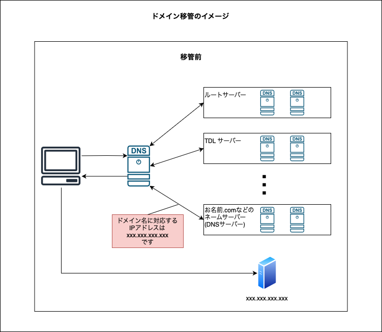
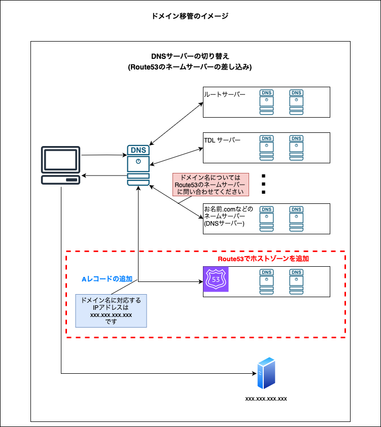
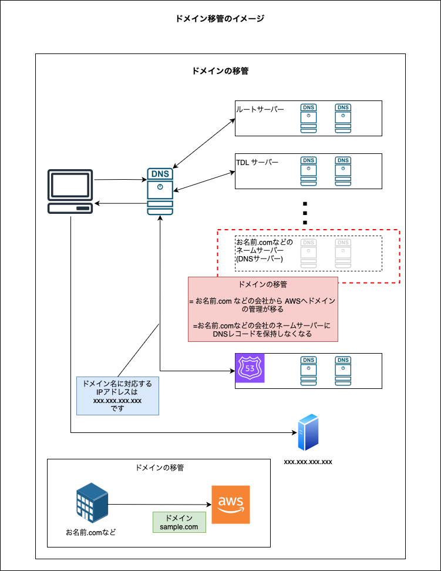
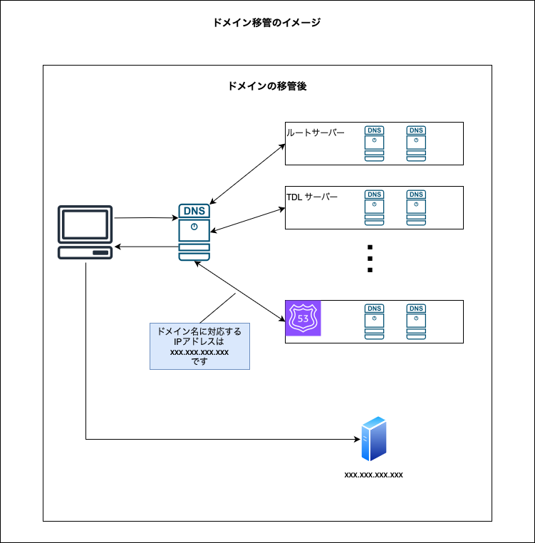
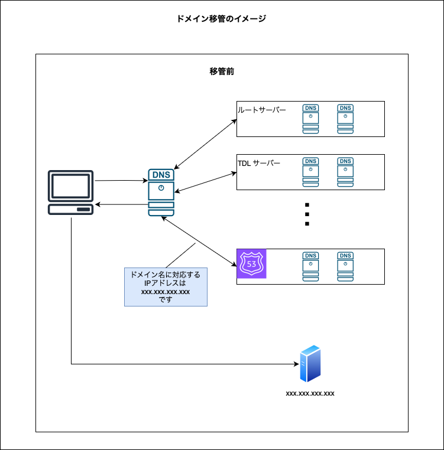
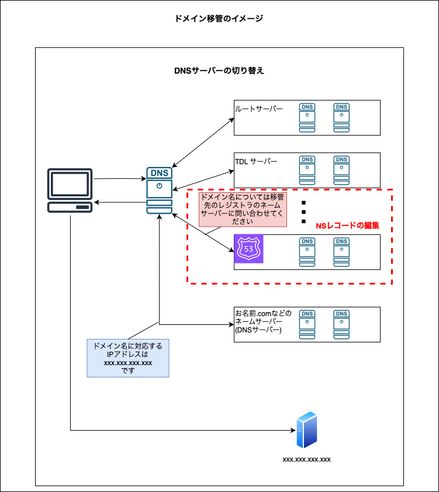
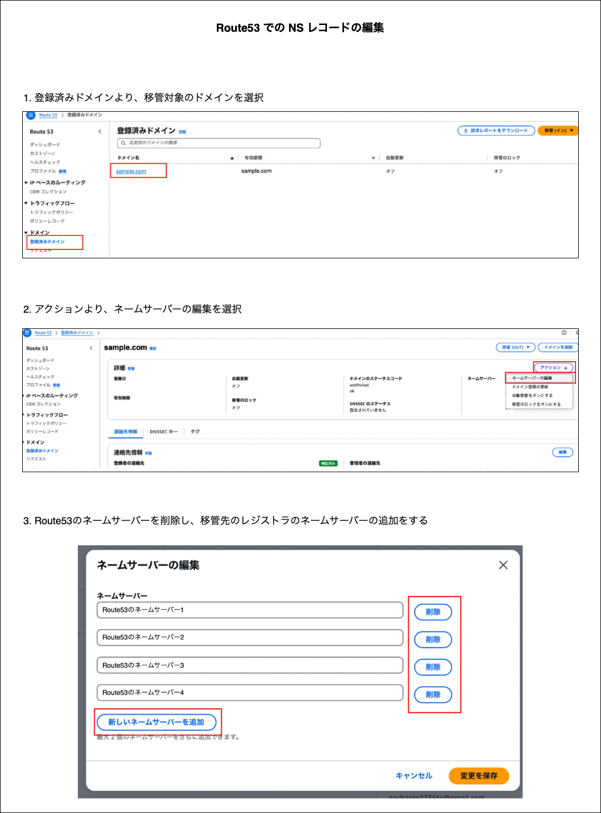
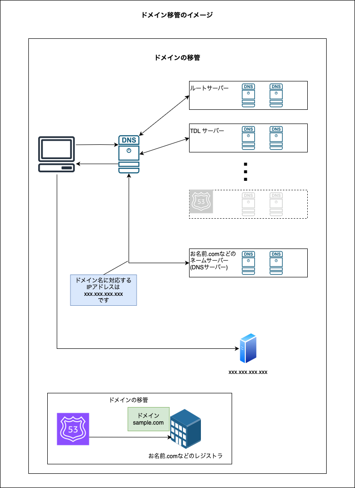
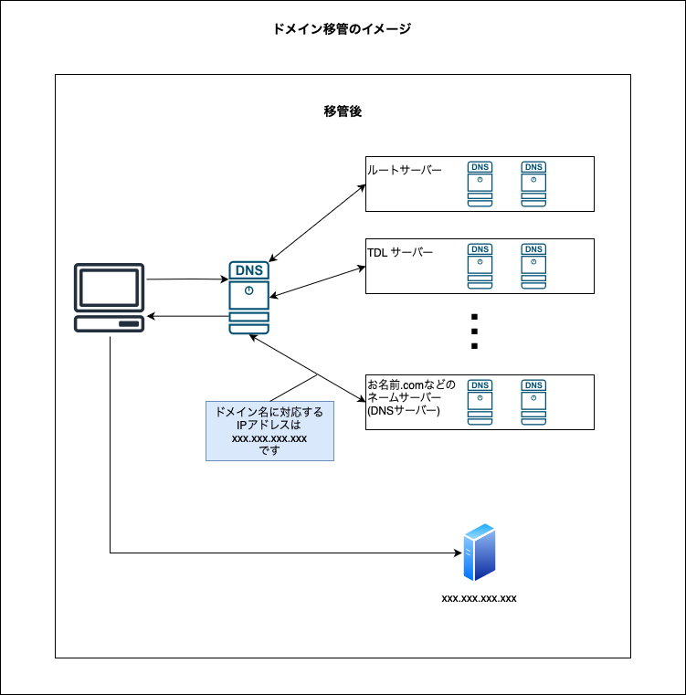

### 他で取得したドメインから　Route53 に移管する

#### ドメインの移管の段階

##### 1. 移管前

- レジストラ (お名前.com などの) の ネームサーバー(DNS サーバー) が最終的なドメイン名に対応する IP アドレスを回答する

- ドメイン名の管理はレジストラが行う

 

 
 

##### 2. Route53 の差し込み (DNS サーバーの切り替え)

- レジストラ側での対応

    - Route53 のネームサーバーを NS レコードとして追加
    
        - ＝ ドメイン名の問い合わせ (= DNS クエリ) に対して、Route53 のネームサーバーを回答するようになる

 

- Route53 側での対応

    - Ruote53 にてホストゾーンの作成

        - ホストゾーンの作成 ≒ ゾーンファイルの作成 + **ネームサーバーを立てる**

     

    - 作成したホストゾーンに A レコードを追加する

 

- ポイント

    - Route53 が最終的なドメイン名に対応する IP アドレスを回答する

    - ドメイン名の管理はレジストラが行う

 

 
 

##### 3. ドメインの移管

- レジストラ側

    - ドメインの移管 (Out) の実施

        - ドメインのロック解除や認証コードの発行など

 

- Route53 側

    - ドメインの移管 (In) の実施

        - 登録者の情報入力や、レジストラ側で払い出された認証コードの入力など

 

 
 

##### 4. 移管完了

- Route53 が最終的なドメイン名に対応する IP アドレスを回答する

- ドメイン名の管理は AWS (Route53) が行う

 
 

参考サイト

[独自ドメインをRoute 53に移管してみた](https://speakerdeck.com/mitsuo_sys/du-zi-domeinworoute-53niyi-guan-sitemita)

[お名前.comからAmazon Route 53へドメインを移管する](https://dev.classmethod.jp/articles/onamae-to-route53/)

[お名前.com から Route 53 に移行した](https://noy72.com/articles/2022-02-01-domain/)

----

### Route53 で取得したドメインを他のレジストラに移管する

- ★移管先のレジストラが対象のドメインをサポートしているかを確認する必要がある

 

#### ドメインの移管の段階

*移管先のレジストラによって手順や移管方法は異なる場合がある

##### 1. 移管前

 
 

##### 2. レジストラのネームサーバーへの切り替え

- 移管先のレジストラのネームサーバーの情報を取得し、Route53 に登録されている NS レコードを取得したネームサーバーの値に変更する

 

- Route53 の `登録済みドメイン` から アクションの `ネームサーバーの編集` にて　NS レコードの変更ができる

    

 
 

##### 3. ドメインの移管

- Route53 側

    - ドメインの移管 (Out) の実施

        - ドメインのロック解除や認証コードの発行など

        - ホストゾーンの削除 (ホストゾーンを残したままにすると[ホストゾーンの料金](./Route53.md#ホストゾーンの維持管理に発生する料金)がかかる)
    
 

- 移管先のレジストラ側

    - ドメインの移管 (In) の実施

        - 登録者の情報入力や、Route53 側で払い出された認証コードの入力など

 

 
 

##### 4. 移管後

 
 

参考サイト

[Route53からCloudflareへのドメインの移管](https://blog.k-bushi.com/post/tech/infrastructure/migrate-from-route53-to-cloudflare/)

[Amazon Route 53 から Cloudflare へドメインを移管してみた](https://dev.classmethod.jp/articles/transferring-domain-from-amazon-route-53-to-cloudflare/)