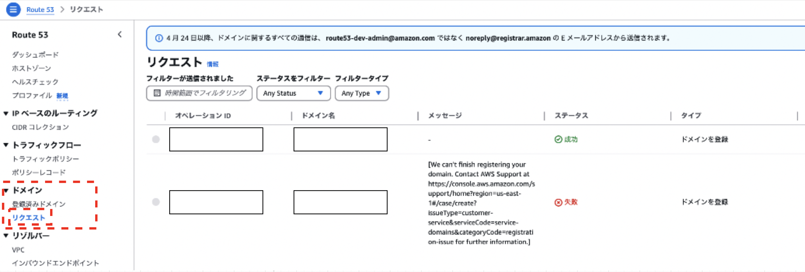

### Route53 でドメインの購入

1. マネージメントコンソールにて、Route53 の画面に遷移し、`ダッシュボード` を選択

    

 

2. ダッシュボード画面にある `ドメインの登録` をクリック

    

 

3. 購入するドメイン名を決める

    1. ドメインの検索にて、登録 (購入) したいドメイン名を入力する

    2. 検索結果にて、登録可能なドメインの中から登録したいドメイン名を選択する

    3. 選択されたドメインにて、選択したドメイン名を確認し、問題がなければ `チェックアウトに進む` をクリックする

    

 

4. 購入オプションを選択する

    

     

    - ドメイン名

        - 前画面にて選択したドメイン名

     

    - 期間

        - ドメインの利用期間

        - 1 ~ 10 年で選択できる

     

    - 自動更新

        - ドメインの期限が来たら自動で更新させるかどうか

        - ドメインの更新は手動でもできる

 

5. 必要事項の記入

    

     

    - 必要事項を記入したら `次へ` をクリック

 

6. 購入ドメイン、記入項目の確認をしてドメインの購入をする

    

     

    - 最後の利用規約の項目にチェックを入れる

    - 表示されている情報に間違いがなければ `送信` をクリック

 

7. メールが届いたら完了

    - マネージドコンソールの Route53 画面のサイドメニューの `ドメイン → リクエスト` からも登録申請したドメインのステータスが見れる

        

     

    - マネージドコンソールの Route53 画面のサイドメニューの `ドメイン → 登録済みドメイン` から登録済みのドメインが見れる

        

---

### ドメインの購入の際に起きた問題

#### 問題1: 電話番号が誤っているため、購入申請に失敗する

- ##### 原因

    

     

    - 電話番号が間違っていた

        - 国コードに次に入力する電話番号の先頭の0は省略する

 

- ##### 解決策

    - 電話番号を確認して、正しい番号を入力する

 

#### 問題2: 購入申請後に購入失敗のメールが届く

- ##### 原因

    - AWS 側から、自分のアカウントにドメインの購入制限がかけられていたっぽい

 

- ##### 解決策

    - 購入失敗メールに記載されているサポートにメールする

 
 

参考サイト

購入申請後に購入失敗のメールが届く問題について
- [Can't register new domain name using Route53](https://repost.aws/questions/QU0fAHnomBSdOtpUzOyjpeRQ/can-t-register-new-domain-name-using-route53)
- [[Resolved] Route53でドメインが登録できなかったのでAWSに問い合わせた](https://zenn.dev/jyama/articles/b57121044bfe4d)