### ヘルスチェックの作成方法

1. マネージドコンソールにログイン後、Route53 画面に遷移し、サイドメニューの `ヘルスチェック` をクリック

    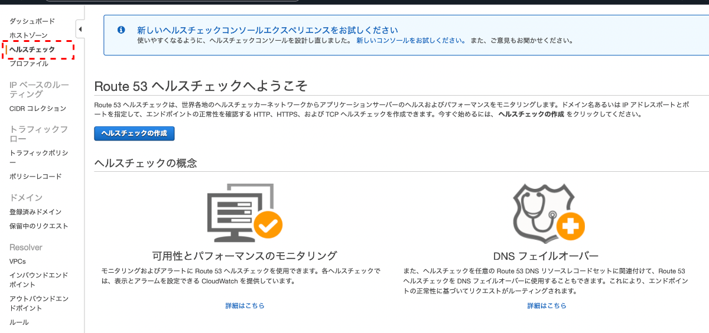

 

2. `ヘルスチェックの作成` をクリック

    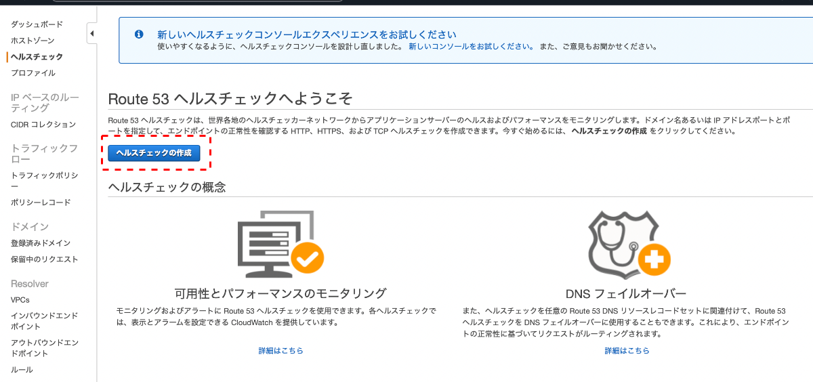

 

3. モニタリングの対象の種類に応じて各項目を設定し `次へ` をクリック

    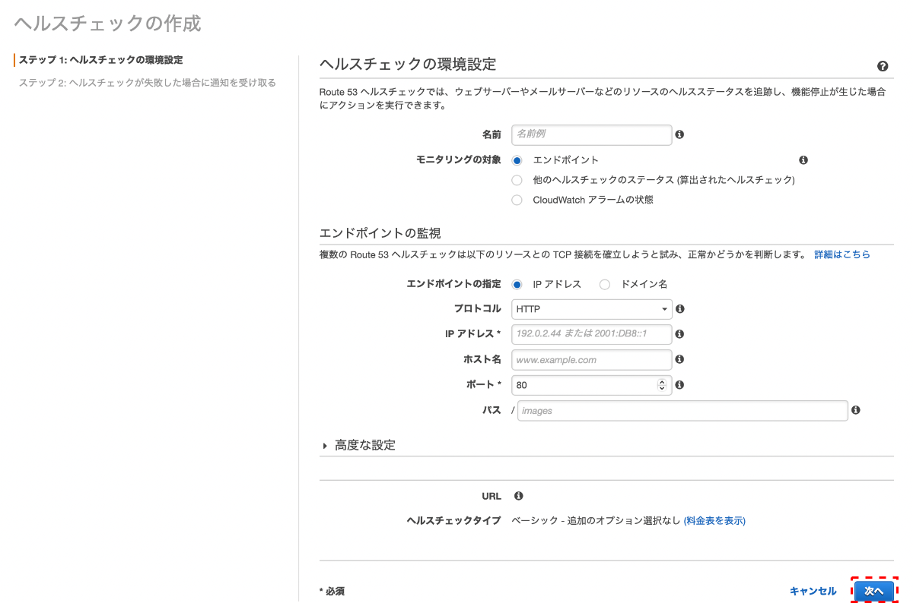

 

4. ヘルスチェックの結果が失敗の時の通知についての設定を行い `ヘルスチェックの作成` をクリック

    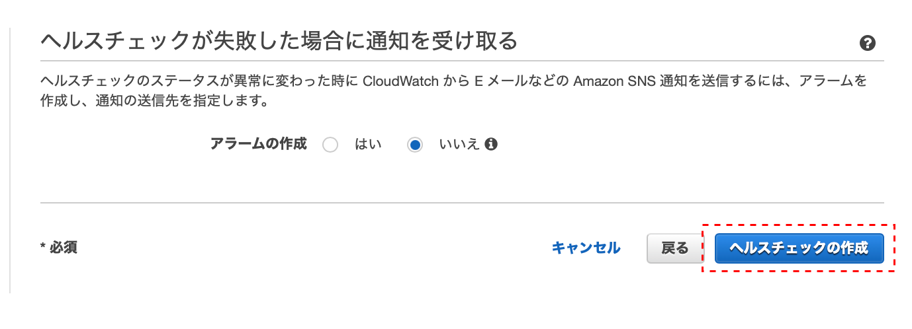

---

### モニタリングの対象 - エンドポイント

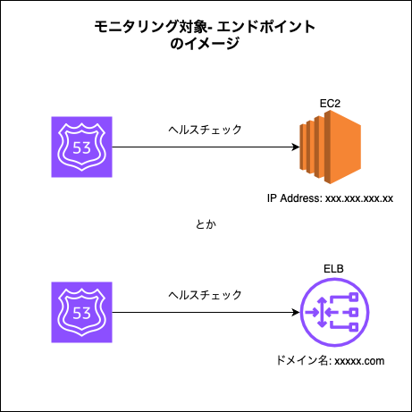

 

- IP アドレスあるいはドメイン名で特定するエンドポイントを監視するヘルスチェックを作成する

 

#### 設定項目

#### エンドポイントの監視

- エンドポイントを IP アドレスで指定する場合

    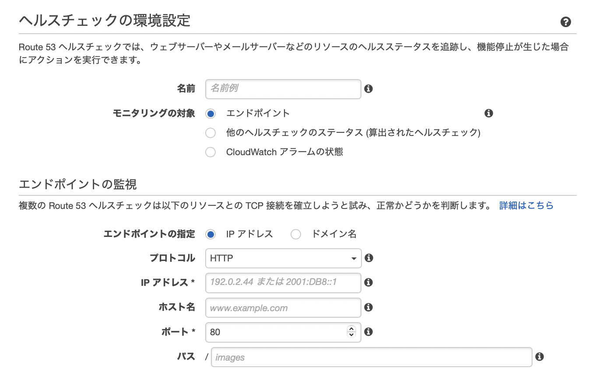

 

- エンドポイントをドメイン名で指定する場合
    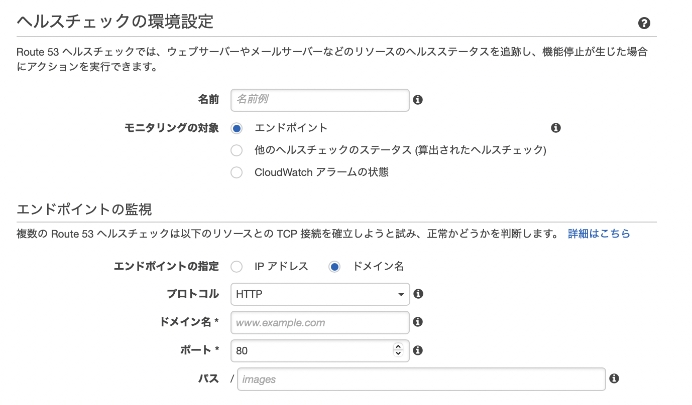

 

- `プロトコル`

    - Route53がエンドポイントとの通信に用いるsessionつ

 

- `IPアドレス`

    - ヘルスチェック対象のエンドポイントの IP アドレス

 

- `ホスト名`

    - ヘルスチェック対象のエンドポイントの ホスト名 (オプション)

 

- `ドメイン名`

    - ヘルスチェック対象のエンドポイントの ドメイン名

 

- `ポート`

    - ヘルスチェック対象のエンドポイントの ポート番号

 

- `パス`

    - ヘルスチェックのリクエストで指定するパス

 

#### 高度な設定

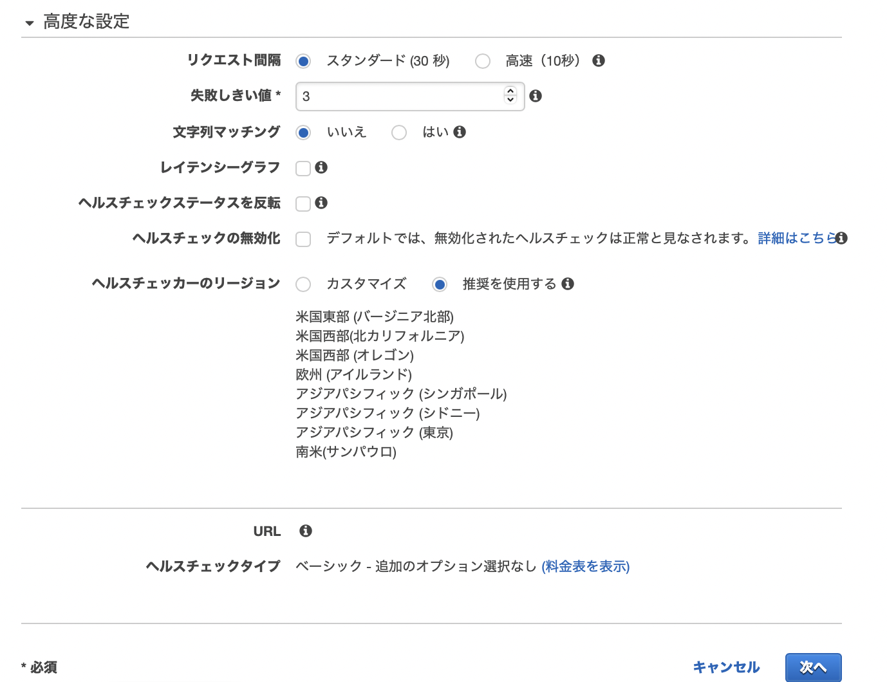

 

- `リクエスト間隔`

    - ヘルスチェックのリクエストを送信する間隔

    - 高速にすると追加料金が発生する

 

- `失敗しきい値`

    - ヘルスチェックのリクエスト結果が何回連続失敗/成功したらヘルスチェックステータスを異常/成功に変更するかについての値

 

- `文字列マッチング`

    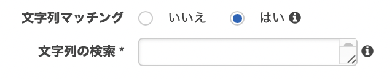

    - レスポンス本文に指定した文字列が含まれているかどうかを確認して、エンドポイントの状態を判断する機能

    - 文字列マッチングを有効化すると、レスポンス本文の最初から 5210 バイト以内に対象の文字列が出現した場合成功とみなす

    - 文字列マッチングを有効化すると追加料金が発生する

 

- `レイテンシーグラフ`

    - Route53 とエンドポイント間の接続に関して、以下の情報を取得表示する機能

        - Route 53 ヘルスチェッカーがエンドポイントとの TCP 接続を確立するのにかかる平均時間 (ミリ秒)

        - Route 53 ヘルスチェッカーが HTTP または HTTPS リクエストへの応答の先頭バイトを受け取るまでにかかった平均時間 (ミリ秒)
        
        - Route 53 ヘルスチェッカーが SSL/TLS ハンドシェイクを完了するまでにかかった平均時間 (ミリ秒)

     

    - レイテンシーグラフを有効にすると、ヘルスチェック詳細画面の Latency タブに情報が表示される

        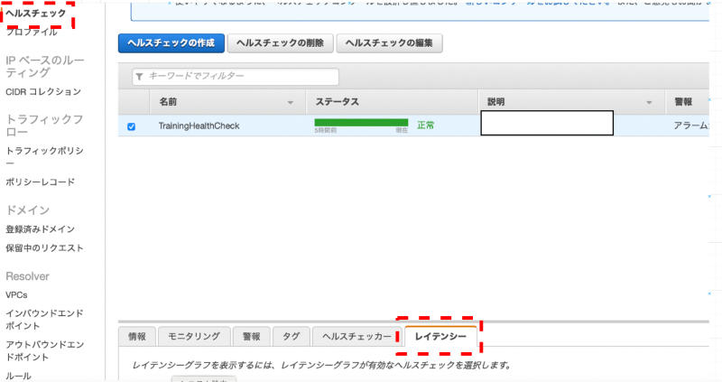

        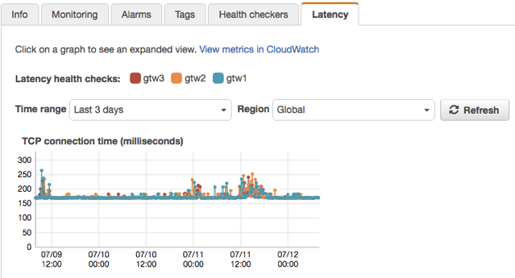

        引用: [Load balancing services with AWS Route53 DNS health checks](https://www.virtualtothecore.com/load-balancing-services-with-aws-route53-dns-health-checks/)

    - レイテンシーグラフを有効化すると、追加料金が発生する

 

- `ヘルスチェックステータスを反転`

    - ヘルスチェックのステータスを正常 → 異常、　異常 → 正常 のように反転させる機能　
 

- `ヘルスチェックの無効化`

    - 対象のエンドポイントへのヘルスチェックリクエストを送信しなくする機能

    - デフォルトでは、無効化されたヘルスチェックのステータスは常に正常になる

 

- `ヘルスチェッカーのリージョン`

    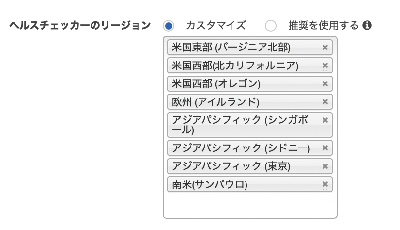

    - ★★★Route53 のヘルスチェックは Route53 が行うのではなく、8つのリージョンにあるヘルスチェッカーが行う

    - 実行するヘルスチェッカーのリージョンを選択する機能

    - カスタマイズを選択するとヘルスチェックを実行するリージョンを選択/削除することができる

    - 最低でも3つのリージョンは選択する必要がある

 
 

参考サイト

モニタリングの対象 - エンドポイントの意味について
- [Amazon Route 53 ヘルスチェックの種類](https://docs.aws.amazon.com/ja_jp/Route53/latest/DeveloperGuide/health-checks-types.html)

 

Route53 のヘルスチェックについて
- [Route53のヘルスチェッカーのIPを一括抽出する](https://www.rainorshine.asia/2021/07/05/post3517.html)

- [Route 53の「算出されたヘルスチェック」で複数のパスをチェックしてフェイルオーバーする](https://www.cloudbuilders.jp/articles/4671/)

- [Route 53 ヘルスチェックを使った死活監視](https://oji-cloud.net/2021/07/22/post-6437/)

---

### モニタリングの対象 - 他のヘルスチェックのステータス (算出されたヘルスチェック)

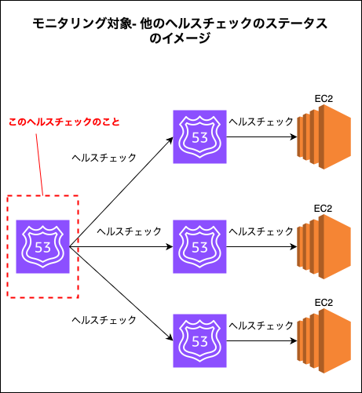

 

- 他のヘルスチェックの結果を監視するヘルスチェックを作成する

 

#### 設定項目

 
 

参考サイト

モニタリングの対象 - 他のヘルスチェックのステータス (算出されたヘルスチェック)の意味について
- [Amazon Route 53 ヘルスチェックの種類](https://docs.aws.amazon.com/ja_jp/Route53/latest/DeveloperGuide/health-checks-types.html)

---

### モニタリングの対象 - CloudWatch アラームの状態

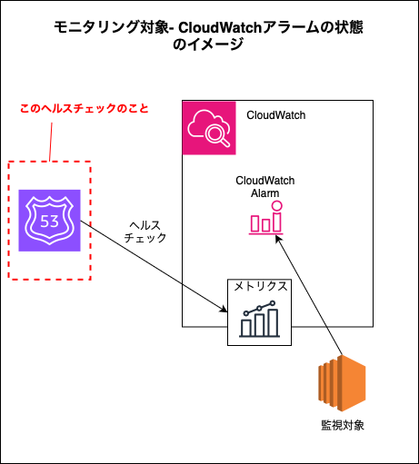

 

- CloudWatch メトリクスのステータスを監視するヘルスチェックを作成する

- ★CloudWatch のアラームの結果を監視するのではなく、メトリクスを監視することに注意

    - CloudWatch アラームがアラーム状態になるよりも前にヘルスチェックが以上を検知することがある

 

#### 設定項目

 
 

参考サイト

モニタリングの対象 - CloudWatch アラームの状態の意味について
- [Amazon Route 53 ヘルスチェックの種類](https://docs.aws.amazon.com/ja_jp/Route53/latest/DeveloperGuide/health-checks-types.html)

---

### ヘルスチェック失敗時の通知 - アラームの作成